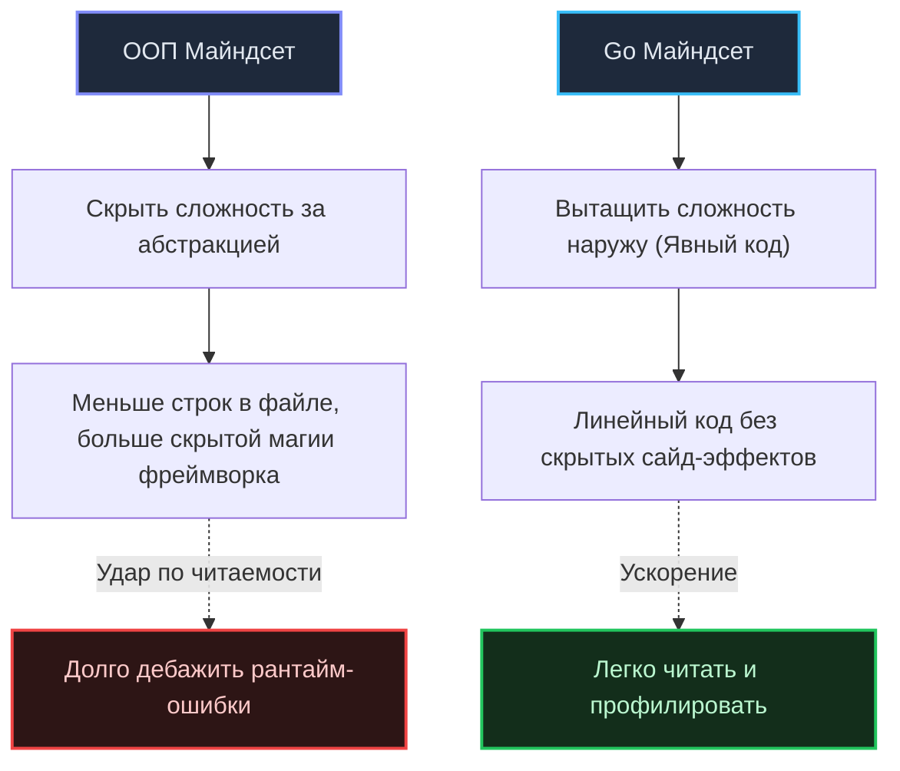

## Переход Рубикона: От ООП-архитектора к Go-инженеру

Мы подошли к финалу фундаментального раздела, посвященного истории, идеологии и глубинному духу языка Go. 

Внимательно изучив предыдущие тридцать лекций, вы наверняка прочувствовали ключевую истину: Go никогда не стремился стать «исправленной Java» или «упрощенным диалектом C++». Это инструмент с принципиально иной инженерной ДНК. Он был спроектирован ветеранами Bell Labs и Google для решения вполне конкретных вызовов XXI века: обуздания сложности гигантских распределенных систем, компиляции миллионов строк кода за секунды и эффективной утилизации многоядерного кремния.

Для опытного инженера (особенно с солидным багажом в Java, C#, PHP или Python) переход на Go — это прежде всего **процесс осознанного разучивания**. Вам предстоит отказаться от целого вороха шаблонов и абстракций, которые годами преподносились в классическом ООП как абсолютные стандарты индустрии («best practices»), и принять новый — прагматичный, лаконичный и честный майндсет.

Давайте кристаллизуем это профессиональное мировоззрение в виде пяти фундаментальных инженерных столпов.

---

## 1. Код читается чаще, чем пишется (Явное лучше неявного)

В лекции [[19. Почему в Go избегают магии и скрытого поведения]] мы детально обсуждали, почему в Go сознательно не добавили аннотации, тяжелые DI-контейнеры на базе рефлексии и перегрузку методов. 

Кредо идиоматичного Go-инженера звучит так: **«Я готов написать немного больше явного кода (бойлерплейта), если это сделает путь выполнения абсолютно прозрачным для любого читателя»**.

Вам больше не нужно гадать, какой именно класс-наследник подставится в контроллер невидимым рантайм-контейнером. Вы не тратите часы на распутывание магии конфигураций фреймворка. Вы открываете `main.go` — и перед вашими глазами предстает чистый, явный граф зависимостей системы. 

Вы точно видите:
* Где и когда аллоцируется память;
* Где объявляются минималистичные интерфейсы (на стороне потребителя, как того требует [[15. Duck Typing и неявная реализация интерфейсов]]);
* Как ошибки явно и предсказуемо поднимаются по стеку вызовов ([[10. Обработка ошибок в Go. if err != nil как часть дизайна]]).



---

## 2. Mechanical Sympathy (Уважение к железу)

Go — это системный компилируемый язык со встроенным сборщиком мусора (`Garbage Collector`). Он избавляет инженера от ручного освобождения памяти через `free()`, но **беспощадно наказывает** за непонимание принципов работы физического процессора, кэш-линий и подсистемы памяти.

Майндсет Go-разработчика: **«Я проектирую структуры данных так, чтобы они дружили с L1/L2 кэшами CPU, и пишу код так, чтобы не создавать бесполезной нагрузки на сборщик мусора»**.

В классической Java разработчик привыкает к тому, что любой объект — это ссылка, хаотично указывающая в область кучи (`Heap`). В Go инженер мыслит физической топологией памяти:
1. **Анализ побега памяти (Escape Analysis):** Вы всегда осознанно выбираете между передачей по значению (мгновенный и бесплатный возврат со стека сдвигом регистра `RSP`) и передачей по указателю (убегание в кучу, создающее работу для фаз Mark и Sweep сборщика мусора).
2. **Выравнивание структур и Padding:** Вы помните, что порядок полей в `struct` напрямую диктует ее физический размер в байтах.
3. **Локальность данных:** Вы отдаете предпочтение непрерывным массивам и срезам структур, а не массивам указателей на структуры. Это обеспечивает пространственную локальность и позволяет аппаратному блоку предвыборки данных (`Hardware Prefetcher`) упреждающе загружать непрерывные кэш-линии в L1/L2 на полной скорости шины.

> [!info] Под капотом: Layout структур и кэш
> Взгляните на эту структуру. На 64-битной архитектуре поля выравниваются по границе машинного слова (8 байт):
> ```go
> type BadStruct struct {
>     A bool  // 1 байт
>     B int64 // 8 байт
>     C bool  // 1 байт
> }
> ```
> Компилятор Go вынужден вставить 7 байт пустоты (padding) после `A` и 7 байт после `C`.  
> Итоговый размер: `1+7 + 8 + 1+7 = 24 байта`.
> 
> Если сгруппировать поля по убыванию размера (`int64`, `bool`, `bool`), структура займет `8 + 1 + 1 + 6 (padding) = 16 байт`.  
> Экономия составляет 33% памяти просто за счет понимания железа.

---

## 3. Композиция вместо монолитных иерархий

Вспомните выводы лекций [[12. Composition Over Inheritance. Почему в Go нет наследования]] и [[21. Простота против абстракций. Почему Go не любит сложные иерархии]]. 

Майндсет Go-разработчика: **«Я собираю систему из небольших, надежных и автономных кубиков, а не высекаю монолитную скульптуру из хрупкого куска мрамора»**.

Вам чуждо мышление категориями «Базовый абстрактный класс -> Потомки -> Переопределения методов». Вы комбинируете функциональность через композицию и встраивание (`Embedding`). Ваши интерфейсы предельно лаконичны (1–2 метода). Если функции требуется запись в лог или буфер, вы передаете стандартный интерфейс `io.Writer`, а не монструозный `ILoggerService`.

> [!tip] Собеседование
> **Вопрос на System Design:** Как спроектировать сервис, который читает сообщения из брокера Kafka, валидирует входящий JSON и сохраняет результат в реляционную базу данных?
> **Ответ ООП-разработчика:** Создать базовый абстрактный класс `MessageProcessor`, унаследовать от него класс `KafkaJsonDbProcessor`, переопределить защищенные виртуальные методы `Read`, `Parse`, `Save`.
> **Ответ Go-разработчика:** Создать три независимых пакета: транспортный ридер, JSON-парсер и репозиторий сохранения. Объединить их через простые интерфейсы в `main.go`. Парсер не имеет права знать о Kafka — он принимает срез байт `[]byte` и возвращает готовую структуру `struct`.

---

## 4. Конкурентность — это архитектура, а не просто скорость

Многие программисты открывают для себя Go ради легковесных горутин, полагая, что это просто «сверхбыстрые потоки». Но, как учит лекция [[24. Concurrency Is Not Parallelism. Философия конкурентности в Go]], конкурентность — это прежде всего инструмент декомпозиции и структурирования программы.

Майндсет Go-разработчика: **«Я не защищаю общую память бесконечными мьютексами. Я передаю владение данными через типизированные каналы»** ([[25. Share Memory By Communicating. Почему каналы важнее Mutex]]).

Вы глубоко понимаете модель рантайма `G-M-P`. Вы знаете, что при блокировке горутины на операции ввода-вывода (сеть или диск) физический поток операционной системы `M` не засыпает: планировщик `P` мгновенно передает управление другой горутине `G`, опираясь на неблокирующий сетевой поллер `netpoll` (`epoll/kqueue`). Вы дисциплинированно используете `context.Context` для контроля жизненного цикла всех асинхронных цепочек и никогда не запускаете горутину, не зная точных условий ее завершения.

---

## 5. Ошибки — это значения (Errors are Values)

Мы навсегда прощаемся с хрупкой ментальной моделью `try-catch`. В лекции [[9. Errors Are Values. Почему в Go нет исключений]] мы доказали, что скрытые исключения превращают логику программы в непредсказуемый лабиринт.

Майндсет Go-разработчика: **«Ошибка — это нормальный, штатный результат выполнения функции, а не катастрофическая аномалия»**.

В Go вы работаете с ошибками точно так же, как со строками или числами: оборачиваете их с помощью `%w`, проверяете через стандартные функции `errors.Is` и `errors.As`, обогащая трассировку доменным контекстом. Код, на треть состоящий из проверок `if err != nil`, — это не визуальный мусор, а признак зрелой, надежной инженерной системы, где автор честно и скрупулезно предусмотрел каждый нештатный сценарий.

> [!warning] Ловушка / Gotcha
> Самый опасный антипаттерн разработчиков, только перешедших в Go, — попытка имитировать операторы `throw` и `catch` через связку `panic` и `recover`. 
> 
> Механизм паники (`panic`) в Go спроектирован **исключительно для фатальных сбоев рантайма**, при которых продолжение выполнения процесса физически невозможно (например, разыменование нулевого указателя `nil pointer dereference` или повреждение системных структур при старте). Использование паники для бизнес-сценариев (например, «пользователь с таким email не найден») — это грубейшее нарушение соглашений языка.

---

## Итог: Что значит быть Senior Go Engineer?

Быть настоящим Senior-инженером на Go — значит писать **скучный код**.

В авиастроении и космической отрасли высшей похвалой инженеру служит фраза: *«Полет прошел штатно и скучно»*. Никому из пассажиров не нужны акробатические трюки пилота в воздухе. В серверной разработке ситуация абсолютно аналогична.

Идиоматичный Go-код:
1. **Читается линейно:** Вам не нужно переключаться между 15 конфигурационными файлами, чтобы понять логику одного запроса;
2. **Просто тестируется:** Зависимости внедряются открыто через аргументы, а интерфейсы состоят из пары понятных методов;
3. **Эффективно дружит с железом:** Память не расходуется впустую, стек используется по максимуму, а ввод-вывод буферизуется;
4. **Безопасно масштабируется:** Каждая горутина имеет четкого владельца, а гонки данных исключаются на уровне архитектуры потоков данных;
5. **Избегает сомнительных трюков:** Инженер не злоупотребляет метапрограммированием, глубокой рефлексией и дженериками там, где достаточно обычного интерфейса ([[28. Generics. Почему Go так долго жил без них]]).

Вы научились мыслить в традициях отцов-основателей Go — Кена Томпсона, Роба Пайка и Роберта Гризмера. Вы осознали, что истинная простота — это не примитивность, а высшая форма инженерной зрелости. 

С этим фундаментальным майндсетом вы готовы перейти к детальному изучению синтаксических глубин, структур данных и продвинутых возможностей самого языка Go. В добрый путь!
