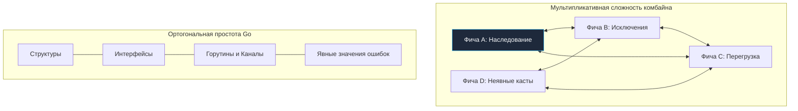

# Философия Go. Простота, читаемость и прагматизм

На протяжении десятилетий в компьютерной индустрии доминировало негласное соревнование языков программирования: *«Чем больше синтаксических конструкций и парадигм упаковано в компилятор, тем мощнее инструмент»*. Языки обрастали возможностями как корабельное днище ракушками: шаблоны, макросы, множественное наследование, перегрузка операторов, аннотации, декораторы, монады и неявные преобразования типов.

Однако когда разработчик с богатым багажом C++, Scala или современного C# впервые открывает документацию Go, он испытывает неподдельное замешательство, переходящее в легкое раздражение: *«И это всё? Где мои любимые синтаксические сахара? Почему язык выглядит так, словно его создали во времена PDP-11?»*

Ответ кроется в фундаментальном наблюдении Роба Пайка (о предыстории которого мы говорили в [[2. История создания Go. Google, Rob Pike, Ken Thompson, Robert Griesemer]]):  
**«Сложность языка мультипликативна, а не аддитивна»**.

Каждая новая фича, добавленная в компилятор, не просто увеличивает сложность языка на единицу. Она вступает во взаимное пересечение со всеми *уже существующими* фичами: шаблоны пересекаются с исключениями, исключения — с перегрузкой операторов, перегрузка операторов — с неявным приведением типов. Возникает комбинаторный взрыв неочевидных граничных состояний, который превращает чтение и отладку кода в мучительный поиск скрытых сайд-эффектов.

Философия Go держится на трех фундаментальных китах: **Простота, Читаемость и Прагматизм**.

---

## Простота (Simplicity): Противоядие от магии

В программной инженерии часто опасно смешивают два термина, которые в английском языке звучат похоже, но обозначают диаметрально противоположные вещи: **Easy** (легко/удобно) и **Simple** (просто/незапутанно).

* **Easy (легко)** — ориентировано на автора в момент написания строчки кода. Вы ставите аннотацию `@Transactional` над методом сервиса в Java, и фреймворк «магически» оборачивает ваш код в распределенную транзакцию базы данных. Это невероятно легко написать в первый вторник проекта. Но когда в пятницу вечером под нагрузкой случается распределенный Deadlock, вы обнаруживаете, что за легкостью скрывается чудовищный клубок из рефлексии, динамических байт-код прокси, мутабельных потоко-локальных переменных (`ThreadLocal`) и невидимых перехватчиков. Вы больше не управляете своей программой.
* **Simple (просто)** — означает отсутствие переплетения концепций. Код делает ровно то, что написано черным по белому, не пряча побочных эффектов.

Go бескомпромиссно выбирает **Simple**, сознательно жертвуя сиюминутным **Easy**. Язык намеренно лишен многих "удобных" (easy) фич ради того, чтобы архитектура оставалась простой (simple).

В Go принципиально отсутствуют многие привычные конструкции:
1. **Никаких неявных приведений типов:** Вы не можете сложить `int32` и `int64` без явного каста `int64(a) + b`. Компилятор защищает вас от переполнений и скрытых потерь точности.
2. **Никакого наследования классов:** Вместо хрупких иерархий «базовый класс -> потомок -> внук» используется строгая композиция (этому посвящен подробный разбор в статье [[12. Composition Over Inheritance. Почему в Go нет наследования]]).
3. **Никаких исключений (Exceptions):** Исключения разрывают стек и скрывают поток управления. В Go ошибки — это обычные значения (см. [[9. Errors Are Values. Почему в Go нет исключений]]).
4. **Никакой перегрузки функций и операторов:** Имя функции однозначно определяет ее поведение.

> [!info] Под капотом: Mechanical Sympathy и ветвления
> Отказ от исключений (`try/catch`) в пользу монотонных проверок `if err != nil` часто кажется начинающим шагом назад во времена C. Но с точки зрения микроархитектуры CPU это выдающееся решение.
>
> Когда в C++ или Java выбрасывается исключение, ядро исполнения вынуждено запустить сложнейшую процедуру **Stack Unwinding (раскрутка стека)**. Процессор вынужден прыгать по таблицам DWARF/RTTI в совершенно посторонние страницы памяти, что намертво сбрасывает кэш инструкций L1i (Instruction Cache Miss) и обнуляет конвейер.
>
> В Go проверка `if err != nil` компилируется в одну легковесную инструкцию сравнения (`TESTQ`) и условного перехода (`JNZ` — Jump if Not Zero). Современный аппаратный блок предсказания ветвлений (Branch Predictor) процессора запоминает, что ошибки случаются редко, и спекулятивно выполняет счастливый путь (happy path) с точностью предсказания свыше 99%. Конвейер ядра процессора вообще не простаивает. Простой код в Go оказывается максимально дружелюбным к железу.

---

## Читаемость: Код для чтения, а не для написания

Каждый опытный инженер знает суровую правду продакшена: **бизнес-логика живет годами, код пишется один раз, а читается, отлаживается и рефакторится десятки раз разными людьми**.

Философия Go утверждает: **стоимость чтения и понимания кода намного превышает стоимость его написания.**

Философия Go формулирует это как закон: **стоимость понимания чужого (или своего полугодовой давности) кода должна стремиться к минимуму.**

Именно поэтому Брайан Керниган сформулировал классическое правило:
> *«Каждый знает, что отладка программы вдвое сложнее, чем её написание. Поэтому, если вы пишете код настолько умно, насколько способны, как же вы надеетесь его отладить?»*

Чтобы код легко читался, он должен быть **скучным и однообразным**. В Go запрещено писать "слишком умный" (clever) код:
* **Запрет на трюкачество:** Если программист написал алгоритм в одну строчку, применив замысловатые побитовые сдвиги или сложные цепочки вызовов, на Code Review его, скорее всего, попросят разбить это на 5 простых, явных строк.
* **Инструмент `gofmt`:** Создатели Go раз и навсегда ликвидировали священные войны о табах и пробелах. Есть только один правильный способ расставить скобки и отступы, и он вшит в стандартный линтер. Это устраняет любые споры о стиле и снижает когнитивную нагрузку: весь Go-код в мире выглядит одинаково.
* **Локальность рассуждений (Local Reasoning):** Читая функцию в Go, вы должны понимать, что она делает, не заглядывая в другие файлы. Поведение не спрятано в базовых классах или абстрактных фабриках.

---

## Прагматизм: Инженерия побеждает академичность

Go — это глубоко прагматичный язык. Он не пытается быть математически идеальным или следовать строгим академическим догмам (как Haskell). Он создан для решения инженерных задач в условиях реального продакшена.

Проявления прагматизма в Go:

1. **Строгий компилятор:**  
   Если вы импортировали пакет, но не используете его, или объявили переменную и не читаете ее — код не скомпилируется. Компилятор Go считает это ошибкой, а не предупреждением. Это сделано прагматично: неиспользуемые импорты раздувают бинарный файл и замедляют сборку (см. *Проблема времени компиляции* в предыдущей статье).
2. **Толстые бинарники (Fat Binaries):**  
   Компромисс размера в пользу удобства деплоя. Бинарник Go весит порядка 6–9 МБ даже для простейшего «Hello World» веб-сервера (и около 5–6 МБ со флагами стриппинга отладочных символов `-ldflags="-s -w"`), вырастая до 15–30 МБ в боевых сервисах с развитыми зависимостями. Академически это может казаться непривычным после скриптов, но прагматически позволяет закинуть один самодостаточный файл на сервер без внешних рантаймов и запустить приложение.
3. **Интерфейсы (Duck Typing):**  
   Вы не должны заранее продумывать всю иерархию типов. Вы пишете конкретные структуры, а когда замечаете дублирование — выделяете небольшой интерфейс (часто из одного метода). Это позволяет архитектуре органично развиваться (Emergent Design).

> [!warning] Ловушка / Gotcha: Борьба с языком
> Типичная ошибка Middle-разработчиков из ООП-языков — попытка воссоздать привычные фреймворки в Go. Они пишут контейнеры инверсии контроля (IoC) с использованием пакета `reflect`, создают "Базовые Контроллеры" со встроенными структурами и скрывают ошибки за кастомными функциями `Must()`, которые вызывают `panic`.
>
> Это приводит к тому, что код начинает тормозить, GC сходит с ума от аллокаций в куче (из-за того, что `reflect` заставляет переменные "утекать" в Heap), а другие Go-разработчики отказываются с этим кодом работать. Прагматизм Go гласит: **Явный бойлерплейт лучше неявной магии.**

> [!tip] Собеседование
> **Вопрос:** Почему в Go считается антипаттерном использование пакета `reflect` для построения бизнес-логики (как это делают ORM или DI-контейнеры в Java/C#)?
>
> **Ответ:** 
> Помимо того, что это нарушает статическую типизацию и приводит к паникам в рантайме вместо ошибок компиляции, это сильно бьет по производительности. Рефлексия обходит оптимизации компилятора. Инструкции не могут быть заинлайнены (Inlining), Escape Analysis часто отправляет переменные в кучу, создавая мусор для GC, а чтение значений через интерфейсы рефлексии стоит в десятки раз дороже прямого доступа к полям структуры. 
> 
> В Go предпочитают явную кодогенерацию (например, `go generate`, инструменты вроде `sqlc` или `easyjson`) вместо магии в рантайме.

---

## Итог

Философия Go — это сознательный отказ от сложного ради понятного и предсказуемого. Язык не пытается впечатлить вас богатством синтаксиса. Он дает вам минимальный набор ортогональных инструментов (структуры, интерфейсы, горутины, каналы), с помощью которых вы конструируете высокопроизводительные системы.

Перестройка мышления под эту философию — самый сложный этап в изучении Go. Чтобы начать думать как Go-инженер, нам необходимо рассмотреть понятие идиоматичности языка. Этому посвящена следующая статья: [[6. Idiomatic Go. Что значит писать по-goшному]].
