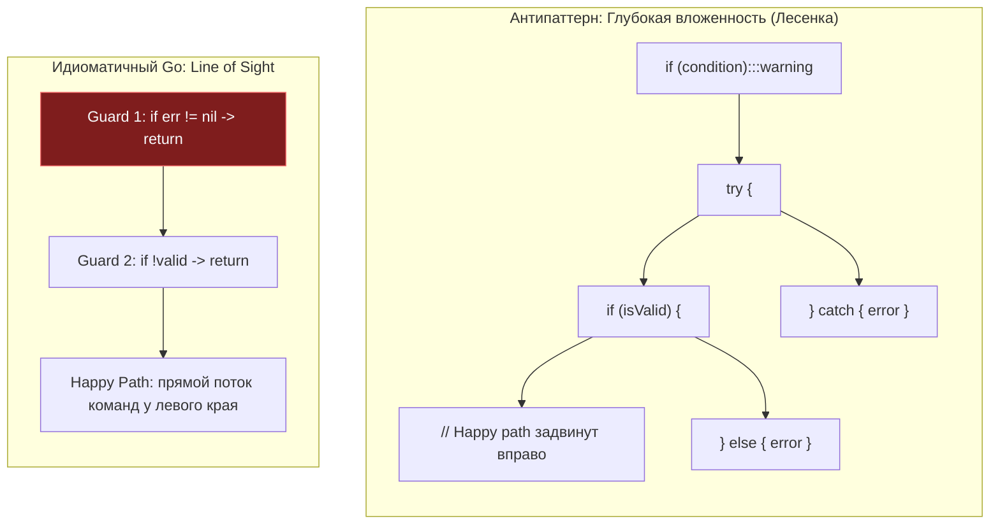
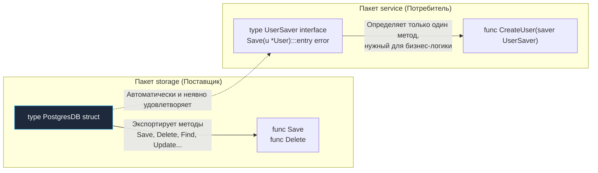

# Idiomatic Go. Что значит писать по-goшному

Каждый язык программирования несет в себе собственный выразительный акцент. Вы можете написать код на Go, который будет синтаксически безупречен, успешно скомпилируется и даже пройдет модульные тесты, но любой опытный Go-разработчик при первом же взгляде на экран скажет: *«Этот код написан на Java, просто автор воспользовался ключевыми словами Go»*.

В компьютерной литературе мы с П. Дж. Плогером в книге *«The Elements of Programming Style»* подчеркивали: **стиль — это не косметическое украшательство, это прямое отражение ясности мышления**. 

В сообществе Go это понимание возведено в абсолют. Понятие **Idiomatic Go (Идиоматичный Go)** — это не формальный свод предписаний линтера. Это выстраданный десятилетиями эксплуатации высоконагруженных систем инженерный майндсет. Идиоматичный код пишется так, чтобы его структура находилась в полной механической гармонии с компилятором, алгоритмом анализа утечек (Escape Analysis), кэшем инструкций CPU и рантайм-планировщиком.

Давайте разберем фундаментальные принципы «Go-way», отличающие код новичка от почерка зрелого системного инженера.

---

## 1. Line of Sight (Прямая видимость) и Guard Clauses

В классических объектно-ориентированных языках код нередко напоминает стрелу или лесенку («Anti-pattern Arrowhead»): блоки `try/catch` оборачивают циклы, внутри циклов громоздятся проверки `if`, а сам полезный «счастливый путь» (Happy Path) оказывается загнан глубоко вправо, за 4–5 уровней отступов. Ошибки же обрабатываются где-то далеко внизу, в разрозненных секциях `else` или `catch`.

Идиоматичный Go формулирует золотое правило оформления функций:  
**Код счастливого пути должен идти вертикально по левому краю экрана (Line of Sight).**

Любая проверка валидности аргументов или наличия ошибки должна отсекаться немедленно (паттерн **Guard Clauses**), возвращая управление из функции.



### Сравнение на практике

**Не идиоматично (Стиль C#/Java):**
```go
func ProcessUser(id string) (*Result, error) {
    if id != "" {
        user, err := db.GetUser(id)
        if err == nil {
            if user.IsActive {
                // Happy path спрятан глубоко вправо
                return generateResult(user), nil
            } else {
                return nil, errors.New("user inactive")
            }
        } else {
            return nil, err
        }
    }
    return nil, errors.New("empty id")
}
```

**Идиоматично (Go-way):**
```go
func ProcessUser(id string) (*Result, error) {
    if id == "" {
        return nil, errors.New("empty id")
    }

    user, err := db.GetUser(id)
    if err != nil {
        return nil, err
    }

    if !user.IsActive {
        return nil, errors.New("user inactive")
    }

    // Happy path всегда слева и в самом низу
    return generateResult(user), nil
}
```

> [!info] Под капотом: Mechanical Sympathy и Предсказатель ветвлений
> Почему такое форматирование критически важно для физического кремния?
>
> Современные микропроцессоры полагаются на глубокий суперскалярный конвейер инструкций и аппаратный предсказатель переходов (Branch Predictor). В идиоматичном коде конструкции `if err != nil` компилируются в ассемблерные условные переходы, которые при нормальной работе сервиса не срабатывают. 
> 
> Предсказатель ветвлений CPU быстро обучается тому, что переход внутрь тела `if` практически невероятен. В результате ядро процессора спекулятивно загружает и декодирует инструкции счастливого пути строго по прямой линии. Конвейер не сбрасывается. Если же код загроможден ветвлениями `if / else`, предсказатель начинает ошибаться, вызывая дорогостоящие сбросы конвейера (Branch Misprediction Penalty) ценой в 15–20 тактов на каждый промах.

---

## 2. Синхронные API (Конкурентность — забота вызывающего)

Инженеры, приходящие из сред с моделью Event Loop (Node.js) или платформ с `async/await` (C#), часто по инерции пытаются сделать методы библиотек асинхронными «на всякий случай», возвращая наружу каналы:

```go
// Антипаттерн: функция самовольно запускает горутину и отдает канал
func FetchDataAsync(url string) <-chan []byte {
    ch := make(chan []byte)
    go func() {
        data := fetch(url)
        ch <- data
    }()
    return ch
}
```

В Go это считается грубейшим нарушением идиоматичности:
1. Вы лишаете вызывающий код контроля: он не может легко отменить операцию, ограничить пул параллелизма или переиспользовать поток.
2. Возникает высокий риск утечки горутины (Goroutine Leak), если вызывающая сторона решит прервать ожидание и никогда не вычитает данные из канала `ch <- data`.

Идиоматичная функция в Go обязана быть **синхронной**:

```go
func FetchData(url string) ([]byte, error) {
    return fetch(url)
}
```

Если вызывающей стороне действительно требуется фоновое асинхронное исполнение, она сделает это самостоятельно в одну простую строчку: `go FetchData()`. Библиотека никогда не должна навязывать вызывающему коду модель параллелизма.

> [!warning] Ловушка / Gotcha: Escape Analysis
> Возврат канала и скрытый запуск горутины имеют тяжелые последствия для подсистемы памяти. 
> 
> Алгоритм Escape Analysis видит, что анонимная функция `go func()` захватывает локальные переменные в замыкание, и принудительно переносит их со стека в кучу (Heap). Сам канал `ch` также аллоцируется в куче. В противоположность этому, синхронная функция выполняет вызовы в пределах локального стекового фрейма горутины: память выделяется за 0 наносекунд и освобождается мгновенно при возврате без какого-либо участия сборщика мусора.

---

## 3. Отказ от конструкторов в пользу Zero Values

В языках вроде Java, C++ или Python объект без явного вызова конструктора часто представляет собой «заминированное поле»: внутренние указатели равны `null`, поля не инициализированы, а вызов любого метода немедленно приводит к аварийной остановке.

В Go ключевым принципом проектирования структур данных является правило: **Нулевое значение (Zero Value) структуры обязано быть полезным и готовым к работе без вызова конструктора**.

Классические примеры из стандартной библиотеки Go:
* `sync.Mutex`: структура не требует никакой инициализации. Вы просто объявляете `var mu sync.Mutex` и сразу можете вызывать методы:
  ```go
  var mu sync.Mutex
  mu.Lock()
  // критическая секция...
  mu.Unlock()
  ```
* `bytes.Buffer`: пустой буфер готов к записи байтов без фабрик:
  ```go
  var buf bytes.Buffer
  buf.WriteString("Привет")
  ```

Вам не нужно вызывать конструкторы вроде `NewMutex()` или `NewBuffer()`. Если структура не требует обязательных параметров конфигурации, не создавайте для нее искусственные функции-фабрики. Позвольте пользователю объявить переменную через `var` и сразу перейти к делу.

(Глубокому разбору этой архитектурной философии посвящена отдельная глава [[20. Zero Value как часть дизайна языка]]).

---

## 4. Интерфейсы определяются там, где используются

В традиционном объектно-ориентированном программировании господствует подход сверху вниз: создается класс `UserRepository`, рядом с ним в том же пакете объявляется интерфейс `IUserRepository` со всеми мыслимыми методами сущности, и этот огромный интерфейс навязывается всем клиентам.

**В Go интерфейсы являются структурными (Duck Typing) и неявными.**
Пакет, предоставляющий конкретную реализацию (например, клиент базы данных), **вообще не должен объявлять интерфейс**. Он экспортирует простую конкретную структуру с методами.

Интерфейс формулирует **потребитель (Consumer)** — пакет, которому требуется конкретное действие. Причем объявляются только те методы, которые реально нужны вызывающему коду.



Этот подход кардинально развязывает архитектуру: пакету `service` не требуется импортировать пакет `storage`. Тестирование тривиально: мок-объект пишется под миниатюрный локальный интерфейс из одного метода, а не под гигантскую простыню из 40 методов репозитория.

---

## 5. Именование: Краткость — сестра таланта

Идиоматичный Go категорически отвергает многословную бюрократию имен и «заикание» (stuttering).

1. **Избегайте заикания:**  
   Поскольку доступ к экспортируемым сущностям предваряется именем пакета, имя сущности не должно механически дублировать имя пакета. В функциях пишите `user.Create()`, а не `user.CreateUser()`. Для центрального типа пакета имя `user.User` допустимо (по аналогии со стандартной библиотекой: `url.URL`, `zip.File`), либо пакет структурируют вокруг роли (например, `account.User` или `auth.User`). При этом категорически избегайте мусорных суффиксов-пустышек вроде `user.Model` или `user.Data`.
2. **Длина имени прямо пропорциональна области видимости:**  
   В коротком цикле на 3 строки переменная счетчика должна называться `i` или `v`, а не `index` или `userValue`. Длинное имя внутри крошечного блока лишь загромождает экран и снижает читаемость. Напротив, глобальные константы и экспортируемые типы должны обладать исчерпывающе ясными именами.
3. **Ресиверы методов — однобуквенные:**  
   В Go ресивер метода традиционно именуется первой буквой названия типа: `func (s *Service) Process(...)`, а не `this` или `self`.

```go
// Не идиоматично:
func (this *UserService) Process(userEntity *User) error {}

// Идиоматично:
func (s *Service) Process(u *User) error {}
```

> [!tip] Собеседование
> **Вопрос:** Почему в Go категорически не рекомендуется использовать имена ресиверов `this` или `self`?
>
> **Ответ:** 
> Go — не язык иерархического ООП. Метод в Go — это обычная функция, первым аргументом которой компилятор передает значение или указатель на структуру.
> 
> Использование слов `this` или `self` создает у инженера ложную психологическую иллюзию, будто он находится в мире полиморфизма Java или Python, подталкивая к поиску несуществующих классов и наследования. Однобуквенный ресивер (`s`, `u`, `c`) четко подчеркивает: перед нами обычный локальный параметр функции, подчиняющийся общим правилам передачи аргументов.

---

## Итог: Что значит "писать по-goшному"

Идиоматичный Go — это инженерное искусство выражать сложные распределенные алгоритмы через простые, очевидные конструкции:

1. **Линейный поток управления (Line of Sight):** Ошибки обрабатываются на месте через Guard Clauses, а логика функции читается сверху вниз без скачков вложенности.
2. **Синхронные и предсказуемые контракты:** Никаких скрытых горутин и каналов «под капотом» библиотечных вызовов.
3. **Симпатия к железу (Mechanical Sympathy):** Полезные Zero Values, минимизация аллокаций в куче и предсказуемые переходы для предсказателя ветвлений CPU.
4. **Минималистичные интерфейсы:** Объявляемые потребителем по месту необходимости.

Чтобы закрепить эту систему ориентиров, создатели и ведущие контрибьюторы Go обобщили принципы языка в емких «пословицах» (Go Proverbs) и манифесте «The Zen of Go». С ними мы познакомимся в следующей главе: [[7. The Zen of Go и официальные принципы языка]].
