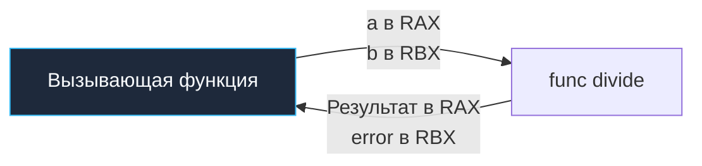

Функции в компьютерных науках — это фундаментальный механизм обуздания сложности. В языке Go функции являются полноправными объектами первого класса (First-Class Citizens). Вы можете свободно присваивать их переменным, упаковывать в структуры данных, передавать как аргументы в другие функции и возвращать в качестве результатов.

Однако разработчиков, переходящих в Go из C++, Java или C#, поначалу поражает то, чего в языке намеренно **нет**:

1. **Нет перегрузки функций (Overloading)**: Вы принципиально не можете объявить две функции с одинаковым именем в одном пакете, например `Print(int)` и `Print(string)`.
2. **Нет аргументов по умолчанию (Default parameters)**: Нельзя написать сигнатуру вроде `func process(timeout int = 10)`.

Это не случайное упущение создателей языка, а результат многолетнего опыта инженеров Bell Labs и Google. В гигантских монорепозиториях перегрузка функций и неявные значения по умолчанию приводят к тому, что при беглом чтении исходного кода (Code Review) человек без помощи IDE не способен однозначно определить, какая именно версия функции будет вызвана и с какими скрытыми параметрами. 

Go требует абсолютной инженерной честности: если поведение различается — дайте функциям явные, говорящие имена (`PrintInt`, `PrintString`) или спроектируйте лаконичный интерфейс.

---

## Анатомия функции и Multiple Return Values

В классических языках вроде C или Java функция возвращает строго одно значение. Если инженеру требовалось вернуть полезную нагрузку и одновременно статус ошибки, приходилось прибегать к костылям: выбрасывать исключения (Exception), возвращать магические константы или `null`, либо передавать во входные аргументы указатели ("out-параметры"), загрязняющие сигнатуру.

В Go множественные возвращаемые значения (Multiple Return Values) встроены в ядро системы типов. Это архитектурный базис идиоматичной модели обработки ошибок, делающий поток выполнения кристально чистым:

```go
package main

import "fmt"

// Функция принимает два int и возвращает int и error
func divide(a, b int) (int, error) {
    if b == 0 {
        // Ошибка - обычное значение, реализующее интерфейс error
        return 0, fmt.Errorf("деление на ноль")
    }
    return a / b, nil
}

func main() {
    result, err := divide(10, 2)
    if err != nil {
        fmt.Println("Ошибка:", err)
        return
    }
    fmt.Println("Результат:", result)
}
```

Никаких тяжелых блоков `try-catch`: ошибка — это обычное возвращаемое значение, которое проверяется сразу же на месте.

> [!info] Под капотом: Register ABI (Application Binary Interface)
> Каким образом процессор физически возвращает несколько значений на аппаратном уровне?
> В классическом C соглашение о вызовах предполагало возврат одного скалярного значения в системном регистре `RAX`. Вплоть до релиза Go 1.17 компилятор Go передавал все входные аргументы и возвращал результаты **через стековый фрейм горутины в оперативной памяти**. Это упрощало переносимость компилятора, но создавало постоянный паразитный трафик шины памяти к кэшам L1/L2.
> 
> Начиная с Go 1.17, экосистема перешла на революционный **Register-based ABI** (ABIInternal). Компилятор связывает аргументы и возвращаемые значения напрямую с регистрами общего назначения процессора. На 64-битной архитектуре amd64 выделяется до 9 целочисленных регистров (RAX, RBX, RCX и др.) и до 15 регистров XMM для вычислений с плавающей точкой.
> Когда функция возвращает пару `(int, error)`, рантайм помещает число `int` в регистр `RAX`, а указатель на структуру `error` — в регистр `RBX`. Никаких обращений к медленному стеку оперативной памяти — передача данных происходит со скоростью тактовой частоты кристалла!



---

## Передача аргументов: Всегда по значению

Один из самых популярных вопросов на техническом собеседовании звучит так: *«Как в Go передаются аргументы — по значению или по ссылке?»*

Ответ однозначен: **в Go абсолютно все аргументы передаются исключительно по значению (Pass by value)**. В языке физически нет концепции передачи по ссылке (Pass by reference) в том виде, в каком она реализована в C++ (через синтаксис `Type&`).

Когда вы вызываете функцию и передаете ей аргумент, рантайм создает **полную побитовую копию** этого значения и помещает ее в целевой регистр процессора или на стековый фрейм вызываемой функции.

```go
func modify(x int) {
    x = 100 // Изменяем КОПИЮ, оригинал не пострадает
}
```

### Передача указателей

Если логика программы требует изменить значение переменной в вызывающем коде, вы передаете указатель на нее. Но даже в этом случае механика непреклонна: **сам указатель передается по значению**:

```go
func modifyPtr(x *int) {
    *x = 100 // Разыменовываем копию указателя, меняем оригинал
}
```

Функция `modifyPtr` получает копию адреса в памяти (8 байт на 64-битной архитектуре). Эта копия указывает на ту же ячейку, что и оригинальный указатель. Мы копируем записку с адресом дома, а не сам дом.

*(Глубокое исследование работы с памятью, указателей и Escape Analysis мы проведем в главе [[14. Указатели в Go]]).*

> [!warning] Ловушка / Gotcha: Передача слайсов и мап
> В сообществе начинающих разработчиков распространено опасное заблуждение: *«слайсы и мапы передаются по ссылке»*. **Это ложь.**
> На физическом уровне слайс в Go — это миниатюрная структура заголовка (`SliceHeader`), состоящая из указателя на массив, длины и емкости (всего 24 байта памяти).
> Когда вы передаете срез в функцию, эти 24 байта **копируются по значению**. Копия слайса внутри функции имеет независимые поля длины (`len`) и емкости (`cap`), но ссылается на *тот же самый базовый массив в памяти*.
> Если вы измените элементы существующего массива (`s[0] = 42`), вызывающий код увидит изменения. Но если вы вызовете функцию `append` внутри функции, и слайс превысит свою емкость (выделив новый базовый массив) либо просто увеличит длину, оригинальный срез снаружи об этом ничего не узнает, потому что его локальная копия `SliceHeader` осталась неизменной!

---

## Вариативные аргументы (Variadic parameters)

В ситуациях, когда функция должна принимать произвольное количество параметров (подобно `fmt.Println`), Go предлагает синтаксис вариативных аргументов с троеточием: `...type`. По правилам синтаксиса такой параметр обязан стоять строго последним в сигнатуре:

```go
func sum(prefix string, nums ...int) int {
    total := 0
    // Внутри функции nums - это обычный срез (slice) типа []int
    for _, n := range nums {
        total += n
    }
    return total
}
```

Внутри тела функции переменная `nums` ведет себя как стандартный срез `[]int`.

### Распаковка слайса (Unpacking)

Если у вас уже сформирован готовый слайс, передать его напрямую в вариативную функцию нельзя — возникнет конфликт типов. Вы должны явно «распаковать» его с помощью суффикса `...`:

```go
mySlice := []int{1, 2, 3, 4}
// sum("test", mySlice) // Ошибка компиляции! Ожидается int, а не []int
result := sum("test", mySlice...) // Правильно
```

> [!tip] Собеседование
> **Вопрос:** Вы вызываете функцию `sum("test", 1, 2, 3)`. Выделяет ли компилятор память в куче (Heap) для временного среза `nums`?
> **Ответ:** Это определяет механизм Escape Analysis (анализ побега памяти). Компилятор Go высокооптимизирован: если временный срез `nums` не сохраняется в глобальных структурах и не «убегает» в другие горутины, компилятор разместит базовый массив для `[1, 2, 3]` прямо на текущем **стеке (Stack)**. Никакой аллокации в куче и никакого давления на сборщик мусора (GC, Garbage Collector) не произойдет!
> А если мы передаем уже существующий срез через распаковку `mySlice...`, никаких новых массивов не создается в принципе — функция просто получает побитовую копию заголовка `SliceHeader`.

---

## Функции как параметры (Колбэки и замыкания)

Статус функций как объектов первого класса раскрывается в паттернах внедрения зависимостей, фильтрации коллекций и паттерне «Стратегия».

В идиоматичном Go принято объявлять тип сигнатуры функции через конструкцию `type`, повышая выразительность кода:

```go
// Определяем тип функции, которая принимает int и возвращает bool
type FilterFunc func(int) bool

// Функция принимает слайс и функцию-фильтр
func filter(data []int, f FilterFunc) []int {
    var result []int
    for _, val := range data {
        if f(val) {
            result = append(result, val)
        }
    }
    return result
}

func main() {
    nums := []int{1, 2, 3, 4, 5}
    
    // Передаем анонимную функцию (лямбду) в качестве аргумента
    evens := filter(nums, func(n int) bool {
        return n%2 == 0
    })
}
```

Передаваемая функция может являться **замыканием (closure)**: она сохраняет доступ к переменным окружающего лексического контекста (например, области видимости функции `main`), даже когда физически выполняется во фрейме функции `filter`. Если такие захваченные переменные переживают возврат из функции, рантайм Go автоматически переносит их со стека в кучу (Heap).

---

## Итог

1. **Никакой магии**: Отсутствие перегрузки функций и параметров по умолчанию делает Go-код предельно прямолинейным и прозрачным для чтения без IDE.
2. **Multiple Return Values**: Возврат нескольких значений избавляет систему от громоздких конструкций `try-catch` и делает ошибку полноправным значением первого класса.
3. **Register ABI**: Начиная с Go 1.17, передача параметров и возврат результатов выполняются через регистры CPU (`RAX`, `RBX`), обеспечивая максимальную аппаратную производительность.
4. **Pass by value**: В Go всё передается строго по значению. Указатель — это копия адреса. Слайс — это копия 24-байтового заголовка `SliceHeader`.
5. **Вариативные параметры (`...T`)**: Внутри функции представлены срезом. Анализ побега памяти (Escape Analysis) позволяет компилятору размещать их прямо на стеке.

Мы изучили базовую механику работы с функциями. Но в арсенале Go есть еще два критически важных инструмента управления жизненным циклом функций и освобождением ресурсов: именованные возвращаемые переменные и отложенные вызовы `defer`. Их внутренней работе посвящена следующая статья: [[11. Именованные возвращаемые значения и defer]].
