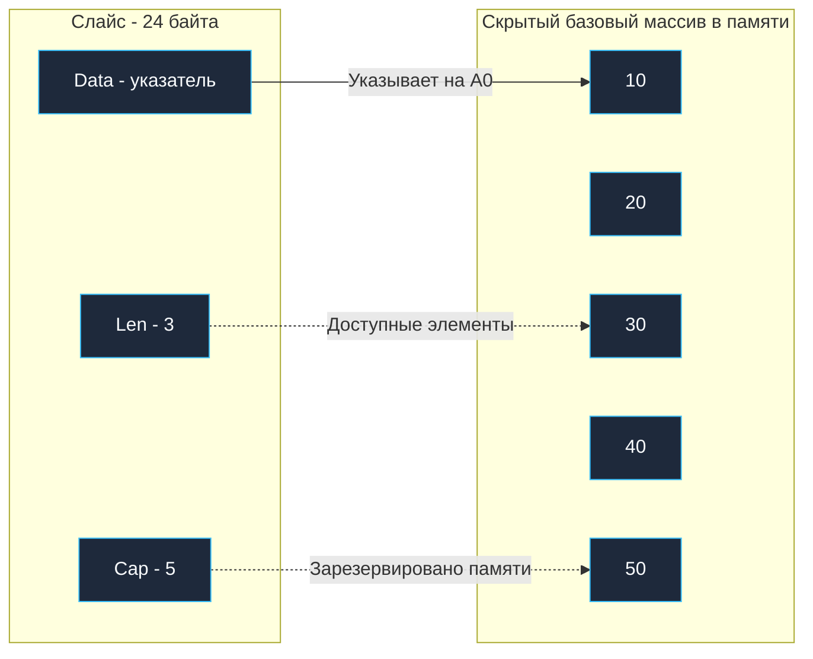

Как мы выяснили в лекции [[15. Массивы и их особенности]], массивы в Go — это монолитные блоки памяти фиксированного размера. Их длина намертво зашита в тип. В реальном программировании привязывать функции к жестким размерам вроде `[10]int` было бы непозволительной роскошью.

Для решения этой задачи создатели Go спроектировали **слайс (slice, срез)**. Это безоговорочно главная и наиболее часто используемая структура данных в языке. Разработчики, приходящие из C++, часто по привычке считают слайс аналогом `std::vector`, а программисты на Java проводят параллели с `ArrayList`.

Однако слайс в Go устроен принципиально иначе. Слайс — это вовсе не динамический массив сам по себе. Это легковесный дескриптор, «смотровое окно», смотрящее на непрерывный базовый массив (backing array) в памяти. Глубокое понимание физики этого окна спасает от скрытых утечек памяти и непредсказуемой перезаписи данных при конкурентной обработке.

---

## Структура слайса под капотом (SliceHeader)

На уровне рантайма Go (`runtime/slice.go`) любой срез — это компактная 24-байтная структура ровно из трех полей:

```go
type slice struct {
    array unsafe.Pointer // Машинный указатель на первый элемент базового массива
    len   int            // Логическая длина (количество доступных элементов)
    cap   int            // Физическая вместимость выделенного массива
}
```

*(Исторически эта структура также была экспортирована в пакете `reflect` как `SliceHeader`, но начиная с Go 1.20 она объявлена устаревшей (deprecated) в пользу типобезопасных функций `unsafe.Slice` и `unsafe.SliceData`).*

На современных 64-битных процессорах каждое из этих полей занимает ровно 8 байт. Это означает фундаментальный факт: **любой слайс в Go всегда весит ровно 24 байта**, независимо от того, пуст он или содержит миллион элементов:

1. **`Data`**: машинный указатель на первый адресуемый элемент базового массива в памяти.
2. **`Len` (Length)**: логическая длина среза — сколько элементов доступно для чтения и записи прямо сейчас. Возвращается встроенной функцией `len(s)`.
3. **`Cap` (Capacity)**: физическая емкость — сколько элементов физически выделено в непрерывной памяти базового массива, начиная от указателя `Data` и до конца массива. Возвращается встроенной функцией `cap(s)`.



---

## Операция среза (Slicing)

Слайс не зря называется срезом: он может в один миг «вырезать» диапазон элементов из существующего массива или другого среза с помощью оператора `array[start:end]`.

> [!warning] Ловушка / Gotcha: Математика индексов
> В синтаксисе `[start:end]` левая граница всегда включается, а правая — **не включается** (полуоткрытый интервал `[start, end)`).
> Логическая длина нового слайса вычисляется по формуле: `end - start`. Все смещения считаются строго в элементах массива, а не в физических байтах.

```go
arr := [5]int{10, 20, 30, 40, 50} // Это жесткий базовый массив

// Создаем слайс, который смотрит на элементы с индексами 1 и 2
s := arr[1:3]
```

Что произошло в памяти компьютера?
- Поле `Data` среза `s` указывает на адрес элемента `arr[1]` (значение `20`).
- Поле `Len` равно 2 (результат `3 - 1`).
- Поле `Cap` равно 4. Почему? Потому что начиная от ячейки `arr[1]` и до самого конца массива `arr` физически выделено 4 элемента (`20, 30, 40, 50`).

> [!info] Под капотом: Mechanical Sympathy
> Создание нового среза из существующего массива — это операция со сложностью $O(1)$. Она не копирует ни одного байта полезных данных! Компилятор просто формирует 24-байтовый заголовок `SliceHeader` на стеке горутины и вычисляет адрес смещения. Именно поэтому Go демонстрирует феноменальную скорость при парсинге HTTP-запросов, протоколов и текстовых потоков.

---

## Инициализация: Nil vs Empty Slice

Слайс можно объявить «с нуля», без явного предварительного выделения массива. Здесь кроется один из излюбленных вопросов технических собеседований: *«В чем разница между nil-слайсом и пустым слайсом?»*

```go
var s1 []int         // Подход 1: Nil-слайс
s2 := []int{}        // Подход 2: Пустой слайс
s3 := make([]int, 0) // Подход 3 -аналогичен 2-
```

С точки зрения базовых функций `len()` или `append()`, разница незаметна. Но с точки зрения рантайма и выделения памяти различия фундаментальны.

### 1. Nil-слайс (var s1 []int)
Это эталонный, канонический способ объявления пустого среза в Go:
- `Data = nil`
- `Len = 0`
- `Cap = 0`

Под такой срез **не выделяется ни одного байта в куче**. Он абсолютно бесплатен для рантайма. Проверка `s1 == nil` возвращает `true`. Встроенная функция `append` превосходно умеет работать с `nil`-слайсами: она самостоятельно запросит память у аллокатора при первой необходимости.

### 2. Пустой слайс (s2 := []int{})
Это слайс нулевой длины, который **не равен nil**:
- `Data = 0x...` (Указывает на специальный адрес в памяти — `zerobase`)
- `Len = 0`
- `Cap = 0`

В недрах рантайма Go существует глобальная статическая переменная `zerobase`. Все пустые аллокации в программе (слайсы нулевой вместимости, пустые структуры `struct{}`) ссылаются на этот единственный адрес в памяти, чтобы не нагружать аллокатор кучи. 

Однако литерал `[]int{}` менее идиоматичен. Главное практическое отличие проявляется при сериализации: например, пакет `encoding/json` при маршалинге `nil`-слайса выдаст JSON-значение `null`, тогда как для пустого слайса он сгенерирует валидный пустой массив `[]`.

> [!tip] Собеседование
> **Вопрос:** Вы объявляете `var users[]User`. Безопасно ли немедленно вызывать `users = append(users, newUser)` без предварительного `make`?
> **Ответ:** Да, это абсолютно безопасно и является рекомендуемым стандартом Go. Функция `append` проверяет указатель на равенство `nil` и сама корректно выделит память при первом обращении.

---

## Функция make и преаллокация

Если вам заранее известен объем данных (например, число строк из запроса к БД или размер конвертируемого списка), **всегда** используйте встроенную функцию `make`:

```go
// Создаст слайс: Len = 5, Cap = 5, заполненный нулями
s1 := make([]int, 5) 

// Создаст слайс: Len = 0, Cap = 100
s2 := make([]int, 0, 100)
```

Второй паттерн (`Len=0, Cap=100`) — золотое правило инженера высоконагруженных систем. Мы единовременно резервируем непрерывный блок памяти в куче под 100 элементов. Последующие вызовы `append` будут лишь увеличивать счетчик `Len` (простая инкрементация регистра в CPU) и без задержек записывать элементы в предварительно выделенную память. Это полностью избавляет рантайм от дорогостоящих повторных аллокаций памяти (realloc) и снижает нагрузку на Garbage Collector.

---

## Передача слайса в функцию

Вспомним незыблемое правило языка Go: **все аргументы всегда передаются по значению**.
Слайс подчиняется этому правилу беспрекословно. При передаче слайса в функцию компилятор копирует его 24-байтовую структуру `SliceHeader`.

```go
func modify(s []int) {
    s[0] = 999 // Изменит оригинал! (указатель Data смотрит на общую память)
    s = append(s, 42) // А вот это изменение длины оригинал не увидит!
}

func main() {
    nums := []int{1, 2, 3}
    modify(nums)
    fmt.Println(nums) // Выведет [999, 2, 3]. Элемента 42 здесь нет!
}
```

**Почему это произошло?**
Функция `modify` получила изолированную **копию** дескриптора (24 байта). Инструкция `s[0] = 999` переходит по скопированному указателю `Data` прямо в базовый массив в памяти и мутирует его ячейку — поэтому вызывающий код видит `999`.

Однако когда внутри функции вызывается `append(s, 42)`, встроенная функция возвращает **новый заголовок слайса** с `Len = 4`. Этот новый заголовок перезаписывает локальную копию `s` внутри стекового фрейма `modify`. Внешний слайс `nums` в функции `main` не имеет ни малейшего представления об этих манипуляциях: его поле `Len` как было равно 3, так и осталось!

---

## Итог

1. **Слайс — это окно:** Слайс не хранит данные самостоятельно, а выступает 24-байтовым дескриптором `SliceHeader` (`Data`, `Len`, `Cap`) над скрытым базовым массивом.
2. **Семантика передачи:** Передача среза копирует только его заголовок. Модификация существующих индексов меняет общий массив, но операция `append` внутри функции не изменяет длину среза снаружи без явного `return`.
3. **Nil против Empty:** Предпочитайте `var s[]T` (nil-слайс). Он не требует аллокаций и полностью поддерживается функцией `append`. Помните про разницу в JSON: `null` против `[]`.
4. **Преаллокация через make:** Вызов `make([]T, 0, cap)` минимизирует системные вызовы аллокации и устраняет фрагментацию памяти.

Мы освоили фундамент срезов, однако намеренно оставили за кадром самые тонкие моменты: что происходит, когда емкость `Cap` исчерпана? По какому алгоритму функция `append` удваивает память? Что такое скрытая утечка памяти при срезах и как один забытый байт может удерживать в куче мегабайтный массив? 

Все эти низкоуровневые вопросы мы детально препарируем в следующей статье: [[17. Slice под капотом. len, cap, append и realloc]].
