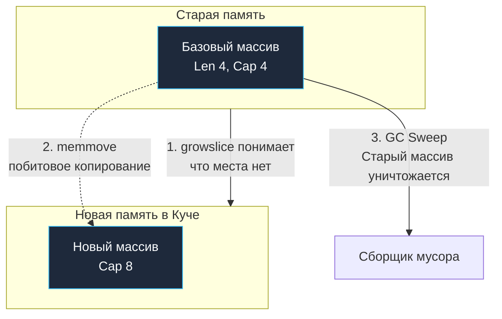

В предыдущей статье мы выяснили, что срез в Go — это всего лишь компактный 24-байтный дескриптор (`SliceHeader`), открывающий смотровое окно в непрерывный базовый массив. Но за этой обманчиво простой абстракцией скрывается один из самых сложных и тонко настроенных механизмов рантайма — алгоритм динамического роста срезов.

Когда Брайан Керниган и Деннис Ритчи создавали язык C, управление памятью было предельно осязаемым: программист вручную вызывал `realloc()` и физически ощущал перемещение каждого байта. В Go встроенная функция `append` настолько лаконична и удобна, что создает опасную иллюзию бесплатности. 

Именно из-за непонимания того, что происходит в недрах `runtime/slice.go` при переаллокации (realloc) и как сборщик мусора (Garbage Collector) отслеживает ссылки базового массива, в продакшен-сервисах утекают гигабайты оперативной памяти.

В этой главе мы разберем физику расширения срезов, познакомимся с ассемблерными оптимизациями `memmove` и изучим два главных паттерна утечек памяти при работе со срезами.

---

## Анатомия функции append

Встроенная функция `append(slice, elements...)` на уровне скомпилированного машинного кода разделяется на два принципиально разных сценария: быстрый путь (Fast Path) и медленный путь (Slow Path).

### Fast Path: Места хватает (Len < Cap)

Если в скрытом базовом массиве еще остается свободная емкость (`Cap - Len >= количество добавляемых элементов`), выполнение идет по «зеленому коридору»:

1. Процессор вычисляет адрес следующей свободной ячейки памяти базового массива простым смещением: `Data + Len * sizeof(Element)`.
2. Записывает новые данные напрямую в память.
3. Инкрементирует поле логической длины (`Len`) в 24-байтном дескрипторе.
4. Возвращает обновленный `SliceHeader`.

Это чистая операция со сложностью $O(1)$. Она укладывается в несколько тактов CPU, идеально ложится в кэш-линию L1 и не требует ни системных вызовов ядра, ни взаимодействия с аллокатором кучи.

### Slow Path: Массив заполнен (Len == Cap)

Когда физическое пространство в базовом массиве исчерпано, простая запись невозможна: она перезаписала бы чужие данные в соседней памяти (buffer overflow). 

В этот момент рантайм Go переключается на «медленный путь» и вызывает системную функцию `runtime.growslice`.

---

## runtime.growslice: Физика переаллокации

Функция `growslice` выполняет всю тяжелую работу по миграции данных. Процесс переаллокации (reallocation) включает четыре последовательных этапа:

1. **Расчет новой емкости (Cap)** по алгоритму плавного масштабирования.
2. **Аллокация:** Запрос у менеджера памяти нового, существенно большего непрерывного блока в куче.
3. **Копирование (memmove):** Побитовое копирование всех существующих данных из старого массива в новый.
4. **Утилизация:** Старый массив остается в памяти без живых дескрипторов (сиротой) и на следующем цикле GC Sweep будет очищен сборщиком мусора.



> [!info] Под капотом: Функция memmove
> Копирование массивов в Go не выполняется наивным циклом `for`. Рантайм вызывает системную процедуру `runtime.memmove`, написанную на чистом ассемблере под каждую конкретную микроархитектуру (amd64, arm64). Она задействует широкие векторные регистры процессора (SIMD, AVX) для перемещения данных блоками по 32 или 64 байта за один такт. 
> Это крайне эффективно, но если ваш срез весит **100 МБ**, то вызов `append` неизбежно заблокирует горутину на время копирования и создаст резкий всплеск потребления памяти: ведь в процессе миграции в RAM одновременно будут существовать и старые 100 МБ, и новые 200 МБ!

### Алгоритм роста (Как меняется Cap?)

На собеседованиях кандидаты нередко отвечают: *«Вместимость среза удваивается при каждом переполнении»*. **Этот ответ устарел.** 

Начиная с **Go 1.18**, алгоритм роста был переработан, чтобы исключить скачкообразный перерасход памяти на больших объемах данных. Критический порог (threshold) теперь составляет **256 элементов** (вместо старого лимита в 1024):

1. Если старая вместимость `Cap < 256`, новый размер строго удваивается (`x2`).
2. Если старая вместимость `Cap >= 256`, применяется формула плавного демпфирования:
   ```text
   newcap += (newcap + 3*256) / 4
   ```
   Эта формула обеспечивает плавное снижение коэффициента роста: от $2.0\times$ при 256 элементах до примерно $\sim 1.25\times$ для гигантских массивов.

> [!tip] Собеседование
> **Вопрос:** Мы выполняем `append` в слайс типа `[]int8`, текущий `Cap` равен 10. Каким станет новый `Cap`?
> **Ответ:** Чисто математически мы ожидаем удвоения: 20. Однако на практике `runtime.growslice` производит **выравнивание памяти (memory alignment)**. Рантайм запрашивает у аллокатора кучи блок памяти, соответствующий фиксированным классам размеров (size class) для блоков `mspan`. Аллокатор может вернуть минимально доступный квант, например, 24 или 32 байта. В результате реальный `Cap` после `append` может стать равен 24, но он **никогда не окажется меньше**, чем требовалось по формуле роста.

---

## Утечка памяти №1: Теневой массив (Capacity Leak)

Это классический подводный камень при обработке сетевых пакетов, парсинге логов и чтении файлов.

Представьте типичный микросервис: вы считываете из сокета сетевой пакет размером 1 Мегабайт в срез `[]byte`. Затем вы находите полезный заголовок (всего 10 байт) и передаете его дальше по бизнес-логике:

```go
package main

func getPayload(packet []byte) []byte {
    // Допустим, мы нашли полезные данные в самом конце
    return packet[len(packet)-10:] 
}

func main() {
    packet := make([]byte, 1024*1024) // Аллоцируем 1 МБ
    // ... читаем данные из сети ...
    
    payload := getPayload(packet) // Берем 10 байт
    _ = payload
    // В этот момент packet выходит из области видимости.
    // GC должен бы удалить 1 МБ. Но он этого НЕ СДЕЛАЕТ!
}
```

### Mechanical Sympathy: Почему GC бессилен?

Срез `payload` — это окно. Поле `Data` этого 24-байтового дескриптора **всё еще указывает на оригинальный мегабайтный массив** в куче (просто с большим начальным смещением).

Сборщик мусора Go использует алгоритм трехцветной маркировки (Mark and Sweep). Он начинает сканирование от корней (стеков и глобальных переменных) и видит: переменная `payload` содержит живой указатель в кучу! GC не имеет права частично удалить массив. Пока живы несчастные 10 байт полезной нагрузки, весь 1 Мегабайт памяти будет удерживаться в куче «мертвым грузом». Тысячи таких запросов быстро приведут к OOM-киллеру в Linux.

### Как лечить?

Необходимо физически разорвать связь с оригинальным базовым массивом, скопировав 10 байт в независимый блок памяти:

**Способ 1: Идиоматичный (через bytes / slices в Go 1.21+)**
```go
func getPayload(packet []byte) []byte {
    return slices.Clone(packet[len(packet)-10:])
}
```

**Способ 2: Через трюк append в nil**
```go
func getPayload(packet []byte) []byte {
    // append в nil принудительно создаст новый массив и скопирует элементы
    return append([]byte(nil), packet[len(packet)-10:]...)
}
```

---

## Утечка памяти №2: Заражение через append

Вторая критическая ловушка возникает, когда два среза ссылаются на общий базовый массив, и к одному из них применяется операция `append`:

```go
package main

import "fmt"

func main() {
    // Представим это как кэш или общий буфер
    origin := []int{1, 2, 3, 4, 5} // Len=5, Cap=5
    
    // Делаем срез
    view := origin[1:3] // [2, 3]. Len=2, Cap=4
    
    // А теперь добавляем данные в "вид"
    view = append(view, 999)
    
    fmt.Println("view:", view)     // [2, 3, 999]
    fmt.Println("origin:", origin) // [1, 2, 3, 999, 5] - ОРИГИНАЛ ИСПОРЧЕН!
}
```

Срез `view` обладал свободной емкостью (`Cap = 4`, при `Len = 2`). Функция `append` пошла по «быстрому пути» (Fast Path) и без зазрения совести перезаписала 4-й элемент общего базового массива. В итоге число `4` в срезе `origin` оказалось уничтожено.

### Как лечить? (Трех-индексный срез)

Для защиты от взаимного повреждения данных в Go существует синтаксис полного выражения среза: `slice[low:high:max]`.

Третий индекс (`max`) жестко задает границу емкости (`Cap = max - low`) для нового среза:

```go
func main() {
    origin := []int{1, 2, 3, 4, 5}
    
    // Создаем срез, но жестко ограничиваем Cap до длины среза (3)
    view := origin[1:3:3] 
    
    // Теперь у view Len=2, Cap=2. 
    // При вызове append свободного места НЕТ. 
    // Сработает slow path (runtime.growslice), будет выделен НОВЫЙ массив.
    view = append(view, 999)
    
    fmt.Println("origin:", origin) // [1, 2, 3, 4, 5] - ОРИГИНАЛ ЦЕЛ!
}
```

Ограничение емкости конструкцией `[1:3:3]` возводит надежный изоляционный барьер: любая последующая попытка добавления элементов принудительно уведет `view` на собственный независимый массив, сохранив `origin` в неприкосновенности.

---

## Итог

1. **Fast vs Slow Path:** При наличии свободной емкости `append` работает за мгновенные $O(1)$. При переполнении вызывается `runtime.growslice` со сложностью $O(N)$ и аллокацией новой памяти.
2. **Плавный рост:** Начиная с Go 1.18, удвоение емкости происходит только до 256 элементов. Далее работает сглаживающая формула `newcap += (newcap + 3*256) / 4`.
3. **Размерные классы памяти:** Из-за выравнивания памяти под классы размеров `mspan` итоговый `Cap` может быть больше расчетного.
4. **Capacity Leak:** Срез маленького фрагмента удерживает от сборки мусора весь гигантский исходный массив. Используйте `slices.Clone()` для копирования данных или `append([]byte(nil), ...)` для разрыва связей.
5. **Изоляция через a[low:high:max]:** Полный трех-индексный срез `slice[low:high:max]` (или `a[low:high:max]`) жестко ограничивает `Cap` и форсирует переаллокацию, исключая порчу общего массива при вызовах `append`.

Мы всесторонне исследовали массивы и динамические срезы. Однако в реальных веб-серверах и базах данных критически важно находить значения не по числовому смещению, а по произвольному ключу за константное время $O(1)$. 

Для этого в арсенале Go есть великолепная хэш-таблица. В следующей лекции — [[18. Map. Хеш-таблица в Go]] — мы исследуем структуру `map`, узнаем, почему ее итерация намеренно рандомизирована и как устроена адресация ключей в памяти.
