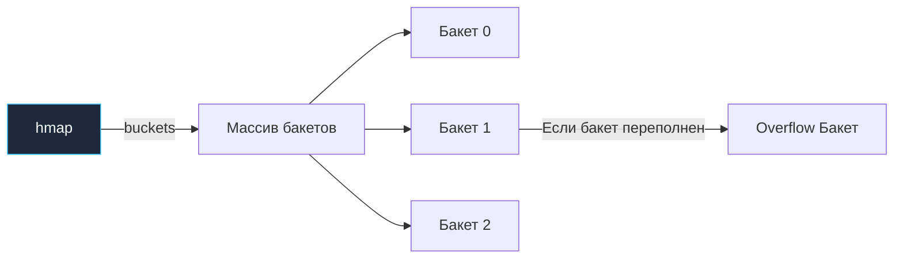
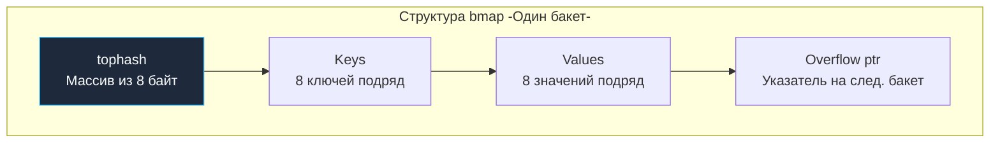

В предыдущей статье [[18. Map. Хеш-таблица в Go]] мы познакомились с синтаксисом и базовым поведением мап. Мы узнали, что мапа передается в функции как легковесный 8-байтный указатель. Но на какую именно структуру в памяти он указывает?

Реализация хэш-таблицы в рантайме Go (написанная Китом Рэндаллом и командой рантайма) — это подлинный триумф системной инженерии. Здесь органично переплелись криптографическая защита от сетевых атак, механическое сочувствие к кэшам процессора (L1/L2) и алгоритмы плавной дефрагментации памяти без остановки мира. Понимание того, как мапа устроена на уровне байтов, — один из главных маркеров Senior-инженера на технических собеседованиях.

В этой главе мы препарируем структуру `hmap`, разберем анатомию бакетов `bmap`, проследим путь поиска ключа и выясним, почему мапа в Go никогда не отдает захваченную память обратно операционной системе.

---

## 1. Структура hmap: Заголовок хеш-таблицы

Когда вы пишете `make(map[string]int)`, рантайм Go аллоцирует в куче структуру `hmap` (Header Map). Она описана в исходниках рантайма в файле `runtime/map.go` и хранит управляющие метаданные:

```go
// Упрощенная структура hmap из исходников рантайма
type hmap struct {
    count     int    // Логическое количество элементов -len-
    flags     uint8  // Флаги состояния -например, hashWriting для защиты от гонок-
    B         uint8  // Логарифм от количества бакетов -2^B = кол-во бакетов-
    noverflow uint16 // Примерное количество overflow-бакетов
    hash0     uint32 // Рандомный seed (соль) для хеш-функции

    buckets    unsafe.Pointer // Указатель на массив текущих бакетов
    oldbuckets unsafe.Pointer // Указатель на старый массив бакетов -при эвакуации-
    // ... отладочные поля и счетчики
}
```

> [!info] Архитектурный контекст: Swiss Tables (Go 1.24+)
> Модель `hmap` и бакетов `bmap` с массивом `tophash` представляет собой классическую архитектуру хэш-таблиц Go, служившую фундаментом языка с версии 1.0 по 1.23. Начиная с Go 1.24, рантайм внедрил реализацию хэш-таблиц на базе алгоритма Swiss Tables (`internal/runtime/maps`), использующую SIMD-инструкции для параллельного поиска по контрольным байтам в группах слотов. При этом фундаментальные свойства (семантика указателя `*hmap`, асимптотика $O(1)$ и поведение памяти при `delete`) сохраняются.

Ключевые поля структуры:
- **`count`**: счетчик элементов. Именно это поле мгновенно читается за $O(1)$, когда вы вызываете функцию `len(m)`.
- **`B`**: показатель степени двойки для количества бакетов. Число бакетов всегда равно $2^B$. Если `B = 4`, в мапе ровно $2^4 = 16$ бакетов.
- **`buckets`**: прямой указатель на непрерывный массив бакетов в оперативной памяти.

> [!info] Под капотом: Защита от HashDOS (hash0)
> Поле `hash0` заполняется криптографически случайным числом при инициализации каждой новой мапы.
> В раннюю эпоху веб-серверов хэш-таблицы использовали детерминированные алгоритмы. Злоумышленник мог заранее рассчитать миллион строковых ключей, дающих абсолютно одинаковый хэш, и прислать их в одном JSON-запросе. В результате все ключи сваливались в одну корзину, вырождая быстрый поиск $O(1)$ в чудовищный связный список со сложностью $O(N)$. Сервер утилизировал 100% CPU на коллизиях и падал от отказа в обслуживании (атака HashDOS).
> В Go хэш-функции (аппаратный AES на процессорах с инструкциями AES-NI или высокоскоростной xxHash) обязательно засаливаются случайным значением `hash0`. Для каждой созданной мапы коллизии распределяются уникально, делая таргетированные атаки математически невозможными.

---

## 2. Структура bmap (Бакет) и Mechanical Sympathy

Хэш-таблица в Go — это массив **бакетов (buckets)**. Каждый бакет представлен структурой `bmap` и спроектирован так, чтобы вмещать **ровно 8 пар «ключ-значение»**:



Если вы заглянете в `runtime/map.go`, определение `bmap` покажется обманчиво пустым: там объявлено лишь одно поле `tophash`. Причина в том, что конкретная структура бакета компилируется динамически на лету в зависимости от типов ключа и значения.

Логическая топология бакета `bmap` выглядит следующим образом:



### Mechanical Sympathy: Гениальная оптимизация памяти

Обратите внимание на физический порядок полей в памяти. Почему Go не хранит элементы парами `K1, V1, K2, V2...`, а группирует их монолитными блоками: `K1, K2, K3... V1, V2, V3...`?

Причина — **выравнивание памяти (Memory Padding)**, о котором мы будем подробно говорить в главе [[21. Struct. Пользовательские типы данных]].

Представьте хэш-таблицу типа `map[int64]int8`:
- Ключ `int64` занимает 8 байт (требует выравнивания по границе 8 байт).
- Значение `int8` занимает всего 1 байт.

Если бы они чередовались парами `(int64, int8)`, процессору требовалось бы вставлять 7 байт пустого заполнителя (padding) после каждого однобайтового значения, чтобы следующий 8-байтный ключ начинался с кратного адреса. На одном бакете впустую сгорало бы 56 байт памяти!

Сгруппировав 8 ключей вместе, а следом разместив 8 значений, рантайм Go полностью уничтожает паразитный padding. Бакет получается максимально компактным, идеально помещаясь в одну-две кэш-линии процессора (L1 Cache).

---

## 3. Анатомия поиска: Как Go находит элемент?

Когда программа запрашивает элемент по ключу (`val := m["alice"]`), процессор выполняет пятишаговый алгоритм:

1. **Хеширование:** Ключ `"alice"` смешивается с солью `hash0` и передается в хэш-функцию. На выходе получается 64-битный хэш.
2. **Выбор бакета (Low bits):** Рантайм берет **младшие `B` бит** хэша. Если `B = 4`, берутся 4 младших бита (например, `0011` в двоичной системе = 3 в десятичной). Поиск направляется строго в Бакет №3.
3. **TopHash (Быстрый фильтр):** Рантайм берет **старшие 8 бит** хэша (High bits) — это значение `tophash`.
4. **Векторный поиск внутри бакета:** Процессор не сравнивает строки! Он сканирует 8-байтный массив `tophash` внутри бакета с помощью быстрых инструкций CPU.
5. **Финальное сравнение:** Только если байт в `tophash` совпал со старшими битами искомого хэша, рантайм обращается к массиву ключей и выполняет честное сравнение `key == "alice"`. Это исключает миллионы дорогостоящих сравнений тяжелых строк и структур.

---

## 4. Разрешение коллизий: Chaining (Цепочки)

Что происходит, когда в один и тот же бакет хэшируется 9-й элемент, а все 8 слотов уже заняты?

Go использует модифицированный метод **связных списков (Separate Chaining)**. Рантайм выделяет в куче дополнительный бакет переполнения (Overflow Bucket) и записывает указатель на него в поле `overflow` текущего бакета, выстраивая цепочку.

> [!warning] Ловушка / Gotcha
> Если ключи генерируют слишком много коллизий, цепочки `overflow`-бакетов вытягиваются в длину. Скорость поиска неминуемо деградирует из $O(1)$ в $O(N)$ по связному списку, что приводит к постоянным Cache Misses. Чтобы предотвратить этот сценарий, мапа обязана динамически расти.

---

## 5. Эвакуация (Рост мапы)

Решение о расширении таблицы рантайт Go принимает на основе двух строгих триггеров:
1. **Load Factor > 6.5**. Фактор загрузки — это отношение общего числа элементов к числу бакетов (`count / 2^B`). Если корзины заполнены в среднем более чем на 80% (6.5 из 8 слотов), вероятность коллизий резко возрастает.
2. **Слишком много overflow-бакетов**. Если фактор загрузки невелик, но создано аномально много overflow-бакетов (следствие частой вставки и удаления ключей), мапа страдает от острой фрагментации.

### Инкрементальная эвакуация (Incremental Rehash)

Когда превышен `Load Factor > 6.5`, рантайм:
1. Увеличивает `B` на 1 (общее число бакетов **удваивается**).
2. Выделяет новый массив бакетов.
3. Сохраняет указатель на старый массив в поле `oldbuckets`, а новый массив связывает с `buckets`.

Но Go **никогда не копирует все данные разом**.
Если в вашей таблице содержится 10 миллионов элементов, полная блокировка сервиса (Stop-The-World) ради их переноса заморозила бы сервер на секунды, сокрушив все SLA по задержкам (latency).

Вместо этого Go применяет **инкрементальную эвакуацию**:
При каждом последующем вызове записи (`m[k] = v`) или удаления (`delete`) рантайм эвакуирует **ровно один или два бакета** из `oldbuckets`, пересчитывает для их 8 элементов новые адреса и аккуратно перемещает их в новый массив.

> [!tip] Собеседование
> **Вопрос:** Вы обращаетесь на чтение к ключу во время активной эвакуации мапы. Откуда рантайм прочитает значение?
> **Ответ:** При чтении рантайм Go первым делом проверяет старый массив `oldbuckets`. Если целевой бакет еще не был эвакуирован, данные мгновенно считываются из старого массива. Если же бакет уже перемещен (в его `tophash` выставлен специальный служебный маркер `evacuated`), поиск прозрачно перенаправляется в новый массив `buckets`.

### Эвакуация того же размера (Same-size Evacuation)

Если эвакуацию спровоцировало переполнение `overflow`-бакетов при низком `Load Factor`, удваивать емкость бессмысленно. Рантайм выделяет массив **точно такого же размера** ($2^B$) и переносит ключи туда. 

Это чистая **дефрагментация**: разрозненные элементы из длинных overflow-цепочек уплотняются обратно в основные бакеты, освобождая «дыры», оставшиеся после операций `delete`.

---

## 6. Великая утечка памяти в Map

С мапами в Go связан фундаментальный архитектурный нюанс, о котором обязан помнить каждый бэкенд-разработчик:

**Хэш-таблица в Go никогда не уменьшает свой размер (does not shrink).**

Если под пиковой нагрузкой вы добавили в мапу 1 000 000 элементов, рантайм выделит под них около 150 000 бакетов в куче.
Если затем вы вызовете функцию `delete` для всех 1 000 000 ключей, счетчик `count` честно обнулится до 0. Однако физический массив из 150 000 бакетов (занимающий сотни мегабайт оперативной памяти) **навсегда останется в памяти**. Поле `B` никогда не уменьшается в меньшую сторону! Сборщик мусора бессилен, так как живая структура `hmap` продолжает удерживать массив корзин.

**Как бороться с этой утечкой?**
Если вы используете мапу в качестве локального In-Memory кэша, который периодически раздувается, а затем сбрасывается, **периодически пересоздавайте мапу заново**:

```go
// Плохой подход для In-Memory кэша (память не освобождается):
for k := range cache {
    delete(cache, k)
}

// Идиоматичный подход (старая мапа уходит в Garbage Collector):
cache = make(map[string]Data) 
```

---

## Итог

1. **`hmap`**: структура хэш-таблицы в куче (~48 байт на 64-битной платформе), на которую ссылается 8-байтный указатель переменной мапы `*hmap`. Хранит счетчик элементов `count`, логарифмический размер $2^B$ и случайную соль `hash0` для защиты от сетевых атак HashDOS.
2. **`bmap` (Бакет)**: Вмещает ровно 8 записей. Ключи и значения сгруппированы раздельно (`K1..K8, V1..V8`), полностью исключая внутренний padding выравнивания.
3. **TopHash**: 8-битный массив старших байт хэша, позволяющий мгновенно фильтровать несовпадающие ключи инструкциями CPU.
4. **Инкрементальный рост**: При `Load Factor > 6.5` емкость удваивается. Перенос данных происходит порциями по 1–2 бакета при операциях мутации, гарантируя низкие задержки (low latency).
5. **Память не сжимается**: Вызов `delete` удаляет значения, но не освобождает бакеты. Периодически пересоздавайте раздувающиеся мапы через `make`.

Мы детально исследовали контейнеры данных: массивы, слайсы и хэш-таблицы. Однако самым частым ключом и самым популярным типом данных в бэкенде остается текст. Строки в Go обладают уникальной двойственной природой: с одной стороны, это неизменяемый монолит, с другой — легковесный дескриптор байтов.

В следующей статье — [[20. Строки в Go. Immutable string и работа с Unicode]] — мы заглянем под капот строк, исследуем `StringHeader`, интернирование (interning) и разберем высокопроизводительную конкатенацию через `strings.Builder`.
