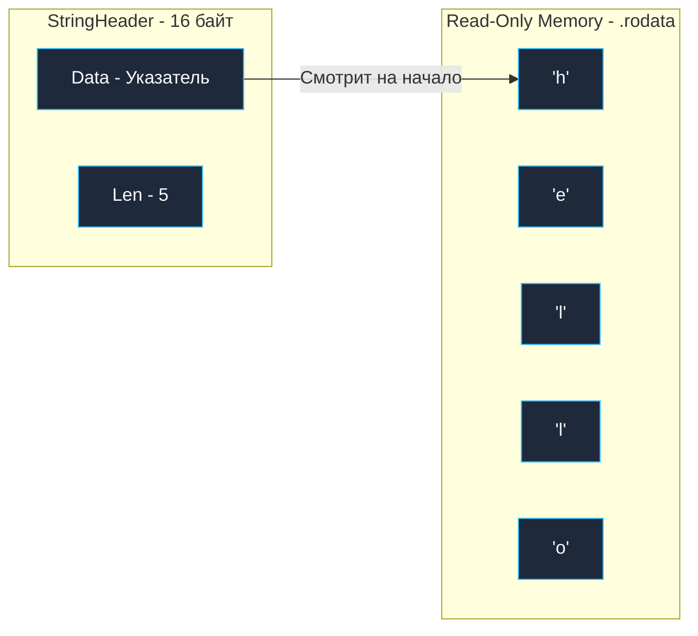

В прикладном бэкенде строки окружают нас повсюду: заголовки HTTP-запросов, тела JSON-документов, SQL-запросы, ключи в распределенном кэше и журналы логов. В лекции [[7. Rune, Byte и Unicode в Go]] мы уже выяснили, что строка в Go — это не абстрактный массив букв, а неизменяемая последовательность сырых байт в стандарте кодирования UTF-8.

В традиционном C строка представляла собой указатель на массив символов, завершающийся нулевым байтом (`char*`, null-terminated). Это историческое решение породило легион уязвимостей переполнения буфера и требовало обхода всей памяти за $O(N)$ для тривиального вычисления длины через `strlen()`.

В Go создатели языка — Кен Томпсон и Роб Пайк — полностью переосмыслили работу со строками. Они заложили в них железные гарантии неизменяемости (Immutability). Это защищает многопоточные приложения от гонок данных без единого мьютекса, но при неосторожном обращении может спровоцировать колоссальные утечки памяти и деградацию производительности при конкатенациях.

В этой главе мы препарируем структуру `StringHeader`, разберем физику неизменяемости, узнаем, почему наивная конвертация строки в срез байт убивает производительность, и изучим, как `strings.Builder` использует низкоуровневые механизмы для Zero-Copy манипуляций.

---

## Анатомия структуры строки (StringHeader)

На уровне рантайма (`runtime/string.go`) строка — это легковесная 16-байтная структура (на 64-битной архитектуре) из двух полей:

```go
type stringStruct struct {
    str unsafe.Pointer // Указатель на непрерывный байтовый массив в памяти
    len int            // Точное количество физических байт в строке
}
```

*(Исторически в пакете `reflect` была определена аналогичная структура `StringHeader`, но начиная с Go 1.20 она объявлена устаревшей (deprecated) в пользу функций `unsafe.String` и `unsafe.StringData`).*

Обратите внимание на ключевое отличие от `SliceHeader` из главы [[16. Slice. Главная структура данных в Go]]: **у строки принципиально отсутствует поле `Cap` (Capacity)**. Поскольку размер строки неизменяем, резервировать избыточную емкость не имеет физического смысла:

1. **`Data`**: указатель на непрерывный read-only массив байт в памяти процесса.
2. **`Len`**: точное количество физических байт (а не рун!).



Поскольку структура весит всего 16 байт (два машинных слова), передача строки в функцию по значению (без указателей) обходится процессору практически бесплатно: рантайм просто копирует два 8-байтных регистра CPU (`Data` и `Len`). Сами текстовые данные при этом не дублируются.

---

## Неизменяемость (Immutability) и её цена

Фундаментальный инвариант языка: **строка в Go абсолютно неизменяема**.
После того как строка создана в памяти, вы не можете модифицировать ни один ее байт:

```go
s := "hello"
// s[0] = 'H' // Ошибка компиляции! Cannot assign to s[0]
```

### Mechanical Sympathy: Зачем нужна неизменяемость?

1. **Потокобезопасность без мьютексов (Mutex):** Вы можете одновременно читать одну и ту же строку из 10 000 параллельных горутин. Никакие блокировки не нужны: данные гарантированно защищены от модификации.
2. **Разделение памяти (Memory Sharing):** Операция среза подстроки (`s[1:3]`) выполняется за мгновенные $O(1)$. Go не копирует байты подстроки, а создает новый 16-байтный дескриптор `StringHeader`, поле `Data` которого просто указывает со смещением на середину оригинального массива.
3. **Защита на уровне сегментов памяти:** Если строковый литерал задан в коде программы жестко (`"hello"`), компилятор помещает массив байт в защищенную секцию бинарного файла — `.rodata` (Read-Only Data). Любая попытка аппаратно перезаписать этот сектор памяти приведет к системному прерыванию процессора `SIGSEGV` (Segmentation fault).

---

## Конкатенация: O(N^2) и убийство Garbage Collector'а

Обратной стороной неизменяемости является поведение оператора сложения строк `+`:

> [!warning] Ловушка / Gotcha: Сложение в цикле
> Взгляните на типичный антипаттерн новичка:
> ```go
> var result string
> for i := 0; i < 100000; i++ {
>     result += "A" // КАТАСТРОФА!
> }
> ```
> При каждом вызове `result += "A"` рантайм Go не может дописать символ в существующую память. Он вынужден выделять в куче **новый** массив байт размером `Len(старая строка) + Len(добавка)` и побайтово копировать туда обе части.
> На следующей итерации предыдущая строка превращается в мусор. Для 100 000 итераций такой цикл выделит в куче около **5 Гигабайт** временных байтов, нагрузив Garbage Collector и загнав CPU в многосекундные паузы! Сложность алгоритма деградирует до катастрофических $O(N^2)$.

### Идиоматичный подход: strings.Builder

Для высокопроизводительной сборки строк создан тип `strings.Builder`. Под капотом он инкапсулирует динамический срез байт `[]byte`, в который данные дописываются через метод `WriteString()`:

```go
package main

import "strings"

func main() {
    var b strings.Builder
    b.Grow(100000) // Оптимизация! Заранее просим аллокатор выделить память

    for i := 0; i < 100000; i++ {
        b.WriteString("A") 
    }
    result := b.String()
    _ = result
}
```

> [!info] Под капотом: Магия Zero-Copy
> В отличие от классического `bytes.Buffer`, который при вызове `.String()` создает новую строку и полностью копирует в нее байтовый массив, `strings.Builder` выполняет **Zero-Copy** конвертацию.
> Заглянем в исходный код метода `String()`:
> ```go
> func (b *Builder) String() string {
>     return unsafe.String(unsafe.SliceData(b.buf), len(b.buf))
> }
> ```
> С помощью пакета `unsafe` (а именно функций `unsafe.String` и `unsafe.SliceData`) компилятор возвращает новый заголовок `StringHeader`, который напрямую указывает на внутренний массив `b.buf`. Никакого копирования памяти! При этом структура `strings.Builder` защищена специальным маркером, предотвращающим последующую мутацию буфера после вызова `.String()`.

---

## Конвертация string <-> []byte

В сетевом бэкенде нам непрерывно приходится преобразовывать текст в байты для отправки в TCP-сокеты или файлы, а затем читать байты обратно в строки:

```go
s := "hello"
b := []byte(s) // Конвертация в байты

b[0] = 'H' // Меняем байт
s2 := string(b) // Конвертация обратно в строку
```

> [!tip] Собеседование
> **Вопрос:** Выделяет ли память конструкция `b :=[]byte(s)`?
> **Ответ:** Да, и это дорогая операция со сложностью $O(N)$! Поскольку исходная строка `s` неизменяема (и может находиться в сегменте `.rodata`), а срез `b` обязан быть изменяемым, рантайм **выделяет совершенно новый блок памяти в куче** и побитово копирует туда все байты строки. Точно такое же копирование $O(N)$ происходит при обратной конвертации `string(b)`.

### Оптимизации компилятора (Compiler Magic)

Создатели Go понимали, что постоянное копирование байтов при конвертациях парализует производительность. Поэтому компилятор Go содержит несколько исключений, при которых аллокация памяти при конвертации `string([]byte)` гарантированно **оптимизируется в Zero-Allocation**:

1. **Поиск в хеш-таблице:** Выражение `m[string(bytesSlice)]`. Компилятор не создает реальную строку в куче: он берет указатель на байты среза и на лету вычисляет хэш для поиска по бакетам.
2. **Конкатенация строк:** Конструкция `s + string(bytesSlice)`.
3. **Сравнение:** Проверка равенства `string(bytesSlice) == "hello"`.

**Практическая эвристика:**
Если вы работаете со стандартной библиотекой ввода-вывода (например, формируете ответ HTTP-сервера в `http.ResponseWriter` или пишете в файл `os.File`), интерфейс `Write` требует на вход `[]byte`. Если у вас на руках готовая строка, **не конвертируйте ее вручную** через `w.Write([]byte(s))`. Всегда используйте хелпер `io.WriteString(w, s)`: внутри он оптимально передаст адрес строки в ядро ОС без лишнего копирования в куче.

---

## String Interning: Экономия на дубликатах

Что произойдет, если в десятках разных файлов вашего проекта объявлены одинаковые строковые константы?

```go
s1 := "internal_server_error"
s2 := "internal_server_error"
```

Будет ли эта строка дублироваться в оперативной памяти? Нет.

Компилятор Go производит автоматическое **интернирование строк (String Interning)** для строковых литералов, известных на этапе компиляции. Он находит все идентичные строки и сохраняет их в единственном экземпляре в секции `.rodata`. Переменные `s1` и `s2` получают независимые 16-байтные дескрипторы, указатели `Data` которых ссылаются на один и тот же адрес памяти.

Однако помните: рантайм **не интернирует динамические строки автоматически**. Если ваш сервис читает из базы данных миллионы одинаковых записей со статусом `"success"`, рантайм честно выделит независимый кусок памяти под каждую из них.

---

## Итог

1. **`StringHeader`**: 16-байтная структура (`Data`, `Len`). Передача строк по значению столь же легковесна, как копирование двух регистров процессора.
2. **Неизменяемость**: Строки монолитны. Срез подстроки `s[1:5]` бесплатен, так как разделяет память с оригинальной строкой.
3. **Конкатенация**: Избегайте сложения строк через `+=` в циклах. Всегда используйте `strings.Builder` с методом `Grow()` — он обеспечивает сборку без аллокаций через механизм Zero-Copy.
4. **Конвертация**: Приведение `[]byte(s)` производит $O(N)$ копирование в куче. Используйте `io.WriteString` для потокового ввода-вывода без лишних конвертаций.
5. **String Interning**: Строковые литералы кода интернируются компилятором в единственном экземпляре в секции `.rodata`.

Мы завершили изучение встроенных примитивных типов и коллекций языка Go. Теперь пришло время исследовать то, как инженер моделирует предметную область. Как сгруппировать разнородные поля сущности «Пользователь» или «Транзакция» в единый компактный тип?

В следующей лекции — [[21. Struct. Пользовательские типы данных]] — мы препарируем структуры, разберем выравнивание памяти (Memory Alignment, Padding) и выясним, почему правильный порядок полей в структуре способен сэкономить десятки мегабайт RAM.
