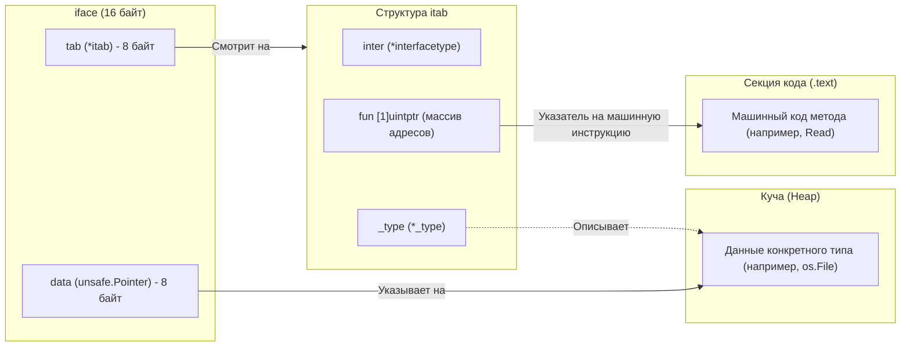
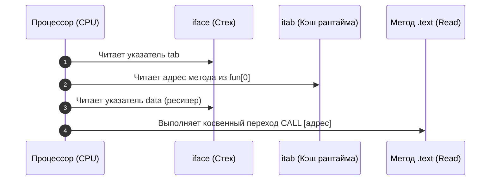

В реальном мире морских грузоперевозок существует гениальное изобретение — стандартизированный интермодальный 20-футовый контейнер. Портовому крану и контейнеровозу совершенно безразлично, что находится внутри: швейцарские наручные часы весом в сто граммов или дизельный генератор весом в десять тонн. Контейнер всегда имеет строго фиксированные внешние габариты и унифицированные угловые фитинги. На двери контейнера наклеен стандартизированный манифест (описание груза), а внутри закреплен сам груз.

В языке Go интерфейсы играют роль точно таких же универсальных контейнеров. Для программиста здесь кроется очевидный парадокс. Go — статически типизированный язык, где компилятор обязан знать точный размер каждой переменной на этапе компиляции, чтобы выделить под нее место на стеке или в регистрах CPU. Число `int64` занимает ровно 8 байт, а структура `User` может занимать 256 байт. Как же переменная интерфейса может хранить в себе значения абсолютно произвольного размера, сохраняя при этом фиксированный размер для компилятора?

Ответ мы найдем в исходниках рантайма Go (файлы `runtime/runtime2.go` и `runtime/iface.go`). Интерфейс в Go — это не мистическая абстракция, а предельно конкретная структура размером **ровно 16 байт** (два машинных слова на 64-битной архитектуре). 

В зависимости от того, требует ли интерфейс методы, рантайм использует одну из двух структур: **`eface`** (пустой интерфейс `any`) или **`iface`** (интерфейс с контрактом методов).

---

## 1. eface: Пустой интерфейс (any)

Когда вы объявляете параметр функции как `any` (или `interface{}`), вы сообщаете компилятору: *«Сюда может прийти значение абсолютно любого типа, и у него не требуется никаких методов»*.

Под капотом рантайм представляет такой пустой интерфейс в виде структуры `eface` (Empty Interface):

```go
// Исходный код runtime/runtime2.go
type eface struct {
    _type *_type          // Указатель на описание типа (8 байт)
    data  unsafe.Pointer  // Указатель на сами данные (8 байт)
}
```

Всего два поля, каждое ровно по 8 байт:

1. **`_type`**: Указатель на метаданные типа. Вся эта информация генерируется компилятором и зашивается в секцию только для чтения (`.rodata`) бинарного файла. Метаданные содержат: размер типа в байтах, его хеш, алгоритмы сравнения на равенство, строковое имя типа и битовую карту для сборщика мусора (GC), указывающую, где внутри типа находятся указатели на другие объекты.
2. **`data`**: Непосредственный указатель (`unsafe.Pointer`) на область памяти, где физически расположены значения вашей переменной (в куче или на стеке).

```
+-------------------+-------------------+
|   _type (*_type)  | data (unsafe.Ptr) |  --> 16 байт (eface)
|      (8 байт)     |      (8 байт)     |
+-------------------+-------------------+
```

Именно поэтому размер `eface` всегда константен. Если вы положите в `any` структуру размером в один мегабайт, сама переменная `any` займет ровно 16 байт: указатель `_type` опишет мегабайтную структуру, а указатель `data` будет указывать на область памяти в куче (Heap), где этот мегабайт расположен.

---

## 2. iface: Интерфейс с методами

Если интерфейс содержит хотя бы один метод (например, `error` имеет метод `Error() string`, а `io.Reader` имеет `Read()`), рантайму недостаточно знать только тип данных. Ему необходимо знать, **какие именно машинные инструкции** вызывать при вызове каждого метода.

Для таких непустых интерфейсов используется структура `iface`:

```go
// Исходный код runtime/runtime2.go
type iface struct {
    tab  *itab           // Указатель на таблицу интерфейса (8 байт)
    data unsafe.Pointer  // Указатель на сами данные (8 байт)
}
```

Поле `data` здесь выполняет знакомую роль — хранит указатель на физические данные объекта. А вот поле `_type` уступило место указателю на структуру **`itab`** (Interface Table).

### Анатомия itab и Виртуальная таблица методов

Структура `itab` — это сердце динамической диспетчеризации (Dynamic Dispatch) в Go. Она связывает конкретный интерфейс с конкретным типом реализации.

```go
// Исходный код runtime/runtime2.go
type itab struct {
    inter *interfacetype // Описание самого интерфейса (какие методы он требует)
    _type *_type         // Описание конкретного типа данных (который мы положили)
    hash  uint32         // Копия _type.hash для быстрого Type Assertion
    _     [4]byte        // Выравнивание памяти (Padding до границы 8 байт)
    fun   [1]uintptr     // Массив указателей на функции (адреса методов в памяти)
}
```



Обратите внимание на поле **`fun`**:
В объявлении структуры `itab` оно описано как массив из одного элемента `[1]uintptr`. На самом деле это классический си-трюк с гибким массивом (Flexible Array Member): рантайм выделяет под `itab` блок памяти переменной длины, достаточный для размещения указателей на **все** методы, объявленные в интерфейсе. 

Массив `fun` — это прямой аналог **vtable (Virtual Method Table)** из C++. В нем лежат физические адреса точек входа в машинный код функций конкретного типа.

Таблицы `itab` не создаются заново при каждом присваивании: рантайм вычисляет их один раз и сохраняет в глобальном хэш-кэше (`itabTable` с атомарными блокировками). Если вы тысячу раз кладете `*os.File` в `io.Reader`, указатель `tab` будет указывать на один и тот же предрассчитанный экземпляр `itab`.

---

## Mechanical Sympathy: Как происходит вызов метода?

Что происходит в кремнии процессора в тот момент, когда ваш код выполняет вызов метода интерфейса `reader.Read()`?

При прямом статическом вызове функции конкретного типа (`File.Read()`) адрес инструкции известен на этапе линковки бинарника. Компилятор просто подставляет инструкцию ассемблера `CALL 0x482a10`. Процессор заранее знает, куда прыгнуть, предсказатель ветвлений (Branch Target Buffer) готов, а конвейер работает на максимальной скорости.

Вызов через интерфейс требует **динамической диспетчеризации (косвенного вызова)**:

1. Процессор читает указатель `tab` из переменной `reader` (чтение из памяти).
2. По смещению в структуре `itab` процессор читает ячейку массива `fun[0]` (второе чтение из памяти).
3. Процессор извлекает из `reader` указатель `data`, чтобы передать его в качестве первого аргумента (Receiver).
4. Процессор выполняет инструкцию косвенного перехода: `CALL [RAX]` (Indirect Call).



> [!info] Под капотом: Налог на интерфейсы
> Косвенные вызовы через указатель (`CALL reg`) создают дополнительную нагрузку на предсказатель ветвлений (Branch Target Buffer) процессора. Если тип под интерфейсом постоянно меняется, предсказатель ошибается, вызывая сброс конвейера инструкций (Pipeline Flush). Вызов метода через интерфейс в среднем **на 1–2 наносекунды медленнее**, чем статический вызов.
> 
> Для 99% бизнес-логики эти пара наносекунд неощутимы на фоне сетевого I/O или запросов к СУБД. Но в ультра-горячих циклах (высокоскоростной парсинг протоколов, математические расчеты) компилятор Go применяет оптимизацию **Devirtualization (Девиртуализация)**, а с появлением PGO (Profile-Guided Optimization в Go 1.22+) компилятор на основе реального профиля нагрузки подменяет косвенный вызов прямым статическим прыжком.

---

## Механика Type Assertion (Утверждения типа)

В предыдущей главе мы применяли конструкцию утверждения типа `str, ok := val.(string)`. Как это реализовано на машинном уровне?

Здесь важно различать два сценария утверждения типа:

1. **Утверждение к конкретному типу (`val.(T)`):** Это предельно легковесная операция со сложностью $O(1)$. Рантайм просто берет скрытый указатель `_type` из вашего `eface` (или `itab._type` из `iface`) и сравнивает его с адресом описания конкретного типа `T` в секции данных программы (для ускорения в `iface` предварительно сверяется 32-битное поле `hash` типа). Это **одно прямое сравнение двух 64-битных указателей**. Если адреса совпали — `ok = true`, и возвращаются данные по указателю `data`.
2. **Утверждение к другому интерфейсу (`val.(TargetInterface)`):** Если мы проверяем, реализует ли лежащий внутри интерфейса конкретный тип другой целевой интерфейс (например, `r.(io.Closer)`), рантайм вызывает функцию `runtime.assertI2I2` или `runtime.assertE2I2`. Она обращается к глобальному хэш-кэшу таблиц `itab` (`itabTable`). Если комбинация «тип — целевой интерфейс» уже рассчитывалась, возвращается готовый `itab` за $O(1)$; если нет — рантайм динамически сверяет сигнатуры методов конкретного типа с целевым интерфейсом и сохраняет результат в кэш.

---

## Утечка памяти и Boxing (Упаковка)

Интерфейсы скрывают важный нюанс управления памятью, о котором обязан помнить бэкенд-инженер.

Вспомним устройство `eface` и `iface`: поле `data` — это **указатель** (`unsafe.Pointer`).
Что произойдет, если мы решим передать в интерфейс обычное число `x := 42` типа `int`?

Примитивное число — это тип-значение (Value Type). Оно живет в регистре процессора или на стеке. У него нет постоянного адреса в куче. Но поле `data` физически обязано содержать адрес!

В этот момент рантайм вынужден выполнить операцию **Boxing (Упаковка)**:
1. Выделить память в **Куче (Heap)** для размещения числа.
2. Скопировать число со стека в выделенный блок кучи.
3. Сохранить полученный указатель на кучу в поле `data` интерфейса.

```go
func DoWork(val any) {
    // ...
}

func main() {
    x := 42 
    DoWork(x) // АЛЛОКАЦИЯ! x "убегает" в кучу
}
```

> [!warning] Ловушка / Gotcha: Интерфейсы нагружают GC
> Любая передача Value-типов (`int`, `bool`, небольших структур по значению) в функцию, принимающую интерфейс (например, популярный вызов `fmt.Println(x)`), исторически приводила к незаметной аллокации памяти в куче (Escape to Heap). Десятки тысяч таких вызовов в секунду создают ненужное давление на сборщик мусора (GC Garbage).
> 
> *Оговорка компилятора:* Начиная с Go 1.15, рантайм оптимизирует упаковку небольших целочисленных констант от 0 до 255 (Small Integers Optimization) и пустых структур/строк: они указывают на заранее аллоцированный статический срез в памяти и не дергают аллокатор кучи. Но для произвольных динамических значений и структур правило упаковки остается в силе.

---

## Еще раз о Typed Nil

Понимание физического устройства `iface` расставляет все точки над «i» в проблеме «типизированного nil», с которой мы столкнулись в лекции об ошибках [[12. Обработка ошибок через error]].

Интерфейс в Go считается равным `nil` (буквальному `nil` при проверке `if iface == nil`) **только тогда, когда ОБА его внутренних указателя (`tab`/`_type` и `data`) равны `0x0`**.

```go
type MyStruct struct{}

var ptr *MyStruct = nil
var i any = ptr 

// Что физически находится внутри переменной i?
// i._type = 0x51c4a0 (указатель на метаданные типа *MyStruct в .rodata)
// i.data  = 0x0      (сырой указатель на данные равен nil)

if i == nil {
    // МЫ СЮДА НЕ ПОПАДЕМ!
}
```

Сравнение `i == nil` проверяет интерфейс на `(0x0, 0x0)`. Но наш интерфейс содержит `_type != 0x0`. Он не равен `nil`! Он "хранит внутри себя типизированный nil".

---

## Итог

1. **`eface` и `iface`:** Любая интерфейсная переменная в Go на 64-битной системе занимает ровно 16 байт (2 машинных слова: указатель на метаданные/методы + указатель на данные).
2. **`itab` и Dynamic Dispatch:** `iface` использует таблицу интерфейса `itab`, содержащую срез указателей на функции `fun`. Вызов метода через интерфейс — это косвенный переход (Indirect Jump), требующий на пару наносекунд больше времени, чем прямой вызов.
3. **Type Assertion за $O(1)$:** Проверка типа сводится к мгновенному сравнению адресов дескрипторов типов в оперативной памяти.
4. **Boxing:** Помещение типов-значений (value types) в интерфейс вынуждает компилятор аллоцировать память в куче, чтобы получить адрес для поля `data`.
5. **Typed Nil:** Интерфейс равен `nil` только при одновременном равенстве нулю типа и данных `(0x0, 0x0)`.

Мы досконально изучили полиморфизм и поведение интерфейсов на аппаратном уровне. Но разработчики, переходящие в Go из классического ООП, часто задаются вопросом: если в Go нет классов и ключевого слова `extends`, как повторно использовать код? Как расширять функциональность готовых структур без монолитных иерархий?

В следующей лекции мы разберем уникальный ответ Go на этот вызов. В главе [[25. Встраивание. Embedding вместо наследования]] мы исследуем композицию, затенение методов (Shadowing) и выясним, почему встраивание — это не наследование, а умный синтаксический сахар рантайма.