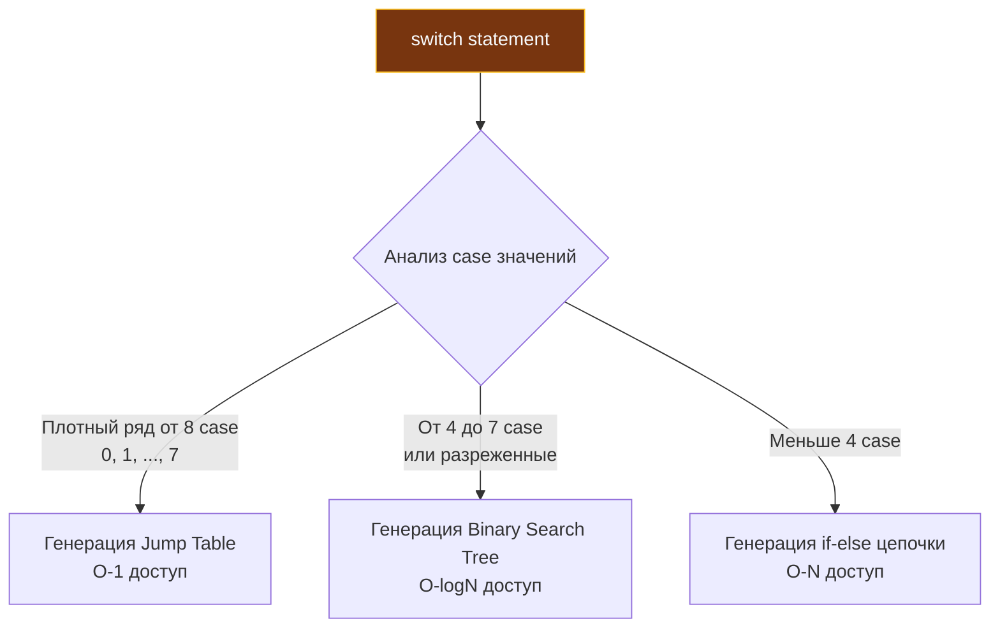

В большинстве языков программирования синтаксис управления потоком выполнения (Control Flow) с годами обрастает деталями, подобно днищу корабля ракушками: `while`, `do...while`, `foreach`, операторы `until` и `unless`, замысловатые тернарные операторы (`condition ? a : b`), а также хрупкие конструкции `switch`, требующие не забывать обязательный `break` в конце каждой ветки.

Философия Go — это культ ортогональности и минимализма. Создатели языка безжалостно вырезали всё синтаксическое дублирование. В Go нет циклов `while` или `do...while`. В Go принципиально отсутствует тернарный оператор (`condition ? a : b`). Зато встроенный `switch` настолько гибок и выразителен, что играючи заменяет собой многоэтажные цепочки `if-else`.

В этой главе мы подробно разберем анатомию трех главных (и по сути единственных) управляющих конструкций Go: `if`, `for` и `switch`. Мы заглянем в машинный код, исследуем оптимизации компилятора и разберем самую громкую проблему рантайма Go за всю историю языка, окончательно решенную лишь в релизе Go 1.22.

---

## 1. Конструкция if: Инициализация по месту

Базовый синтаксис `if` в Go знаком каждому программисту, за одним приятным исключением: проверяемое логическое условие больше не нужно оборачивать в круглые скобки. Однако фигурные скобки `{}` обязательны абсолютно всегда, даже если тело блока состоит из единственной инструкции.

Это железное правило навсегда ликвидировало класс критических уязвимостей в безопасности, самый известный пример которого — катастрофический баг `goto fail` в криптографическом стеке Apple iOS (где случайно продублированная строчка `goto fail` без фигурных скобок приводила к безусловному пропуску валидации сертификата TLS).

Но самая практичная особенность `if` в Go — это возможность указать **блок инициализации** непосредственно перед проверяемым условием через точку с запятой `;`:

```go
// Классический подход (переменная user "утекает" во внешнюю область видимости)
user := getUser()
if user.IsActive() {
    // ...
}

// Идиоматичный Go: инициализация и проверка в одной строке
if user := getUser(); user.IsActive() {
    // user доступна только внутри этого блока if и связанных else
    fmt.Println(user.Name)
}
// Здесь переменная user больше не существует (удалена из Scope)
```

Переменная `user`, созданная в заголовке, живет ровно столько, сколько живет сам блок `if` (включая ветки `else if` и `else`), и автоматически удаляется из области видимости (Scope) при выходе.

Этот синтаксис стал фундаментом идиомы обработки ошибок в Go, которую мы встречаем на каждом шагу бэкенд-разработки:

```go
if err := processData(); err != nil {
    return err // Обработка и немедленный возврат (Early Return)
}
```

> [!warning] Ловушка / Gotcha
> Как мы подробно обсуждали в главе [[5. Переменные, константы и вывод типа]], оператор краткого объявления `:=` внутри блока `if` создает **новую** локальную переменную в текущей области видимости. Если вы попытаетесь записать результат работы функции в уже объявленную внешнюю переменную, но ошибочно используете `:=` внутри `if`, вы создадите локальную тень (Shadowing). Внешняя переменная останется нетронутой, а локальная копия исчезнет при выходе из `if`, породив скрытый логический дефект.

---

## 2. Ультимативный for: Один цикл, чтобы править всеми

Вместо зоопарка циклов создатели Go оставили одно-единственное ключевое слово: `for`. Подобно швейцарскому ножу, `for` элегантно трансформируется во все мыслимые сценарии итерации.

### Форма 1: Классический C-style
Используется при необходимости жесткого контроля над числовым индексом и шагом инкремента:
```go
for i := 0; i < 10; i++ {
    // ...
}
```

### Форма 2: Замена while
Если отбросить секции инициализации и пост-итерации, `for` мгновенно превращается в классический цикл `while`:
```go
n := 1
for n < 100 {
    n *= 2
}
```

### Форма 3: Бесконечный цикл
Полное отсутствие условий превращает конструкцию в вечный цикл. Это канонический паттерн для фоновых демонов, пулов воркеров (worker pools) или горутин, непрерывно считывающих события из каналов:
```go
for {
    msg := <-ch // Ожидание сообщения из канала
    process(msg)
}
```

### Форма 4: Цикл for ... range
Это наиболее часто используемая форма цикла в реальных Go-проектах. Она умеет перебирать срезы, массивы, хэш-таблицы, каналы и строки (автоматически декодируя руны UTF-8, как мы узнали в лекции [[7. Rune, Byte и Unicode в Go]]):

```go
items := []string{"apple", "banana", "cherry"}
for index, value := range items {
    fmt.Printf("%d: %s\n", index, value)
}
```

> [!tip] Собеседование
> **Вопрос:** Вы пишете `for index, value := range bigSlice`. Слайс содержит тяжелые структуры по 1 КБ каждая. Приведет ли такой обход к падению производительности?
> **Ответ:** Безусловно! Переменная `value` — это локальная **копия** элемента. На каждом шаге итерации рантайм процессора будет копировать 1 КБ данных из базового массива слайса в стек текущей функции. Чтобы исключить дорогостоящий оверхед, следует опустить значение: `for i := range bigSlice`, и обращаться к элементам по указателю: `&bigSlice[i]`.

### Самая известная ловушка Go: Замыкания в цикле (Исправлено в Go 1.22)

Если вы проходите техническое интервью на позицию Go-разработчика, вопрос о замыканиях внутри цикла всплывет почти со 100% вероятностью. До выхода Go 1.22 (февраль 2024 года) этот нюанс был источником неисчислимого количества багов в продакшене.

**Код до релиза Go 1.22:**
```go
funcs := make([]func(), 0)
for _, v := range []int{1, 2, 3} {
    // Каждая функция "замыкает" (closure) переменную v
    funcs = append(funcs, func() { fmt.Println(v) })
}
for _, f := range funcs {
    f() 
}
// Вывод в Go 1.21: 3, 3, 3! (Ожидали 1, 2, 3)
```

**Почему так происходило под капотом рантайма?**
В версиях вплоть до Go 1.21 переменная `v` создавалась компилятором ровно **один раз** перед входом в цикл. На каждой итерации в одну и ту же ячейку памяти просто копировалось новое число. Все созданные анонимные функции захватывали в свое замыкание ссылку на эту единственную ячейку. К моменту фактического вызова `f()` цикл уже завершился, и в ячейке находилось последнее записанное число — `3`. Чтобы обойти эту проблему, инженерам годами приходилось писать ритуальный костыль: `v := v` прямо в начале тела цикла.

**Начиная с Go 1.22**, семантика цикла `for` была официально изменена: компилятор автоматически выделяет **новую переменную `v` (с уникальным адресом в памяти) на каждой итерации**. Теперь этот код предсказуемо и безопасно выводит `1, 2, 3`. На собеседовании крайне важно упомянуть оба поведения, продемонстрировав глубокое владение историей эволюции рантайма.

---

## 3. switch: Мощь и Mechanical Sympathy

Конструкция `switch` в Go изящно решает старые проблемы языков C, C++ и Java:

1. **Нет неявного fallthrough**. В C/C++, если вы забыли дописать `break` в конце секции `case`, управление автоматически «провалится» в код следующей ветки. В Go оператор `break` подставляется компилятором автоматически. Если же вам действительно требуется провалиться в следующий блок, язык обязывает явно написать ключевое слово `fallthrough` в конце `case`.
2. **Множественные значения**. Не нужно громоздить повторяющиеся ветки, значения можно перечислять через запятую: `case 1, 2, 3:`.
3. **Switch без условия (switch true)**. Позволяет элегантно свернуть каскадные `if - else if - else`:

```go
score := 85

// Switch без значения работает как switch true
switch {
case score >= 90:
    fmt.Println("A")
case score >= 80:
    fmt.Println("B")
default:
    fmt.Println("F")
}
```

### Под капотом компилятора: Как оптимизируется switch?

Почему в высоконагруженных обработчиках `switch` работает существенно быстрее длинных цепочек `if-else`? 
Компилятор Go в процессе генерации промежуточного SSA-представления (Single Static Assignment) выполняет статистический анализ плотности распределения констант (density) ваших меток `case`:



1. **Jump Table (Таблица переходов)**: Если количество меток `case` достаточно велико (в компиляторе Go порог `minCases` равен 8) и проверяемые значения идут сплошной плотной последовательностью без сильных разрывов (например, целочисленные коды состояний `0, 1, 2... 7`), компилятор отказывается от цепочки сравнений в рантайме. Он размещает в сегменте данных плотный массив указателей на адреса инструкций. Значение переменной становится прямым смещением в этом массиве. Процессор выполняет мгновенный косвенный переход по адресу (инструкция `JMP` в x86) за константное время $O(1)$. Это максимально сочувствует конвейеру процессора и кэшу инструкций (I-Cache), полностью устраняя промахи предсказателя ветвлений.
2. **Binary Search Tree (Бинарное дерево поиска)**: Если количество веток от 4 до 7 (`binarySearchMin = 4`) или если значения от 8 case сильно разрежены (например, `10`, `1000`, `50000`), таблица переходов не строится (иначе она раздула бы бинарный файл пустыми ячейками). В этом случае компилятор выстраивает сбалансированное бинарное дерево инструкций сравнения, сокращая время поиска ветки до $O(\log N)$.
3. **If-Else цепочка**: Применяется компилятором тогда, когда меток `case` совсем мало (меньше 4), так как оверхед на бинарный поиск превысил бы стоимость нескольких линейных проверок $O(N)$.

> [!info] Mechanical Sympathy
> Зная устройство SSA-оптимизатора компилятора, бэкенд-инженер может проектировать числовые константы состояний конечных автоматов с помощью генератора `iota` (из статьи [[5. Переменные, константы и вывод типа]]) сплошным плотным рядом от 8 состояний (`0, 1, 2... 7`). Это гарантирует, что диспетчер запросов скомпилируется в аппаратную Jump-таблицу со скоростью доступа $O(1)$.

---

## Type Switch: Рефлексия на минималках

У конструкции `switch` в Go есть исключительная возможность, заменяющая тяжелые инструменты рефлексии: переключение не по значению, а по динамическому **типу данных**, упакованных в пустой интерфейс `interface{}`:

```go
var v interface{} = "Hello, System!"

switch val := v.(type) { // Специальный синтаксис .(type)
case int:
    fmt.Printf("Это число, возводим в квадрат: %d\n", val*val)
case string:
    fmt.Printf("Это строка длиной: %d байт\n", len(val))
default:
    fmt.Println("Неизвестный тип")
}
```

Этот механизм опирается на низкоуровневую структуру пустых интерфейсов `eface` в рантайме Go. Процессор мгновенно проверяет указатель на таблицу типов `_type` внутри структуры интерфейса, позволяя безопасно извлекать типизированные значения без аллокаций и без применения рефлексии (`reflect`).

---

## Итог

1. **`if`** поддерживает блок инициализации прямо перед условием (`if err := do(); err != nil`). Всегда контролируйте область видимости, чтобы избежать теневого перекрытия (shadowing) переменных при использовании `:=`.
2. **`for`** — единственный цикл в экосистеме Go. Он заменяет `while`, реализует бесконечные циклы серверов и обходит коллекции через `range`.
3. **Loop Variable Scoping**: Начиная с Go 1.22 переменная цикла в `range` пересоздается на каждом витке, устраняя историческую ловушку общего адреса в замыканиях.
4. **`switch`** не требует ручного `break`, поддерживает множественные условия в `case` и конструкцию `switch true`.
5. На уровне SSA-компилятора `switch` оптимизируется в Jump-таблицы $O(1)$ (для плотных рядов от 8 case) или бинарные деревья $O(\log N)$ (от 4 case), работая значительно быстрее каскадов `if-else`.
6. **Type Switch** через синтаксис `.(type)` предоставляет быстрый способ разбора динамических типов в пустых интерфейсах `eface`.

Управляющие конструкции Go аскетичны, лаконичны и лишены двусмысленности. Разобравшись с логикой ветвлений и циклов, мы готовы структурировать логику в повторно используемые модули. В следующей лекции — [[10. Функции. Аргументы, return, multiple return values]] — мы исследуем устройство функций как граждан первого класса (First-Class Citizens), передачу аргументов на стеке и регистрах, а также архитектурную мощь множественных возвращаемых значений.
