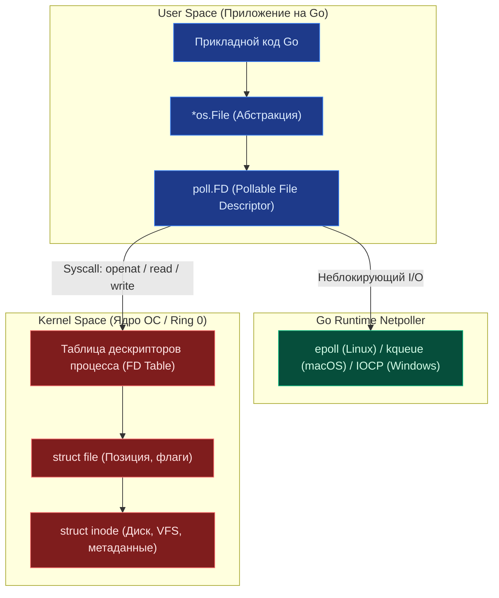

## `os`: Абстракция над операционной системой

> *«В Unix всё есть файл — последовательность байтов, доступная по целочисленному дескриптору. Go не прячет эту истину за слоями вычурных абстракций; пакет `os` обеспечивает прямое механическое сочувствие к ядру системы».*    
> — Брайан Керниган

В компьютерных системах операционная система является верховным распорядителем аппаратных ресурсов: физической памяти, дисковых блоков, сетевых интерфейсов и процессов. Когда Кен Томпсон и Деннис Ритчи создавали Unix в Bell Labs, они заложили гениальный в своей простоте принцип: унифицированный интерфейс взаимодействия через файловые дескрипторы и байтовые потоки.

Пакет `os` в Go — прямой и благородный наследник этой философии. Он предоставляет платформенно-независимый интерфейс к функционалу операционной системы, скрывая низкоуровневые различия между ядрами Linux, Windows и macOS. Он дает разработчику единый API для управления файлами, переменными окружения, системными сигналами и дочерними процессами.

Однако «платформенно-независимый» в философии Go не означает «оторванный от железа». Напротив, функции пакета `os` являются тончайшими, бескомпромиссными обертками над системными вызовами (syscalls). Понимание того, какой именно системный вызов стоит за функцией `os`, критически важно для оценки производительности, латентности и надежности работы микросервиса под высокой нагрузкой.



> [!info] Под капотом
> В основе большинства операций `os` лежит структура `*os.File`. Даже если вы работаете с сетевым сокетом, stdin/stdout или пайпом, внутри это файловый дескриптор.
> ```go
> type File struct {
>     *file // platform-specific implementation
> }
> 
> // Внутри file (на Linux):
> type file struct {
>     pfd         poll.FD // Интеграция с netpoller (epoll/kqueue)
>     name        string
>     dirinfo     *dirInfo // Кэш для readdir
>     nonblock    bool     // Флаг неблокирующего режима
>     stdoutOrErr bool     // Оптимизация для stdout/stderr
> }
> ```
> Поле `pfd` (Pollable File Descriptor) — это ключевой элемент, позволяющий Go реализовывать асинхронный I/O без блокировки OS-тредов, даже при работе с обычными файлами (хотя для дисковых файлов асинхронность ограничена возможностями ОС).

---

## 1. Работа с файловой системой: Syscalls и права доступа

### Открытие и создание файлов
Функции `os.Open`, `os.Create`, `os.OpenFile` транслируются ядром в системные вызовы `openat` (в Linux/Unix) или `CreateFile` (в Windows).

```go
// os.Open - открытие только для чтения (O_RDONLY)
f, err := os.Open("config.yaml")

// os.Create - чтение/запись, создание, усечение (truncate). 
// Важно: права доступа 0666 модифицируются umask процесса!
f, err := os.Create("output.log") 

// os.OpenFile - полный низкоуровневый контроль флагов и прав
// Флаги: O_RDWR | O_CREATE | O_APPEND
// Perm: 0640 (владелец: rw, группа: r, остальные: нет)
f, err := os.OpenFile("app.log", os.O_RDWR|os.O_CREATE|os.O_APPEND, 0640)
```

> [!warning] Ловушка / Gotcha
> **Umask и права доступа.**
> Аргумент `perm` в `os.Create` и `os.OpenFile` — это *максимально возможные* права. Реальные права вычисляются как `perm &^ umask`.
> Если `umask` системы равен `0022` (стандарт для многих серверов), то создание файла с `0666` даст реальные права `0644` (`rw-r--r--`).
> Если вам критичны строгие права (например, `0600` для приватных ключей), устанавливайте `umask` процесса в `0` при старте или явно вызывайте `f.Chmod(0600)` сразу после создания, но до записи данных, чтобы избежать окна уязвимости.

### Чтение и запись
Методы `f.Read()`, `f.Write()`, `f.Seek()` вызывают соответствующие системные вызовы ядра `read`, `write`, `lseek`.
*   `Read` может вернуть `n < len(buf)` и `err == nil`. Это абсолютно нормальное поведение потокового ввода. Вы должны вызывать `Read` в цикле, пока не получите маркер конца файла `io.EOF`.
*   `Write` по контракту Go обязан вернуть ненулевую ошибку, если `n != len(b)` (`Write returns a non-nil error when n != len(b)`). В отличие от POSIX `write(2)`, стандартный `*os.File.Write` под капотом дописывает срез в цикле рантайма; возврат неполного среза без ошибки запрещен контрактом языка.

### Метаданные и Stat
Функция `os.Stat(path)` вызывает системный вызов `stat` (или `fstatat`). Он возвращает интерфейс `os.FileInfo`, содержащий точный размер файла, время модификации, флаги каталога и режим доступа `FileMode`.  
**Важно:** `Stat` автоматически следует по символьным ссылкам (symlinks). Если вам требуется получить метаданные самого линка, а не целевого файла, используйте функцию `os.Lstat`.

---

## 2. Переменные окружения: Глобальное состояние и гонки

Функции `os.Getenv`, `os.Setenv`, `os.Environ` работают с глобальной таблицей переменных окружения процесса (`environ`).

> [!warning] Ловушка / Gotcha
> **Потокобезопасность `os.Setenv`.**
> Хотя чтение (`Getenv`) в Go относительно безопасно, запись (`Setenv`, `Unsetenv`) **не является потокобезопасной** на уровне всего процесса. Если две горутины одновременно вызовут `os.Setenv`, результат непредсказуем, а в некоторых ОС это может привести к состоянию гонки (data race) внутри libc.
> **Правило:** Устанавливайте переменные окружения только на этапе инициализации приложения (в `main` или `init`), до запуска горутин. В runtime используйте передачу конфигурации через структуры или `context`.

### Загрузка `.env` файлов
Стандартная библиотека Go принципиально **не умеет** парсить `.env` файлы. Это осознанное архитектурное решение создателей языка. Для production-окружения рекомендуется передавать параметры конфигурации через переменные окружения (ENV vars), установленные оркестратором (Kubernetes ConfigMaps/Secrets, Docker env), а не читать файлы `.env` непосредственно из кода. Если в локальной разработке всё же необходимо парсить `.env`, используйте проверенные сторонние библиотеки (например, `godotenv`), выполняя инициализацию строго однократно при старте в `main`.

---

## 3. Управление процессом и сигналами

### Graceful Shutdown
Один из фундаментальных инженерных паттернов в серверной разработке на Go — корректное завершение работы (Graceful Shutdown) при получении терминальных сигналов операционной системы (`SIGTERM`, `SIGINT`).

```go
func main() {
    srv := &http.Server{Addr: ":8080"}
    
    // Канал для получения сигналов ОС
    quit := make(chan os.Signal, 1)
    // Notify перенаправляет системные сигналы в канал
    signal.Notify(quit, syscall.SIGINT, syscall.SIGTERM)
    
    go func() {
        <-quit
        log.Println("Shutting down server...")
        
        // Создаем контекст с таймаутом для graceful shutdown
        ctx, cancel := context.WithTimeout(context.Background(), 5*time.Second)
        defer cancel()
        
        if err := srv.Shutdown(ctx); err != nil {
            log.Fatal("Server forced to shutdown:", err)
        }
    }()
    
    log.Println("Server starting...")
    if err := srv.ListenAndServe(); err != nil && err != http.ErrServerClosed {
        log.Fatal("ListenAndServe error:", err)
    }
    log.Println("Server exited properly")
}
```

В современном Go (начиная с Go 1.16) для этого паттерна также доступна удобная функция `signal.NotifyContext`:
```go
ctx, stop := signal.NotifyContext(context.Background(), syscall.SIGINT, syscall.SIGTERM)
defer stop()
// Контекст ctx автоматически отменится при поступлении сигнала ОС
```

> [!info] Под капотом
> `signal.Notify` регистрирует обработчик сигналов на уровне рантайма Go. Рантайм использует системный вызов `sigaction` (в Linux/Unix) для перехвата сигналов. Вместо немедленного аварийного уничтожения процесса (как делает стандартный обработчик ядра по умолчанию), Go перенаправляет сигнал в указанный канал `chan os.Signal`, позволяя приложению безопасно закрыть открытые соединения с БД и сбросить дисковые буферы.

### Запуск внешних процессов (`os/exec`)
Хотя `os/exec` вынесен в отдельный подпакет, он концептуально и технически неразрывно связан с `os`. Он позволяет порождать дочерние процессы ядра операционной системы через связку вызовов `fork` + `execve` (или `clone`).  
**Важно:** Избегайте конструирования команд через шелл (`sh -c "cmd"`) из-за фатальной угрозы уязвимостей типа Command Injection:
```go
// ❌ Опасно и неэффективно: запуск лишнего sh-процесса + риск инъекции
exec.Command("sh", "-c", "grep "+userInput+" /var/log/syslog")

// ✅ Безопасно: прямой вызов бинарника с разделенными аргументами
exec.Command("grep", userInput, "/var/log/syslog")
```

---

## 4. Mechanical Sympathy: Файловые дескрипторы и лимиты

Каждый открытый файл, сетевой сокет или пайп в операционной системе потребляет слот в системной таблице — **файловый дескриптор (FD)**. Это строго ограниченный ресурс ядра ОС.
*   В Linux лимит на процесс задается директивой ядра `ulimit -n` (значение по умолчанию часто составляет скромные 1024 слота, что катастрофически мало для высоконагруженного бэкенд-сервиса).
*   Утечка файловых дескрипторов (например, забытый `f.Close()` в цикле обработки запросов) мгновенно приведет к системной ошибке `too many open files` и полному отказу сервиса принимать новые входящие TCP-соединения.

**Правило:** Всегда используйте идиому `defer f.Close()` сразу после проверки ошибки открытия:

```go
f, err := os.Open("data.txt")
if err != nil {
    return err
}
defer f.Close() // Гарантированное освобождение FD при выходе из функции
```

> [!tip] Собеседование
> **Вопрос:** Что произойдет, если вызвать `f.Close()` дважды?  
> **Ответ:** Второй вызов вернет ошибку `os.ErrClosed` (или аналогичную, зависящую от ОС). Это безопасно, но указывает на логическую ошибку в коде. В некоторых случаях (если между закрытиями FD был переиспользован ОС для другого файла) это может привести к закрытию чужого ресурса, но в Go рантайм обычно отслеживает состояние `*os.File`, предотвращая такие катастрофы на уровне абстракции.
>
> **Вопрос:** Почему `os.Remove` может не освободить место на диске сразу?  
> **Ответ:** В Unix-системах файл удаляется из директории вызовом системной функции `unlink`, но физические блоки данных на диске остаются выделенными до тех пор, пока есть хотя бы один открытый файловый дескриптор, ссылающийся на данный `inode`. Если ваша программа держит файл открытым после `os.Remove`, дисковое пространство не освободится вплоть до завершения процесса или вызова `f.Close()`.

---

## 5. Сравнение с другими языками

| Аспект | Java (NIO.2) | Python (`os`, `pathlib`) | Go (`os`) |
|--------|--------------|--------------------------|-----------|
| **Модель I/O** | Асинхронная (CompletableFuture), сложная | Синхронная (GIL блокирует), есть `asyncio` | Синхронная API, асинхронная реализация через G-M-P |
| **Обработка ошибок** | Исключения (`IOException`) | Исключения (`OSError`) | Явные возвращаемые значения `error` |
| **Управление ресурсами** | `try-with-resources` | `with open(...)` | `defer f.Close()` |
| **Производительность** | Высокая, но высокий overhead JVM | Низкая из-за GIL и интерпретатора | Высокая, близкая к C, минимальный runtime overhead |

---

## Итог

1.  **`os.File` — это абстракция над FD.** Помните про лимиты ядра `ulimit` и всегда своевременно закрывайте дескрипторы.
2.  **Права доступа зависят от `umask`.** Не полагайтесь слепо на числовой аргумент `perm`.
3.  **ENV vars — глобальное состояние.** Не меняйте их в runtime конкурентно во избежание data race в libc.
4.  **Graceful Shutdown обязателен.** Используйте `signal.Notify` (или `signal.NotifyContext`) и `context.WithTimeout` для корректного завершения HTTP-серверов и сброса очередей.
5.  **Syscalls дороги.** Группируйте операции с диском, используйте буферизацию (`bufio`) поверх `os.File` для мелких чтений и записей.

Разобравшись с базовой работой с файлами и дескрипторами, мы неизбежно сталкиваемся с задачей манипуляции путями в файловой системе: склеиванием каталогов, нормализацией слешей между Windows и Linux, выделением расширений и проверкой относительных путей. В следующей статье мы изучим правильные инструменты: [[12. path, path_filepath и работа с путями]].