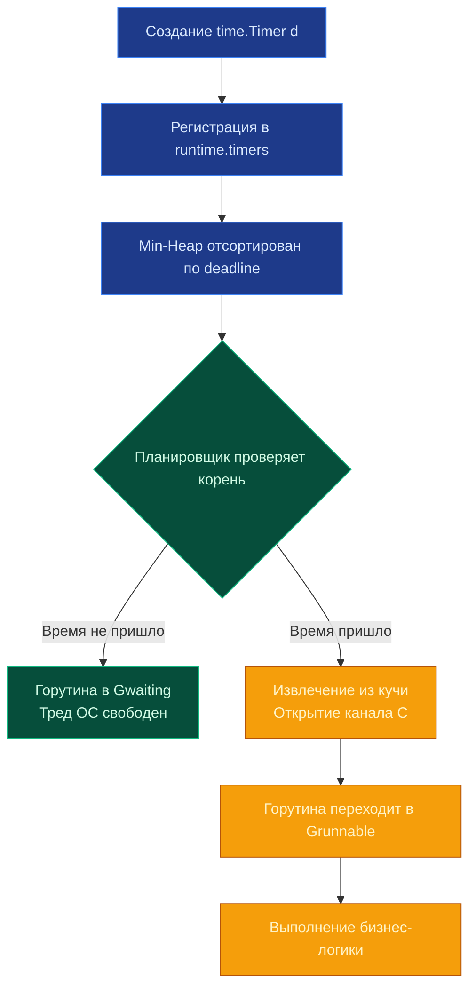

## Философия времени: Монотонность и точность

> *«Время — понятие ускользающее в физике, а в компьютерных системах оно коварно вдвойне. Физические часы сбоят, NTP скачет назад, а високосные секунды несут хаос. Пакет `time` в Go — образец прагматичной инженерии: он строго отделяет календарь человеческого мира от монотонного тикания процессора».*    
> — Брайан Керниган

Время в распределенных серверных системах — это не просто форматированная строка в логе. Это фундамент таймаутов, дедлайнов в `context`, экспоненциальных ретраев, инвалидации кэша и распределенного консенсуса. Пакет `time` в Go спроектирован так, чтобы изолировать программиста от капризов аппаратных часов, NTP-коррекций и скачков високосных секунд, предоставляя при этом прямой и предсказуемый доступ к планировщику рантайма.

Ключевое архитектурное решение Go (внедренное в релизе Go 1.9) — прозрачное разделение **Wall Clock** (астрономическое «настенное» время суток) и **Monotonic Clock** (монотонное, физически непрерывно растущее время аппаратного генератора CPU). В языках, где эти понятия смешиваются в один timestamp, коррекция времени NTP-демоном назад на 200 миллисекунд превращала положительный интервал `t2 - t1` в отрицательный, вызывая дедлоки и паники в тайм-аутах. В Go это математически невозможно.



> [!info] Под капотом
> Структура `time.Time` в оперативной памяти занимает ровно 24 байта на 64-битной архитектуре и содержит:
> ```go
> type Time struct {
>     wall uint64    // Битовое поле: флаг монотонности, наносекунды, секунды от epoch
>     ext  int64     // Unix-секунды (для wall) или наносекунды с момента старта (для monotonic)
>     loc  *Location // Часовой пояс
> }
> ```
> Если операционная система поддерживает монотонные часы (Linux, macOS, современные Windows), вызов `time.Now()` захватывает оба значения одновременно. Сравнение `t1 == t2` и вычисление разницы `t1.Sub(t2)` **всегда используют monotonic**, гарантируя защиту от скачков NTP. Методы форматирования `String()` или `Format()` используют wall clock.

---

## `time.Duration`: Наносекунды как фундамент

В стандартной библиотеке Go нет громоздких объектно-ориентированных классов для интервалов времени. Тип `time.Duration` — это прямой псевдоним типа `int64`, выражающий отрезок времени в наносекундах:

```go
type Duration int64

const (
    Nanosecond  Duration = 1
    Microsecond          = 1000 * Nanosecond
    Millisecond          = 1000 * Microsecond
    Second               = 1000 * Millisecond
    Minute               = 60 * Second
    Hour                 = 60 * Minute
)
```

Поскольку `Duration` — это обычное 64-битное целое число, все арифметические операции сложения и вычитания выполняются процессором за 1 машинный такт без единой аллокации в куче. Максимальное положительное значение `time.Duration` составляет около 290 лет, что с избытком покрывает любые практические задачи бэкенда.

---

## Timer и Ticker: Интеграция с планировщиком Go

Объекты `time.Timer` и `time.Ticker` не блокируют потоки операционной системы (OS threads) и не порождают отдельные тяжелые горутины на каждый таймер. Они интегрированы непосредственно в планировщик Go через глобальную кучу таймеров `runtime.timers`.

### Механика работы
1. При создании `time.After()` или `time.NewTimer()` рантайм Go добавляет таймерное событие в **min-heap** (двоичную кучу), отсортированную по абсолютному времени дедлайна.
2. Поток `sysmon` (системный монитор рантайма) или сам планировщик при каждом цикле `schedule()` на процессорах P проверяет корень кучи.
3. Если дедлайн наступил, таймер извлекается, а горутина, заблокированная на чтении из канала `C`, переводится в состояние готовности к исполнению `Grunnable` и попадает в локальную очередь запуска.
4. Если время срабатывания еще не пришло, горутина мирно спит в состоянии ожидания `Gwaiting`, не потребляя процессорные циклы.

> [!warning] Ловушка / Gotcha
> **Утечка Ticker.**
> Исторически `time.Ticker` **не останавливался автоматически**, когда горутина переставала читать из его канала. Если создавать тикер в цикле или HTTP-обработчике и забывать вызвать `ticker.Stop()`, объект навсегда оставался в структурах `runtime.timers`. В Go 1.23 архитектуру таймеров радикально переработали: теперь неиспользуемые таймеры и тикеры могут собираться сборщиком мусора GC. Тем не менее, для надежности и переносимости всегда пишите `defer ticker.Stop()` или вызывайте `Stop()` явно при завершении работы.

---

## Mechanical Sympathy: vDSO, TSC и цена `time.Now()`

Вызов `time.Now()` кажется тривиальной операцией, но под капотом он требует предельной механической симпатии между Go и ядром Linux:

1. **Системный вызов без прерывания ядра**: В Linux системный вызов `clock_gettime(CLOCK_MONOTONIC)` оптимизирован через механизм **vDSO** (Virtual Dynamically Shared Object). Ядро ОС проецирует страницу памяти с актуальными показаниями аппаратных часов прямо в адресное пространство процесса (User Space). Вызов `time.Now()` превращается в чтение из оперативной памяти без аппаратного переключения Ring 3 → Ring 0!
2. **TSC (Time Stamp Counter)**: На современных процессорах x86_64 рантайм может использовать ассемблерную инструкцию `rdtsc`, считывающую тактовые импульсы кремниевого кристалла. Это быстрейший способ замера времени (~10–20 тактов CPU).
3. **Нулевая нагрузка на GC**: Создание `time.Time` не выделяет память в куче. Структура живет на стеке горутины. В горячих циклах замера метрик миллионы вызовов `time.Now()` не создают мусора для GC.

### Оптимизация циклов с таймерами
Классическая ошибка — создание `time.After()` внутри блока `select` в бесконечном цикле:

```go
// ❌ ПЛОХО: Создает новый таймер на каждой итерации -> утечка в runtime.timers + GC
for {
    select {
    case msg := <-ch:
        process(msg)
    case <-time.After(time.Second):
        log.Println("timeout")
    }
}
```

Функция `time.After()` порождает новый `Timer` на каждую итерацию. При плотном потоке сообщений цикл создаст десятки тысяч таймеров, висящих в памяти.

```go
// ✅ ХОРОШО: Переиспользование одного таймера (Go 1.23+)
t := time.NewTimer(time.Second)
defer t.Stop()

for {
    t.Reset(time.Second) // В Go 1.23+ Reset безопасен напрямую (канал unbuffered)
    select {
    case msg := <-ch:
        process(msg)
        // До Go 1.23 требовался дренаж: if !t.Stop() { <-t.C }
        // В Go 1.23+ дренаж канала не нужен и может привести к deadlock!
        t.Stop()
    case <-t.C:
        log.Println("timeout")
    }
}
```

---

## Ловушки и вопросы с собеседований

| Ловушка | Описание | Решение |
|---------|----------|---------|
| Сравнение времен с `==` | `t1 == t2` вернет `false`, если у одного объекта есть показания monotonic, а у другого нет (после `JSON.Unmarshal` или `Format`/`Parse`). | Используйте `t1.Equal(t2)`. Он корректно сравнивает только wall clock или только monotonic, если они доступны у обоих. |
| `time.Parse` формат | Ожидает строку-эталон `"Mon Jan 2 15:04:05 MST 2006"`, а не `%Y-%m-%d`. | Это reference time (1 2 3 4 5 6). Используйте готовые константы `time.RFC3339` или сформируйте строку на базе эталона. |
| Таймауты в БД | `ctx, cancel := context.WithTimeout(ctx, 5*time.Second)` + `defer cancel()` в цикле. | Директива `defer` выполнится только при выходе из функции. Таймауты не будут сбрасываться. Вызывайте `cancel()` явно или выносите контекст внутрь цикла. |
| `time.Sleep` в тестах | `time.Sleep(100 * time.Millisecond)` делает тесты медленными и нестабильными (flaky). | Используйте `time.Ticker` с коротким интервалом + `context` или новейший пакет `synctest` (Go 1.24+) для детерминированного тестирования времени без задержек. |

> [!tip] Собеседование
> **Вопрос:** Почему `time.Sleep` не гарантирует точного пробуждения ровно через N миллисекунд?  
> **Ответ:** Планировщик Go кооперативный и асинхронный. Когда таймер срабатывает, горутина переводится в `Grunnable`, но реальный запуск зависит от доступности треда ОС (M) и очереди выполнения. Дополнительно, точность зависит от кванта времени ОС (обычно 1-10 мс) и нагрузки на систему. Для жестких real-time гарантий Go не подходит; используйте `runtime.LockOSThread` или специализированные RTOS.
>
> **Вопрос:** Как `time.Time` обрабатывает переход на летнее/зимнее время?  
> **Ответ:** Структура `time.Time` хранит только смещение от UTC в конкретный момент. При вычислении разницы `Sub()` используется арифметика по монотонным часам, поэтому переходы DST не ломают интервалы. При форматировании учитывается `loc`. Всегда используйте `time.UTC()` для хранения меток в БД и `time.Local()` только для вывода пользователю.

---

## Сравнение с экосистемами

| Язык | Механизм | Особенности в сравнении с Go |
|------|----------|------------------------------|
| **Java** | `java.time.Instant`, `Duration` | `Instant` хранит наносекунды + секунды. Требует JVM. Сравнение всегда monotonic. Более сложный API, но строгая типизация. |
| **C++** | `std::chrono::system_clock`, `steady_clock` | Разделение Wall/Monotonic на уровне типов. Работает на compile-time templates. `sleep_for` блокирует thread напрямую. |
| **Python** | `datetime.datetime`, `timedelta` | `datetime` мутабелен по умолчанию. Нет встроенной monotonic поддержки в `datetime` (требуется `time.monotonic()`). GIL блокирует `sleep()`. |
| **Go** | `time.Time`, `time.Duration` | Иммутабельные структуры. Автоматическое разделение Wall/Monotonic в одном типе. Интеграция `Sleep` с планировщиком горутин. |

---

## Итог

1. `time.Time` хранит **и** wall clock, **и** monotonic. Всегда используйте метод `Equal()` для логического сравнения временных меток.
2. `time.Duration` — это целочисленный `int64` в наносекундах. Арифметика сложения интервалов бесплатна для CPU.
3. `time.Timer` и `time.Ticker` управляются планировщиком рантайма. Они не тратят треды ОС. Начиная с Go 1.23, неиспользуемые таймеры собираются GC даже без `Stop()`, а каналы стали синхронными (unbuffered), что устранило необходимость сложного ручного дренажа при `Reset`.
4. Избегайте вызова `time.After` в циклах `select`. Переиспользуйте один экземпляр `time.NewTimer` с методом `Reset()`.
5. `time.Now()` оптимизирован через страницы ядра vDSO и процессорный счетчик TSC. Аллокаций в куче не происходит.
6. Храните временные метки в базе данных в формате UTC (`time.UTC()`), форматируя их в локальное время `time.Local()` только перед отображением клиенту.

Понимание таймеров и работы со временем напрямую пересекается с необходимостью синхронизации доступа к общим ресурсам. Как гарантировать безопасность данных при конкурентных операциях, избегать гонок и deadlocks? В следующей статье мы глубоко погрузимся в примитивы синхронизации: [[19. sync. Mutex, RWMutex, WaitGroup, Once]].