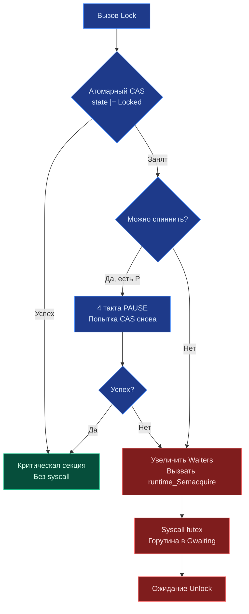

## Философия синхронизации состояния

> *«Не общайтесь через разделяемую память — делитесь памятью через общение. Но если вам необходимо защитить состояние в оперативной памяти, делайте это с железной дисциплиной: берите мьютекс, держите критическую секцию микроскопической и никогда не удерживайте блокировку во время операций ввода-вывода».*    
> — Брайан Керниган

В Go существует широко известное золотое правило: *«Не общайтесь, разделяя память. Делитесь памятью, общаясь»*. Это превосходный совет для архитектуры потоков данных и координации независимых процессов. Однако когда речь заходит о локальном мутабельном состоянии, разделяемом между сотнями параллельных горутин (in-memory кэши, счетчики запросов, таблицы маршрутизации, пулы буферов), использование каналов может оказаться неэффективным или избыточно сложным. Пакет `sync` предоставляет низкоуровневые фундаментальные примитивы для безопасного конкурентного доступа к общим ячейкам памяти.

Ключевое отличие `sync` от мьютексов в C++ или классической Java — это продуманная **гибридная модель**. Блокировка в Go не падает в ядро операционной системы сразу. Сначала предпринимается сверхбыстрая попытка захвата в пространстве пользователя (User Space) с помощью атомарных процессорных инструкций. И только при обнаружении реальной конкуренции горутина передается планировщику Go и ядру ОС. Это минимизирует количество дорогостоящих переключений контекста и сохраняет колоссальную пропускную способность.

---

## sync.Mutex: Гибридная блокировка и машинные инструкции

`sync.Mutex` — это не просто тривиальная обертка над системным вызовом `futex` в Linux или функцией `WaitForSingleObject` в Windows. Это сложный конечный автомат с двумя режимами работы: **Normal** (нормальный) и **Starvation** (режим голодания).

Внутреннее состояние мьютекса упаковано всего в два поля:
```go
type Mutex struct {
    state int32 // Биты: 1=Locked, 2=Woken, 4=Starving, 8..=WaiterCount
    sema  uint32 // Семафор для park/unpark
}
```

### Алгоритм захвата (Fast Path -> Slow Path)
1. **Атомарный CAS (Fast Path)**: Горутина пытается установить бит `Locked` через атомарную операцию `atomic.CompareAndSwapInt32`. Если мьютекс был свободен — захват происходит мгновенно за ~5 тактов CPU без единого перехода в ядро ОС.
2. **Аппаратный спиннинг (Spinning)**: Если мьютекс занят, но на машине есть свободные процессоры P (логические процессоры рантайма) и очередь горутин коротка, горутина выполняет до 4 итераций активного спиннинга с инструкциями `PAUSE` (`procyield(30)`). Это позволяет удерживать поток на ядре CPU в надежде на скорую разблокировку владельцем, избегая дорогостоящего контекстного переключения.
3. **Парковка (Parking / Slow Path)**: Если спиннинг не привел к успеху, мьютекс увеличивает счетчик ожидающих `WaiterCount`, помечает себя как `Woken` и вызывает рантайм-функцию `runtime_SemacquireMutex`. Это транслируется в системный вызов ядра `futex(SYS_futex, FUTEX_WAIT)` на Linux. Горутина переходит в состояние сна `Gwaiting`, а тред операционной системы (M) немедленно освобождается для полезной работы других горутин.



> [!info] Под капотом
> Начиная с Go 1.9, мьютекс автоматически переходит в **Starvation Mode**, если ожидание превышает 1 мс. В этом режиме новый владелец выбирается строго из очереди (FIFO), а не через CAS-гонку. Это предотвращает ситуацию, когда активные горутины постоянно перебивают «проснувшиеся», но уже «старые» горутины, вызывая их вечное ожидание.

---

## sync.RWMutex: Приоритет писателей и балансировка

Структура `sync.RWMutex` (Read-Write Mutex) позволяет сотням читателей работать параллельно, но полностью блокирует доступ при запросе со стороны писателя. Внутри используется комбинация `int32` счетчиков и обычного `Mutex`.

### Логика работы
* **Читатели**: Инкрементируют счетчик `readerCount`. Если `readerCount` >= 0, вход разрешен.
* **Писатели**: Пытаются захватить внутренний `Mutex`. При успехе устанавливают `readerCount` в отрицательное значение, блокируя новых читателей. Затем ждут, пока активные читатели (`readerWait`) завершат работу.
* **Разблокировка писателя**: Сбрасывает `readerCount`, будит всех ожидающих писателей или читателей.

> [!warning] Ловушка / Gotcha
> **Рекурсивный захват запрещен.**
> Если горутина удерживает `RLock()` и пытается вызвать `Lock()`, произойдет дедлок. Go не имеет рекурсивных мьютексов (как `pthread_mutex` с `PTHREAD_MUTEX_RECURSIVE`). Архитектура языка требует явного разделения прав доступа. Если вам нужен рекурсивный доступ, пересмотрите архитектуру: вынесите блокировку выше или используйте каналы.

---

## sync.WaitGroup: Координация без каналов

`WaitGroup` решает задачу ожидания завершения группы параллельных горутин. Это не канал, а оптимизированный атомарный счетчик со встроенным системным семафором.

Внутренняя структура использует поле `state1 [3]uint32` (или `uint64` на 64-битных системах), разделенное на две логические части:
1. **Counter**: Число активных работающих горутин (`Add(1)` -> `counter++`).
2. **Waiters**: Число горутин, заблокированных в вызове `Wait()`.

Когда `Counter` падает до нуля, `WaitGroup` вызывает `runtime_Semrelease` ровно `Waiters` раз, одновременно пробуждая все ожидающие горутины.

```go
func processBatch(items []Item) {
    var wg sync.WaitGroup
    // ❌ ОШИБКА: Add внутри горутины создает гонку!
    // for _, item := range items {
    //     go func() {
    //         wg.Add(1) // Может выполниться после wg.Wait()!
    //         ...
    //     }()
    // }
    
    // ✅ ИДИОМАТИЧНО: Add до запуска
    wg.Add(len(items))
    for _, item := range items {
        go func(i Item) {
            defer wg.Done() // Атомарный counter--
            process(i)
        }(item)
    }
    wg.Wait() // Блокирует до counter == 0
}
```

> [!tip] Собеседование
> **Вопрос:** Почему `sync.WaitGroup` нельзя копировать после первого использования?  
> **Ответ:** Структура хранит состояние счетчиков (поле `state`) и семафор ожидания (`sema`) по значению, без указателей. При копировании `WaitGroup` создается независимая копия счетчиков: вызовы `Done()` или `Add()` в одной горутине перестают влиять на вызов `Wait()` в другой, что приводит к рассинхронизации, дедлокам или панике `runtime: sync: WaitGroup misuse`. Для защиты от случайного копирования в структуру встроено поле `noCopy`, проверяемое линтером `go vet`. Всегда передавайте `*sync.WaitGroup` по указателю.

---

## sync.Once: Ленивая инициализация и Double-Checked Locking

`sync.Once` гарантирует однократное выполнение переданной функции `f`, сколько бы сотен параллельных горутин ни вызывали метод `Do(f)`. Используется для инициализации синглетонов, загрузки конфигурационных файлов, настройки кэшей.

Реализация использует классический паттерн **Double-Checked Locking**:
1. Быстрая атомарная проверка флага `done == 0` без блокировок.
2. Если `done == 0`, происходит захват внутреннего мьютекса.
3. Повторная проверка `done` под защитой мьютекса (защита от гонки, пока горутина ждала освобождения).
4. Выполнение пользовательской функции, атомарная установка `done = 1`, освобождение мьютекса.

```go
var config *Config
var once sync.Once

func GetConfig() *Config {
    once.Do(func() {
        config = loadFromDisk() // Выполнится строго один раз
    })
    return config
}
```

В Go 1.21+ появились удобные функции-обертки:
* `sync.OnceFunc(f)`: возвращает функцию, выполняющую `f` ровно один раз.
* `sync.OnceValue(f)`: возвращает функцию, вычисляющую значение и кэширующую результат.
* `sync.OnceValues(f)`: аналогично для функций, возвращающих пару `(value, error)`.

> [!warning] Ловушка / Gotcha
> **Паника внутри `Do`**.
> Если функция `f` вызывает `panic`, `sync.Once` считает выполнение завершенным и **не будет** вызывать `f` повторно. В Go 1.21+ это поведение задокументировано явно. Если инициализация может падать, обрабатывайте ошибку внутри `f` и возвращайте её, либо не используйте `sync.Once` для критически важных операций с внешними зависимостями.

---

## Mechanical Sympathy: Кэш-линии, False Sharing и планировщик

### 1. False Sharing (Ложное разделение)
Если два независимых экземпляра `sync.Mutex` случайно оказываются в пределах одной 64-байтовой кэш-линии процессора, изменение состояния одного мьютекса ядром CPU инвалидирует всю кэш-линию для соседнего ядра через протокол когерентности MESI. Это порождает паразитный `cache coherence traffic` и падение производительности на 10–30%.

**Решение:** Принудительное выравнивание структуры до размера строки кэша CPU (64 байта):
```go
type alignedMutex struct {
    mu sync.Mutex
    _  [56]byte // Паддинг до 64 байт на 64-битной системе
}
```

### 2. Конкуренция и рост M-тредов
Когда `sync.Mutex` переводит горутину в режим сна `Gwaiting`, тред операционной системы (M) освобождается. Если блокировка критической секции длительна, планировщик Go для поддержания параллелизма может порождать новые системные потоки M. Это приводит к явлению **Thread Thrashing**: операционная система тратит львиную долю времени на переключение контекстов между десятками тяжелых ядерных потоков, а не на выполнение полезного кода.

**Правило:** Держите критические секции микроскопическими! Никогда не делайте дисковый или сетевой I/O под `mu.Lock()`. Захватили -> быстро скопировали/обновили указатель -> немедленно отпустили через `mu.Unlock()`.

---

## Ловушки и вопросы с собеседований

| Ловушка | Описание | Решение |
|---------|----------|---------|
| `defer mu.Unlock()` в начале функции | Разблокировка происходит при `return`, а не сразу после секции | Вызывайте `defer` непосредственно перед `mu.Lock()`, но только если вся функция является критической секцией. |
| Передача `sync.Mutex` по значению | Функция получает копию, мьютекс не синхронизирует | Передавайте только указатели `*sync.Mutex`. |
| `WaitGroup.Add()` в конце горутины | `wg.Wait()` может сработать до инкремента | Всегда `wg.Add()` **до** `go func()`. |
| `Once` для периодических задач | `Once` выполняется один раз за всё время жизни процесса | Для периодической перезагрузки используйте `context` + таймер или `sync.RWMutex` с версионированием. |

> [!tip] Собеседование
> **Вопрос:** Когда использовать `sync.Mutex`, а когда `chan`?  
> **Ответ:** 
> * `chan` — для **передачи владения** данными, координации потоков, реализации паттернов (worker pool, fan-in/out). Это «общение».
> * `sync.Mutex` — для защиты **разделяемого состояния** (кэш, счетчик, ин-мемори карта), когда данные не передаются, а мутируются. Это «совместное использование».
> Смешивание подходов (мьютекс + канал для одного ресурса) почти всегда ведет к багам.

---

## Сравнение с экосистемами

| Язык | Примитив | Особенности в сравнении с Go |
|------|----------|------------------------------|
| **C++** | `std::mutex`, `std::shared_mutex` | Прямая обертка над `pthread_mutex` или OS primitives. Нет встроенного спиннинга/режима starvation. Рекурсивность настраивается. |
| **Java** | `synchronized`, `ReentrantLock` | `synchronized` использует Object Monitor (JVM internal). `ReentrantLock` дает fair/unfair modes, аналогично Go, но требует явного `lock()/unlock()` в `finally`. |
| **PHP** | Отсутствует | PHP не имеет общей памяти для процессов. Синхронизация происходит через внешние хранилища (Redis `SETNX`, Memcached, файлы). |
| **Go** | `sync.Mutex`, `sync.RWMutex` | Гибридный User/Kernel режим, автоматический starvation mode, интеграция с планировщиком G-M-P, нулевая магия. |

---

## Итог

1. `sync.Mutex` использует быстрый CAS в User Space и переходит в `futex` только при длительном ожидании.
2. `sync.RWMutex` блокирует новых читателей при запросе писателя. Избегайте дедлоков через рекурсию.
3. `sync.WaitGroup` требует вызова `Add()` строго до запуска горутины. Копирование структуры после первого использования категорически запрещено.
4. `sync.Once` реализует идиому Double-Checked Locking. Паника внутри `f` помечает выполнение как завершенное.
5. Избегайте `False Sharing` выравниванием структур и держите критические секции предельно короткими, чтобы не провоцировать Thread Thrashing.

Понимание блокировок открывает путь к изучению их «атомарной» альтернативы. Когда мьютекс избыточен, а производительность критична, на сцену выходят машинные инструкции. В следующей статье: [[20. sync_atomic. Атомарные операции.md]].