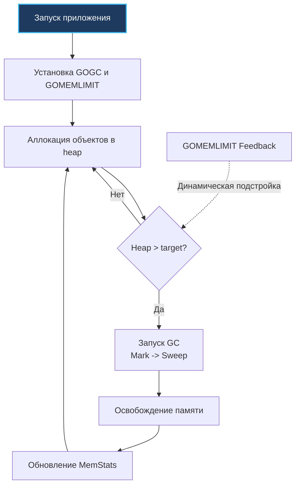

## Философия интроспекции и контроля

Если большинство пакетов стандартной библиотеки Go строят уютные, абстрактные переборки между разработчиком и операционной системой, то пакет `runtime` — это прямой трап в машинное отделение корабля. В отличие от `os`, который предоставляет абстракцию над операционной системой, `runtime` дает доступ к планировщику горутин, сборщику мусора, управлению стеками и низкоуровневым метрикам памяти. 

Это не инструмент для повседневной бизнес-логики. Вызов функций `runtime` в обычном сервисном слое чаще всего свидетельствует о нарушении границ абстракций или архитектурном просчете. Однако для старшего инженера глубокое понимание устройства рантайма жизненно необходимо: именно оно превращает слепую панику при production-инцидентах в хладнокровный инженерный анализ. Утечки горутин, зависание потоков ОС, раздувание стеков и непредсказуемое поведение в контейнерах Docker и подах Kubernetes невозможно диагностировать без знания механики этого пакета.

> [!info] Под капотом
> Пакет `runtime` компилируется в один бинарный файл вместе с приложением и линкуется статически. Он не использует системные вызовы напрямую для внутренней координации, а полагается на встроенный планировщик G-M-P и атомарные инструкции CPU. Это обеспечивает минимальную задержку при интроспекции, но требует осторожности: ошибочный вызов может перевести весь процесс в состояние `Stop-The-World`.

## 1. Интроспекция планировщика и диагностика горутин

В распределенных системах любая утечка ресурсов обычно начинается тихо: счетчик горутин ползет вверх, пока не исчерпается память или сетевые дескрипторы. Базовая диагностика состояния приложения начинается с мониторинга активных горутин:

```go
// Количество активных горутин в системе
count := runtime.NumGoroutine()

// Полный дамп стеков всех горутин (дорого!)
buf := make([]byte, 1024*1024)
n := runtime.Stack(buf, true)
fmt.Printf("%s", buf[:n])
```

### Under the hood: Как работает `runtime.Stack`

Функция `runtime.Stack` приостанавливает выполнение всех горутин (`stopTheWorld` на микросекунды), безопасным образом копирует их стеки из сегментированной памяти в переданный буфер и возобновляет работу. Когда передан флаг `all=true`, рантайм должен остановить мир, чтобы гарантировать согласованность указателей: если бы горутины продолжали исполняться, их стеки могли бы расти, перемещаться или сжиматься прямо во время чтения.

В production вызов `runtime.Stack(..., true)` с флагом `all=true` может вызвать заметный `latency spike` при десятках тысяч горутин. Для безопасного получения стека текущей горутины используйте `debug.Stack()` из пакета `runtime/debug`, который работает асинхронно и не трогает другие потоки выполнения.

Внутренний счетчик горутин (`sched.ngrun` + `sched.nmidle`) обновляется атомарно при создании (`newproc`) и завершении (`goexit`) горутин. `runtime.NumGoroutine()` читает его без блокировок, но возвращает мгновенный срез, который может не отражать горутины в процессе создания.

## 2. Управление потоками ОС и привязка

Планировщик Go виртуозно мультиплексирует миллионы горутин (`G`) на небольшое количество потоков операционной системы (`M`). Но в реальном мире есть подсистемы, требующие строгой привязки к конкретному системному треду.

### `NumCPU` vs `GOMAXPROCS`

`runtime.NumCPU()` возвращает количество логических ядер, доступных процессу. В Linux рантайм определяет это значение через системный вызов `sched_getaffinity` (маску affinity процесса), поэтому привязка к конкретным ядрам (`cpuset`) учитывается. Однако квоты процессорного времени (CFS Bandwidth / `cpu.max`) системный вызов `sched_getaffinity` не отражает, и файлы `cgroups` напрямую рантаймом не парсятся.

`runtime.GOMAXPROCS(n)` изменяет количество логических процессоров (`P`), используемых планировщиком Go. По умолчанию равно `NumCPU`. Изменение на лету возможно, но не рекомендуется: оно вызывает перераспределение очередей горутин и временную деградацию пропускной способности. В облачных контейнерах при жестких CPU Quota (CFS bandwidth control) исторически требовалось настраивать `GOMAXPROCS` вручную (например, через популярную библиотеку `uber-go/automaxprocs`), чтобы планировщик не создавал лишние `P`, приводящие к троттлингу ядра Linux.

### `LockOSThread` и `UnlockOSThread`

Эти функции привязывают текущую горутину `g` к системному треду `m` на 1:1:

```go
func runWithThreadAffinity() {
    runtime.LockOSThread()
    // Гарантируем, что Unlock вызовется всегда, даже при panic
    defer runtime.UnlockOSThread()
    
    // Работа с CGO, GUI, специфичными syscall или Thread-Local Storage
    performNativeOperation()
}
```

Такая привязка незаменима при взаимодействии с графическими библиотеками (OpenGL, Cocoa), специфическими системными вызовами Linux (такими как смена namespace через `setns`) или библиотеками CGO, которые используют локальное хранилище потока (Thread-Local Storage, TLS).

> [!warning] Ловушка / Gotcha
> **Забытый `UnlockOSThread` приводит к утечке тредов.**
> Если горутина завершается (или паникует) в состоянии `locked`, тред `M` помечается как `lockedg = nil`, но не возвращается в пул. Планировщик создает новый системный тред для замены. При частых вызовах это приводит к росту `thread_count` ОС, исчерпанию лимитов (`pthread_create` fails) и OOM-killer. Всегда используйте `defer runtime.UnlockOSThread()` сразу после `Lock`.

## 3. Метрики памяти и эволюция управления GC

Пакет `runtime` предоставляет единственный способ получить точные данные о работе сборщика мусора без внешних агентов.

### `runtime.MemStats`

Структура `MemStats` раскрывает полную картину использования оперативной памяти приложением:

```go
var ms runtime.MemStats
runtime.ReadMemStats(&ms)

fmt.Printf("Alloc: %d MB\n", ms.Alloc/1024/1024)          // Текущий heap
fmt.Printf("TotalAlloc: %d MB\n", ms.TotalAlloc/1024/1024) // Сумма всех аллокаций
fmt.Printf("Sys: %d MB\n", ms.Sys/1024/1024)               // Запрошено у ОС
fmt.Printf("NumGC: %d\n", ms.NumGC)                        // Завершенных циклов
```

> [!info] Под капотом
> `runtime.ReadMemStats` по-прежнему вызывает Stop-The-World (`stopTheWorld(stwReadMemStats)`) для фиксации консистентного среза структур аллокатора памяти. Частый вызов `ReadMemStats` в критических путях высоконагруженных сервисов приводит к ощутимым задержкам (latency spikes). Именно поэтому в современном Go для регулярного и высокочастотного сбора телеметрии рекомендуется пакет `runtime/metrics`, который считывает агрегированные счетчики атомарно и без остановки мира.

### `GOGC` и `GOMEMLIMIT`

Две главные ручки управления поведением сборщика мусора:

* `GOGC=100` (по умолчанию) запускает GC, когда heap удвоился с момента последнего сбора. Уменьшение (`GOGC=50`) делает сборку чаще, но снижает peak-память. Увеличение (`GOGC=200`) повышает latency, но снижает CPU overhead GC.
* `GOMEMLIMIT` (Go 1.19+) задает жесткий лимит RSS. Рантайм использует feedback-контроллер для динамического изменения целевого размера heap и частоты GC, чтобы процесс не превысил указанный лимит. Это замена ручному тюнингу `GOGC` в контейнерах с ограниченными ресурсами.



## 4. Mechanical Sympathy: Стек, `Gosched` и барьеры памяти

### `runtime.Gosched`

Вызов `runtime.Gosched()` эквивалентен `sched_yield()` в POSIX. Он принудительно передает квант времени другой горутине, перемещая текущую `g` в конец локальной очереди `P`. В ранних версиях Go (до 1.14) планировщик был сугубо кооперативным, и плотный цикл без вызовов функций мог навечно заморозить ядро. Хотя в Go 1.14+ внедрена асинхронная не-кооперативная прерывистость по сигналам `SIGURG`, `Gosched()` по-прежнему полезен в tight-loop алгоритмах без блокирующих вызовов, чтобы избежать starvation других задач и уменьшить латентность координации.

### `runtime.KeepAlive`

Компилятор Go выполняет агрессивный анализ времени жизни переменных (liveness analysis). Если на объект больше нет ссылок в последующем коде, компилятор считает его «мертвым» еще до выхода из текущей функции, даже если указатель на него держится во внешнем коде CGO или дескрипторе ОС.

Вызов `runtime.KeepAlive(x)` создает искусственную ссылку до точки вызова, предотвращая преждевременную сборку GC. Это критически важно при работе с `unsafe.Pointer`, финализаторами (`runtime.SetFinalizer`) и CGO, где C-код может использовать память, которую Go уже пометил для освобождения. Без `KeepAlive` сборщик мусора может уничтожить структуру и вызвать финализатор прямо в тот момент, когда функция C читает ее поля.

### Рост стека

Исторически Go использовал **сегментированные стеки** (связанные списки фреймов памяти). Это приводило к печально известной проблеме «горячего разделения» (hot split): вызов функции на границе сегмента непрерывно выделял и освобождал память в цикле.

Начиная с Go 1.4, рантайм перешел на **непрерывные (contiguous) стеки с копированием**. Каждая горутина рождается с крошечным стеком размером всего 2 КБ. При переполнении вызывается функция `runtime.morestack`, которая выделяет новый блок памяти удвоенного размера, копирует содержимое старого стека на новое место, аккуратно перенастраивает все внутренние указатели и освобождает старый блок. `runtime.Stack` отражает эту структуру. Размер стека начинается с 2 КБ и растет кратно 2 до ~1 ГБ на горутину (на 64-битных системах).

## 5. Ловушки и вопросы с собеседований

| Ловушка | Описание | Решение |
|---------|----------|---------|
| `runtime.GC()` в production | Принудительный запуск сборки останавливает все горутины и сбрасывает pacing алгоритм. | Никогда не вызывать вручную. Полагаться на `GOGC`/`GOMEMLIMIT`. |
| Игнорирование `UnlockOSThread` | Тред помечается как deadlocked, ОС создает новый. Лимит потоков исчерпывается. | Всегда `defer Unlock` после `Lock`. Оборачивайте в надежные функции. |
| `ReadMemStats` в hot-path | Сбор метрик занимает микросекунды, но при тысячах вызовов добавляет contention на память. | Выносить в отдельную горутину с интервалом 1-5 сек. |
| `runtime.Caller` для логирования | Извлечение stack trace требует раскрутки стека и аллокаций. В циклах убивает производительность. | Использовать `runtime.CallersFrames` с кэшированием или готовые профайлеры. |

> [!tip] Собеседование
> **Вопрос:** В чем разница между `runtime.NumCPU()` и `os.Getenv("NPROC")`?
> **Ответ:** `runtime.NumCPU()` обращается к API ядра (`sched_getaffinity` или cgroups) и возвращает точное число доступных ядер для процесса. Переменная окружения `NPROC` или `OMP_NUM_THREADS` — это соглашение, которое не гарантирует фактических ограничений `cgroups`. В Kubernetes `NumCPU()` корректно учитывает `requests/limits`, в отличие от многих сторонних инструментов.
>
> **Вопрос:** Почему `runtime.Stack(buf, true)` не рекомендуется в middleware HTTP-сервера?
> **Ответ:** Флаг `all=true` вызывает остановку всех горутин (`stopTheWorld`). На нагруженном сервере это приводит к задержке ответов на сотни миллисекунд, таймаутам клиентов и каскадным отказам. Для отладки используйте `pprof` или `debug.PrintStack()` только для текущей горутины.

## 6. Сравнение с экосистемами

| Язык / Среда | Механизм интроспекции | Особенности в сравнении с Go |
|--------------|----------------------|------------------------------|
| **JVM (Java)** | `java.lang.management.ManagementFactory`, VisualVM | Требует JMX-агентов, тяжелая метрика. GC-тюнинг через флаги `-XX`. Go встраивает метрики в `runtime`, тюнинг через env-переменные. |
| **C / C++** | `valgrind`, `gdb`, `pthread_*` | Нет встроенного рантайма. Отладка памяти внешними утилитами. Управление потоками полностью на уровне ОС. |
| **PHP** | `xdebug`, `memory_get_usage()` | Процессы изолированы, нет shared state. Метрики собираются через внешние APCu или экспорт в Prometheus. Go дает прямой доступ к внутреннему счетчику. |
| **Go** | `runtime`, `runtime/debug` | Легковесный, статически слинкованный, атомарный. Интегрирован с G-M-P планировщиком. Позволяет точную настройку без внешних агентов. |

## Итог

1. `runtime` — это диагностический и настройный слой, а не инструмент бизнес-логики.
2. `runtime.NumGoroutine()` атомарен, но `runtime.Stack(..., true)` вызывает `STW` и не подходит для hot-path.
3. Всегда используйте `defer runtime.UnlockOSThread()` после `Lock`. Забытый вызов ведет к утечке системных тредов.
4. `runtime.ReadMemStats` предоставляет точные метрики heap/GC. Для контроля лимитов используйте `GOMEMLIMIT` вместо ручного изменения `GOGC`.
5. `runtime.KeepAlive` предотвращает раннюю сборку GC при работе с `unsafe` и финализаторами.
6. Понимание `runtime` необходимо для отладки production-инцидентов, но злоупотребление им нарушает абстракции языка.

Разобрав низкоуровневые механизмы рантайма, мы переходим к механизму, который позволяет Go работать с типами, неизвестными на этапе компиляции. Ценой этой гибкости является производительность и сложность. В следующей статье мы глубоко погрузимся в рефлексию: [[23. reflect. Рефлексия и ее цена]].