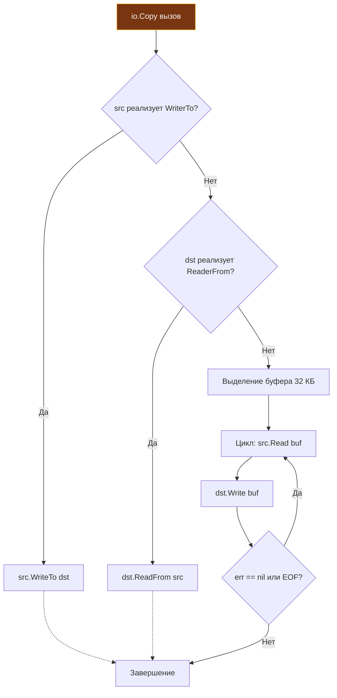
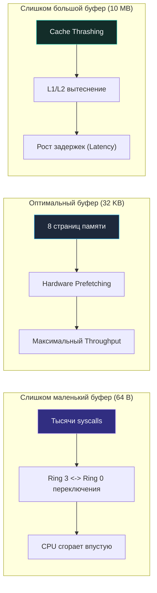
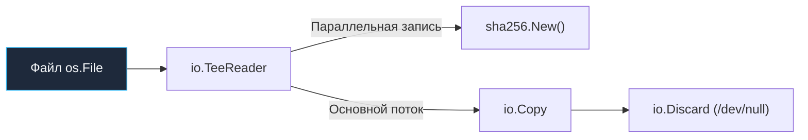

# 4. io. Reader, Writer и философия потоков в Go

> *«Такова философия Unix: пишите программы, которые делают одно дело и делают его хорошо. Пишите программы, способные работать сообща. Пишите программы для обработки потоков, ибо поток — универсальный интерфейс».*    
> — Дуглас Макилрой

## Философия минимализма и композиции

Пакет `io` — это архитектурное сердце всей стандартной библиотеки Go. В то время как в других языках работа с потоками ввода-вывода обросла циклопическими иерархиями классов, фабриками фабрик и абстрактными декораторами, Go предлагает радикально лаконичный и практичный подход: два минималистичных интерфейса, задающих универсальный контракт обмена байтовыми потоками.

```go
type Reader interface {
    Read(p []byte) (n int, err error)
}

type Writer interface {
    Write(p []byte) (n int, err error)
}
```

Всего 24 байта в оперативной памяти (два указателя на таблицу методов и конкретные данные в структуре `iface`) определяют абстракцию, через которую в Go проходит абсолютно всё: чтение локальных файлов с NVMe-накопителей, передача сетевых TCP-пакетов, парсинг JSON-документов, потоковая компрессия gzip и даже обработка HTTP/2 и gRPC фреймов.

> [!info] Под капотом
> Интерфейсы `io` спроектированы так, чтобы **не блокировать архитектуру**. Реализация может быть файлом (`*os.File`), сетевым сокетом (`net.Conn`), буфером в памяти (`*bytes.Buffer`) или генератором криптографического шума (`crypto/rand`). Go не проверяет тип источника через `instanceof` или тяжелые `type assertions` внутри ядра библиотек. Всё сводится к мгновенному вызову метода через таблицу `itab`. Это позволяет писать универсальные функции (например, `io.Copy`), которые элегантно связывают любые источники и приемники данных.

---

## Контракт: почему не int, а (n int, err error)

В классическом C системный вызов `read()` возвращает количество прочитанных байтов или `-1` при возникновении ошибки. В Java метод `InputStream.read()` возвращает `int`, где значение `-1` служит сигналом окончания потока (EOF). 

Создатели Go сделали контракт явным через возврат кортежа `(n int, err error)`. Это не просто синтаксический сахар — это устраняет двусмысленность и позволяет корректно обработать критический сценарий распределенных систем: **частичное чтение при одновременном возникновении ошибки**.

Когда вы вызываете `r.Read(buf)`:
1. Функция пытается заполнить переданный срез `buf`.
2. Если данные доступны, она записывает их в срез и возвращает `n` (число реально прочитанных байт).
3. Если поток завершился или произошел сетевой сбой, она возвращает ошибку `err`.

Важнейшее правило контракта: **`n` и `err` независимы**. Функция имеет полное право вернуть `n = 1024` и `err != nil` (например, `io.EOF` или сетевой таймаут) одновременно. Игнорирование значения `n` при наличии ошибки неизбежно приводит к тихой потере данных!

---

## Под капотом: как работает io.Copy и оптимизация системных вызовов

Функция `io.Copy(dst, src)` — это идиоматичный стандарт для перекачки данных между потоками. Но ее внутренняя реализация далека от наивного бесконечного цикла чтения и записи.



### Механизм fallback-оптимизаций

Перед тем как начать гонять байты через временный буфер в оперативной памяти приложения, `io.Copy` проверяет, не реализуют ли участники оптимизированные интерфейсы `io.WriterTo` или `io.ReaderFrom`.

Если интерфейсы реализованы, `io.Copy` делегирует передачу напрямую им. Это открывает путь к аппаратно ускоренным, системно-зависимым механизмам **Zero-Copy**:

Например, при копировании данных из `*os.File` в сетевой сокет `*net.Conn` на Linux, стандартная библиотека активирует системные вызовы ядра `sendfile` или `splice`. Они передают страницы памяти напрямую между дескрипторами в ядре Linux, **полностью минуя пользовательское пространство (User Space)** и избавляя процессор от двойного копирования памяти (kernel -> user -> kernel).

```go
// Пример оптимизации в net/internal/poll (упрощенно)
// Если оба аргумента подходят, Go вызывает syscall.splice()
// Данные летят из сокетного буфера в сокет назначения, минуя RAM приложения.
```

---

## Mechanical Sympathy: буферы, кэш процессора и цена syscall

Почему `io.Copy` использует буфер размером ровно **32 Килобайта** по умолчанию? Это не случайная константа, а выверенный инженерный баланс между архитектурой ядра Linux, сетевым стеком и кэшами процессора:

1. **Страницы виртуальной памяти Linux:** Стандартный размер страницы памяти x86-64 — 4 КБ. Буфер в 32 КБ вмещает ровно 8 страниц памяти. Это идеальный объем для насыщения очередей сокета TCP без избыточной фрагментации пакетов.
2. **Кэш-линии процессора (L1/L2):** Данные читаются последовательно. Контроллер памяти CPU автоматически запускает предвыборку (Hardware Prefetching), подгружая соседние кэш-линии в L1/L2. Буфер, кратный страницам памяти, минимизирует количество `Cache Misses`.
3. **Цена системного вызова:** Каждый вызов `read()` или `write()` влечет переключение контекста процессора (Ring 3 -> Ring 0), сохранение регистров и проверку привилегий. Слишком маленький буфер (например, 64 байта) заставит ядро делать тысячи прерываний на 1 МБ данных, сжигая CPU. Слишком большой буфер (например, 10 МБ) приведет к вымыванию полезных данных из кэша процессора (Cache Thrashing) и заблокирует горутину надолго.



### Пример ручного чтения: как избежать аллокаций

```go
// ❌ Плохо: выделение нового буфера на каждой итерации
for {
    buf := make([]byte, 4096) // Аллокация в куче каждый цикл
    n, err := r.Read(buf)
    // ...
}

// ✅ Хорошо: переиспользование памяти
buf := make([]byte, 32*1024) // Выделяем ОДИН раз вне цикла
for {
    n, err := r.Read(buf)
    // Работаем с buf[:n]
    if err == io.EOF {
        break
    }
    if err != nil {
        return err
    }
}
```

> [!info] Под капотом
> При многократном чтении в один и тот же срез `[]byte` рантайм Go не выделяет память заново. Если создавать буфер внутри цикла, Escape Analysis гарантированно отправит его в кучу, создавая колоссальную работу для GC. Вынос буфера за пределы цикла позволяет выделить память ровно один раз.

---

## Критическая ловушка: обработка io.EOF и частичных чтений

Это самый частый источник скрытых багов при переходе на Go. Сигнал `io.EOF` **не является ошибкой или сбоем в привычном смысле**. Это штатное уведомление о достижении конца потока данных.

### Правило обработки EOF

```go
func readFully(r io.Reader) ([]byte, error) {
    var data []byte
    buf := make([]byte, 1024)
    
    for {
        n, err := r.Read(buf)
        
        // 1. Всегда обрабатываем прочитанные данные ДО проверки ошибки
        if n > 0 {
            data = append(data, buf[:n]...)
        }
        
        // 2. Только теперь проверяем err
        if err == io.EOF {
            break // Нормальное завершение
        }
        if err != nil {
            return nil, err // Реальная ошибка
        }
    }
    return data, nil
}
```

> [!warning] Ловушка / Gotcha: Потеря данных при EOF
> Если вы напишете:
> ```go
> if err != nil {
>     if err == io.EOF { break }
>     return err
> }
> process(buf[:n])
> ```
> Вы можете потерять последние байты, если `Read` вернул `n=5, err=io.EOF`. 
> **Всегда сначала `if n > 0 { process }`, потом `if err != nil { ... }`**.

---

## Композиция потоков без копирования данных

Истинная красота пакета `io` раскрывается в его комбинаторах и декораторах. Они не копируют данные в промежуточные буферы, а выстраивают прозрачные конвейеры обработки на лету:

1. `io.LimitReader(r, n)`: Ограничивает чтение ровно `n` байтами. Незаменим в HTTP-серверах для защиты от DoS-атак переполнения памяти при чтении тела запроса.
2. `io.TeeReader(r, w)`: Читает из `r`, синхронно записывает прочитанное в `w` и возвращает данные вызывающему коду. Идеален для логирования сетевых запросов или вычисления контрольных сумм на лету.
3. `io.MultiReader(readers...)`: Последовательно вычитывает данные из нескольких источников, склеивая их в один непрерывный логический поток.
4. `io.MultiWriter(writers...)`: Принимает один вызов записи и дублирует данные сразу во все целевые потоки (программный аналог утилиты `tee` в Unix).

```go
// Пример: подсчет SHA256 хеша файла на лету, без загрузки в память
func hashFile(path string) (string, error) {
    f, err := os.Open(path)
    if err != nil {
        return "", err
    }
    defer f.Close()
    
    h := sha256.New()
    // TeeReader читает из файла и параллельно пишет хешеру
    r := io.TeeReader(f, h)
    
    // Копируем в /dev/null, чтобы триггерить чтение всего файла
    if _, err := io.Copy(io.Discard, r); err != nil {
        return "", err
    }
    return fmt.Sprintf("%x", h.Sum(nil)), nil
}
```



---

## Сравнение с Java, C++ и PHP

| Аспект | Java `InputStream` | C++ `std::istream` | PHP Streams | Go `io.Reader` |
|---|---|---|---|---|
| **Архитектура** | Наследование, `ByteArrayInputStream`, `FileInputStream`, декораторы через `FilterInputStream` | Итераторы, `streambuf`, шаблоны | Ресурс-дескрипторы `fopen`, `stream_context` | Интерфейс из 1 метода, композиция |
| **Обработка EOF** | Возвращает `-1` | Устанавливает `failbit/eofbit` | Возвращает `false`/`""` | Возвращает `io.EOF` (ошибку) |
| **Zero-Copy** | `FileChannel.transferTo` (NIO) | `std::filesystem` + mmap | `stream_copy_to_stream` | `io.Copy` + `sendfile`/`splice` (автоматически) |
| **Блокировка** | Часто синхронная, требует `CompletableFuture`/NIO для async | Синхронная по умолчанию | Синхронная, зависит от контекста | Синхронная, но планировщик Go паркует горутину, не блокируя OS thread |

> [!tip] Собеседование
> **Вопрос:** Почему в пакете `io` нет поддержки `context.Context` для отмены операций?  
> **Ответ:** Пакет `io` абстрагирует *потоки данных*, а не *жизненный цикл операций*. Добавление `context` в сигнатуры `Read`/`Write` нарушило бы ортогональность и усложнило композицию. Для отмены операций вводу-вывода используют:
> 1. Сетевые дедлайны: `net.Conn.SetDeadline` / `SetReadDeadline`.
> 2. Контекст в структуре `http.Request.Context()` (обрабатывается `net/http`).
> 3. Асинхронное прерывание: закрытие сокета/пайпа из другой горутины при получении сигнала отмены (например, через канал `chan struct{}`).

---

## Хардкорные вопросы с собеседований

| Вопрос | Краткий ответ |
|---|---|
| Что произойдет, если передать в `io.Copy` `nil`? | Паника: `runtime: invalid pointer dereference` при вызове интерфейсного метода. `io` не проверяет на `nil` из соображений производительности. |
| Может ли `Write` вернуть `n < len(p)` и `err == nil`? | Нет. Спецификация `io.Writer` прямо запрещает это: если `n < len(p)`, метод обязан вернуть ненулевую ошибку. Частичная запись без ошибки характерна для системного вызова POSIX `write(2)`, но в Go реализации дописывают буфер в цикле либо возвращают ошибку (например, `io.ErrShortWrite`). |
| Как реализовать `io.Reader`, который читает из `chan []byte`? | Через блокировку в `Read`: ждать данные из канала, копировать в `p`, вернуть `n` и `err`. При закрытии канала вернуть `io.EOF`. |
| Почему `io.ReadAll` может быть опасен в продакшене? | Он читает **всё** в память до EOF. Без `Content-Length` или `LimitReader` злоумышленник может отправить бесконечный поток, вызывая OOM. |

---

## Итог

1. **`io.Reader` и `io.Writer` — это контракты, а не классы.** Их минимализм позволяет компоновать любые источники данных.
2. **Всегда проверяйте `n` перед `err`.** Частичное чтение/запись с ошибкой — штатный сценарий.
3. **Используйте готовые утилиты.** `io.Copy`, `io.LimitReader`, `io.TeeReader` оптимизированы на уровне рантайма и поддерживают zero-copy fallback.
4. **Уважайте syscall и кэш.** Правильный размер буфера (32 КБ) и переиспользование памяти (`sync.Pool`) критически важны для высокой нагрузки.
5. **Контекст таймаутов лежит на уровне `net`.** `io` пакет работает синхронно, но не блокирует потоки ОС благодаря планировщику Go.

Понимание потоков `io` логически приводит нас к историческому изменению в стандартной библиотеке. Мы разберем, какие утилиты стали антипаттернами, чем их заменили и как правильно мигрировать легаси-код: [[5. io_ioutil устарел. Чем его заменили]].