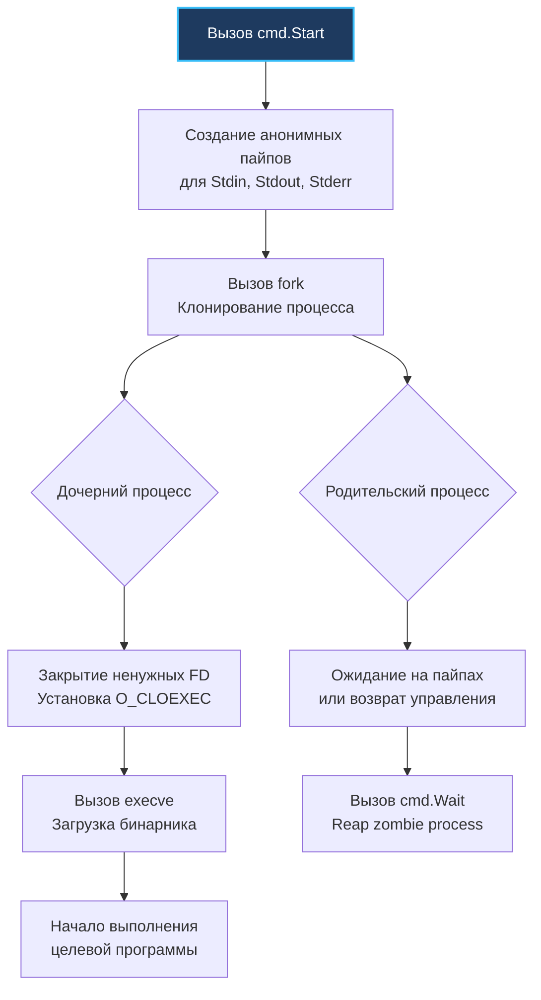

## Философия изоляции и контроля процессов

В операционных системах семейства Unix запуск дочернего процесса — фундаментальный строительный блок всей вычислительной модели. Еще в Bell Labs Кен Томпсон и Деннис Ритчи сформулировали принцип: программы должны делать одну вещь хорошо и взаимодействовать через текстовые потоки. 

Пакет `os/exec` в Go предоставляет стандартизированный, строгий интерфейс для порождения внешних процессов и управления ими. В отличие от других языков (где вызов внешней утилиты часто выполняется через опасную оболочку `system()` или требует громоздких внешних библиотек), Go интегрирует управление процессами прямо в стандартную библиотеку, руководствуясь принципами явности, максимальной безопасности и абсолютной предсказуемости.

Порождение дочернего процесса — одна из самых тяжелых операций в операционной системе. Ядру необходимо создать новую виртуальную память, настроить таблицы трансляции адресов MMU, организовать каналы межпроцессного взаимодействия (пайпы), смаппировать файловые дескрипторы и скоординировать доставку сигналов ОС. Пакет `os/exec` элегантно абстрагирует эту сложность, сохраняя за разработчиком полный контроль над жизненным циклом, таймаутами и потоками ввода-вывода. 

Ошибки при работе с `exec` обходятся дорого: они приводят к зомби-процессам, утечкам дескрипторов, зависаниям из-за переполнения 64-килобайтного буфера пайпа и катастрофическим уязвимостям внедрения команд (Command Injection).

> [!info] Под капотом
> На POSIX-совместимых платформах вызов `exec.Command` в конечном итоге транслируется в классическую связку системных вызовов `fork` и `execve`. Рантайм Go использует оптимизированный ассемблерный вызов `syscall.ForkExec`: он клонирует текущий процесс, настраивает перенаправление стандартных потоков ввода-вывода через анонимные пайпы (`pipe2` с системным флагом `O_CLOEXEC`), принудительно закрывает все унаследованные файловые дескрипторы (кроме 0, 1, 2 и переданных явно), после чего заменяет адресное пространство дочернего процесса целевым бинарным файлом. В среде Windows используется нативный системный вызов `CreateProcessW` со схожей семантикой наследования хендлов.

---

## Under the hood: fork, execve и наследование дескрипторов

Когда вы создаете команду через конструктор `cmd := exec.Command("ls", "-l")`, структура `exec.Cmd` не выполняет никаких системных вызовов и не порождает процесс. Это лишь декларативная конфигурация будущего запуска: путь к бинарнику, аргументы, переменные окружения, рабочая директория и правила маршрутизации стандартных потоков.

Реальное порождение процесса происходит только в момент вызова `cmd.Run()` (синхронный запуск) или `cmd.Start()` (асинхронный запуск):



### Безопасность дескрипторов по умолчанию

В классическом C или старом Python дочерний процесс после вызова `fork` по умолчанию наследовал **все** открытые файловые дескрипторы родителя. Это порождало катастрофические утечки безопасности: дочерний процесс (например, сторонний конвертер картинок) получал доступ к открытым сетевым сокетам базы данных родительского процесса или секретным файлам конфигурации.

Go спроектирован с учетом безопасности:
1. Все внутренние пайпы создаются с флагом `O_CLOEXEC` (закрыть дескриптор при `execve`).
2. Рантайм Go закрывает в дочернем процессе абсолютно все дескрипторы, кроме стандартных потоков (`stdin`, `stdout`, `stderr`) и тех, которые разработчик явно разрешил через срез `cmd.ExtraFiles`.

---

## Mechanical Sympathy: Пайпы, буферы и блокировки

Каждый инженер обязан понимать аппаратные и системные ограничения ядра ОС при взаимодействии с дочерними процессами:

### 1. Лимит буферов пайпов

Анонимные каналы (пайпы) в ядре Linux имеют кольцевой буфер фиксированного объема — ровно 64 КБ (размер настраивается в ядре через `fs.pipe-max-size`, но практически везде по умолчанию равен 65 536 байтам). 

Если дочерний процесс непрерывно пишет в `stdout` или `stderr` большие объемы данных, а родительский Go-процесс не вычитывает их параллельно, буфер ядра объемом 64 КБ мгновенно заполняется. Следующий системный вызов `write` в дочерней программе **намертво блокируется ядром ОС**. Дочерняя программа зависает в ожидании освобождения буфера, а родительский Go-процесс зависает в ожидании завершения дочерней программы. Возникает классический распределенный Deadlock!

### 2. Стоимость fork и COW

Системный вызов `fork` не выполняет физического дублирования всей оперативной памяти родителя: ядро применяет оптимизацию Copy-On-Write (`COW`), помечая страницы памяти как общие (read-only) до первой попытки модификации. 

Однако для Go-сервиса с объемом кучи в несколько гигабайт вызов `fork` все равно обходится дорого: ядру необходимо скопировать и смаппировать все таблицы страниц виртуальной памяти (`MMU`) родительского процесса. Это может занимать от 5 до 50 миллисекунд процессорного времени, вызывая микрозадержки в обслуживании клиентских запросов. В критических путях высокой нагрузки создание процессов «на каждый чих» категорически запрещено.

### 3. Reaping зомби-процессов

Когда процесс завершает свое выполнение, ядро операционной системы не удаляет запись о нем из глобальной таблицы процессов. Процесс переходит в состояние зомби (`Zombie`), сохраняя свой код возврата и статистику использования ресурсов. 

Освободить эти системные структуры и утилизировать запись в таблице ядра может только родительский процесс через системный вызов `wait4` (в Go это делает метод `cmd.Wait()`). Если запустить процесс через `cmd.Start()` и никогда не вызвать `cmd.Wait()`, зомби-процессы будут накапливаться до тех пор, пока система не исчерпает лимит идентификаторов процессов (`pid_max`), после чего операционная система откажется создавать любые новые процессы и потоки.

---

## Идиомы безопасности и управление жизненным циклом

### Запрет на `sh -c` и инъекции

Никогда не используйте запуск через оболочку с конкатенацией пользовательских строк:

```go
// ❌ ГРУБЕЙШАЯ УЯЗВИМОСТЬ: Shell Command Injection!
// cmd := exec.Command("sh", "-c", "grep "+userInput+" /var/log/app.log")
// Если userInput равен: 'foo /dev/null; rm -rf /; echo', сервер будет уничтожен!

// ✅ АБСОЛЮТНО БЕЗОПАСНО: Прямой вызов исполняемого файла с аргументами
cmd := exec.Command("grep", userInput, "/var/log/app.log")
```

Функция `exec.Command` принимает исполняемый файл и срез строк-аргументов. Они передаются напрямую в системный вызов `execve` как массив указателей. Никакая командная оболочка не вызывается, аргументы не парсятся на спецсимволы, и любая вредоносная строка передается целиком как литерал.

### Контекст, таймауты и graceful termination

Любой запуск внешнего процесса в production обязан быть ограничен по времени с помощью `exec.CommandContext` и `context.Context`:

```go
package main

import (
	"bytes"
	"context"
	"errors"
	"fmt"
	"os/exec"
	"time"
)

func runExternalTask(ctx context.Context, timeout time.Duration, args []string) error {
	// Создаем контекст с жестким таймаутом
	ctx, cancel := context.WithTimeout(ctx, timeout)
	defer cancel() // Гарантирует очистку таймера контекста

	// Инициализируем команду, привязанную к контексту
	cmd := exec.CommandContext(ctx, "my-worker", args...)

	// Буферизируем вывод stdout и stderr
	var stdout, stderr bytes.Buffer
	cmd.Stdout = &stdout
	cmd.Stderr = &stderr

	// cmd.Run запускает процесс и синхронно дожидается его завершения
	if err := cmd.Run(); err != nil {
		// Если процесс завершился с ненулевым кодом выхода:
		var exitErr *exec.ExitError
		if errors.As(err, &exitErr) {
			return fmt.Errorf("process failed with code %d: %s", 
				exitErr.ExitCode(), stderr.String())
		}
		// Если произошла отмена контекста или ошибка системного вызова
		return fmt.Errorf("execution error: %w", err)
	}

	return nil
}
```

> [!warning] Ловушка / Gotcha
> **`cmd.Run()` блокирует до завершения процесса.**
> Если дочерняя программа генерирует гигабайты вывода, использование `bytes.Buffer` аллоцирует всю память в куче Go-процесса, вызывая OOM. Для передачи больших объемов данных используйте `io.Pipe` или прямую потоковую запись в файл `os.File`, вычитывая данные в отдельной параллельной горутине, чтобы предотвратить переполнение буфера ядра.

---

## Конкурентная работа с потоками без deadlock

Когда приложению необходимо одновременно читать вывод `stdout` и `stderr`, либо передавать данные в `cmd.Stdin` и параллельно вычитывать результат, стандартные методы `cmd.Output()` или `cmd.CombinedOutput()` неприменимы — они выполняют чтение последовательно и гарантируют deadlock при объеме вывода более 64 КБ.

Идиоматичный паттерн — асинхронное чтение через горутины с координацией через `sync.WaitGroup`:

```go
package main

import (
	"fmt"
	"io"
	"os"
	"os/exec"
	"sync"
)

func runConcurrent(cmd *exec.Cmd) error {
	// Создаем пайпы для чтения до вызова Start()
	stdout, err := cmd.StdoutPipe()
	if err != nil {
		return fmt.Errorf("stdout pipe: %w", err)
	}

	stderr, err := cmd.StderrPipe()
	if err != nil {
		return fmt.Errorf("stderr pipe: %w", err)
	}

	// Запускаем процесс асинхронно
	if err := cmd.Start(); err != nil {
		return fmt.Errorf("start process: %w", err)
	}

	var wg sync.WaitGroup
	wg.Add(2)

	// Параллельное чтение stdout
	go func() {
		defer wg.Done()
		io.Copy(os.Stdout, stdout)
	}()

	// Параллельное чтение stderr
	go func() {
		defer wg.Done()
		io.Copy(os.Stderr, stderr)
	}()

	// КРИТИЧЕСКИ ВАЖНО: Сначала дожидаемся вычитки всех пайпов до EOF!
	wg.Wait()

	// Лишь затем ждем завершения процесса и утилизируем зомби (reap)
	if err := cmd.Wait(); err != nil {
		return fmt.Errorf("wait process: %w", err)
	}

	return nil
}
```

---

## Ловушки и хардкорные вопросы с собеседований

| Сценарий | Проблема | Решение |
|---|---|---|
| **`cmd.Run()` без контекста** | Внешний процесс зависает при блокировке на сокете или I/O. Родительский сервис зависает навсегда. | Всегда используйте `exec.CommandContext` с `context.WithTimeout`. |
| **Игнорирование `cmd.Wait()` после `cmd.Start()`** | Завершившийся процесс навсегда остается в состоянии zombie. Утечка PID в таблице процессов ОС. | Всегда вызывайте `cmd.Wait()` явно или через `defer` после успешного `cmd.Start()`. |
| **Запись в `cmd.Stdin` и чтение из `cmd.Stdout` в одном потоке** | При записи более 64 КБ дочерний процесс блокируется на выводе, а родитель блокируется на вводе. Взаимная блокировка (deadlock). | Разносите чтение и запись по отдельным горутинам или используйте `io.Pipe`. |
| **`exec.Command` с пустым путем** | Ошибка запуска: `exec: no command` (паники нет). | Передавайте абсолютный путь или имя бинарника из системного `$PATH`. Используйте `exec.LookPath` для предварительной проверки. |
| **Слепое наследование окружения** | Дочерний процесс получает все переменные среды родителя (секреты, токены БД, ключи API). | Явно задавайте `cmd.Env = []string{...}` со строгим whitelist переменных. |

> [!tip] Собеседование
> **Вопрос:** В чем принципиальная разница между ошибкой типа `*exec.ExitError` и обычной ошибкой `error` при выполнении команды?
> **Ответ:** Обычный `error` свидетельствует о том, что процессу **не удалось запуститься вовсе** (бинарный файл не найден в `$PATH`, нет прав на исполнение `permission denied`, контекст был отменен до вызова системного вызова `fork`). Ошибка типа `*exec.ExitError` означает, что процесс был успешно запущен операционной системой, отработал, но завершился с ненулевым кодом выхода (exit code != 0). Из `*exec.ExitError` можно извлечь код завершения через `exitErr.ExitCode()` и тело ошибки `exitErr.Stderr`.
>
> **Вопрос:** Как отменить запущенный внешний процесс «мягко» (graceful shutdown), а не грубым принудительным `SIGKILL`?
> **Ответ:** Конструктор `exec.CommandContext` по умолчанию посылает процессу сигнал `SIGKILL` (на Unix) или вызывает `TerminateProcess` (на Windows) при истечении таймаута контекста. Для корректного завершения необходимо вручную отправить сигнал завершения через метод `cmd.Process.Signal(syscall.SIGTERM)`. Затем запустить горутину с таймером ожидания: если процесс не завершился за отведенное время (вызов `cmd.Wait()`), принудительно послать `cmd.Process.Kill()`. Начиная с Go 1.20, в структуре `exec.Cmd` появились поля `cmd.Cancel` и `cmd.WaitDelay`, позволяющие задать кастомную функцию отмены для `CommandContext` и задержку ожидания завершения ввода-вывода.

---

## Сравнение с экосистемами других языков

| Язык / Среда | Механизм | Особенности в сравнении со стандартной библиотекой Go |
|---|---|---|
| **Python** | `subprocess.run` / `Popen` | Опасный флаг `shell=True` часто используется новичками. Метод `communicate()` буферизует весь вывод в память (риск OOM). GIL препятствует параллельному вводу-выводу. Go безопасен по умолчанию и использует сверхлегкие горутины. |
| **Java** | `ProcessBuilder` | Требует ручного вычитывания `InputStream` в отдельных потоках ОС для предотвращения deadlock на буферах пайпов. Многословный boilerplate-код с ручным вызовом `waitFor()` и проверкой `exitValue()`. Go предлагает лаконичный API со встроенной защитой от утечек дескрипторов. |
| **Node.js** | `child_process.spawn` / `exec` | Полностью асинхронный event-loop подход. Буферы растут в куче V8. Трудности с безопасным завершением дерева дочерних процессов без сторонних библиотек (таких как `tree-kill`). |
| **Go** | `os/exec` | Синхронный или асинхронный интерфейс поверх горутин, автоматическое закрытие дескрипторов (`O_CLOEXEC`), бесшовная интеграция с `context.Context`, потоковая перекачка данных через интерфейсы `io.Reader`/`io.Writer`. |

---

## Итог

1. Пакет `os/exec` абстрагирует системные вызовы `fork/execve` и `CreateProcessW`, обеспечивая строгое закрытие лишних файловых дескрипторов по умолчанию.
2. Всегда используйте `exec.CommandContext` с явными таймаутами. Не допускайте неконтролируемого запуска процессов.
3. Никогда не конкатенируйте строки для командной оболочки (`sh -c`). Передавайте аргументы в виде среза строк для абсолютной защиты от Command Injection.
4. Вызов `cmd.Run()` блокирует выполнение. Для больших потоков данных используйте `cmd.Start()`, пайпы `cmd.StdoutPipe()` / `cmd.StderrPipe()` и параллельное чтение в горутинах.
5. Никогда не забывайте вызывать `cmd.Wait()`: именно он освобождает системные ресурсы и выполняет reaping зомби-процессов.
6. Контролируйте переменные окружения дочернего процесса через срез `cmd.Env`, не допуская утечки конфиденциальных данных родительского сервиса.

Освоив запуск внешних процессов, мы спускаемся на уровень ниже, к прямым системным вызовам и взаимодействию с ядром. Как Go обертывает `syscall`, зачем нужен пакет `golang.org/x/sys` и как безопасно работать с платформенно-зависимыми API без потери переносимости? В следующей статье мы разберем низкоуровневые механизмы ОС: [[44. syscall и golang_org_x_sys. Работа с ОС на низком уровне]].