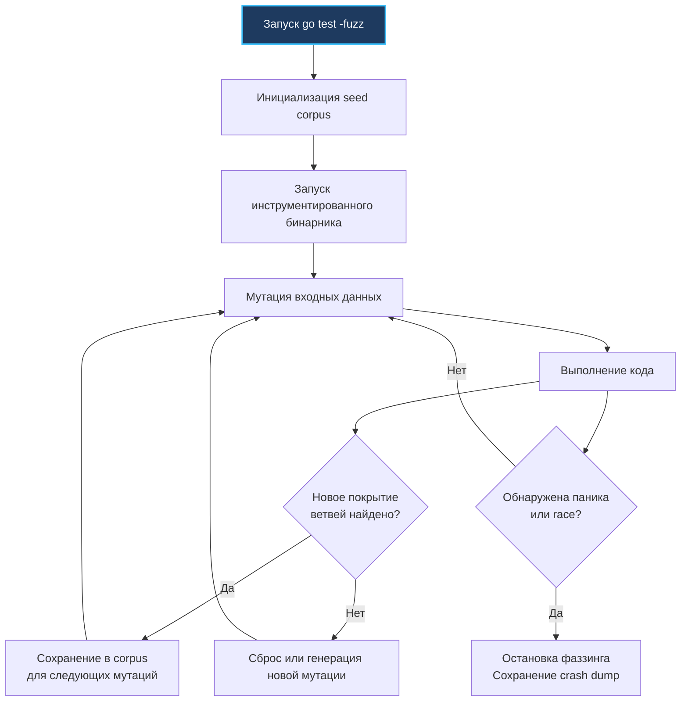

## Философия минимализма и конвенций

В большинстве современных экосистем разработка тестов обросла колоссальным слоем абстракций: сложные тестовые фреймворки, громоздкие XML-конфигурации, аннотации, байткод-манипуляции для моков и неявные соглашения о вызове. В такой среде сам запуск тестов превращается в отдельную сложную подсистему, требующую долгого разогрева виртуальной машины или компиляции плагинов.

В Go создатели языка сознательно вернулись к кернигановскому идеалу простоты: **тестирование — это не отдельный фреймворк, а неотъемлемая часть самого языка и стандартного тулчейна**. 

Пакет `testing` не содержит магии аннотаций, динамических прокси или скрытых глобальных раннеров. Вместо этого в Go действует строгая система соглашений (conventions):
- Тестовые файлы всегда имеют суффикс `*_test.go` и располагаются в том же каталоге, что и тестируемый код.
- Имена функций начинаются с префиксов `Test` (модульные и интеграционные тесты), `Benchmark` (замеры производительности) или `Fuzz` (фаззинг-тестирование).
- В качестве единственного аргумента передается указатель на структуру рантайма `*testing.T`, `*testing.B` или `*testing.F`.
- Логика проверки строится на обычном императивном коде Go: операторы `if got != want`, стандартное форматирование и явные методы `t.Errorf` или `t.Fatalf`.

Этот минимализм — величайшее архитектурное достоинство Go. Тесты компилируются тем же самым компилятором, оптимизируются теми же правилами и не зависят от внешних библиотек. Для Senior-инженера пакет `testing` — это мощная триада валидации: проверка бизнес-логики, математически точные бенчмарки и автоматизированный поиск граничных уязвимостей через coverage-guided фаззинг.

> [!info] Под капотом
> При запуске команды `go test` компилятор изолированно компилирует целевой пакет вместе со всеми файлами `*_test.go` в единый временный бинарный файл. Точкой входа генерируется функция `testing.MainStart`. Она использует внутренние метаданные символов, сформированные линковщиком, строит списки функций тестов и бенчмарков, и запускает их в кооперативном пуле горутин. После завершения бинарник выводит отчет и автоматически удаляется из каталога кэша.

---

### 1. Under the hood. Табличные тесты и модель параллельного выполнения

Золотой стандарт написания тестов в Go — **табличные тесты (table-driven tests)**. Они заменяют десятки однотипных тестовых функций единой структурой данных, где в виде таблицы декларируются входные параметры, ожидаемый результат и флаги возможных ошибок:

```go
package main

import (
	"testing"
)

func TestParseURL(t *testing.T) {
	// Декларируем анонимную структуру тестовых сценариев
	tests := []struct {
		name    string
		input   string
		want    string
		wantErr bool
	}{
		{"valid_https", "https://example.com", "https://example.com", false},
		{"missing_scheme", "example.com", "", true},
		{"invalid_chars", "http://exam ple.com", "", true},
	}

	for _, tc := range tests {
		// t.Run изолирует каждый тестовый сценарий как независимый подтест
		t.Run(tc.name, func(t *testing.T) {
			got, err := ParseURL(tc.input)
			if (err != nil) != tc.wantErr {
				t.Errorf("got err=%v, wantErr=%v", err, tc.wantErr)
			}
			if got != tc.want {
				t.Errorf("got=%q, want=%q", got, tc.want)
			}
		})
	}
}
```

### Механика параллелизма: метод `t.Parallel()`

Если в начале подтеста вызвать `t.Parallel()`, рантайм Go **не выполняет** тест немедленно. Происходит следующее:
1. Вызов `t.Parallel()` паркует текущую горутину подтеста и приостанавливает ее выполнение.
2. Родительская функция `TestParseURL` продолжает итерации цикла и завершается.
3. Как только все последовательные тесты завершаются, раннер пакета `testing` снимает барьер синхронизации и одновременно пробуждает все припаркованные параллельные горутины, распределяя их по ядрам CPU (в количестве не более `GOMAXPROCS`).

Это позволяет эффективно утилизировать многоядерные процессоры без взаимных гонок данных на этапе инициализации родительского теста.

---

### 2. Механика бенчмарков и защита от оптимизаций компилятора

Бенчмарки в Go (`func BenchmarkX(b *testing.B)`) предназначены для измерения задержки и пропускной способности функций в наносекундах. Однако современный оптимизирующий компилятор Go крайне агрессивен: если результат вычислений внутри цикла бенчмарка нигде не используется, компилятор применит оптимизацию **Dead Code Elimination (DCE)** и полностью удалит вызов тестируемой функции из сгенерированного машинного кода!

В результате вы будете измерять не скорость вашего алгоритма, а пустоту (0.2 нс на итерацию):

```go
package main

import (
	"testing"
)

// sink — глобальная переменная уровня пакета. 
// Запись в нее гарантирует компилятору, что значение может быть прочитано снаружи,
// предотвращая удаление мертвого кода (DCE, Dead Code Elimination).
var sink string 

func BenchmarkStringConcat(b *testing.B) {
	a, c := "hello", "world"

	b.ReportAllocs() // Включает подсчет выделенных байт и аллокаций в куче на итерацию
	b.ResetTimer()   // Сбрасывает таймер, исключая подготовительную работу из замера

	for i := 0; i < b.N; i++ {
		// Присвоение глобальной переменной sink предотвращает Dead Code Elimination
		sink = a + " " + c
	}
}
```

> [!tip] Go 1.24+: Новый цикл бенчмарков `b.Loop()`
> Начиная с Go 1.24, вместо классического цикла `for i := 0; i < b.N; i++` доступен идиоматичный метод `for b.Loop() { ... }`. Он автоматически управляет запуском и таймером бенчмарка, устраняя необходимость ручного вызова `b.ResetTimer()` перед циклом, и изолирует подготовительные действия от самого замера.

> [!warning] Ловушка / Gotcha
> **GC-интерференция в бенчмарках.**
> Сборщик мусора Go работает в фоновых горутинах. Если тестируемый код активно аллоцирует в куче, GC может непредсказуемо активироваться посреди замера `b.N`, исказив метрики латентности на десятки миллисекунд.
> 
> Для получения чистых, статистически повторяемых результатов запускайте бенчмарки с отключенным сборщиком: `GOGC=off go test -bench=.`, либо принудительно вызывайте `runtime.GC()` непосредственно перед `b.ResetTimer()`.

---

### 3. Fuzzing: Coverage-guided генерация и нативная интеграция

Начиная с версии Go 1.18, стандартная библиотека включает полноценный встроенный фаззинг-движок (`testing.F`). В отличие от наивных генераторов случайного шума (monkey testing), фаззинг в Go является **coverage-guided** (управляемым покрытием кода).

Компилятор внедряет в бинарник счетчики переходов (branch coverage). Когда фаззер генерирует мутацию входных данных, он отслеживает, привел ли этот ввод к исполнению новой инструкции или нового ветвления `if/switch`. Если найдено новое ветвление, этот входной срез данных немедленно сохраняется в локальный `corpus` как базис для всех последующих мутаций:

```go
package main

import (
	"strconv"
	"testing"
)

func FuzzParseInt(f *testing.F) {
	// Seed corpus: начальные валидные примеры для затравочной базы мутатора
	f.Add("123")
	f.Add("-456")
	f.Add("0")

	// Тело фаззинг-теста запускается тысячами параллельных горутин с мутированными данными
	f.Fuzz(func(t *testing.T, s string) {
		// Фаззинг непрерывно ищет паники, бесконечные циклы и race conditions
		val, err := strconv.Atoi(s)
		if err == nil {
			// Проверяем инвариант обратимости: число обязано обратно форматироваться в строку
			if strconv.Itoa(val) != s && s[0] != '+' && s != "-0" {
				t.Fatalf("invariant broken: strconv.Itoa(%d) != %q", val, s)
			}
		}
	})
}
```



---

### 4. Mechanical Sympathy. Влияние рантайма на точность метрик

Замеры производительности — сложный физический эксперимент над кремнием процессора:
* **Динамическая частота CPU (CPU Frequency Scaling / Turbo Boost):** В начале бенчмарка процессор работает на базовой энергоэффективной частоте (например, 2.4 ГГц). Через несколько миллисекунд контроллер процессора повышает частоту до Turbo Boost (4.8 ГГц). Первые итерации окажутся искусственно замедленными. Тулчейн `go test` автоматически проводит разминочные запуски (`warmup`), но для эталонных замеров на сервере рекомендуется фиксировать CPU Governor на профиль `performance` или отключать `intel_pstate`.
* **Шум планировщика ОС (OS Scheduler Noise):** Фоновые процессы операционной системы могут вытеснять поток Go на другое ядро CPU, вызывая холодный промах кэша данных L1/L2 (`cache cold miss`). Для изоляции используйте утилиту `taskset`: `taskset -c 0-3 go test -bench=.`.
* **Анализ побега в кучу (Escape Analysis):** Тестовый код компилируется теми же правилами оптимизации, что и продакшен. Если вспомогательные аргументы внутри бенчмарка заставляют переменную неявно «убегать» в кучу (heap escape), бенчмарк зафиксирует ложные аллокации. Всегда проверяйте вывод компилятора `go build -gcflags=-m`.

---

### 5. Ловушки и хардкорные вопросы с собеседований

| Сценарий | Проблема | Решение |
|---|---|---|
| **`t.Parallel()` с общим состоянием** | Подтесты конкурентно пишут в общий срез, файл или базу данных, вызывая `data race` или панику. | Защищайте разделяемые данные через `sync.Mutex`, изолируйте тестовые БД через `testcontainers` или не включайте `t.Parallel()` для интеграционных тестов. |
| **Попытка управлять `b.N` вручную** | Раннер бенчмарков сам адаптивно выбирает `b.N` для достижения статистической сходимости (дисперсия < 10%). | Никогда не модифицируйте `b.N`. Для нормализации throughput по объему данных используйте метод `b.SetBytes(n)`. |
| **Разница `t.Fatal` и `t.Error`** | Вызов `t.Error` лишь помечает тест упавшим, продолжая исполнение. Если далее следует обращение к `nil`-указателю, тест упадет с паникой. | Используйте `t.Fatal` (`t.Fatalf`), если дальнейшее продолжение теста бессмысленно. `t.Error` применяйте для агрегации нескольких проверок. |
| **Фаззинг падает на валидных данных** | Coverage-guided мутатор находит неочевидные граничные строки, ломающие некорректно сформулированный инвариант. | Расширяйте `f.Add()` валидными примерами и аккуратно фильтруйте входные параметры в теле функции `f.Fuzz`. |
| **`t.Cleanup` против классического `defer`** | Инструкция `defer` выполняется в порядке LIFO при выходе из функции. Метод `t.Cleanup` регистрирует коллбэки, гарантированно срабатывающие даже при досрочной остановке через `t.Fatal` или панике в подтесте. | Для освобождения внешних ресурсов (удаление временных директорий, остановка контейнеров) всегда используйте метод `t.Cleanup()`. |

> [!tip] Собеседование
> **Вопрос:** Как раннер бенчмарков Go определяет точное значение `b.N` для выполнения замера?
> **Ответ:** Раннер использует экспоненциальный подбор. Сначала функция запускается с `b.N=1`. Раннер измеряет время выполнения. Если оно меньше заданного интервала бенчмарка (по умолчанию 1 секунда, настраивается флагом `-benchtime`), раннер прогнозирует необходимое число итераций и последовательно умножает `b.N` (1, 10, 100, 1000...), пока суммарное время работы цикла не превысит 1 секунду, гарантируя статистическую достоверность результата.
>
> **Вопрос:** Почему встроенный фаззинг в Go (Go 1.18+) работает существенно быстрее внешних инструментов вроде `go-fuzz` или `afl`?
> **Ответ:** Встроенный фаззинг работает непосредственно внутри процесса рантайма Go. Он использует нативную инструментированность компилятора Go без использования мостов и разделяемой памяти IPC, и мутирует срезы байтов непосредственно в оперативной памяти без системных вызовов `fork`/`exec`. Это позволяет достигать производительности до $10^5$–$10^6$ итераций в секунду на одно ядро процессора.

---

### 6. Сравнение с экосистемами других языков

| Язык / Инструмент | Механизм | Особенности в сравнении со стандартной библиотекой Go |
|---|---|---|
| **Java** (JUnit + JMH) | Аннотации (`@Test`, `@Benchmark`), сложный Reflection runner | Фреймворк JMH требует сложной настройки прогрева JVM (warmup), множественных форков процессов и черных дыр (`Blackhole`). Мощно, но чрезвычайно многословно. В Go бенчмаркинг встроен изначально и декларативно прост. |
| **Python** (pytest + `timeit`) | Декораторы, динамические фикстуры, плагины | Наличие Global Interpreter Lock (GIL) делает параллельное тестирование условным. Высокий оверхед интерпретатора искажает замеры микро-бенчмарков. Go компилирует тесты в нативный машинный код. |
| **C++** (Catch2, Google Benchmark) | Сложные макросы, препроцессор, ручная линковка | Google Benchmark требует ручной линковки библиотек, настройки макросов `BENCHMARK_ADVANCED` и сложных сборочных файлов CMake. Go собирает и запускает тесты одной командой `go test`. |
| **Go** (`testing`) | Строгие конвенции, нулевые внешние зависимости | Полный цикл: unit-тесты, бенчмарки, профилирование памяти/CPU, проверка покрытия `go cover`, `go fuzz`, статический анализ `go vet` и фаззинг `go test -fuzz` прямо из коробки. Флаг `-count` обеспечивает строгую статистику. |

---

## Итог

1. Пакет `testing` следует философии конвенций над конфигурацией. Используйте табличные тесты, `t.Run` и метод `t.Parallel()` для параллельной проверки независимых сценариев.
2. Бенчмарки (`func BenchmarkX`) подвержены агрессивным оптимизациям компилятора. Всегда записывайте результат в глобальную переменную `sink` для предотвращения Dead Code Elimination (DCE) и вызывайте `b.ResetTimer()`. Для изоляции от GC используйте `GOGC=off`.
3. Встроенный фаззинг (`go test -fuzz`) — нативный coverage-guided инструмент. Он автоматически находит скрытые паники и граничные условия за счет мутации затравочного корпуса `f.Add`.
4. Метод `t.Cleanup` надежнее обычного `defer`: он гарантирует корректную утилизацию внешних ресурсов даже при вызове `t.Fatal` внутри подтеста.
5. Замеряйте производительность в чистом окружении: фиксируйте частоту ядер CPU, изолируйте процессы через `taskset` и используйте флаг `-count` для оценки дисперсии.
6. Стандартный тулчейн `go test` покрывает 95% потребностей инженерного цикла без необходимости во внешних громоздких фреймворках.

Понимание стандартного инструментария тестирования открывает путь к более продвинутым техникам валидации свойств и ускоренному запуску тестовых сценариев. Как использовать быстрые прокси-запуски, генераторы данных и property-based подходы для поиска скрытых багов? В следующей статье мы разберем: [[46. testing_quick и property based testing]].