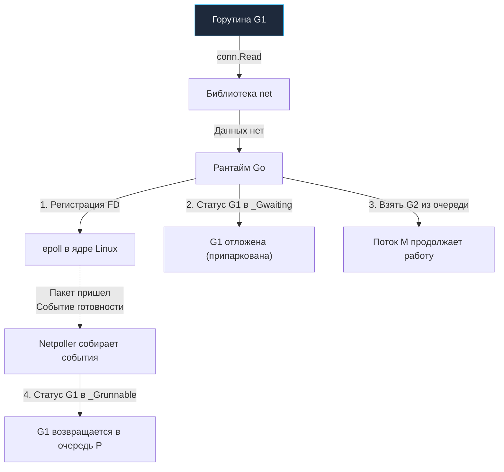

В предыдущей лекции [[9. Scheduler Go. G, M, P и work stealing]] мы подробно исследовали идеальный математический мир планировщика: горутины послушно распределяются по ядрам, рабочие потоки ОС (`M`) разбирают задачи из локальных очередей (`P`) и элегантно крадут работу друг у друга при дисбалансе.

Однако реальный продакшен — это не абстрактное вычисление чисел Фибоначчи в вакууме. Серверный бэкенд находится в состоянии непрерывного ожидания: медленные сетевые ответы от удаленных микросервисов, задержки дисковой подсистемы при записи журналов баз данных и тяжелые системные вызовы к ядру Linux.  
Если бы рантайм Go не обладал специализированными защитными барьерами, даже один «зависший» дисковый вызов или долгий сетевой сокет парализовал бы поток операционной системы, а всплеск из нескольких тысяч одновременных запросов мгновенно исчерпал бы системные ресурсы сервера.

Чтобы модель конкурентности `M:N` сохраняла исключительную устойчивость в условиях агрессивного ввода-вывода (IO, Input/Output) и неаккуратного пользовательского кода, в недрах рантайма непрерывно функционируют два ключевых механизма: **Netpoller** (сетевой поллер) и **Sysmon** (системный монитор).

---

## Netpoller. Магия неблокирующего IO

**Архитектурный вызов:**  
Классические системные вызовы ввода-вывода (например, `read` из сетевого сокета в Unix) по умолчанию являются блокирующими. Если в сетевом буфере сокета нет готовых байт, ядро операционной системы переводит вызывающий поток в состояние глубокого сна до момента физического прибытия TCP-пакета. Для многопоточной модели Go это означало бы катастрофу: поток ядра `M` оказался бы заблокирован вместе со своим контекстом `P`, заморозив исполнение сотен других горутин.

**Системное решение:**  
Современные операционные системы предоставляют высокопроизводительные механизмы асинхронного мультиплексирования событий ввода-вывода:
- `epoll` в Linux;
- `kqueue` в macOS и FreeBSD;
- `IOCP` (I/O Completion Ports) в Windows.

Эти системные селекторы позволяют единственному потоку ядра операционной системы отслеживать сотни тысяч открытых сетевых сокетов, мгновенно получая уведомление от ядра, как только в каком-либо канале появляются готовые данные.

Рантайм Go абстрагирует эти разнородные низкоуровневые API в единый кроссплатформенный компонент — **Netpoller**.  
Для прикладного разработчика код выглядит абсолютно синхронным, последовательным и прямолинейным. Однако под капотом рантайм трансформирует его в сложнейший неблокирующий конечный автомат.

### Как работает Netpoller (Пошагово)

Проследим механику обработки сетевого чтения на примере вызова `conn.Read(buf)`:

1. **Перехват вызова:** Пакет стандартной библиотеки `net` не совершает прямой блокирующий системный вызов ядра. Вместо этого он обращается к внутреннему механизму `poll.FD` в рантайме.
2. **Регистрация в epoll:** Рантайм проверяет готовность данных в сокете. Если буфер пуст, дескриптор сокета регистрируется в глобальном экземпляре `epoll` ядра Linux с флагом отслеживания событий чтения.
3. **Парковка горутины:** Рантайм атомарно переводит статус текущей горутины из `_Grunning` в `_Gwaiting` (ожидание). Горутина открепляется от потока `M` и помещается в структуру ожидания сокета.
4. **Освобождение потока M:** Поток операционной системы `M` остается полностью свободным! Он мгновенно обращается к локальной очереди своего процессора `P`, извлекает следующую готовую горутину и продолжает выполнять вычисления. Никаких холостых блокировок тредов ядра не происходит.
5. **Пробуждение при поступлении данных:** Когда физический кадр поступает на сетевой адаптер, ядро Linux фиксирует готовность сокета в очереди событий `epoll`.  
   В цикле планирования рантайм опрашивает сетевой поллер (`runtime.netpoll`). Обнаружив готовность сокета, Netpoller находит ассоциированную спящую горутину, переводит ее статус в `_Grunnable` и возвращает в локальную очередь `P`.

> [!info] Под капотом: Интеграция планировщика и поллера
> 
> В традиционных асинхронных фреймворках (например, в Node.js или классических реактивных библиотеках) Event Loop вращается в отдельном выделенном потоке ядра.  
> В рантайме Go проверка сетевого поллера **органично интегрирована в общий цикл поиска задач (`findrunnable`) каждого потока `M`**.  
> Когда поток `M` исчерпывает задачи в локальной очереди `P.runq` и глобальной очереди, он обязательно выполняет неблокирующий системный опрос `epoll_wait`, чтобы забрать пробудившиеся сетевые горутины. Это гарантирует минимальный tail latency и равномерно размазывает обработку сетевого трафика по всем доступным ядрам CPU.

---

## Sysmon. Страж рантайма

Если Netpoller глубоко вплетен в логику рабочих потоков планировщика, то **Sysmon (System Monitor)** представляет собой абсолютно независимого арбитра.

`sysmon` — это специализированная низкоуровневая функция рантайма, запускаемая на **отдельном, выделенном потоке ядра ОС (`M`)** еще на этапе начального бутстрапа программы.

Его фундаментальная архитектурная особенность: **`sysmon` функционирует без привязки к логическому контексту (`P`)**.  
Ему не требуются локальные очереди задач или локальные кэши памяти. Он выведен за рамки стандартных правил планировщика именно для того, чтобы иметь возможность спасать рантайм, когда все рабочие процессоры `P` перегружены или заблокированы.

Поток `sysmon` исполняется в непрерывном цикле, варьируя паузы сна от 20 микросекунд (при высокой активности) до 10 миллисекунд (при простое), и выполняет четыре жизненно важные задачи:

### Задача 1. Preemption (Вытеснение "жадных" горутин)

Горутины не должны монополизировать аппаратные ядра. Если разработчик написал вычислительно плотный цикл `for {}` без системных вызовов, переключения каналов или вызовов функций, наивный планировщик позволил бы такой горутине навсегда захватить физическое ядро CPU.

Для защиты от монополизации `sysmon` регулярно инспектирует состояние всех работающих горутин. Если он обнаруживает, что конкретная горутина непрерывно выполняется на процессоре **более 10 миллисекунд**, он инициирует принудительное вытеснение (**Preemption**).

- До версии Go 1.14 вытеснение было чисто кооперативным (рантайм выставлял флаг проверки стека в прологе функций, на который полагалась горутина). Пустые бесконечные циклы этот флаг игнорировали.
- Начиная с Go 1.14 внедрено полноценное **Асинхронное вытеснение (Asynchronous Preemption)**. `sysmon` посылает аппаратный сигнал операционной системы **`SIGURG`** соответствующему потоку ядра `M`. Обработчик сигнала в рантайме прерывает исполнение потока на уровне регистров CPU, сохраняет контекст зависшей горутины, переводит ее в глобальную очередь и передает управление другой готовой задаче.

*(Детальный разбор этой низкоуровневой механики представлен в лекции [[43. Preemption. Как Go останавливает горутины]]).*

### Задача 2. Handoff (Спасение при блокирующих Syscalls)

Хотя сетевой ввод-вывод элегантно обрабатывается через Netpoller, файловые операции с обычными дисками в Linux исторически не поддерживают неблокирующий `epoll` (файловые дескрипторы на диске всегда считаются ядром готовыми к чтению). Аналогично ведут себя вызовы сторонних библиотек через CGO. В результате чтение с медленного HDD или сетевого хранилища NFS совершает честный блокирующий системный вызов.

Когда рабочий поток `M` входит в блокирующий вызов, он засыпает в пространстве ядра. Вместе с ним рискует зависнуть привязанный контекст `P` со всеми 255 ожидающими горутинами.

`sysmon` предотвращает эту катастрофу:
1. Он фиксирует, что процессор `P` находится в состоянии системного вызова `_Psyscall` **более 20 микросекунд** (если в очереди задач `runq` есть другие готовые горутины либо нет свободных потоков; при пустой же очереди рантайм терпит вызов вплоть до **10 миллисекунд**, чтобы не тратить ресурсы на лишний отрыв процессора);
2. `sysmon` инициирует протокол **Handoff (передача эстафеты)**: он принудительно отрывает процессор `P` от спящего потока `M`;
3. Процессор `P` немедленно передается другому свободному потоку `M` (или рантайм оперативно порождает новый поток ОС);
4. Локальная очередь задач продолжает бесперебойно исполняться на освободившемся ядре CPU.

*(Подробный разбор состояний `entersyscall`/`exitsyscall` см. в лекции [[42. Планировщик и блокирующие syscalls]]).*

### Задача 3. Страховка Netpoller'а

Если все рабочие процессоры загружены тяжелыми математическими алгоритмами, они могут редко обращаться к циклу планирования и не опрашивать системный `epoll`. Входящие сетевые запросы начали бы скапливаться в очередях ядра, провоцируя рост задержки (latency).

`sysmon` выступает страхующим таймером. Если с момента последнего опроса сетевого поллера прошло более 10 миллисекунд, `sysmon` самостоятельно выполняет опрос `runtime.netpoll` и направляет проснувшиеся горутины в глобальную очередь задач, сигнализируя рабочим потокам о необходимости забрать работу.

### Задача 4. Scavenging (Возврат памяти)

Память, освобожденная сборщиком мусора (GC), не возвращается ядру Linux немедленно: рантайм удерживает ее в глобальных структурах `mheap` для повторного мгновенного использования.  
Однако если пик трафика спал, удержание гигабайт пустых страниц в памяти создает прямую угрозу уничтожения сервиса системным OOM Killer в контейнерах Kubernetes.

В периоды пониженной активности `sysmon` координирует работу фонового сборщика свободных страниц (**Scavenger**). Сборщик планомерно вызывает системный вызов `madvise(MADV_DONTNEED)`, сообщая ядру операционной системы, что неиспользуемые страницы физической памяти можно освободить, сохраняя при этом диапазон виртуальных адресов приложения.

> [!tip] Собеседование: Поведение спящих горутин
> 
> **Вопрос:** Что произойдет с ресурсами сервера, если в Go-приложении запустить 100 000 горутин, каждая из которых выполняет `time.Sleep` продолжительностью в один час? Приведет ли это к исчерпанию пула потоков ядра или росту загрузки CPU?
> 
> **Ответ:** Потребление CPU останется на уровне **0%**, а системные потоки ядра ОС не пострадают.  
> Вызов `time.Sleep` не блокирует поток операционной системы `M`. Рантайм переводит горутину в состояние ожидания `_Gwaiting` и регистрирует внутренний таймер в системном heap-таймере рантайма. Потоки `M` засыпают из-за отсутствия работы, а `sysmon` лишь периодически пробуждается для фонового надзора.  
> Единственным накладным расходом будет память под структуры и начальные стеки самих горутин: при стартовом стеке 2 КБ на горутину 100 000 горутин суммарно займут около **~200 МБ RAM**.

---

## Итог

1. **Netpoller** прозрачно трансформирует блокирующий сетевой код прикладного уровня в высокопроизводительный асинхронный событийный цикл на базе `epoll`/`kqueue`/`IOCP`, устраняя накладные расходы на блокировки потоков ОС.
2. **Sysmon** — автономный фоновый супервизор рантайма, работающий на выделенном потоке ядра ОС без привязки к `P`.
3. `sysmon` гарантирует отказоустойчивость системы:
   - Принудительно вытесняет вычислительно плотные горутины через сигнал `SIGURG` (Asynchronous Preemption) каждые 10 миллисекунд;
   - Спасает контексты `P` от простоя при блокирующих системных вызовах через механизм **Handoff** (таймаут 20 микросекунд);
   - Регулярно опрашивает сетевой поллер в качестве страховки;
   - Возвращает неиспользуемую память ядру ОС через фоновый Scavenger и системный вызов `madvise`.

Мы изучили, как планировщик, Netpoller и sysmon дирижируют потоками и горутинами. Но до сих пор сама горутина оставалась для нас компактной абстракцией со «стеком в 2 КБ».  
Каким образом этот стек размещается в памяти, как он умудряется динамически расти при глубокой рекурсии и почему он никогда не вызывает классический `StackOverflowError`?

В следующей лекции мы детально исследуем: [[11. Стек горутины. Рост и shrink стека]].