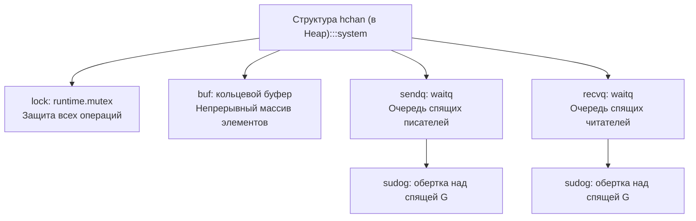
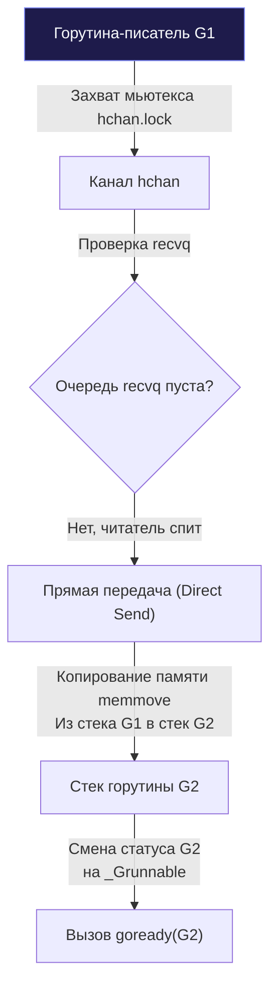

В завершении лекции [[12. Как создается и завершается goroutine]] мы привели крылатый афоризм Роба Пайка: *«Не общайтесь, разделяя память; разделяйте память, общаясь»* (наследие формальной модели CSP Тони Хоара). Главным инженерным инструментом этого общения в языке Go выступают **Каналы (Channels)**.

Среди разработчиков, недавно освоивших Go, вокруг каналов нередко складывается мистический ореол. Возникает иллюзия, будто канал — это некая безакцептная (lock-free) квантовая телепортация данных на уровне процессорных шин, которая по определению быстрее, надежнее и современнее «старомодных» мьютексов.

Для инженера Senior-уровня критически важно развеять эту романтическую дымку. **Канал в Go — это обыкновенная потокобезопасная очередь в памяти, защищенная классическим мьютексом**, но тесно спаянная с планировщиком задач рантайма.

Заглянем в файл `src/runtime/chan.go` и разберем анатомию канала на уровне физических структур данных.

---

## 1. Структура hchan

Когда программист пишет `ch := make(chan int, 3)`, компилятор транслирует эту инструкцию в вызов рантайм-функции `runtime.makechan`, которая аллоцирует в оперативной памяти кучи (Heap) заголовочную структуру **`hchan`** (Header of Channel).

**В текущей реализации компилятора Go (`gc`) вызов `make(chan ...)` всегда аллоцирует структуру `hchan` в куче** через `mallocgc`, даже если канал создан внутри локальной функции и не передается наружу (Escape Analysis компилятора пока не оптимизирует размещение каналов на стеке). Причина очевидна: канал фундаментально спроектирован для разделения данных между независимыми горутинами, у каждой из которых свой собственный изолированный стек.

Структура `hchan` включает в себя ключевые поля:
* `qcount`: текущее количество элементов, фактически находящихся в буфере прямо сейчас;
* `dataqsiz`: общая вместимость буфера (размер capacity, заданный вторым аргументом `make`);
* `buf`: указатель на непрерывный кольцевой буфер (ring buffer) в памяти. Для небуферизованных каналов (`make(chan int)`) буфер отсутствует, и указатель равен `nil`;
* `elemsize` и `elemtype`: размер в байтах и указатель на метаданные типа элемента (необходимо для безопасного побайтового копирования `memmove`);
* `sendx`: индекс в кольцевом буфере, куда будет записан следующий поступающий элемент;
* `recvx`: индекс в кольцевом буфере, откуда будет прочитан следующий элемент;
* `recvq` и `sendq`: очереди ожидания (**wait queues**). Это двусвязные списки спящих горутин, заблокированных на чтении или записи;
* `lock`: встроенный системный спин-мьютекс (`runtime.mutex`), который захватывается при **любой** операции с каналом (чтение, запись, закрытие, проверка длины).

---

## 2. Что такое sudog?

В очередях ожидания `sendq` и `recvq` находятся не «сырые» структуры `g` (горутины), а специальные связующие узлы — **`sudog`**.

Зачем рантайму потребовался этот промежуточный объект?  
Горутина `G` — это неделимый субъект исполнения. В реальной программе одна горутина может одновременно ожидать данных из **нескольких разных каналов** (например, внутри конструкции `select`). Если бы мы помещали саму структуру `g` в двусвязный список одного канала, ее указатели связности `next` и `prev` оказались бы перезаписаны при попытке встать в очередь второго канала!

Поэтому структура `sudog` выступает «делегатом» или представителем горутины в очереди конкретного канала:
* `g`: указатель на саму ожидающую горутину;
* `elem`: указатель на ячейку памяти (на стеке горутины), откуда нужно прочитать или куда нужно записать передаваемые данные;
* `c`: указатель на структуру канала `hchan`, в очереди которого этот `sudog` зарегистрирован.

---

## 3. Анатомия записи (Send): ch <- data

Операция отправки данных в канал транслируется компилятором в вызов функции **`runtime.chansend`**.  
За исключением быстрых неблокирующих проверок, рантайм первым делом захватывает внутренний мьютекс `hchan.lock`. Далее логика разделяется на три строгих сценария с выраженным сочувствием к машине (**Mechanical Sympathy**):

### Сценарий 1: Читатель уже ждет (Direct Send)

Если мы отправляем данные в канал, а в очереди `recvq` уже томится заблокированный читатель (его `sudog`), рантайм применяет великолепную оптимизацию — **Direct Send (прямая передача)**.

Вместо того чтобы копировать данные в промежуточный буфер `buf`, обновлять индексы, а затем будить читателя, чтобы тот скопировал данные из буфера к себе на стек, рантайм берет данные из стека писателя и **копирует их напрямую в стек читателя**:

Мы экономим целый цикл обращений к оперативной памяти и избегаем прогрева промежуточного буфера! После прямого копирования писатель вызывает процедуру `goready(readerG)`, сообщая планировщику, что читатель готов к исполнению (`_Grunnable`) и должен вернуться в локальную очередь `P`.

### Сценарий 2: Буфер свободен

Если читателей в очереди нет, но канал является буферизованным и в нем есть свободное место (`qcount < dataqsiz`):
1. Писатель копирует данные из своего стека в массив кольцевого буфера по адресу смещения `sendx`;
2. Индекс `sendx` циклически инкрементируется: `if sendx == dataqsiz { sendx = 0 }`;
3. Счетчик элементов `qcount` увеличивается на 1;
4. Мьютекс `lock` освобождается, и горутина-писатель продолжает выполнение без малейшей паузы.

### Сценарий 3: Блокировка (Буфер полон или отсутствует)

Если канал небуферизован (а читателя нет) либо буфер полностью заполнен (`qcount == dataqsiz`), писатель не может продолжить работу:
1. Рантайм аллоцирует или берет из кэша дескриптор `sudog` для текущей горутины;
2. Сохраняет в `sudog.elem` адрес передаваемой переменной на своем стеке;
3. Вставляет `sudog` в хвост двусвязного списка `sendq`;
4. Вызывает процедуру **`runtime.gopark`**: горутина освобождает поток `M`, переходит в статус `_Gwaiting` и засыпает до момента, пока будущий читатель не разбудит ее.

---

## 4. Анатомия чтения (Receive): data := <-ch

Операция чтения транслируется компилятором в функцию **`runtime.chanrecv`**. Она работает зеркально, но содержит важнейший тонкий нюанс:

### Сценарий 1: Писатель уже ждет

Если мы зашли в чтение, а в очереди `sendq` находится спящий писатель:
* **Если канал небуферизованный:** Выполняется **Direct Receive**: данные копируются напрямую со стека спящего писателя на стек читателя, после чего писатель пробуждается через `goready`.
* **Если канал буферизованный (и буфер полон):** Напрямую скопировать данные со стека писателя читателю **категорически нельзя**, иначе нарушится фундаментальный FIFO-порядок (первым пришел — первым ушел)!  
  Рантайм поступает предельно элегантно:
  1. Читатель забирает самые старые данные из головы буфера: `buf[recvx]`;
  2. Данные со стека спящего писателя копируются **на освободившееся место в буфер**: `buf[sendx]`;
  3. Оба индекса `recvx` и `sendx` инкрементируются;
  4. Писатель разблокируется через `goready`.

### Сценарий 2: В буфере есть данные (писателей нет)

Читатель копирует элемент из слота `buf[recvx]` в свою целевую переменную, очищает память в освобожденном слоте буфера (чтобы GC мог утилизировать объект, если элемент был указателем), инкрементирует `recvx`, уменьшает `qcount`, отпускает мьютекс и продолжает путь.

### Сценарий 3: Блокировка (Данных нет)

Если данных нет и канал не закрыт:
Читатель формирует свой `sudog`, сохраняет в нем адрес ячейки для приема данных, встает в очередь `recvq`, отпускает мьютекс канала и вызывает `gopark`, погружаясь в сон.

---

## 5. Закрытие канала: close(ch)

При вызове встроенной функции `close(ch)` рантайм исполняет процедуру `runtime.closechan`:
1. Захватывает мьютекс `hchan.lock`;
2. Если канал уже закрыт (`closed != 0`), паникует: `panic: close of closed channel`;
3. Выставляет флаг `closed = 1`;
4. Проходит по всей очереди читателей `recvq`: каждому `sudog` в качестве значения записывается нулевое значение по умолчанию (**zero value**) его типа, после чего горутина будится (`goready`);
5. Проходит по очереди писателей `sendq`: все заблокированные писатели немедленно пробуждаются, вызывая фатальную панику: **`panic: send on closed channel`**;
6. Освобождает мьютекс `lock`.

> [!warning] Ловушка / Gotcha: Утечка памяти при работе с nil-каналами
> 
> Если обнулить ссылку на канал (`ch = nil`), он не закроется и не разбудит спящие горутины.  
> Операции чтения и записи в `nil`-канал блокируют вызывающую горутину **навсегда**:  
> рантайм вызывает процедуру `gopark` напрямую, не добавляя горутину ни в одну очередь `waitq`, поскольку самого объекта `hchan` не существует. Это классический источник невидимых утечек горутин (**Goroutine Leak**). Единственное легитимное применение `nil`-каналов — намеренное отключение ветки `case` внутри цикла `select`.

> [!tip] Собеседование: Что быстрее — канал или мьютекс?
> 
> **Вопрос:** Если требуется защитить целочисленный счетчик (`counter++`) от состояния гонки между горутинами, что эффективнее использовать: буферизованный канал на 1 элемент или `sync.Mutex`?
> 
> **Ответ:** Однозначно **`sync.Mutex`** (или атомики `sync/atomic`).  
> Как мы убедились, внутри абсолютно любого канала Go **уже живет обыкновенный мьютекс** (`hchan.lock`).  
> Использование канала в роли мьютекса порождает огромный паразитный оверхед: аллокация `hchan` в куче, создание дескрипторов `sudog`, копирование памяти в буфер, лишние вызовы планировщика `gopark`/`goready` и переключения контекста. Мьютексы служат для синхронизации доступа к разделяемой памяти, а каналы — для оркестрации потоков данных.

---

## Итог

1. **Канал (`hchan`)** — это не lock-free структура, а классическая потокобезопасная очередь в куче, защищенная встроенным спин-мьютексом `lock`.
2. **`sudog`** — вспомогательный связующий объект, представляющий горутину в очередях ожидания (`sendq`, `recvq`) и позволяющий ей ждать события из нескольких каналов сразу.
3. **Direct Send / Direct Receive:** Если партнер по коммуникации уже заблокирован, рантайм копирует данные напрямую из стека в стек, минуя кольцевой буфер `buf`.
4. В буферизованном канале при чтении в присутствии спящего писателя соблюдается строгий порядок FIFO: читатель берет старое значение из `buf[recvx]`, а значение писателя помещается на освободившееся место `buf[sendx]`.
5. Попытка записи или повторного закрытия закрытого канала приводит к немедленной панике, а операции с `nil`-каналами ведут к вечной блокировке.

Мы досконально изучили поведение отдельного изолированного канала. Но в архитектуре современных распределенных микросервисов горутине постоянно требуется мультиплексировать события от нескольких каналов одновременно — реализовывать таймауты, отмену контекста и приоритетную маршрутизацию.

В следующей лекции мы детально разберем: [[14. Select под капотом]].