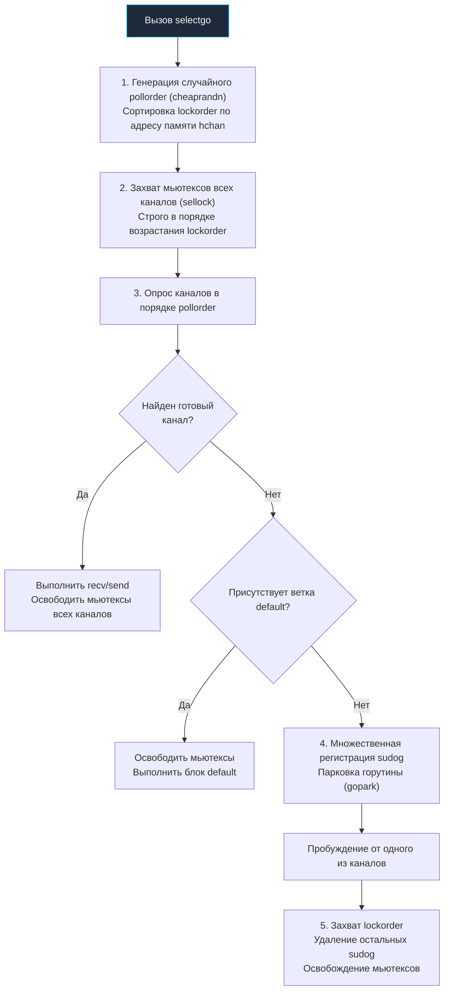

В предыдущей лекции [[13. Каналы под капотом. hchan, sudog, sendq, recvq]] мы препарировали устройство одиночного канала и убедились, что за романтическим ореолом «передачи сообщений» скрывается классический кольцевой буфер в куче, защищенный мьютексом. Однако подлинная выразительность конкурентной модели Go раскрывается не на одиночных каналах, а при их мультиплексировании.

Оператор **`select`** позволяет горутине одновременно ожидать событий ввода-вывода из множества независимых каналов. Эта элегантная языковая конструкция служит архитектурным фундаментом для реализации важнейших паттернов распределенных систем: *fan-in*, *cancellation* (отмена задач через контекст) и таймауты сетевых запросов.

Но как эта механика реализуется на уровне машинного кода рантайма? Каким образом одиночная горутина может спать сразу в нескольких независимых очередях каналов? И почему за удобство `select` приходится платить вполне ощутимую цену в тактах процессора?

Разберем алгоритмическую анатомию `select` в рантайме Go.

---

## 1. Иллюзия компилятора (Синтаксический сахар)

Первое откровение для системного программиста: единой тяжеловесной универсальной процедуры `select` в рантайме не существует.  
На этапе построения промежуточного представления (SSA, см. [[4. SSA в Go. Как компилятор оптимизирует код]]) компилятор тщательно исследует структуру блока `select` и при малейшей возможности заменяет его на оптимизированные специализированные вызовы:

1. **Пустой `select {}`:**  
   Компилятор заменяет его прямым вызовом функции **`runtime.block()`**. Горутина навсегда переводится в состояние сна `_Gwaiting` и никогда не возвращается к исполнению. Этот трюк часто применяется в конце функции `main`, когда процессу необходимо удерживать фоновые воркеры без выхода из программы.
2. **Один case (без default):**  
   Конструкция синтаксически избыточна. Компилятор полностью вырезает обертку `select` и подставляет непосредственный вызов чтения **`runtime.chanrecv1`** или записи **`runtime.chansend1`**.
3. **Один case + default:**  
   Это классический паттерн неблокирующего опроса сокета. Компилятор генерирует специализированный вызов **`runtime.selectnbrecv`** (non-blocking receive) или `selectnbsend`. Если в канале нет готовых данных, функция моментально возвращает `false`, и поток выполнения без задержек переходит в ветку `default`, не создавая объектов ожидания `sudog` и не обращаясь к планировщику.
4. **Два и более case:**  
   Только здесь в игру вступает полномасштабная машинерия рантайма. Компилятор упаковывает ветви в массив структур `scase` (select case) и передает управление главной процедуре диспетчеризации — **`runtime.selectgo`**.

> [!info] Под капотом: Структура scase
> 
> Перед передачей управления в `selectgo` компилятор конструирует массив структур `scase`:
> - `c *hchan` — указатель на целевой канал в куче;
> - `elem unsafe.Pointer` — указатель на переменную на стеке для чтения данных или записи значения;
> - `kind uint16` — тип операции: чтение (`caseRecv`), запись (`caseSend`) или ветка `default` (`caseDefault`).

---

## 2. Механика runtime.selectgo

Функция `runtime.selectgo` (исходный код в `src/runtime/select.go`) представляет собой виртуозный алгоритм, решающий одну из сложнейших задач Computer Science: **синхронную атомарную проверку нескольких независимых ресурсов без возникновения взаимных блокировок (Deadlock)**.

Алгоритм выполняется в пять строгих последовательных фаз:



### Фаза 1. Подготовка: Справедливость (pollorder) и порядок блокировок (lockorder)

Перед тем как захватывать блокировки каналов, рантайм Go выполняет подготовительные вычисления без удержания каких-либо мьютексов, минимизируя время нахождения в критической секции:

1. **Справедливость (Перемешивание `pollorder`):**  
   Если бы каналы опрашивались строго сверху вниз по тексту программы, верхние ветки `case` получали бы колоссальное преимущество, а нижние каналы страдали бы от голодания (**Starvation**). Чтобы обеспечить строгую справедливость (**fairness**), рантайм использует быстрый генератор псевдослучайных чисел (`cheaprandn`) и генерирует массив **`pollorder`** — случайную перестановку индексов веток `case`.

2. **Защита от Deadlock (Сортировка `lockorder`):**  
   Каждый канал `hchan` защищен собственным встроенным мьютексом `lock`. Чтобы атомарно проверить состояние нескольких каналов, `select` обязан захватить блокировки каждого из них.  
   Представим классическую ловушку:
   - Горутина 1 выполняет `select`, опрашивающий сначала `ch1`, а затем `ch2`;
   - Горутина 2 в ту же наносекунду выполняет `select`, опрашивающий `ch2`, а затем `ch1`.  
   Если бы рантайм захватывал мьютексы в порядке их перечисления в коде, возник бы кольцевой Deadlock. Инженеры Go применили классическое решение Дейкстры: **рантайм сортирует все участвующие в select каналы по их физическому адресу в куче (heap address)** с помощью пирамидальной сортировки (heapsort), формируя массив `lockorder`.

### Фаза 2. Захват блокировок (sellock)

Только после завершения всех подготовительных расчетов рантайм вызывает функцию `sellock(scases, lockorder)`.  
Мьютексы всех участвующих каналов блокируются **строго в порядке возрастания адресов их структур `hchan` в памяти**. Это исключает избыточное удержание блокировок во время генерации псевдослучайных чисел и сортировки, а также математически делает циклические взаимоблокировки невозможными.

> [!tip] Собеседование: Почему порядок выполнения веток select случаен?
> 
> **Вопрос:** Если в конструкции `select` одновременно готовы к передаче данных два или три канала, какой из них будет выбран для исполнения?
> 
> **Ответ:** Выбор будет **псевдослучайным**.  
> Это сознательное архитектурное решение рантайма Go. Благодаря генерации случайной перестановки `pollorder` планировщик предотвращает систематическое голодание каналов, находящихся в конце блока `select`, и равномерно распределяет нагрузку при конкурентном чтении.

### Фаза 3. Опрос (Polling)

Рантайм последовательно опрашивает каналы в порядке, заданном случайным массивом `pollorder`:
* Для ветки чтения `case <-ch`: есть ли заблокированный писатель в `sendq` или готовые данные в буфере `buf`?
* Для ветки записи `case ch<-`: есть ли ожидающий читатель в `recvq` или свободное место в буфере?

Если **хотя бы один** канал готов к операции:
1. Рантайм выполняет обмен данными (прямое копирование между стеками Direct Send/Receive или работа с буфером);
2. Немедленно освобождает мьютексы всех каналов в порядке `lockorder`;
3. Возвращает индекс сработавшего `case`, и процессор переходит к исполнению соответствующего блока кода.

Если ни один канал не готов, но в блоке присутствует ветка **`default`**, рантайм мгновенно снимает все блокировки и направляет управление в секцию `default`.

### Фаза 4. Глубокий сон (Множественный sudog)

Что происходит, если ни один канал не готов, а ветка `default` отсутствует? Горутина обязана уснуть.  
Именно здесь в полной мере раскрывается назначение связующего объекта **`sudog`**:

1. Для **каждого** канала, участвующего в `select`, рантайм формирует отдельный дескриптор `sudog`;
2. Каждый `sudog` помещается в очередь ожидания `sendq` или `recvq` соответствующего канала;
3. Все `sudog` ссылаются на одну и ту же горутину `g`;
4. Рантайм отпускает мьютексы всех каналов и вызывает процедуру **`runtime.gopark`**.

Горутина переходит в статус `_Gwaiting` и засыпает. Она буквально распята между несколькими каналами, присутствуя в очередях ожидания каждого из них.

Как только в **любой один** из этих каналов поступит сигнал от сторонней горутины, эта сторонняя горутина обнаружит спящий `sudog`, переведет нашу горутину в статус `_Grunnable` и передаст ее планировщику для пробуждения.

### Фаза 5. Очистка после пробуждения (Cleanup)

Горутина проснулась от события в одном из каналов. Однако ее остальные дескрипторы `sudog` все еще физически находятся в очередях ожидания других каналов!  
Если оставить их там, другие горутины могут попытаться повторно передать в них данные, что приведет к разрушению инвариантов рантайма и фатальной панике.

Поэтому перед тем как передать управление в прикладной код, горутина выполняет обязательную процедуру очистки:
1. Захватывает мьютексы всех каналов в порядке `lockorder`;
2. Обходит все очереди и аккуратно удаляет свои неиспользованные объекты `sudog`;
3. Освобождает мьютексы каналов и возвращается в бизнес-логику.

---

## Mechanical Sympathy. Цена Select

Зная внутреннюю анатомию `select`, системный архитектор может точно оценить накладные расходы конструкции:

1. **Многократные захваты мьютексов:** Конструкция `select` на 4 канала требует захвата и освобождения 4 спин-мьютексов при входе, и еще 4 мьютексов при пробуждении для очистки очередей.
2. **Сортировка массивов:** Сортировка адресов `lockorder` требует процессорных тактов.
3. **Генерация случайных перестановок:** Работа `fastrand` быстра, но в плотных горячих циклах дает паразитный оверхед.
4. **Аллокации дескрипторов `sudog`:** При засыпании расходуются ресурсы кэшей аллокатора.

> [!warning] Ловушка / Gotcha: Бесконечный цикл с закрытым каналом
> 
> Классическая архитектурная ошибка при мультиплексировании каналов в цикле `for select`:
> 
> ```go
> for {
>     select {
>     case val := <-ch1:
>         // Если канал ch1 закроется (close), этот case начнет
>         // срабатывать МГНОВЕННО и БЕСКОНЕЧНО, возвращая zero-value!
>         // Произойдет мгновенная 100% утилизация ядра CPU (Busy Loop).
>         process(val)
>     case <-ctx.Done():
>         return
>     }
> }
> ```
> 
> **Инженерное решение:** Всегда используйте форму чтения с проверкой флага открытости `val, ok := <-ch1` и устанавливайте `ch1 = nil`, если `ok == false`:
> 
> ```go
> case val, ok := <-ch1:
>     if ok == false {
>         ch1 = nil // Отключаем ветку!
>         continue
>     }
>     process(val)
> ```
> 
> Присвоение каналу значения `nil` навсегда исключает эту ветку из участия в `selectgo`, полностью предотвращая сжигание тактов CPU в холостом цикле (**Busy Loop**).

---

## Итог

1. Компилятор оптимизирует тривиальные формы `select` (пустой `select {}`, одиночные каналы, неблокирующие вызовы с `default`), избегая накладных расходов общего диспетчера.
2. Полноразмерный `select` обслуживается функцией **`runtime.selectgo`**.
3. **Защита от Deadlock:** Каналы всегда блокируются в строгом порядке возрастания их физических адресов в оперативной памяти (`lockorder`).
4. **Справедливость (Fairness):** Порядок опроса каналов перемешивается псевдослучайным алгоритмом (`pollorder`), гарантируя равноправие всех ветвей `case`.
5. **Множественные `sudog`:** При блокировке горутина регистрирует представителей во всех каналах одновременно, а после пробуждения обязана снова захватить все мьютексы и очистить очереди ожидания.

Каналы и `select` — это мощные, элегантные, но ресурсоемкие инструменты координации. Внутри них, как мы убедились, всегда работают низкоуровневые мьютексы рантайма.  
Если наша задача — защитить простой счетчик, обновить конфигурацию или обеспечить атомарный доступ к кэшу в оперативной памяти, использование каналов становится расточительным антипаттерном. Для экстремальной производительности инженеры опираются на базовые примитивы синхронизации.

В следующей лекции мы спустимся к самому фундаменту конкурентности памяти:

Переходим к: [[15. Mutex и RWMutex под капотом]].