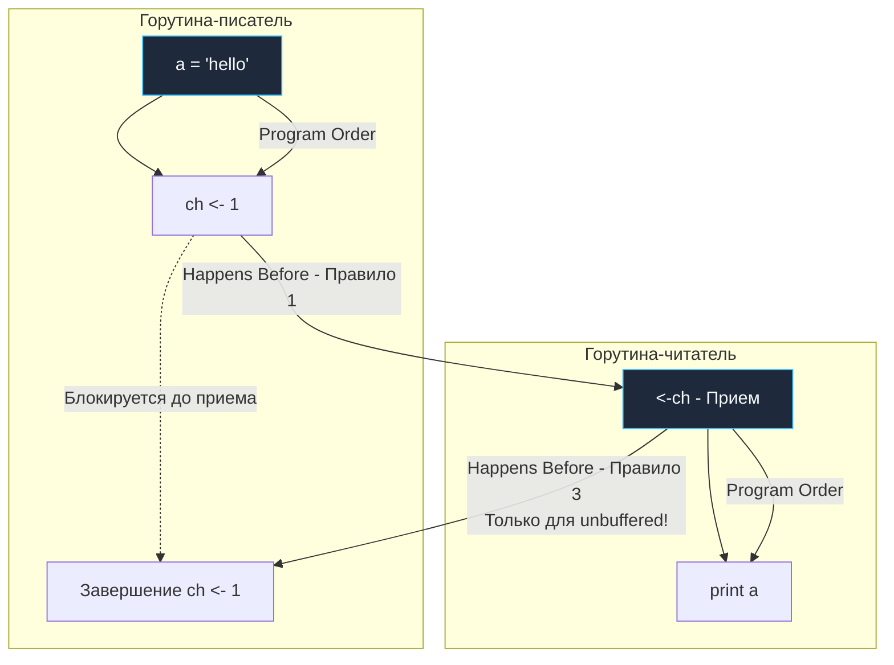

В статьях [[15. Mutex и RWMutex под капотом.md]] и [[16. sync_atomic и атомарные операции в рантайме.md]] мы разбирали, как технически работают примитивы синхронизации: как они блокируют кэш-линии и используют атомарные инструкции процессора. 

Но существует проблема гораздо более глубокого концептуального уровня. Даже если вы не проектируете мудреные lock-free структуры данных, обычное чтение и запись разделяемых переменных в многопоточной среде таят в себе фундаментальную опасность. Эта опасность парадоксальным образом исходит от тех, кто призван делать наши программы быстрыми: от оптимизирующего компилятора и от самого физического процессора.

Чтобы писать предсказуемый и надежный конкурентный код, инженер должен научиться мыслить не в обманчивых категориях «что произошло раньше по настенным часам», а в строгих категориях **Go Memory Model** и математического отношения **Happens Before** (происходит до).

---

## Иллюзия последовательности (Instruction Reordering)

Каждый начинающий программист интуитивно полагает, что машина выполняет команды строго последовательно — строчка за строчкой. Давайте посмотрим на хрестоматийный пример с двумя горутинами:

```go
var a string
var done bool

func setup() {
	a = "hello, world"
	done = true
}

func main() {
	go setup()
	for !done {
		// ждем
	}
	print(a)
}
```

Наивная человеческая логика рассуждает безупречно: если мы вышли из цикла `for`, значит `done == true`. А раз флаг `done` стал `true`, то переменной `a` **уже** присвоено значение `"hello, world"`. Следовательно, встроенная функция `print(a)` гарантированно выведет заветную строку на экран.

На практике этот код содержит грубейший **Data Race**. Программа может напечатать пустую строку, напечатать обрывочный мусор или упасть с паникой рантайма при попытке разыменовать некорректный указатель на срез байт. Почему?

Потому что и компилятор, и процессор имеют полное законное право **переставлять инструкции местами (Reordering)** ради оптимизации производительности:

1. **Компилятор (SSA):** На этапе оптимизации SSA компилятор анализирует тело функции `setup()`. Он видит, что переменные `a` и `done` никак не зависят друг от друга по данным. Ему ничто не мешает сначала выставить флаг `done = true`, а уже затем приступить к копированию дескриптора строки `a` (указатель и длина). В однопоточном контексте результат был бы неотличим, а значит, с точки зрения стандарта компилятор чист.
2. **Процессор (Out-of-Order Execution):** Даже если компилятор заботливо сохранил исходный порядок инструкций в машинном коде, конвейер процессора исполняет команды вне очереди. Запись в `done` (простой байт) может мгновенно осесть в буфере записи (Store Buffer) и просочиться в L1-кэш первого ядра раньше, чем завершится запись двух машинных слов для строки `a`. Второе ядро CPU тут же прочитает флаг `done == true` и пойдет читать `a`, в которой еще лежат нули.

> [!warning] Ловушка / Gotcha. Кэширование переменных в регистре
> В приведенном выше коде кроется еще одна фатальная ловушка. Компилятор может проанализировать цикл `for !done {}` внутри `main` и заключить: *«Внутри этого цикла переменная `done` никак не модифицируется. Зачем мне на каждой итерации тратить десятки тактов на чтение из L1-кэша или оперативной памяти? Я прочитаю `done` один раз перед циклом, положу в регистр процессора и буду проверять только этот регистр»*. 
> В машинном коде цикл вырождается в конструкцию вида `if !done { for {} }`. В результате главная горутина зациклится навечно и никогда не увидит изменений от горутины `setup`.

---

## Что такое Модель Памяти (Memory Model)?

**Модель памяти** (Go Memory Model) — это формальный правовой договор между разработчиком, оптимизирующим компилятором и аппаратной архитектурой компьютера. Она строго определяет, при каких условиях чтение разделяемой переменной в Горутине Б гарантированно увидит значение, записанное в эту переменную Горутиной А.

В основе этого контракта лежит понятие **Happens Before** (Происходит до).
В математике и спецификации языка оно обозначается стрелкой $\to$.
Если событие $e_1 \to e_2$, это означает, что все изменения памяти, произведенные в точке $e_1$, **гарантированно, предсказуемо и в полном объеме видимы** для операции $e_2$.

Принципиально важно помнить: отношение *Happens Before* — это **не про физическое время**.
Событие $e_1$ могло произойти за секунду до $e_2$ по астрономическому времени, но если между ними нет формальной цепочки отношений *Happens Before* (то есть отсутствуют точки явной синхронизации), рантайм Go не дает абсолютно никаких гарантий, что горутина $e_2$ когда-либо увидит результат $e_1$.

---

## Правила Happens Before в Go

Разработчики языка заложили в спецификацию строгие правила синхронизации. Если вы используете официальные примитивы рантайма, компилятор и процессор обязаны гарантировать порядок видимости памяти.

### 1. Инициализация (Init)
* Выполнение функции `init()` в любом пакете *happens before* начала выполнения функции `main.main()`.
* Инициализация импортируемого пакета *happens before* инициализации импортирующего его пакета.

### 2. Создание горутины
* Инструкция `go func()` *happens before* начала выполнения кода самой создаваемой горутины.  
*(Мы всегда гарантированно видим внутри новой горутины те значения переменных, которые были записаны в коде до ключевого слова `go`).*

### 3. Завершение горутины
* Завершение горутины **НЕ** *happens before* чему-либо в системе.  
*(Если горутина записала данные в память и завершилась, нет никаких гарантий, что `main` или другие потоки когда-либо увидят эту запись, пока вы не используете явную синхронизацию через `sync.WaitGroup`, каналы или мьютексы).*

### 4. Каналы (Самое важное!)

Правила для каналов часто выступают лакмусовой бумажкой на собеседованиях, поскольку небуферизованные каналы обладают уникальной особенностью обратной причинности:

* **Правило 1:** Отправка в канал *happens before* завершения приема из этого канала.
* **Правило 2:** Закрытие канала *happens before* получения zero-value читателем.
* **Правило 3 (Небуферизованный канал):** Успешный ПРИЕМ из небуферизованного канала *happens before* завершения ОТПРАВКИ в этот канал.



Благодаря цепочке $\text{WRITE\_A} \to \text{SEND} \to \text{RECV} \to \text{READ\_A}$, мы получаем транзитивную гарантию: запись в переменную `a` гарантированно произойдет и станет видимой до чтения из `a`. Программа работает абсолютно надежно и безопасно.

### 5. Мьютексы (sync.Mutex)
* Для любого мьютекса успешный возврат из `Unlock()` *happens before* следующего успешного возврата из `Lock()`.  
*(Всё, что было изменено под мьютексом до его освобождения, будет на 100% видимо любой горутине, которая захватит этот мьютекс следующей).*

### 6. Атомарные операции (sync/atomic, Go 1.19+)
* Любая атомарная операция записи (`Store`, `Swap`, успешный `CompareAndSwap`, `Add`) над переменной *synchronizes before* (и, следовательно, *happens before*) любой атомарной операции (`Load`, `CompareAndSwap`), наблюдающей эффект этой записи.  
*(Начиная с Go 1.19, операции пакета `sync/atomic` официально специфицированы в модели памяти Go и гарантируют модель строгой последовательной согласованности — Sequentially Consistent / DRF-SC).*

---

## Mechanical Sympathy. Как это работает в железе?

Отношение *Happens Before* — это логическая абстракция уровня языка. Как именно рантайм Go заставляет физический процессор и компилятор соблюдать эти правила?

Для этого используются **Memory Barriers** (Барьеры памяти) или Memory Fences.
Это специальные аппаратные инструкции процессора (например, `MFENCE` в архитектуре x86-64 или барьеры `DMB` / `ISB` в ARM).

Когда вы вызываете `mu.Unlock()` или отправляете данные в канал, рантайм под капотом выполняет атомарную инструкцию, несущую в себе семантику барьера памяти (Acquire-Release или Sequential Consistency).
Что делает барьер памяти:
1. **Директива компилятору:** Он жестко запрещает планировщику инструкций компилятора переносить инструкции чтения/записи через границу барьера (снизу вверх или сверху вниз).
2. **Директива процессору:** Он заставляет ядро CPU приостановить выполнение зависимых инструкций конвейера, принудительно сбросить свой буфер отложенной записи (Store Buffer) в L1-кэш и дождаться подтверждения инвалидации по шине когерентности кэшей MESI от остальных ядер.

Таким образом, барьер памяти буквально выталкивает (flush) все локальные накопленные изменения ядра в единое поле глобальной видимости для всех процессоров системы.

> [!info] Под капотом. Патч Go 1.19 и атомарные операции
> Долгое время в официальной спецификации Go Memory Model не было ни слова про пакет `sync/atomic`. Инженерам приходилось верить создателям языка «на слово», что атомарные операции создают отношение *happens before*.
> В Go 1.19 под руководством Расса Кокса (Russ Cox) спецификацию официально и фундаментально обновили. Теперь там жестко закреплено: атомарные операции в Go обеспечивают строгую модель **Sequential Consistency** (последовательную согласованность). Успешная атомарная запись (`Store`, `Add`, `CAS`) *happens before* любого последующего атомарного чтения (`Load`) этой же переменной.

---

## Как исправить наш плохой код?

Возвращаясь к нашему антипаттерну с переменной `done` из начала статьи, мы можем корректно синхронизировать горутины несколькими идиоматичными способами.

### Способ 1. Каналы (Идиоматичный Go)
Канал выступает естественным барьером синхронизации:
```go
var a string
done := make(chan struct{})

go func() {
	a = "hello, world"
	close(done) // Закрытие happens before возврата из <-done
}()

<-done
print(a)
```

### Способ 2. Atomics (Высокопроизводительный бэкенд)
Если создание канала избыточно и требуется предельная скорость без аллокаций:
```go
var a string
var done atomic.Bool

go func() {
	a = "hello, world"
	done.Store(true) // Выпускает аппаратный барьер памяти
}()

for !done.Load() { // Load гарантирует отсутствие кэширования флага в регистре CPU
	runtime.Gosched() // Уступаем квант времени P, чтобы не сжигать ядро
}
print(a)
```

> [!tip] Собеседование. Double-Checked Locking
> **Вопрос:** Корректна ли популярная в других языках реализация шаблона Singleton (одиночка) через двойную проверку без использования `atomic`?
> ```go
> var instance *Singleton
> var mu sync.Mutex
> 
> func GetInstance() *Singleton {
>     if instance == nil { // Первая проверка БЕЗ мьютекса
>         mu.Lock()
>         defer mu.Unlock()
>         if instance == nil {
>             instance = &Singleton{}
>         }
>     }
>     return instance
> }
> ```
> **Ответ:** Код содержит опаснейший Data Race и может вернуть вызывающему коду **битый (полуинициализированный) объект**. 
> Создание объекта `instance = &Singleton{}` состоит как минимум из двух логических шагов: выделение памяти под поля структуры и запись адреса этого блока в указатель `instance`. Из-за Out-of-Order Execution компилятор или ядро CPU имеют право записать адрес в указатель `instance` *до того*, как тело структуры заполнится данными. 
> В этот момент другое ядро выполняет первую проверку `if instance == nil` (которая не защищена мьютексом, а значит, не имеет барьера памяти). Оно видит ненулевой указатель, пропускает критическую секцию и возвращает указатель на структуру, поля которой еще не инициализированы! 
> Именно поэтому в Go для таких задач следует использовать `sync.Once` (который под капотом использует `atomic.Load` с полноценным барьером памяти для быстрой проверки).

---

## Итог

1. **Reordering:** Компилятор и CPU имеют право переставлять инструкции вашего кода ради производительности, разрушая наивные ожидания о порядке выполнения в конкурентной среде.
2. **Memory Model:** Это строгий контракт. Без использования официальных примитивов синхронизации вы не имеете права делать никаких предположений о порядке чтения и записи памяти.
3. **Happens Before ($\to$):** Математическая гарантия видимости эффектов одной операции для другой. В железе она обеспечивается барьерами памяти (Memory Barriers).
4. Отправка в канал, разблокировка мьютекса и атомарная запись создают непреодолимую стену (memory fence), принуждая процессор синхронизировать кэши со всей системой.

Мы глубоко изучили, как рантайм Go управляет потоками исполнения (Scheduler) и как синхронизирует память между ними (Memory Model). Но до сих пор мы обходили стороной фундаментальный вопрос: а откуда эта память берется физически? 

Как компилятор понимает, какую переменную можно безопасно разместить на сверхбыстром стеке горутины, а какую придется отправить в общую кучу под надзор Сборщика Мусора? 

Ответ на этот вопрос — краеугольный камень оптимизации высоконагруженного Go-бэкенда. Переходим к следующей статье:
[[18. Escape Analysis. Почему переменная ушла в heap.md]]