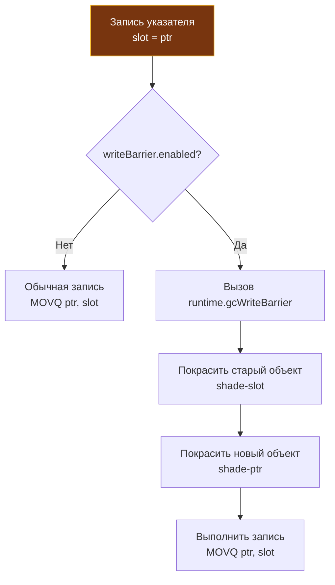

В статье [[26. Concurrent GC и Stop The World.md]] мы смоделировали классическую катастрофу параллельного управления памятью: в тот момент, пока Сборщик мусора (GC) конкурентно обходит граф объектов кучи, прикладной код (Мутатор) успевает внедрить ссылку на Белый (еще не обнаруженный) объект внутрь Черного (уже просканированного) и одновременно удалить все старые связи, ведущие от Серых узлов.

Если рантайм оставит эту мутацию незамеченной, трехцветный алгоритм пометки математически ошибется: живой объект останется Белым, будет объявлен мусором и физически стерт из памяти на фазе Sweep. Результат — повреждение памяти (Memory Corruption) и немедленный крах процесса.

Чтобы навсегда исключить эту угрозу, компилятор Go генерирует специальный защитный код при каждой мутации указателей — **Write Barrier (Барьер записи)**. Понимание его внутренней архитектуры и стоимости в процессорных тактах отделяет рядового прикладного разработчика от системного инженера, глубоко чувствующего механику рантайма.

---

## Терминологическая ловушка: Software vs Hardware

В инженерном сленге одинаковые термины часто обозначают диаметрально противоположные концепции.

> [!warning] Ловушка / Gotcha. Не путайте барьеры!
> В главе [[17. Go Memory Model и happens before.md]] мы подробно обсуждали *Hardware Memory Barrier* (аппаратный барьер памяти) — низкоуровневые инструкции процессора вроде `MFENCE` или `DMB`, которые заставляют физические ядра CPU сбросить буферы записи (Store Buffers) и синхронизировать кэши L1/L2.
> 
> **GC Write Barrier** — это совершенно иная сущность! Это *Software Barrier* (программный барьер). Это легковесный фрагмент машинного кода (проверка условия `if/else` и последующий вызов рантайм-функции), который компилятор автоматически компилирует перед каждой операцией записи указателя в память кучи.

---

## Эволюция барьеров: От Dijkstra к гибриду

Проблема рассинхронизации мутатора и сборщика исследована еще пионерами Computer Science, которые предложили две классические стратегии защиты:

1. **Барьер вставки Дейкстры (Dijkstra Insertion Barrier):**
   * *Математическое правило:* Если вы записываете указатель на объект `C` внутрь Черного объекта `A`, немедленно переведите объект `C` в Серый цвет (добавьте его адрес в рабочую очередь GC).
   * *Преимущество:* Строго гарантирует сильный триколорный инвариант (Черный объект никогда не ссылается на Белый).
   * *Недостаток:* Если ради скорости освободить локальные стеки горутин от необходимости выполнять барьер записи (иначе вызовы функций стали бы невыносимо медленными), то к финалу разметки стеки окажутся «грязными». Рантайму приходилось объявлять долгую паузу Stop-The-World (STW), чтобы заново остановить все потоки и пересканировать стеки всех горутин. Именно так функционировал рантайм Go до версии 1.8, и паузы STW на больших стеках достигали 50–100 миллисекунд.

2. **Барьер удаления Юасы (Yuasa Deletion Barrier):**
   * *Математическое правило:* Если вы удаляете ссылку на Белый объект `C` из Серого объекта `B` (перезаписывая поле другим значением), немедленно окрасьте затираемый старый объект `C` в Серый цвет.
   * *Преимущество:* Гарантирует слабый триколорный инвариант. Даже если Мутатор спрячет объект `C` в глубине Черного узла, сборщик мусора не потеряет его, поскольку момент обрыва старого пути был заблаговременно перехвачен.

### Магия Go 1.8: Hybrid Write Barrier

В релизе Go 1.8 системные инженеры рантайма (Остин Клементс и Рик Хадсон) внедрили **Гибридный барьер записи (Hybrid Write Barrier)**. Он объединил сильные стороны подходов Дейкстры и Юасы.

Когда прикладная программа выполняет операцию косвенной записи вида `*slot = ptr` (запись нового указателя `ptr` по адресу ячейки памяти `slot`), барьер синхронно реализует две защитные меры:
1. Извлекает старый указатель, ранее находившийся в `slot`, и окрашивает этот объект в Серый цвет (семантика Yuasa).
2. Берет новый записываемый указатель `ptr` и также безусловно окрашивает его в Серый цвет (семантика Dijkstra).

Зачем рантайму столь явная алгоритмическая избыточность?  
Эта двойная страховка позволила авторам Go совершить колоссальный эволюционный прорыв: **полностью отказаться от пересканирования стеков горутин на фазе Mark Termination**. 

Стеки горутин сканируются ровно один раз на старте (в фазе Mark Setup) и окрашиваются в Черный цвет. С этого момента любые перемещения указателей между стеком и кучей перехватываются гибридным барьером, что навсегда уронило паузы STW с сотен миллисекунд до стабильных $< 1$ мс.

---

## Mechanical Sympathy: Как это выглядит в ассемблере?

Если барьер записи — это программный код, он неизбежно расходует такты процессора. Посмотрим, во что компилятор Go превращает на первый взгляд элементарную строчку присваивания:
```go
user.Profile = newProfile
```



На этапе SSA-компиляции перед каждой инструкцией записи адреса в кучу (подчеркнем: именно указателя на объект кучи, а не скалярного числа `int` или `float`!) компилятор внедряет ассемблерную проверку глобального битового флага:

```asm
// Псевдо-ассемблер барьера записи (x86-64)
CMP runtime.writeBarrier(SB), 0  // Проверяем флаг включения барьера
JEQ fast_path                    // Если 0 (выключен), прыгаем к обычной записи
CALL runtime.gcWriteBarrier(SB)  // Если 1 (включен), вызываем тяжелую функцию
fast_path:
MOVQ AX, (BX)                    // Сохраняем указатель
```

### Цена Барьера (Write Barrier Overhead)

В состоянии покоя (когда сборщик мусора не активен) флаг выключен (`writeBarrier.enabled = 0`). 
Процессор выполняет единственную инструкцию проверки `CMP`, результат которой благодаря статическому аппаратному предсказателю ветвлений (Branch Predictor) идеально предсказывается на конвейере CPU как `false` и практически стоит **0 тактов**.

Но когда наступает фаза `Concurrent Mark` (Конкурентная пометка), рантайм на ультракороткой паузе STW выставляет `writeBarrier.enabled = 1`. 
С этой наносекунды **каждая** перезапись любого указателя в куче проваливается по ветке `JEQ` в медленный путь (`SLOW_PATH`).

Функция `runtime.gcWriteBarrier` филигранно написана на чистом ассемблере, но ее аппаратная стоимость ощутима:
1. Она сохраняет все задействованные регистры процессора;
2. Помещает адреса объектов (старого и нового) в локальный кольцевой буфер процессора `P` (`wbBuf` на 512 слотов);
3. При заполнении буфера выполняет пакетный сброс (`wbBufFlush`) в рабочие очереди `gcWork` сборщика мусора.

В результате в моменты активной фазы разметки прикладной код, выполняющий интенсивные мутации графов и структур в куче, замедляется на 10–30%. Это прямой и честный «налог на конкурентность», который мы платим за низкие сетевые задержки.

> [!tip] Собеседование. Барьеры и Стек
> **Вопрос:** Срабатывает ли Write Barrier, когда горутина перезаписывает локальную переменную-указатель, расположенную на собственном стеке?
> 
> **Ответ:** **Категорически нет.**  
> Модификации локальных переменных стека происходят сотни миллионов раз в секунду. Если бы компилятор вставлял проверку барьера записи на каждую стековую операцию, производительность Go упала бы ниже интерпретируемых скриптовых языков.
> 
> Стеки горутин свободны от барьеров записи. Именно поэтому компилятор Go так ревностно изолирует стек от кучи: барьер записи применяется **исключительно при записи в память Кучи (Heap)**.

---

## Связь с Escape Analysis

Здесь раскрывается безупречная гармония внутренней архитектуры Go:
1. В главе [[18. Escape Analysis. Почему переменная ушла в heap.md]] мы увидели, как компилятор пытается удержать переменные на стеке.
2. На стеке отсутствуют барьеры записи (Write Barrier Overhead = 0).
3. Чем меньше переменных «убегает» в кучу, тем реже в критических горячих циклах (Hot Paths) вызывается тяжелая функция `runtime.gcWriteBarrier` во время работы GC.
4. Оптимизируя аллокации, мы не просто экономим байты оперативной памяти и разгружаем сборщик — мы **напрямую ускоряем машинный код бизнес-логики** в моменты конкурентной сборки мусора!

---

## Итог

1. **Write Barrier (Барьер записи)** — это компиляторный программный перехватчик, исполняемый перед каждой мутацией указателя в куче.
2. Он гарантирует целостность трехцветного инварианта, не позволяя Мутатору спрятать Белый объект внутри Черного в обход очередей сборщика.
3. Go применяет **Гибридный барьер (Dijkstra + Yuasa)**: он окрашивает в Серый цвет как вытесняемый старый указатель, так и вновь записываемый адрес.
4. Гибридный барьер позволил рантайму полностью исключить повторное сканирование стеков горутин, зафиксировав паузы STW на отметках $< 1$ мс.
5. На стеках горутин барьер записи не применяется, что делает использование локальной памяти стека колоссальным преимуществом для скорости.

Мы детально исследовали устройство Сборщика Мусора: от структуры триколорных графов до битовых масок `mspan` и ассемблерных вставок барьеров записи. Мы знаем физику его работы до последнего такта.

Но что предпринять, если в реальном продакшене GC начинает работать чересчур агрессивно, сжигая процессорные мощности? Или наоборот — сборщик запаздывает, и сервис погибает под натиском OOM Killer? 

В отличие от других экосистем с сотнями эзотерических флагов тюнинга, Go предлагает лаконичный и выверенный набор инструментов управления. В следующей главе мы разберем боевой тюнинг сборщика мусора:
[[28. Тюнинг GC. GOGC, GOMEMLIMIT и memory ballast.md]]