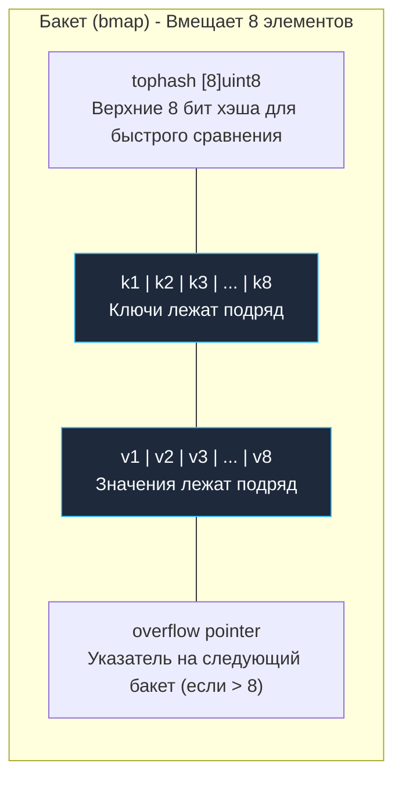
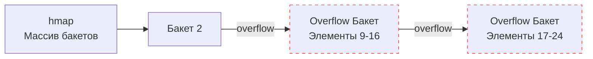

В прошлой статье ([[30. Рост slice. append, realloc и copy.md]]) мы глубоко исследовали линейную память. Срезы идеальны, когда ключом выступает последовательный целочисленный индекс, а размер коллекции увеличивается предсказуемо. 

Однако современный бэкенд немыслим без ассоциативных массивов — словарей, где ключом может служить произвольная строка, число, составная структура или любой иной сравниваемый тип данных. В языке Go эта фундаментальная структура встроена на уровне синтаксиса и называется `map`.

Как и каналы, мапа настолько органично вплетена в язык, что компилятор надежно скрывает от прикладного программиста ее внутреннюю сложность. Но за эту легкость абстракции приходится платить: небрежное использование мапы приводит к резким всплескам нагрузки на CPU (из-за непрерывного хэширования), фатальным сбоям процессов (из-за гонок при конкурентной записи) и замаскированным утечкам оперативной памяти (Memory Leaks).

Пришло время открыть исходный код `src/runtime/map.go` и досконально разобраться, как рантайм Go балансирует между математикой хэш-функций и физической реальностью кэш-линий процессора.

> [!note] Архитектурная эволюция: классический дизайн (Go 1.0–1.23) vs Swiss Tables (Go 1.24+)
> Начиная с версии **Go 1.24**, стандартная реализация встроенной `map` была фундаментально модернизирована: рантайм перешел на архитектуру **Swiss Tables** (пакет `internal/runtime/maps`, развивающий идеи Google Abseil). Swiss Tables используют контрольные байты (1 бит статуса + 7 бит H2-хэша), группы по 8 слотов, плоские массивы групп и быстрые параллельные битовые/SIMD инструкции вместо связных списков бакетов, снижая оверхед по памяти и ускоряя поиск.  
> Однако классическая архитектура бакетов (`hmap`, `bmap`, `overflow`), подробно разобранная ниже, являлась фундаментом Go на протяжении более 12 лет (Go 1.0–1.23), сохраняется в качестве режима сборки с откатом (`GOEXPERIMENT=noswissmap`) и до сих пор служит базовой ментальной моделью и стандартом вопросов на технических собеседованиях.

---

## 1. Структура hmap (Заголовок мапы)

Когда в коде выполняется выражение `m := make(map[string]int)`, рантайм выделяет в куче управляющий дескриптор — структуру `hmap` (Header of map). На 64-битной архитектуре этот заголовок занимает ровно 48 байт и содержит исчерпывающие метаданные хэш-таблицы:

```go
type hmap struct {
    count     int    // Количество элементов в мапе (len)
    flags     uint8  // Флаги состояния (например, идет ли сейчас запись)
    B         uint8  // Логарифм от количества бакетов (buckets = 2^B)
    noverflow uint16 // Примерное число переполненных бакетов
    hash0     uint32 // Seed для хэш-функции (рандомизация)
    buckets    unsafe.Pointer // Указатель на массив бакетов
    oldbuckets unsafe.Pointer // Указатель на старый массив бакетов (при эвакуации)
    nevacuate  uintptr        // Прогресс эвакуации (индекс следующего бакета)
}
```

Разберем назначение ключевых полей:
* **`count`:** Счетчик числа элементов. Благодаря ему вызов встроенной функции `len(m)` всегда выполняется за константное время $O(1)$ без необходимости перебора таблицы.
* **`B`:** Логарифмический масштаб хэш-таблицы по основанию 2. Число основных бакетов всегда строго равно степени двойки: $2^B$. Если $B=3$, это означает, что таблица разбита ровно на $2^3 = 8$ бакетов.
* **`hash0`:** Случайное затравочное число (seed), генерируемое при инициализации каждого нового экземпляра мапы. Это важнейший компонент информационной безопасности: защита от **Hash Collision DOS-атак**. Без рандомизации seed злоумышленник мог бы прислать на сервер набор специально сконструированных HTTP-заголовков, дающих одинаковые хэши. Это сложило бы все миллионы ключей в один-единственный бакет, деградировав быстрый поиск за $O(1)$ в катастрофический линейный перебор $O(N)$, способный полностью парализовать сервис.

---

## 2. Анатомия бакета (bmap)

Мапа в Go реализует классический алгоритм хэш-таблицы с разрешением коллизий методом цепочек (Separate Chaining). 

В традиционных реализациях (например, в классической `std::unordered_map` из C++) под каждый добавленный элемент в куче выделяется отдельный связный узел. Для современного процессора это худший сценарий: каждый переход по указателю в цепочке провоцирует тяжелый Pointer Chasing и серии Cache Misses (см. [[20. Stack vs Heap в Go.md]]).

Инженеры Go проявили глубокое Mechanical Sympathy к аппаратной архитектуре: вместо цепочки единичных элементов они сгруппировали данные в плотные **Бакеты (Buckets)**. Один бакет (в исходниках описываемый низкоуровневой структурой `bmap`) вмещает ровно **8 пар ключ-значение**.



### Mechanical Sympathy: Почему ключи и значения разделены?

Внимательный взгляд на устройство бакета сразу заметит архитектурную особенность: данные в памяти располагаются не чередующимися парами `K-V, K-V, K-V`, а строго секциями: сначала массив всех 8 ключей `K, K, K...`, а затем массив всех 8 значений `V, V, V...`.

Зачем потребовалось такое разделение?  
Причина кроется в правилах **выравнивания памяти (Memory Alignment)**!

Представьте типичную мапу вида `map[int64]int8`, где ключ занимает 8 байт, а значение — всего 1 байт.  
Если бы данные хранились парами: `[8][1] - padding 7 байт - [8][1] - padding 7 байт...` мы будем терять почти половину памяти бакета просто на пустоту (padding).

Сгруппировав их как `[8][8][8]...[1][1][1]`, рантайм Go полностью устраняет межэлементный паддинг, сводя внутреннюю фрагментацию памяти к абсолютному нулю.

---

## 3. Чтение из мапы: v := m["key"]

Проследим по шагам, какие низкоуровневые действия совершает процессор при банальном обращении по ключу:

1. **Хэширование:** Ключ `"key"` передается в аппаратную хэш-функцию рантайма (AES-NI на x86-64 или CRC32/SHA на ARM64), подмешивая случайный `hash0`. На выходе формируется 64-битное целое число (хэш).
2. **Выбор бакета:** Рантайм берет младшие (нижние) `B` бит полученного хэша. Если $B=3$, мы анализируем 3 младших бита (например, биты `010`, что соответствует числу 2). Процессор по базовому адресу `buckets` мгновенно переходит к бакету номер 2.
3. **Быстрый поиск (tophash):** Внутри бакета необходимо обнаружить конкретный слот. Но сравнивать тяжелые строки байт за байтом — дорого для конвейера CPU. Поэтому рантайм берет **старшие (верхние) 8 бит** того же 64-битного хэша и побайтово сопоставляет их с массивом `tophash [8]uint8`. Массив из 8 байт целиком помещается в один машинный регистр процессора, и проверка всех 8 слотов бакета совершается за пару тактов!
4. **Глубокое сравнение:** Если в массиве `tophash` обнаружено точное совпадение (например, в 3-й ячейке), рантайм обращается к 3-му ключу бакета и проводит окончательное честное сравнение (сравнивает саму строку `"key"`). 
   * Если ключи идентичны — возвращается указатель на 3-е значение.
   * Если случилась коллизия хэша (tophash совпал, но сами строки различаются) — поиск продолжается по следующим ячейкам бакета.

---

## 4. Разрешение коллизий и Overflow

Что происходит, если в бакет номер 2 захэшировалось более 8 элементов?

В этот момент рантайм выделяет в куче дополнительный **Overflow Bucket** (Переполненный бакет) — идентичную структуру `bmap` на 8 слотов, и связывает ее с основным бакетом в односвязный список через указатель `overflow`.

Если при чтении ключ не найден в первичном бакете, процессор переходит по ссылке `overflow` в следующий бакет цепочки и повторяет проверку `tophash`.



> [!warning] Ловушка / Gotcha. Деградация производительности
> Чем длиннее выстраивается цепочка `overflow` бакетов, тем сильнее деградирует скорость выборки: константный доступ $O(1)$ стремится к медленному линейному перебору $O(N)$ с постоянными аппаратными промахами кэша. Чтобы предотвратить деградацию, рантайм непрерывно отслеживает **Load Factor (Коэффициент заполнения)**.

---

## 5. Эвакуация (Рост мапы)

Рантайм Go принимает решение о расширении таблицы при наступлении одного из двух условий:
1. Средняя заполненность бакетов превысила порог **6.5** элементов на бакет (Load Factor > 6.5).
2. Накопилось слишком много `overflow` бакетов (ситуация, когда элементов суммарно немного, но из-за локальных коллизий они скучковались в длинные хвосты переполнения).

Процедура расширения мапы называется **Эвакуацией (Evacuation)**:
1. Выделяется новый массив бакетов, размер которого **ровно в 2 раза превышает** старый (показатель `B` увеличивается на 1).
2. Поле `oldbuckets` перенаправляется на старый массив.
3. Поле `buckets` инициализируется адресом новой арены бакетов.

### Инкрементальная эвакуация

Если бы рантайм попытался одномоментно перенести миллион элементов из старых бакетов в новые, сервис замер бы на десятки миллисекунд, спровоцировав тяжелый эффект Stop-The-World.

Go решает эту проблему виртуозно: эвакуация выполняется **инкрементально**.

Работа по миграции данных равномерно размазывается по обычным прикладным операциям записи и удаления. Каждый раз, когда горутина выполняет вставку `m["key"] = 1` или удаление `delete(m, "key")`, рантайм Go попутно берет **1 или 2 старых бакета** и переносит их содержимое в новые целевые бакеты, сдвигая системный маркер `nevacuate`.

Пока эвакуация активна, операции чтения прозрачно проверяют `oldbuckets`, если запрошенный бакет еще не был эвакуирован. Как только последний бакет мигрирует, ссылка `oldbuckets` зануляется, и старая память утилизируется сборщиком мусора.

---

## 6. Механика удаления и утечки памяти (Memory Leaks)

Фундаментальный факт, незнание которого ломает память на продакшене:  
Удаление элементов через встроенную функцию `delete(m, "key")` **никогда не уменьшает физический размер мапы в оперативной памяти**.

При вызове `delete` рантайм лишь находит соответствующий слот и маркирует его ячейку в `tophash` специальным системным значением `emptyOne`. Однако сам блок памяти бакетов и все цепочки `overflow` остаются намертво закрепленными за структурой `hmap`.

Это классический источник скрытых утечек памяти в долгоживущих сервисах:
```go
m := make(map[int]int)
for i := 0; i < 1_000_000; i++ { m[i] = i } // Мапа раздулась до десятков МБ
for i := 0; i < 1_000_000; i++ { delete(m, i) } 

// В мапе 0 элементов: len(m) == 0.
// Но физическая память НЕ ОСВОБОДИЛАСЬ!
```

Если вы используете обычную мапу в качестве самодельного кэша, который циклически разрастается до сотен мегабайт, а затем полностью очищается, процесс будет монотонно удерживать пиковый объем памяти в RSS. Сборщик Мусора бессилен, поскольку заголовок `hmap` продолжает удерживать ссылки на гигантский массив бакетов.

**Инженерное решение:** Чтобы гарантированно вернуть память операционной системе, необходимо пересоздать мапу заново, отдав старый дескриптор сборщику мусора:
```go
m = make(map[int]int) // Старая мапа теряет ссылку и утилизируется GC
```

> [!info] Под капотом. clear(m)
> Начиная с Go 1.21 в стандартный синтаксис добавлена встроенная функция `clear(m)`. Важно понимать ее физику: она **не уменьшает** `cap` мапы и не освобождает выделенные под бакеты спаны! Она лишь молниеносно очищает все значения `tophash` и зануляет ссылки на ключи и значения, позволяя GC собрать *сами объекты*, в то время как "скелет" мапы останется в памяти.

---

## 7. Параллелизм: fatal error: concurrent map read and map write

Если две горутины одновременно обратятся к одной мапе, причем хотя бы одна из них выполняет запись, ваше приложение **немедленно завершится аварийным крахом**:
```text
fatal error: concurrent map read and map write
```
Это не обычная `panic`, которую можно перехватить через `recover()`. Это системная фатальная ошибка рантайма, безусловно убивающая процесс (аналогично прямому системному вызову `os.Exit`).

Такая бескомпромиссная жесткость рантайма оправдана. Вспомним механизм инкрементальной эвакуации: если одна горутина в данный миг мигрирует элементы бакета, а параллельная горутина попытается записать в этот же бакет данные, битовые маски и указатели `overflow` будут необратимо повреждены.

Перед началом любой операции записи рантайм выставляет защитный бит `hashWriting` в поле `hmap.flags`. Если читатель или другой писатель обнаруживает этот бит установленным — процесс немедленно падает.

**Архитектурные решения:**
1. При редких записях и преобладающих чтениях: защитить мапу через мьютекс `sync.RWMutex` (см. [[15. Mutex и RWMutex под капотом.md]]).
2. В высококонкурентных сценариях с частыми параллельными записями по независимым ключам: использовать специализированную структуру `sync.Map` (см. [[33.1. sync_map под капотом. Read и dirty словари.md]]).

---

## Итог

1. **`hmap`:** Заголовок мапы (48 байт) управляет счетчиком элементов, битовыми флагами, логарифмом размера `B` и массивами бакетов.
2. **Бакеты (`bmap`):** Для максимальной локальности в кэше L1 элементы упакованы квантами по 8 штук. Ключи и значения разделены на уровне памяти для исключения байтов выравнивания (padding).
3. **Двухуровневый поиск:** Байт `tophash` позволяет за считанные такты проверить все 8 слотов бакета в регистре процессора, избегая дорогостоящего сравнения самих ключей до фиксации совпадения хэша.
4. **Инкрементальная эвакуация:** При превышении Load Factor > 6.5 мапа расширяется в 2 раза, перенося данные порциями по 1–2 бакета, «крадя» процессорное время у операций `insert` и `delete`, исключая паузы STW.
5. **Memory Leak:** Функция `delete` не освобождает физическую память бакетов. Мапа в Go способна расти, но никогда не сжимается автоматически.

Мы разобрали базовую архитектуру `hmap` и узнали, что элементы хранятся блоками по 8 штук (`bmap`) для максимальной скорости CPU кэшей. Мы также вскользь упомянули, что при переполнении мапа «эвакуируется». Но дьявол кроется в деталях: как именно рантайм переносит миллионы элементов, не блокируя всё приложение на сотни миллисекунд? И как побитовая математика позволяет перераспределять ключи без пересчета хэшей?

В следующей статье мы опустимся на уровень битовых масок и исследуем алгоритм эвакуации:
[[32. Рост и эвакуация map.md]]