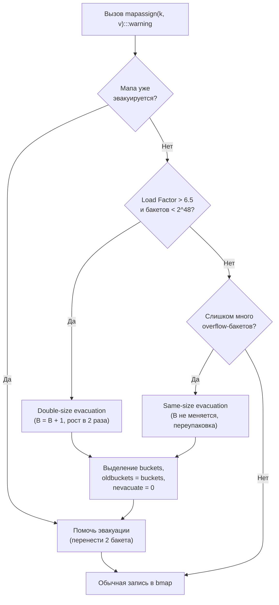
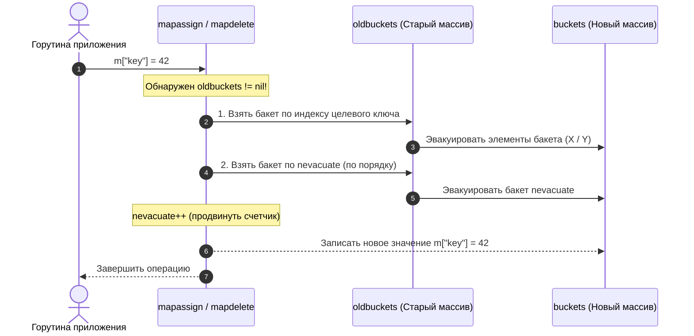
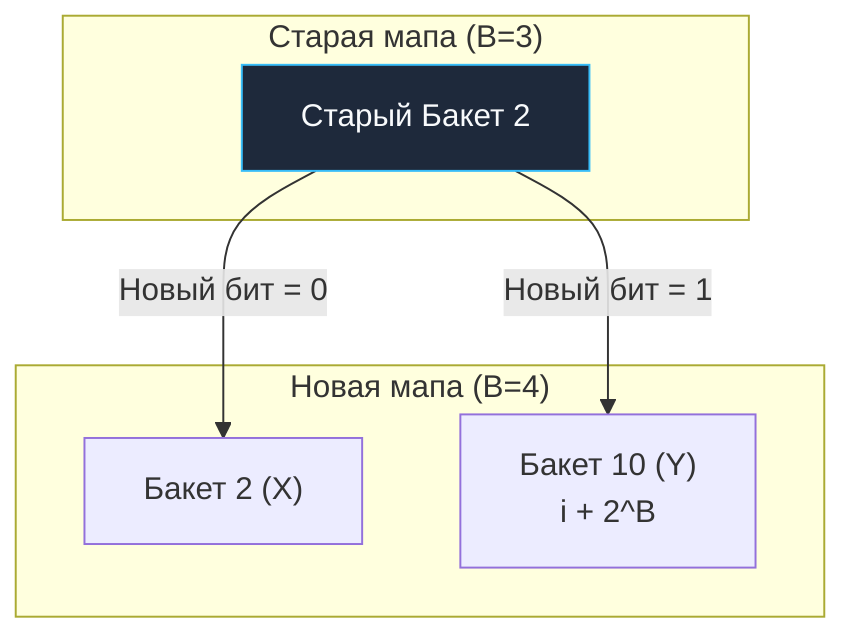

В прошлой статье ([[31. Внутреннее устройство map. hmap, bucket, overflow]]) мы выяснили, что мапа в Go — это массив бакетов (`bmap`), каждый из которых вмещает ровно 8 элементов. Мы заглянули в физическую память `hmap`, разобрались с разделением хэша на младшие биты (индекс бакета) и старшие 8 бит (`tophash`), а также увидели, как локальность данных спасает процессорные конвейеры от простоев.

Пока мы знаем точное количество элементов заранее и выделяем мапу через `make(map[int]int, 1000)`, рантайм сразу аллоцирует нужное количество бакетов. Но что происходит, когда мы постоянно добавляем новые ключи в пустую мапу `m := make(map[string]int)`? 

Рано или поздно 8 слотов в бакетах переполняются, цепочки `overflow` удлиняются, и скорость доступа за константное время $O(1)$ начинает неумолимо деградировать до линейного перебора $O(N)$. 

Словари в Go растут. Этот процесс называется **Эвакуацией (Evacuation)**. Это одна из самых изящных и сложных инженерных операций в рантайме, потому что разработчики языка поставили жесткое условие: **рост мапы не должен вызывать пауз Stop-The-World**. В классических языках (например, в старых версиях Java или Python) расширение хэш-таблицы приводило к единовременному стоп-фактору: поток останавливался, выделял гигантский массив и судорожно перехешировал миллионы ключей, вызывая катастрофические спайки хвостовой задержки (Tail Latency P99). В высоконагруженных сетевых сервисах на Go такой подход был абсолютно неприемлем.

> [!note] Контекст версий: Инкрементальная эвакуация vs Swiss Tables
> Описанный ниже механизм инкрементальной эвакуации (`oldbuckets`, разделение на X/Y бакеты и порог Load Factor 6.5) относится к классической модели Go 1.0–1.23 (и режиму `GOEXPERIMENT=noswissmap`). В архитектуре Swiss Tables (Go 1.24+) открытая адресация внутри групп слотов меняет организацию роста: хэш-таблица использует структуру подтаблиц с каталогом директорий, а эффективный порог заполнения повышен до 7/8 (~87.5%). Тем не менее понимание классической инкрементальной эвакуации без пауз STW является стандартом индустрии и глубоких технических собеседований.

---

## 1. Триггеры роста: Когда мапе пора расти?

Рантайм Go принимает решение о расширении мапы в двух случаях. Обе проверки выполняются при вызове операции добавления (`mapassign`). Если мапа уже находится в процессе предыдущей эвакуации (поле `oldbuckets != nil`), новый рост инициирован не будет, пока не завершится текущий.



### Триггер 1: Load Factor > 6.5

Load Factor (Коэффициент заполнения) вычисляется как отношение общего числа активных элементов к количеству основных бакетов:
$$\text{Load Factor} = \frac{\text{Количество элементов}}{\text{Количество бакетов}} = \frac{count}{2^B}$$

В Go критический порог равен **6.5**. Почему именно 6.5, а не 8.0 (полная вместимость бакета) и не 0.75 (как в Java `HashMap`)? 

Разработчики рантайма провели масштабные бенчмарки и выяснили, что при значении 6.5 достигается идеальный баланс с точки зрения Mechanical Sympathy:
* **Экономия памяти (RAM):** мапа используется плотно (в среднем 6.5 слотов из 8 заняты, то есть более 81% полезного объема). Пустых слотов минимум.
* **Экономия тактов процессора (CPU):** цепочки `overflow` бакетов еще не успевают вырасти настолько, чтобы убить скорость поиска за $O(1)$ и вызвать кэш-промахи в L1d. Вероятность коллизии остается низкой, а перебор 8 байт `tophash` укладывается в один такт процессора.

Если Load Factor превысил 6.5 (и количество бакетов еще не достигло теоретического предела $2^{48}$), рантайм инициирует **рост в 2 раза (Double-size evacuation)**. Параметр $B$ увеличивается на 1 ($B = B + 1$), а количество бакетов удваивается: было $2^B$, стало $2^{B+1}$.

### Триггер 2: Слишком много Overflow бакетов

Представьте типичную ситуацию в долговременном сервисе: вы добавили 10 000 элементов, а затем удалили 9 900 из них через `delete()`. 

Load Factor в такой мапе будет крошечным: всего 100 элементов на сотни бакетов. Казалось бы, мапа полупустая! Но из-за постоянных добавлений и последующих удалений в бакетах образовались «дыры» (слоты со статусом `emptyOne`), а оставшиеся ключи оказались «размазаны» по длиннющим связным спискам `overflow` бакетов. 

Поиск в такой мапе деградирует до $O(N)$ — процессор вынужден следовать по цепочкам указателей через всю память, собирая Cache Miss на каждом звене.

Чтобы вылечить это «загрязнение», рантайм следит за количеством переполненных бакетов. Порог срабатывания формулируется так:
* Если $B \le 15$, число `noverflow` превышает общее число бакетов $2^B$.
* Если $B > 15$, число `noverflow` превышает константу $2^{15} = 32768$.

Если переполненных бакетов становится слишком много при нормальном Load Factor, рантайм инициирует **рост без увеличения размера (Same-size evacuation)**. Он просто создает новый массив бакетов *такого же размера* ($B$ остается прежним) и переносит туда данные. В процессе эвакуации рантайм сжимает разрозненные элементы, идеально и плотно упаковывая их в основные бакеты, попутно удаляя мусорные пустые бакеты `overflow` и отдавая их сборщику мусора.

---

## 2. Механика Инкрементальной Эвакуации

Мы помним, что в структуре `hmap` есть два важных указателя: `buckets` (активный массив) и `oldbuckets` (старый массив).

Когда срабатывает один из триггеров роста, рантайм делает следующее:
1. Выделяет в памяти новый массив бакетов (удвоенного размера или такого же).
2. Переносит текущий указатель `buckets` в `oldbuckets`.
3. Записывает указатель на новый массив в `buckets`.
4. Сбрасывает счетчик прогресса эвакуации: устанавливает флаг `nevacuate = 0`.
5. Инициализирует битовую маску эвакуации в `flags` (флаг `sameSizeGrow`, если размер не менялся).

**С этого момента мапа находится в состоянии эвакуации.**

Рантайм *не* бежит переносить все элементы мгновенно. Вместо этого он «облагает налогом» каждую вашу операцию записи или удаления.

Каждый раз, когда ваша горутина делает `m["new_key"] = 42` (вызов `mapassign`) или `delete(m, "key")` (вызов `mapdelete`), рантайм заставляет эту горутину выполнить полезную работу для мапы:
она берет **ровно 2 бакета** из `oldbuckets` и переносит их содержимое в `buckets`. 



Один бакет выбирается адресно — тот, в который должен был бы попасть текущий модифицируемый ключ (если он еще не эвакуирован). Второй бакет берется строго последовательно — по указателю `nevacuate`. 

Затем `nevacuate` увеличивается. Когда `nevacuate` доходит до конца старого массива, эвакуация считается завершенной: указатель `oldbuckets` зануляется (`oldbuckets = nil`), а старый массив бакетов вместе со всеми связными цепочками `overflow` становится доступен сборщику мусора.

Таким образом, стоимость переноса миллионов элементов «размазывается» во времени и не блокирует приложение — амортизированная сложность вставки остается равной честному $O(1)$.

---

## 3. Математическая магия: X и Y бакеты

Это самая гениальная часть алгоритма, за которую Go так любят системные инженеры.

Допустим, у нас была мапа, где параметр $B = 3$ ($2^3 = 8$ бакетов). Мы выросли в два раза, теперь $B = 4$ ($2^4 = 16$ бакетов).

В классических хэш-таблицах при увеличении размера нужно заново вычислять хэш для *каждого* элемента, чтобы понять, в какой бакет его положить. Расчет хэша для строк — дорогая операция: нужно прогнать через алгоритм хэширования десятки или сотни байт строки. Для миллиона ключей это миллиарды циклов CPU!

В Go **хэши не пересчитываются вообще**.

### Как это работает?

Чтобы найти номер бакета, рантайм берет младшие $B$ бит от 64-битного хэша ключа.

В старой мапе ($B=3$) маска была `0111` (двоичная, то есть `(1 << 3) - 1 = 7`).  
Допустим, у нас есть два ключа, лежащих в бакете номер 2 (`010`):
* Ключ 1: хэш заканчивается на `...0_010`
* Ключ 2: хэш заканчивается на `...1_010`

Оба они попали в бакет `2`, потому что последние 3 бита одинаковые.

В новой мапе ($B=4$) маска стала `1111` (мы смотрим на 4 бита, `(1 << 4) - 1 = 15`).  
Теперь, чтобы понять, куда перенести ключи из старого бакета `2`, рантайму нужно просто посмотреть на **один дополнительный бит** (4-й с конца)!

```
Старый хэш: ... [старшие биты] [4-й бит] [ 0 1 0 ]
                                   │
                     ┌─────────────┴─────────────┐
                     ▼                           ▼
                 Бит = 0                     Бит = 1
                    │                           │
          Новый индекс: 0010          Новый индекс: 1010
             (Бакет 2, X)             (Бакет 10 = 2 + 8, Y)
```

* Если этот бит `0` (как у Ключа 1 `0_010`), элемент идет в бакет `0010` (то есть остается в бакете номер **2**). Это называется **X-бакет**.
* Если этот бит `1` (как у Ключа 2 `1_010`), элемент идет в бакет `1010` (десятичное $2 + 2^3 = 2 + 8 = 10$). Он идет в бакет номер **10**. Это называется **Y-бакет**.



Рантайм берет один переполненный бакет из старой мапы и элегантно, за счет простейшей побитовой операции `AND`, «расщепляет» его на два бакета (X и Y) в новой мапе. Это невероятно быстро: одна ассемблерная инструкция `TEST` или `AND`, и процессор моментально знает, куда положить элемент.

Если же происходит рост без изменения размера (**Same-size evacuation**), все элементы старого бакета $i$ гарантированно отправляются ровно в бакет $i$ нового массива (только в X-бакет), просто плотно упаковываясь без дыр.

---

## 4. Чтение во время эвакуации

Мы выяснили, что эвакуация идет постепенно. Значит, в один момент времени часть данных лежит в новом массиве `buckets`, а часть — всё ещё ждет своей очереди в `oldbuckets`.

Что происходит, если горутина делает чтение `val := m["key"]` в этот момент?

1. Рантайм вычисляет, в какой бакет должен попасть ключ в **новой** мапе (допустим, в бакет 10).
2. Но погодите! А был ли этот бакет уже эвакуирован из старой мапы?
3. Рантайм вычисляет индекс бакета в **старой** мапе (бакет 2). Для этого он накладывает старую битовую маску: `hash & ((1 << (B - 1)) - 1)`.
4. Он смотрит на `nevacuate`. Если индекс старого бакета меньше `nevacuate`, значит этот бакет уже перенесен. Данные нужно искать в новой мапе.
5. Если индекс старого бакета $\ge nevacuate$, значит он еще не перенесен! 
6. В этом случае рантайм идет в `oldbuckets`, находит там старый бакет 2 и ищет данные в нем.

> [!info] Под капотом. Флаги эвакуации в tophash
> Как рантайм помечает, что бакет уже перенесен? В прошлой статье мы упоминали массив `tophash` внутри бакета. Когда бакет эвакуирован, рантайм не просто оставляет его пустым. Он записывает в `tophash` специальные статусы-заглушки: `evacuatedX` (ячейка уехала в X-бакет), `evacuatedY` (ячейка уехала в Y-бакет) или `evacuatedEmpty` (ячейка была пустой). Если читающая горутина натыкается на этот флаг в `oldbuckets`, она понимает, что данные нужно искать в новом месте.

```go
// Константы статусов эвакуации в рантайме Go (src/runtime/map.go)
const (
    emptyRest      = 0 // Ячейка пуста, и все последующие ячейки в бакете пусты
    emptyOne       = 1 // Ячейка пуста (например, после delete)
    evacuatedX     = 2 // Элемент перенесен в первую половину новой таблицы (X)
    evacuatedY     = 3 // Элемент перенесен во вторую половину новой таблицы (Y)
    evacuatedEmpty = 4 // Ячейка была пуста при начале эвакуации
    minTopHash     = 5 // Минимальное значение реального tophash обычного ключа
)
```

Благодаря тому, что все статусы эвакуации строго меньше `minTopHash` ($< 5$), рантайм никогда не спутает маркер эвакуации с реальным хэшем существующего ключа!

---

## 5. Итерация (range map) во время эвакуации

Итерация по мапе через цикл `for k, v := range m` — это сама по себе боль (порядок ключей намеренно рандомизируется при каждом запуске цикла). Но итерация во время эвакуации — это сущий кошмар для разработчиков рантайма.

Если итератор будет просто бежать по `buckets`, он пропустит ключи, которые еще лежат в `oldbuckets`.  
Если он побежит по `oldbuckets`, он может выдать один и тот же ключ дважды (ведь ключи «расщепляются» на X и Y, и итератор в новой мапе может наткнуться на уже пройденный X-ключ, когда дойдет до Y-бакета).

Алгоритм итератора (в функции `mapiterinit` и `mapiternext`) настолько сложен, что содержит сотни строк кода только для того, чтобы гарантировать, что каждый ключ будет возвращен ровно один раз, игнорируя уже эвакуированные куски старых бакетов и обходя X и Y развилки. 

Если текущий бакет в новой мапе еще не эвакуирован из старой, итератор спускается в соответствующий старый бакет в `oldbuckets`, но выбирает из него только те элементы, чей дополнительный бит хэша соответствует текущей половине (X или Y)!

Это одна из причин, почему `range` по мапе считается **очень медленной** операцией в критических путях (Hot Paths). Избегайте итераций по большим мапам в высоконагруженном коде.

> [!interview] Вопрос с собеседования: Что происходит с памятью при удалении всех элементов из map?
> **Вопрос:** Если мы создадим `m := make(map[int]int)`, добавим в нее 10 000 000 чисел, а затем вызовем `for k := range m { delete(m, k) }`, сколько памяти освободится и вернется ли она операционной системе?
> 
> **Ответ:** **Ни байта памяти не вернется ОС!** 
> Вызов `delete()` лишь очищает ячейки в бакетах и ставит маркер `emptyOne`. Количество бакетов $2^B$ остается прежним, массив `buckets` и все выделенные `overflow` бакеты продолжают удерживаться в куче (heap). 
> Единственный способ вернуть эту память ОС или рантайму — либо присвоить `m = nil` (или `m = make(...)`), позволив сборщику мусора (GC) утилизировать старую структуру целиком, либо не хранить миллионы элементов в динамической мапе без явного пула или пересоздания.

---

## Итог

1. **Триггеры:** Мапа растет в 2 раза при Load Factor > 6.5, или переупаковывается в тот же размер при аномально длинных цепочках Overflow.
2. **Инкрементальность:** Эвакуация не вызывает пауз Stop-The-World. Данные переносятся порциями (по 2 бакета) за счет горутин, выполняющих `insert` или `delete`.
3. **Бит-магия X/Y:** При росте в 2 раза хэши ключей не пересчитываются. Рантайм просто смотрит на один следующий старший бит хэша, чтобы раскидать ключи старого бакета на два новых (X и Y).
4. **Чтение и итерация** во время эвакуации стоят дороже, так как рантайму приходится проверять два массива бакетов и сверяться со статусами `evacuatedX/Y`.
5. **Память:** Удаление элементов через `delete` не освобождает выделенные под бакеты страницы памяти.

Мы теперь знаем о стандартной мапе почти всё: от структуры памяти до побитовых сдвигов при её инкрементальной эвакуации. Но остался один нюанс, с которым сталкивался абсолютно каждый Go-разработчик. Если вы пройдетесь циклом `range` по одной и той же мапе дважды, порядок вывода ключей будет разным. Это баг или фича? И зачем рантайм тратит такты процессора на перемешивание того, что и так не имеет порядка?

В следующей статье мы ответим на этот вопрос и изучим один из важнейших законов программирования: [[33. Почему iteration по map случайный.md]]