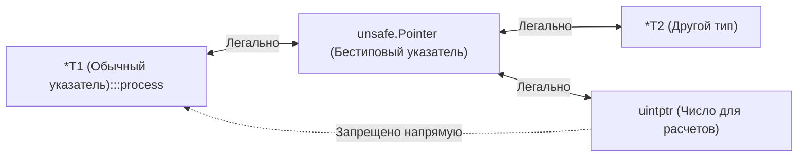
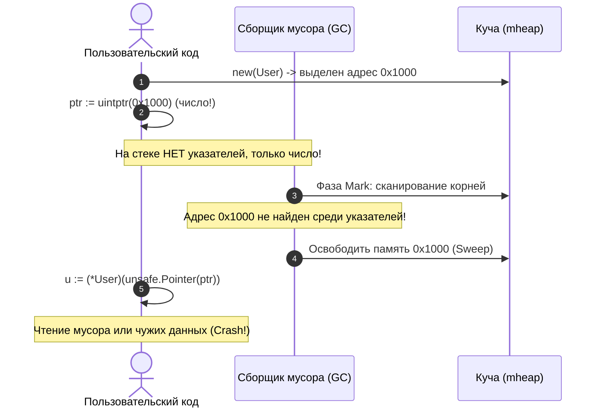

В прошлых статьях мы изучили рефлексию ([[37. Reflect под капотом.md]]), которая позволяет динамически работать с типами, сохраняя при этом базовую безопасность рантайма. Пакет `unsafe`, как следует из его говорящего названия, — это территория, где строгие правила и гарантии языка Go перестают действовать.

Если система типов Go — это современный пассажирский лайнер с системой Fly-by-Wire, защищающей пилота от сваливания и критических кренов, то пакет `unsafe` — это отключение всей бортовой электроники и переход на прямое механическое управление рулями высоты. Вы получаете неограниченную власть над каждым байтом оперативной памяти, но малейшая неточность в расчетах или неверное предположение о поведении Garbage Collector мгновенно приводит к катастрофическому падению всего приложения.

Использование `unsafe` — это осознанный отказ от безопасности типов ради экстремальной производительности (Zero-Copy) или низкоуровневой системной интеграции с ядром ОС и C-библиотеками. Системный инженер обязан понимать, что `unsafe` — это не просто трюк для бенчмарков, а инструмент с высокой ценой поддержки, который может превратить ваш код в мину замедленного действия при очередном минорном обновлении компилятора Go или смене архитектуры процессора.

---

## 1. Три кита unsafe

Вся функциональность пакета `unsafe` построена вокруг трех фундаментальных понятий:

1. **`unsafe.Pointer`**: Специальный тип бестипового указателя, способный хранить адрес любого объекта в памяти. Компилятор Go разрешает свободное взаимное преобразование между любым типизированным указателем (`*T`) и `unsafe.Pointer`. Для сборщика мусора (GC) `unsafe.Pointer` является полноценным «живым» указателем, который он обязан отслеживать при обходе графа объектов.
2. **`uintptr`**: Обычное беззнаковое целое число, разрядность которого в точности равна размеру машинного слова архитектуры (32 бита на x86/ARM32, 64 бита на x86-64/ARM64). В отличие от указателей, над `uintptr` процессор может выполнять прямую арифметику (сложение, вычитание, побитовые маски). **Для сборщика мусора `uintptr` — это просто число, а не ссылка на объект!**
3. **Функции времени компиляции (`unsafe.Sizeof`, `Offsetof`, `Alignof`)**: Псевдофункции, которые вычисляются компилятором на этапе сборки и возвращают точные метаданные о физической раскладке структур в памяти с учетом выравнивания (Alignment) целевой платформы.



---

## 2. Механика обмана: Арифметика указателей

В обычном безопасном Go адресная арифметика запрещена: вы не можете прибавить 8 к указателю на структуру, чтобы переместиться к следующему полю. В `unsafe` это базовая операция.

Представим структуру:
```go
type User struct {
    ID     uint32
    Active bool
    Name   string
}
```

Как эта структура физически раскладывается в оперативной памяти на 64-битной архитектуре? Из-за правил аппаратного выравнивания процессора (CPU Memory Alignment) поля не могут лежать абсолютно вплотную:

```
Смещение:  0      4   5    8               24
Байты:    [ID: 4B][A:1B][Pad:3B][   Name: 16B   ]
           uint32   bool  дыра      string (ptr+len)
```

Поле `ID` занимает 4 байта (смещение 0..3). Поле `Active` занимает 1 байт (смещение 4). Но поле `Name` (заголовок строки 16 байт) требует 8-байтного выравнивания! Поэтому компилятор вставляет 3 байта невидимого заполнителя (Padding). Полный размер структуры составляет 24 байта.

Чтобы прочитать поле `Name` без прямого обращения по имени `u.Name`, мы можем применить адресную арифметику:

```go
u := &User{ID: 101, Active: true, Name: "Brian"}

// 1. Берем адрес структуры *User
// 2. Конвертируем в unsafe.Pointer
// 3. Конвертируем в uintptr для выполнения сложения
// 4. Прибавляем смещение поля Name (через unsafe.Offsetof)
// 5. Конвертируем обратно в unsafe.Pointer, а затем в *string
namePtr := (*string)(unsafe.Pointer(uintptr(unsafe.Pointer(u)) + unsafe.Offsetof(u.Name)))

fmt.Println(*namePtr) // Выведет "Brian"
```

---

## 3. Смертельная ловушка: Сборщик мусора и uintptr

Это самая опасная, коварная и трудноуловимая ошибка при работе с памятью в Go.

**Запомните фундаментальное правило рантайма:**
> **Сборщик мусора (GC) видит и защищает `unsafe.Pointer`, но полностью игнорирует `uintptr`!**

Посмотрим на код, который кажется логичным, но является миной замедленного действия:

```go
// СМЕРТЕЛЬНО ОПАСНО
ptr := uintptr(unsafe.Pointer(new(User)))
// ... здесь может запуститься GC или произойти преемпция горутины ...
u := (*User)(unsafe.Pointer(ptr))
```

Почему этот код сломается в продакшене?
1. В первой строке аллоцируется объект `User`, и его адрес превращается в число `uintptr`.
2. Между первой и второй строками горутина может быть вытеснена планировщиком, либо фоновый поток `sysmon` запустит фазу сборки мусора (GC Mark Phase).
3. Сборщик мусора сканирует стек горутины. Он видит переменную `ptr`, но для него это просто абстрактное целое число (например, `0xc000018060`), а не указатель. 
4. GC делает вывод: *«На объект `User` больше нет ни одного живого указателя в программе!»* — и немедленно освобождает эту память, либо отдает её под другой объект.
5. Хуже того: если горутина расширяет стек (Stack Growth), рантайм копирует стек в новый непрерывный кусок памяти и переписывает все `unsafe.Pointer`, но оставляет число `uintptr` нетронутым. Число `ptr` теперь указывает на старый, уже освобожденный стек!
6. Когда во второй строке мы кастуем `ptr` обратно в `*User`, мы разыменовываем «висячий указатель» (Dangling Pointer / Use-After-Free) и читаем чужой мусор.



**Каноническое правило компилятора Go:**
Переход `Pointer -> uintptr -> Pointer` обязан выполняться в виде **единого неделимого выражения** (в одну строку):

```go
p := unsafe.Pointer(uintptr(basePtr) + offset)
```
Компилятор Go специально обучен распознавать такие однострочные выражения: он гарантирует, что базовый объект `basePtr` будет удерживаться живым на протяжении всей операции вычисления адреса.

---

## 4. Zero-copy конвертации: []byte в string

Мы подробно обсуждали иммутабельность строк в [[34. Внутреннее устройство string.md]]. В стандартном Go стандартная конвертация `string([]byte)` обязана выделить новый блок памяти в куче и побайтово скопировать туда данные, чтобы защитить строку от будущих мутаций слайса.

Однако в сетевых серверах, HTTP-роутерах и JSON-парсерах это приводит к терабайтам бесполезных аллокаций. 

Исторически инженеры использовали хак с подменой заголовков через структуры `reflect.SliceHeader` и `reflect.StringHeader`. Но это нарушало инварианты компилятора и часто приводило к сбоям при оптимизациях.

Начиная с **Go 1.20**, разработчики рантайма добавили официальные, легальные и безопасные zero-copy функции прямо в пакет `unsafe`:

```go
// Без единого копирования и 0 аллокаций!
b := []byte("hello, world")
s := unsafe.String(unsafe.SliceData(b), len(b))
```

* `unsafe.SliceData(b)` возвращает указатель на первый байт массива слайса (`*byte`).
* `unsafe.String(ptr, len)` конструирует валидный 16-байтный заголовок строки на стеке за 1 такт CPU!

Аналогично, функция `unsafe.Slice(ptr, len)` позволяет превратить «сырой» указатель C-массива в полноценный слайс Go без копирования.

> [!warning] Ловушка / Gotcha. Нарушение иммутабельности string
> Zero-copy преобразование связывает строку и срез на одном и том же участке памяти. 
> Если после создания `s := unsafe.String(unsafe.SliceData(b), len(b))` вы измените байт в срезе (`b[0] = 'H'`), то у вас **тихо изменится и строка `s`**! 
> Если эта строка уже была добавлена как ключ в мапу, мапа окажется повреждена (хэш бакета перестанет соответствовать содержимому). Используйте этот прием только тогда, когда гарантируете, что слайс `b` больше никогда не будет модифицирован.

---

## 5. Нарушение инкапсуляции

В Go имена, начинающиеся со строчной буквы, являются неэкспортируемыми (приватными для пакета). Компилятор жестко пресекает любые попытки обратиться к ним из другого пакета.

Пакет `unsafe` полностью стирает это ограничение. Зная физическое смещение поля в структуре, вы можете прочитать или перезаписать любое приватное поле.

Например, в структуре `hmap` из пакета `runtime` (которую мы подробно разбирали в [[31. Внутреннее устройство map. hmap, bucket, overflow.md]]) счетчик элементов и служебные флаги скрыты. Но высокопроизводительные сетевые библиотеки вроде `fasthttp` или драйверы высоконагруженных баз данных нередко используют `unsafe`, чтобы заглянуть в закрытые структуры рантайма, обойти накладные расходы стандартных интерфейсов и выжать максимум пропускной способности из кремния.

---

## Mechanical Sympathy: Цена риска

Перед тем как добавить импорт `"unsafe"` в ваш модуль, взвесьте технический долг и риски:

1. **Поломка при обновлениях Go (Несовместимость):** Команда Go гарантирует обратную совместимость (Go 1 Compatibility Promise) только для безопасного API. Ваш код может сломаться в новом релизе Go, если разработчики изменят внутренний `layout` структур в рантайме (размеры заголовков `hmap`, горутины `g`, планировщик).
2. **Непереносимость между архитектурами:** Смещение полей структуры, рассчитанное на x86-64, почти наверняка окажется неверным на 32-битной платформе (ARM32/MIPS) из-за разницы в размерах указателей и правилах `Alignof`.
3. **Отключение компиляторных оптимизаций:** Компилятор строит граф псевдонимов памяти (Alias Analysis). Использование `unsafe` может разрушить предположения компилятора об изоляции переменных, заблокировав векторизацию (SIMD), переупорядочивание инструкций и устранение мертвого кода.

> [!tip] Собеседование. Зачем нужен unsafe?
> **Вопрос:** Если пакет `unsafe` настолько опасен и ломает фундаментальные гарантии типобезопасности, почему создатели языка не удалят его?
> 
> **Ответ:** Без пакета `unsafe` невозможно написать сам рантайм Go! 
> Вся инфраструктура языка — низкоуровневый аллокатор страниц памяти (`mheap`), стек горутин, запуск потоков ОС через `clone`/`futex`, системные вызовы ядра (Syscalls) и рефлексия — написаны на самом Go с активным использованием `unsafe.Pointer`. 
> Кроме того, `unsafe` незаменим для взаимодействия с кодом на C/C++ (CGO), сетевым вводом-выводом и драйверами устройств.

---

## Итог

1. **`unsafe.Pointer`** — это системный мост между строгой статической типизацией Go и «голыми» байтами памяти. Он распознается и отслеживается сборщиком мусора.
2. **`uintptr`** — это просто целое число. Оно позволяет производить адресную арифметику, но **не защищает объект от удаления Сборщиком Мусора**.
3. Расчет адресов через `uintptr` должен всегда выполняться в виде **единого однострочного выражения**.
4. В современном Go (начиная с 1.20) для быстрых безаллокационных преобразований следует использовать стандартные функции `unsafe.String`, `unsafe.SliceData`, `unsafe.Slice`.
5. Использование `unsafe` требует безупречного знания аппаратного выравнивания памяти (`Alignment`) и готовности к поломке кода при внутренних изменениях рантайма.

Мы научились работать с памятью на самом низком аппаратном уровне. Теперь пора вернуться к логике управления потоком исполнения. В Go есть ключевые управляющие конструкции, которые гарантируют корректное освобождение системных ресурсов и перехват критических сбоев даже при фатальных паниках.

В следующей статье мы разберем, как устроен стек вызовов при обработке ошибок и паник:
[[39. defer, panic и recover под капотом.md]]