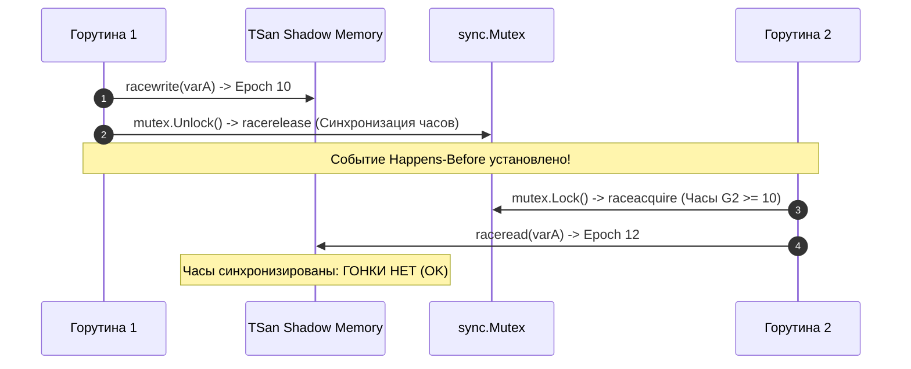

В прошлой статье ([[45. Plugins, Shared Libraries и ограничения Go.md]]) мы изучили процесс сборки и загрузки кода. До сих пор мы рассматривали работу программы так, будто она выполняется в стерильном вакууме строго последовательного и предсказуемого потока команд. 

Но реальный современный серверный бэкенд на Go — это сотни тысяч горутин, одновременно разделяющих оперативную память на многоядерном процессоре.

Если две или более горутины обращаются к одной и той же физической ячейке памяти без строгой синхронизации (мьютексов, атомарных операций или каналов), и хотя бы одно из этих обращений является записью, возникает **Состояние гонки (Data Race)**. 

Это самый коварный, разрушительный и трудноуловимый дефект в многопоточном программировании. Он может месяцами тихо дремать в тестовых окружениях, а затем под пиковой нагрузкой в продакшене внезапно вызвать частичную запись в двухсловный заголовок слайса или интерфейса (Torn Read/Write), повредить указатели кучи и привести к необъяснимому падению процесса или утечке конфиденциальных данных.

Чтобы дать инженерам возможность выявлять эти баги до релиза, в компилятор Go встроен флаг `go run -race` (или `go test -race`). Этот детектор гонок находит даже сложнейшие гонки с ювелирной точностью. 

Но как именно он это делает? Это не инструмент статического линтинга (он не ищет ошибки по тексту кода). Это сложнейшая динамическая подсистема рантайма. Пришло время узнать, как компилятор и процессорная память объединяются для отслеживания каждого байта.

---

## 1. Не магия, а ThreadSanitizer

Создатели Go не стали изобретать велосипед с нуля. Под капотом детектора гонок в Go работает библиотека **ThreadSanitizer (TSan)** — легендарный инструмент, созданный в недрах Google инженерами Дмитрием Вьюковым (Dmitry Vyukov) и Константином Серебряным для C/C++ экосистемы (LLVM/Clang). Дмитрий Вьюков — один из ключевых архитекторов рантайма Go (автор современного планировщика, каналов и Netpoller) — лично интегрировал TSan в компилятор и рантайм Go.

Специальная скомпилированная сборка библиотеки TSan встроена прямо в дистрибутив Go и адаптирована для работы с легковесными горутинами вместо тяжелых POSIX-потоков ОС.

Архитектура Race Detector базируется на двух фундаментальных столпах:
1. **Инструментирование кода компилятором (Compiler Instrumentation):** автоматическая расстановка хуков на каждое чтение и запись памяти на этапе сборки.
2. **Теневая память (Shadow Memory) и Векторные часы (Vector Clocks):** математический анализ порядка событий Happens-Before в рантайме.

---

## 2. Инструментирование (Compiler Instrumentation)

Когда вы запускаете сборку или тесты с флагом `-race`, компилятор Go кардинально меняет логику кодогенерации (пакет `cmd/compile/internal/race`). 

Он обходит промежуточное SSA-представление вашей программы и **переписывает машинный код**:
Каждое обращение к памяти (чтение переменной, запись в поле структуры, доступ по индексу слайса) оборачивается в вызовы служебных функций рантайма `runtime.raceread` и `runtime.racewrite`.

**Ваш исходный код:**
```go
func updateCounter(p *int) {
    *p = *p + 1
}
```

**Во что его компилирует Go с флагом `-race` (упрощенная модель):**
```go
func updateCounter(p *int) {
    // TSan: Фиксируем адрес и размер читаемой ячейки памяти
    runtime.raceread(unsafe.Pointer(p)) 
    tmp := *p
    
    tmp = tmp + 1
    
    // TSan: Фиксируем адрес и размер записываемой ячейки памяти
    runtime.racewrite(unsafe.Pointer(p)) 
    *p = tmp
}
```

Это означает, что абсолютно каждая инструкция процессора, работающая с оперативной памятью (инструкции `MOV`, `ADD`, загрузки из стека и кучи), теперь сопровождается аппаратным прыжком в функцию анализатора. 

Именно поэтому приложение, скомпилированное с флагом `-race`, работает **в 2–20 раз медленнее** и требует кратно больше вычислительных ресурсов процессора!

---

## 3. Теневая память (Shadow Memory)

Как ThreadSanitizer узнает, что две независимые горутины обратились к одной и той же переменной? Ему необходимо сохранять подробную историю всех недавних доступов к каждому байту оперативной памяти.

Для этого рантайм использует концепцию **Теневой памяти (Shadow Memory)**.

При старте программы с флагом `-race` рантайм резервирует гигантский непрерывный диапазон виртуального адресного пространства операционной системы (десятки гигабайт виртуальной памяти, которая физически выделяется ядром Linux лениво, по мере записи).

На каждые **8 байт реальной памяти** вашего приложения (Application Memory) TSan выделяет **до 32 байт Теневой памяти** (четыре теневых слота по 8 байт):

```mermaid
flowchart LR
    classDef process  fill:#1e293b,stroke:#38bdf8,stroke-width:1px,color:#f8fafc
    classDef success  fill:#064e3b,stroke:#34d399,stroke-width:1px,color:#f8fafc
    classDef error    fill:#7f1d1d,stroke:#f87171,stroke-width:1px,color:#f8fafc
    classDef warning  fill:#78350f,stroke:#fbbf24,stroke-width:1px,color:#f8fafc
    classDef entry    fill:#1e3a5f,stroke:#38bdf8,stroke-width:2px,color:#f8fafc
    classDef aux      fill:#334155,stroke:#64748b,stroke-width:1px,color:#f8fafc
    classDef system   fill:#312e81,stroke:#a78bfa,stroke-width:1px,color:#f8fafc
    classDef data     fill:#132d29,stroke:#2dd4bf,stroke-width:1px,color:#f8fafc
    classDef network  fill:#881337,stroke:#fb7185,stroke-width:1px,color:#f8fafc
    classDef accent   fill:#1e1b4b,stroke:#818cf8,stroke-width:1px,color:#f8fafc
    subgraph APP ["Реальная память приложения (8 байт)"]
        VAR_A["Переменная A<br>(Адрес: 0x00c00008)"]
    end
    
    subgraph TSYNC ["Адресная арифметика TSan"]
        ADDR{{"shadow_addr = <br>(addr >> 3) + SHADOW_OFFSET"}}
    end

    subgraph SHADOW ["Теневая память (32 байта тени)"]
        direction TB
        SLOT1["Слот 1: Goroutine 5 | Write | Epoch 120 | 8B"]:::system
        SLOT2["Слот 2: Goroutine 8 | Read  | Epoch 125 | 8B"]:::system
        SLOT3["Слот 3: Goroutine 12| Write | Epoch 130 | 8B"]:::system
        SLOT4["Слот 4: Свободно"]:::process
    end
    
    VAR_A --> TSYNC
    TSYNC -->|"Аппаратный сдвиг за 1 такт"| SHADOW
```



> [!info] Эволюция TSan: переход на версию v3 (Go 1.19+)
> Классическая схема с четырьмя фиксированными 8-байтными слотами тени на 8 байт приложения (соотношение 4:1) иллюстрирует базовую модель ThreadSanitizer v2. Начиная с **Go 1.19**, Race Detector на поддерживаемых 64-битных платформах (Linux, macOS на amd64/arm64) был переведен на библиотеку **TSan v3**. В третьей версии теневая память организуется динамически, накладные расходы по RAM снизились примерно в 2 раза (типичный оверхед по памяти упал с $5\times$–$10\times$ до $1.5\times$–$2.6\times$), а также было снято историческое ограничение на максимальное количество одновременно работающих горутин ($8\,192$ горутины в TSan v2).

Когда горутина делает запись `runtime.racewrite(unsafe.Pointer(p))` (или просто `racewrite(p)`), алгоритм работает так:
1. TSan берет реальный адрес указателя `p`.
2. С помощью простого побитового сдвига вычисляет адрес соответствующей ячейки в Теневой памяти.
3. Записывает в Теневую память **Метаданные**: 
   * ID текущей горутины.
   * Тип операции (Чтение или Запись).
   * Адрес инструкции (Program Counter), чтобы потом показать вам номер строки в коде.
   * **Временную метку (Vector Clock)**.

---

## 4. Векторные часы (Vector Clocks) и Happens-Before

Представьте ситуацию: в Теневой памяти зафиксировано, что Горутина 1 записала данные в переменную `A`, а через секунду Горутина 2 прочитала эти данные. Является ли это состоянием гонки?

**Вовсе нет!** Если Горутина 1 записала данные, вызвала `mutex.Unlock()`, а Горутина 2 захватила этот же мьютекс через `mutex.Lock()` и только потом прочитала значение — данные переданы корректно.

Чтобы отличать легальную передачу данных от состояния гонки, TSan реализует строгую модель памяти Go Memory Model и концепцию **«Происходит-До» (Happens-Before)**, опираясь на математический аппарат **Векторных часов (Vector Clocks)**.

Компилятор инструментирует не только чтение и запись данных, но и **абсолютно все примитивы синхронизации**:
* `sync.Mutex` и `sync.RWMutex` (вызовы `runtime.raceacquire` и `runtime.racerelease`);
* Операции с каналами (`channel` send, receive, close);
* Барьеры `sync.WaitGroup` и `sync.Once`;
* Атомарные операции из пакета `sync/atomic`.

Каждая горутина хранит свой вектор логических часов. Когда горутина отпускает мьютекс (`mutex.Unlock()`), TSan обновляет векторные часы мьютекса. Когда другая горутина захватывает этот мьютекс (`mutex.Lock()`), она подтягивает свои векторные часы до уровня отпустившей горутины, устанавливая ребро Happens-Before в графе событий.



**Алгоритм проверки гонки при каждом обращении к памяти:**
1. Горутина 2 пытается выполнить запись или чтение переменной `A`.
2. TSan мгновенно вычисляет адрес в Теневой памяти и считывает историю предыдущих обращений.
3. Если среди записей есть конфликт (хотя бы одно обращение — запись, и оно совершено другой горутиной):
   * TSan сравнивает векторные часы текущего доступа и прошлого доступа.
   * Если между ними **нет отношения Happens-Before** (горутины работали параллельно без общей синхронизации через мьютекс или канал), TSan мгновенно генерирует отчет:

```
==================
WARNING: DATA RACE
Write at 0x00c00008 by goroutine 7:
  main.updateCounter()
      /app/main.go:27 +0x3b

Previous Read at 0x00c00008 by goroutine 6:
  main.worker()
      /app/main.go:15 +0x88
==================
```

> [!info] Под капотом. Ограничение в 8192 горутины
> В старых версиях Go (до 1.22) запуск с флагом `-race` имел жесткое ограничение: Race Detector падал с фатальной ошибкой, если в программе одновременно создавалось более 8192 горутин! 
> Причина заключалась в том, что оригинальная библиотека TSan создавалась в Google под тяжелые C-потоки и отводила под ID потока всего 13 бит в слоте теневой памяти ($2^{13} = 8192$). В Go 1.22 рантайм перешел на новую версию TSan v3, где разрядность идентификаторов была увеличена, устранив эту проблему для современных высоконагруженных сервисов.

---

## 5. Mechanical Sympathy: Правила использования -race

Глубокое понимание цены работы Race Detector диктует Senior-инженеру строгие стандарты эксплуатации:

❌ **Никогда не запускайте бинарники с флагом `-race` в Production-окружении!**  
Попытка выкатить `-race` на боевые сервера приведет к деградации сервиса:
* **Процессор (CPU):** Потребление CPU возрастает в **2–20 раз** из-за постоянного выполнения хуков `raceread`/`racewrite` на каждую инструкцию работы с памятью.
* **Память (RAM):** Потребление оперативной памяти возрастает в **5–10 раз** из-за колоссальных массивов Теневой памяти.
* **Аллокатор:** Отключаются многие оптимизации рантайма (включая частичный инлайнинг).

✅ **Где Race Detector обязан работать:**
1. **Локальные тесты разработчика:** `go test -race ./...` — обязательный шаг перед каждым коммитом.
2. **CI/CD пайплайны:** Прогон всего тестового набора с флагом `-race` на этапе сборки мердж-реквестов.
3. **Canary / Staging:** Включение на тестовых стендах со сгенерированной синтетической нагрузкой, воспроизводящей реальный трафик.

⚠️ **Динамическая слепота детектора:**  
Race Detector — это строго динамический инструмент. Он не проводит формальную математическую верификацию исходного кода. Он способен обнаружить состояние гонки **только тогда, когда конфликтующие пути исполнения физически выполнились во время работы программы**. 

Если состояние гонки спрятано внутри редкой ветки обработки ошибок `if err != nil`, и в ходе выполнения тестов эта ошибка ни разу не возникла — Race Detector не сообщит о проблеме. Высокий процент тестового покрытия (Code Coverage) и стресс-тестирование конкурентного кода — обязательное условие эффективной работы Race Detector.

---

## Итог

1. **Race Detector** в Go построен на базе библиотеки **ThreadSanitizer (TSan)**, адаптированной под модель горутин.
2. При сборке с `-race` компилятор переписывает машинный код, внедряя проверки `runtime.raceread` и `runtime.racewrite` перед каждой операцией с памятью.
3. TSan выделяет **Теневую память (Shadow Memory)**, где сохраняет историю обращений к каждому 8-байтному блоку реальной памяти.
4. Синхронизация отслеживается через **Векторные часы (Vector Clocks)**, обновляемые всеми примитивами (`sync.Mutex`, каналы, атомики) для построения графа Happens-Before.
5. Флаг `-race` незаменим для тестов и CI/CD, но категорически неприемлем в Production из-за десятикратного перерасхода памяти и замедления CPU.

Мы научились выявлять дефекты параллелизма в коде. Но что делать, если код работает корректно, гонок нет, но сервис медленно отвечает пользователям? Почему при `GOMAXPROCS=8` процессор утилизирован всего на 20%? Куда уходят миллисекунды и почему возникают паузы?

Для ответа на эти вопросы в стандартный инструментарий Go встроена тяжелая артиллерия — подсистемы низкоуровневого профилирования и трассировки ядра.

В следующей статье мы разберем, как устроен профайлер pprof и трассировщик execution trace:
[[47. Pprof, Trace и внутренние механизмы профилирования.md]]