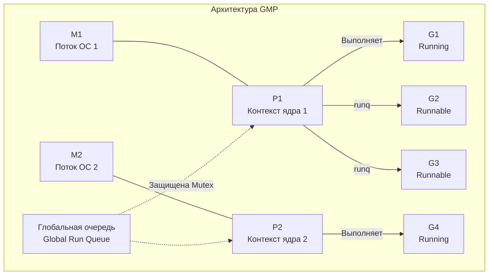
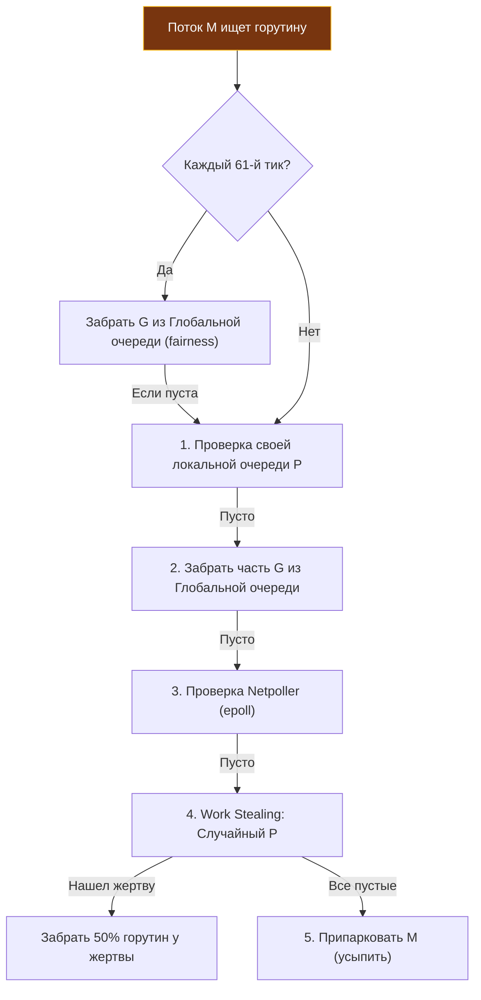

В предыдущей лекции [[8. Go runtime. Главные компоненты рантайма]] мы познакомились с общей архитектурой среды выполнения Go. Главным дирижером и интеллектуальным центром этой системы является **Планировщик (Scheduler)**.

Исторически многопоточность в операционных системах и языках программирования общего назначения строилась вокруг классической модели `1:1` (one-to-one) — на каждый параллельный поток в коде создавался один поток операционной системы (OS Thread).  
Для высоконагруженного бэкенда такая архитектура губительна. Поток ОС — это тяжелый, монолитный ресурс ядра:
- Операционная система резервирует под каждый поток огромный фиксированный стек (в Linux по умолчанию от 1 до 8 МБ);
- Переключение контекста между потоками ядра (**Context Switch**) сопряжено с переходом в Ring 0, сохранением десятков регистров, сбросом конвейера CPU и, что самое разрушительное для производительности, частичной инвалидацией TLB-кэша и кэшей данных L1–L3.

Сервер, вынужденный обслуживать 10 000 – 50 000 активных потоков ОС, быстро захлебывается в накладных расходах планировщика ядра Linux.

Go кардинально меняет правила игры, реализуя двухуровневую модель **`M к N`** (M:N): планировщик рантайма мультиплексирует миллионы легковесных пользовательских горутин (**M**) поверх небольшого пула физических потоков операционной системы (**N**).

Чтобы эта схема масштабировалась линейно и не деградировала из-за конкуренции за глобальные блокировки (lock contention), инженер Дмитрий Вьюков и команда рантайма разработали всемирно признанную трехкомпонентную архитектуру — **GMP**.

---

## Фундаментальные структуры: G, M и P

Если открыть ядро рантайма Go (`src/runtime/runtime2.go`), мы обнаружим три ключевые структуры данных, лежащие в основе диспетчеризации.

### 1. G (Goroutine)

Структура `g` описывает отдельную горутину — атомарную единицу исполнения в Go.  
Горутина невероятно легковесна: при рождении ее стек занимает всего **2 КБ**, что позволяет одновременно держать в оперативной памяти миллионы горутин.

Ключевые поля структуры `g`:
* `stack`: пара указателей `lo` и `hi`, задающих физические границы текущего стека в памяти;
* `sched`: структура `gobuf`, представляющая контекст выполнения горутины при ее приостановке. Она сохраняет регистры процессора: указатель стека `sp`, программный счетчик инструкций `pc` и указатель базы стекового кадра `bp`;
* `atomicstatus`: битовое поле атомарного статуса жизненного цикла горутины (`_Grunnable` — готова к исполнению, `_Grunning` — активно исполняется на процессоре, `_Gwaiting` — заблокирована на канале, мьютексе или сетевом вызове).

### 2. M (Machine)

Структура `m` представляет поток операционной системы (OS Thread), созданный ядром (системный вызов `clone` в Linux). Это реальная физическая рабочая лошадка, которая связывается ядром Linux с аппаратным ядром CPU и исполняет машинный код.

Ключевые поля структуры `m`:
* `g0`: выделенная системная горутина, обладающая полноценным фиксированным стеком операционной системы (обычно 8 МБ). Именно на стеке `g0` выполняются все системные операции: переключение контекста горутин, распределение памяти и шаги сборщика мусора. Пользовательский бизнес-код никогда не выполняется на стеке `g0`!
* `curg`: указатель на пользовательскую горутину (`G`), которая выполняется на данном потоке прямо сейчас;
* `p`: указатель на логический процессор (`P`), за которым закреплен данный поток в текущий момент времени.

### 3. P (Processor)

Логический процессор — это абстрактный **локальный контекст исполнения**. Эта сущность была введена в релизе Go 1.1: до этого существовали только G и M, из-за чего все потоки конкурировали за единственный глобальный мьютекс планировщика, создавая непреодолимое «бутылочное горлышко».

Количество структур `P` в системе жестко фиксировано переменной окружения **`GOMAXPROCS`** (по умолчанию равной числу физических/логических ядер сервера).

Поток операционной системы (`M`) не имеет права исполнять пользовательский Go-код, пока он не захватит доступ к свободному процессору `P`.

Ключевые поля структуры `p`:
* `runq`: **Локальная очередь (Local Run Queue — LRQ)** горутин, готовых к выполнению. Это кольцевой буфер (ring buffer) фиксированного размера на 256 элементов, спроектированный полностью Lock-Free (на быстрых атомарных операциях CAS без тяжелых мьютексов);
* `runnext`: атомарный слот (указатель) на горутину, которая должна быть взята на исполнение приоритетно, опережая основную локальную очередь;
* `mcache`: локальный кэш аллокатора памяти, позволяющий горутинам выделять память в куче без блокировок.

> [!info] Под капотом: runnext и локальность кэша CPU
> 
> Зачем в структуре `P` выделен специальный слот `runnext`?  
> Когда горутина `A` создает горутину `B` (через `go func()`), планировщик помещает `B` не в конец очереди, а именно в слот `runnext` текущего процессора `P`.  
> Это проявление глубокого сочувствия к архитектуре машины (**Mechanical Sympathy**). Данные, которые родительская горутина только что подготовила для дочерней, прямо сейчас находятся в горячих кэшах L1 и L2 текущего ядра процессора. Немедленный запуск `B` на этом же ядре гарантирует феноменальный прирост скорости за счет аппаратной локальности кэшей (**Cache Affinity**). Если бы `B` отправилась в хвост очереди из 256 элементов, к моменту ее вызова кэши L1/L2 были бы давно перезаписаны посторонними данными.

---

## Цикл Планирования (The Schedule Loop)

Когда рантайм развернут, каждый активный поток `M` (находящийся в связке с `P`) входит в бесконечный диспетчерский цикл — функцию **`runtime.schedule()`**.

Задача потока `M` проста: найти готовую к работе горутину (`_Grunnable`), переключить ее статус в `_Grunning`, загрузить ее стековые регистры `sp` и `pc` в физический процессор (ассемблерная функция `gogo()`) и исполнять код.

Откуда поток `M` берет горутины? Алгоритм поиска в функции `findrunnable()` строго эшелонирован по приоритетам:

1. **`runnext`:** проверить приоритетный слот `runnext` своего процессора `P`. Если там есть задача — немедленно забрать и выполнить.
2. **Локальная очередь (LRQ):** извлечь горутину из головы кольцевого буфера `P.runq`. Операция безакцептна (lock-free) и отрабатывает за несколько процессорных тактов.
3. **Глобальная очередь (GRQ):** если локальная очередь пуста, проверить глобальную очередь `sched.runq`. Доступ к ней защищен глобальным мьютексом, поэтому частые обращения туда минимизируются.
4. **Network Poller:** опросить сетевой поллер (`epoll`/`kqueue`). Если сокеты получили порцию сетевых пакетов, разбудить ожидающие горутины и забрать их на исполнение.
5. **Work Stealing (Кража работы):** если работы все еще нет, попытаться украсть горутины у соседних ядер.

---

## Work Stealing (Кража работы)

Что происходит в гетерогенных нагрузках, когда горутины на процессоре `P1` оказались тяжелыми математическими вычислениями, а горутины на `P2` обработали быстрые запросы и завершились? Локальная очередь `P2` опустеет. Без балансировки поток `M2` уснул бы, в то время как `M1` задыхался бы от перегрузки.

Для поддержания 100% утилизации доступных ядер рантайм реализует алгоритм **Work Stealing**:
Если поток `M` не нашел задач в своих локальных источниках, он переходит в статус «вора» (**spinning thread**). Поток выбирает случайный процессор `P` в системе и **крадет ровно половину (50%) горутин** из хвоста его локальной очереди `runq`, перенося их в свой локальный буфер.

> [!warning] Ловушка / Gotcha: Предотвращение голодания (Starvation)
> 
> Если бы планировщик бесконечно выбирал задачи только из локальных очередей (которые постоянно пополняются новыми горутинами), горутины, однажды попавшие в глобальную очередь `sched.runq`, могли бы навсегда остаться без внимания процессора.  
> Чтобы предотвратить голодание задач (**starvation**), в планировщике жестко зафиксировано правило:  
> **Ровно каждый 61-й тик планировщика** поток обязан проигнорировать свою локальную очередь и принудительно забрать горутину из глобальной очереди!  
> Число **61** выбрано не случайно: это простое число (prime number), что математически исключает возникновение резонансных гармоник и синхронизации с другими циклическими процессами в программе.

---

## Handoff: Что происходит при системных вызовах?

Мы подошли к ключевому архитектурному вопросу: зачем вообще потребовалось вводить абстракцию `P`? Почему нельзя было закрепить локальные очереди задач прямо за потоками операционной системы `M`?

Ответ кроется в поведении **блокирующих системных вызовов** (например, синхронное чтение файла с жесткого диска, вызовы библиотек через `CGO` или системный вызов `syscall.Read`).

Когда горутина инициирует синхронный системный вызов, она проваливается в пространство ядра (**Kernel Space, Ring 0**). Поток операционной системы `M` физически замораживается ядром Linux на время ожидания ввода-вывода.

Если бы очередь задач была жестко привязана к потоку `M`, то 255 готовых к работе горутин оказались бы заложниками заблокированного треда, а физическое ядро процессора простаивало бы!

Благодаря отделению `P` от `M` рантайм мгновенно выполняет протокол **Handoff (передача эстафеты)**:
1. Горутина `G1` на потоке `M1` вызывает блокирующий системный вызов;
2. Поток `M1` переходит в состояние ожидания ответа от ядра ОС;
3. Рантайм немедленно **отрывает** логический процессор `P1` (вместе со всей локальной очередью готовых горутин) от засыпающего потока `M1`;
4. Процессор `P1` передается свободному потоку ядра `M2` (или создается новый тред ОС, если свободного нет);
5. Поток `M2` без малейшей задержки продолжает выполнять задачи из очереди `P1`.

Когда системный вызов на `M1` завершается, он просыпается, видит, что потерял свой `P`, помещает `G1` в глобальную очередь и отправляется в пул спящих потоков.

*(Механику обработки системных вызовов мы подробно разберем в лекции [[42. Планировщик и блокирующие syscalls]]).*

> [!tip] Собеседование: Spinning Threads (Крутящиеся потоки)
> 
> **Вопрос:** Если в приложении нет входящих запросов, рантайм Go усыпляет неиспользуемые потоки ядра. Почему же в системном мониторе (top/htop) видно, что 1–2 потока процесса Go продолжают потреблять доли процента CPU даже в состоянии полного простоя?
> 
> **Ответ:** Это механизм **Spinning Threads** (вращающиеся потоки).  
> Усыпление потока ОС (системный вызов `futex`) и его последующее пробуждение ядром Linux — очень дорогая операция, требующая тысяч тактов процессора (микросекунды задержки).  
> Поэтому рантайм Go держит небольшое число потоков в активном спин-цикле (опрос очередей без засыпания) на короткое время в расчете на то, что прямо сейчас поступит новая задача (например, придет сетевой пакет от Netpoller). Это сознательный расход крошечной доли тактов CPU ради радикального снижения задержки реакции системы (Tail Latency).

---

## Итоги

1. **Модель M:N:** Go устраняет узкие места потоков ядра операционной системы, мультиплексируя миллионы легковесных горутин на компактный пул потоков ОС.
2. **Триада GMP:** `G` — горутина со стеком 2 КБ; `M` — рабочий поток ядра ОС; `P` — логический контекст исполнения, задающий степень реального параллелизма (`GOMAXPROCS`).
3. **Локальность кэшей (Mechanical Sympathy):** Локальная очередь (LRQ) и приоритетный слот `runnext` минимизируют блокировки памяти и сохраняют горячие данные в L1/L2 кэшах физических ядер CPU.
4. **Work Stealing:** Потоки, исчерпавшие локальные задачи, равномерно перераспределяют нагрузку, похищая ровно 50% горутин у загруженных контекстов `P`.
5. **Handoff:** Разделение исполнителя (`M`) и контекста (`P`) защищает очереди горутин от простоя при выполнении блокирующих системных вызовов в ядре ОС.

Теперь мы ясно видим, как горутины циркулируют между процессорами `P` и потоками `M`. Но кто выступает верховным арбитром в этой системе? Кто будит горутины при сетевых событиях и принудительно отбирает процессор у бесконечных циклов `for`?

В следующей лекции мы детально разберем: [[10. sysmon, netpoller и фоновые потоки рантайма]].