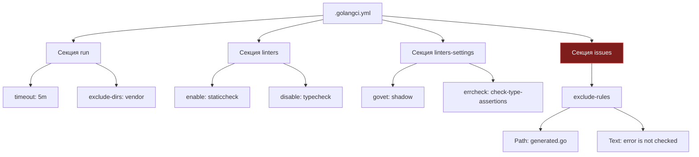

## Тонкая настройка: От хаоса к порядку

Запустить `golangci-lint` со стандартным набором правил — прекрасный первый шаг, напоминающий включение настольной лампы в темной комнате. Но в реальном промышленном проекте этот первоначальный восторг быстро сменяется отрезвлением. Вы открываете терминал и обнаруживаете сотни предупреждений в автоматически сгенерированных Protobuf-файлах, жалобы на легаси-код десятилетней давности, написанный до появления контекстов, и ожесточенные споры среди коллег о допустимой длине функций.

Конфигурация линтеров — это искусство поддержания тонкого баланса между инженерной строгостью и скоростью разработки. Если выкрутить чувствительность приборов на максимум, инструмент превратится в бюрократическую преграду, парализующую команду ложными срабатываниями. Если же ослабить проверки сверх меры, линтер выродится в бесполезную формальность, пропускающую гонки данных и фатальные утечки ресурсов.

Как и в типографском наборе, где правила верстки согласуются до печати книги, правила статического анализа кода в Go должны быть четко зафиксированы в едином машинно-читаемом манифесте.

---

## Файл `.golangci.yml`

При запуске `golangci-lint` выполняет иерархический поиск файла конфигурации, начиная от текущего рабочего каталога и поднимаясь вверх по дереву каталогов вплоть до корня файловой системы. Хотя утилита распознает различные форматы (`.golangci.yaml`, `.golangci.toml`, `.golangci.json`), абсолютным стандартом де-факто в экосистеме Go является файл **`.golangci.yml`**, расположенный в корневом каталоге репозитория (рядом с `go.mod`).

Архитектура конфигурационного файла делится на четыре основополагающие секции:

1. **`run`**: Глобальные параметры среды исполнения — таймауты, параллелизм, фильтрация анализируемых директорий и флаги компиляции Go.
2. **`linters`**: Реестр анализаторов — явное перечисление того, какие проверки активированы, а какие отключены.
3. **`linters-settings`**: Глубокая параметризация конкретных анализаторов (включение дополнительных проверок в AST, настройка порогов цикломатической сложности, регулярные выражения для именования).
4. **`issues`**: Пост-процессинг и фильтрация результатов — тонкие правила подавления предупреждений (`exclude-rules`), лимиты вывода и обработка инлайн-директив.



---

## Стратегия включения линтеров

При формировании списка проверок начинающие команды часто совершают фундаментальную ошибку в выборе базовой стратегии:

1. **Blacklist (Черный список)** (`disable-all: false`): По умолчанию активны все встроенные линтеры, а разработчик выборочно отключает те, которые вызывают раздражение.
2. **Whitelist (Белый список)** (`disable-all: true`): Все линтеры принудительно деактивируются, после чего команда осознанно включает только проверенные и согласованные инструменты.

> [!warning] Ловушка / Gotcha
> **Всегда используйте подход Whitelist.**
> ```yaml
> linters:
>   disable-all: true
>   enable:
>     - errcheck
>     - gosimple
>     - govet
>     - staticcheck
>     - ineffassign
>     - revive
> ```
> Разработчики `golangci-lint` регулярно выпускают новые релизы, добавляя экспериментальные анализаторы или ужесточая правила существующих. В режиме Blacklist очередное минорное обновление линтера на CI-сервере автоматически активирует новый линтер и неожиданно завалит ночной пайплайн сборки десятками замечаний к коду, который вчера считался безупречным.
> 
> Whitelist гарантирует детерминированность: ваш CI-пайплайн падает только тогда, когда нарушены явно утвержденные инженерные соглашения.

---

## Настройка игнорирования (`issues`)

Наиболее болезненный этап внедрения статического анализа — первый запуск на зрелом проекте с богатой историей. Перед инженером предстает стена из тысяч замечаний к легаси-коду, утилитным скриптам и автогенерированным файлам (Protobuf, gRPC, Swagger, EasyJSON). Попытка исправить всё разом неминуемо приведет к регрессионным ошибкам, а отключить проверки означает расписаться в собственной беспомощности.

Для решения этой дилеммы `golangci-lint` предоставляет развитый механизм подавления замечаний в секции `issues`.

### 1. Исключение путей (Global)
Если каталог заведомо не подлежит проверке (сторонний код или зависимости), его исключают целиком на уровне секции `run`:

```yaml
run:
  exclude-dirs:
    - vendor
    - legacy/pkg
    - third_party
```

> [!note] Эволюция конфигурации
> В современных версиях `golangci-lint` для исключения директорий каноническим параметром является `run.exclude-dirs` (или `issues.exclude-dirs`). Исторический ключ `skip-dirs` объявлен устаревшим (deprecated), хотя все еще может встречаться в старых пайплайнах.

### 2. Исключение файлов и точечные правила (`exclude-rules`)
Для сгенерированного кода (например, файлов с суффиксом `.pb.go`) лучше использовать правила исключений. Автоматически сгенерированный код нельзя редактировать вручную: любые исправления будут стерты при следующем перезапуске кодогенератора. Однако сгенерированные файлы часто грешат неидеальными именами параметров, устаревшими вызовами API или неиспользованными аргументами.

Механизм `exclude-rules` позволяет гибко комбинировать маски путей к файлам (`path`), идентификаторы анализаторов (`linters`) и текст сообщений (`text`):

```yaml
issues:
  exclude-rules:
    # Исключить проверки для сгенерированных Protobuf файлов
    - path: \.pb\.go$
      linters:
        - revive
        - errcheck
    
    # Исключить определенные ошибки в тестах
    - path: _test\.go$
      text: "SA1019:" # Игнорировать использование deprecated функций в тестах
```

Здесь регулярное выражение `\.pb\.go$` отсекает автогенерированные protobuf-структуры от проверок форматирования и обработки возвращаемых кодов, а маска `_test\.go$` с фильтром `SA1019:` позволяет юнит-тестам временно использовать устаревшие методы без блокировки релизного цикла.

### 3. Инлайн-игнорирование в коде
Когда анализатор находит подозрительное место, но инженер абсолютно уверен в корректности и осознанности своего решения, применяется специальная комментарий-директива `//nolint`:

```go
//nolint:errcheck // Это безопасно, так как мы игнорируем ошибку записи в закрытый канал
_ = ch.Send(data)
```

Правила хорошего тона при использовании `//nolint`:
* **Всегда указывать конкретный линтер:** директива вида `//nolint` без параметров отключает вообще все проверки для данной строки, включая детекторы утечек памяти и гонок. Пишите строго `//nolint:errcheck` или `//nolint:govet,revive`.
* **Всегда аргументировать исключение:** поясняющий комментарий после директивы объясняет коллегам и рецензентам, почему машина в данном случае не права.

> [!tip] Собеседование
> **Вопрос:** Как внедрить линтер в проект с 5-летней историей, не ломая CI?
> **Ответ:** Используйте `issues.exclude-rules` для временного игнорирования легаси-папок или установите `max-issues-per-linter: 0` и `max-same-issues: 0`, чтобы видеть все ошибки. Но лучше всего работает стратегия "новый код — новые правила". Вы настраиваете линтер на блокировку (fail CI), но исключаете все текущие ошибки через конфиг. Весь новый код должен проходить линтер, а старый рефакторится постепенно.
> 
> На практике это реализуется либо через флаг `--new-from-rev=origin/main` (линтер анализирует только строки, затронутые текущим Pull Request), либо через сохранение снимка текущих проблем в базовый список исключений (baseline).

---

## Глубокая настройка (`linters-settings`)

Стандартные линтеры поставляются с консервативными конфигурациями, рассчитанными на то, чтобы не беспокоить программиста без крайней необходимости. Секция `linters-settings` открывает доступ к скрытым возможностям анализаторов.

### `govet`: Включение проверки затенения переменных (`shadow`)
По умолчанию `go vet` не проверяет затенение переменных (variable shadowing), хотя это частый источник трудноуловимых багов в Go. Когда во внутреннем блоке условий используется краткое объявление `:=` для переменной с именем, совпадающим с внешней переменной (например, `err`), внешняя переменная не модифицируется:

```yaml
linters-settings:
  govet:
    enable:
      - shadow
```

После активации `shadow` анализатор `govet` немедленно сообщит о повторном объявлении `err` или идентификатора бизнес-логики во вложенной области видимости.

### `errcheck`: Проверка утверждений типов (Type Assertions)
По умолчанию `errcheck` контролирует возвращаемые значения функций с сигнатурой `(... error)`. Однако не менее опасная ошибка кроется в непроверенном приведении интерфейсных типов (`val := i.(int)`), которое при несовпадении типов приводит к мгновенной панике рантайма.

Флаг `check-type-assertions` принуждает разработчиков использовать безопасную двухпараметрическую форму `val, ok := i.(int)`:

```yaml
linters-settings:
  errcheck:
    check-type-assertions: true
```

### `revive`: Быстрая и настраиваемая замена `golint`
Исторический линтер `golint`, созданный авторами Go, был официально заморожен из-за невозможности тонкой настройки и низкой скорости работы. Его преемник `revive` написан с прицелом на максимальную производительность и позволяет гибко управлять строгостью правил (severity) и передавать им аргументы:

```yaml
linters-settings:
  revive:
    rules:
      - name: var-naming
        severity: warning
        arguments: [["ID", "HTTP"]]
```

С такой настройкой правило `var-naming` будет выдавать предупреждение, если аббревиатуры в идентификаторах оформлены с нарушением идиоматического регистра Go (например, `userId` вместо `userID` или `HttpServer` вместо `HTTPServer`).

---

## Секция `run`: Таймауты и производительность

В крупных репозиториях построение графа зависимостей и семантический анализ типов требуют значительных вычислительных ресурсов процессора и оперативной памяти. Если проект насчитывает сотни пакетов, линтинг может превысить стандартное ограничение по времени (по умолчанию составляющее 1 минуту).

```yaml
run:
  timeout: 5m
  concurrency: 4 # Количество потоков для анализа
```

Параметр `timeout: 5m` предотвращает аварийное завершение линтера при пиковых нагрузках на CI-раннерах. Параметр `concurrency: 4` задает число параллельных горутин-анализаторов, оптимизируя загрузку аппаратных ядер процессора и предотвращая деградацию дискового ввода-вывода.

Если `golangci-lint` систематически упирается в таймаут даже при параллельной работе, это верный сигнал архитектурного неблагополучия: либо проект страдает от чрезмерного зацепления пакетов (package coupling), либо CI-агент испытывает острый дефицит памяти при загрузке AST в кэш.

---

## Итог

Конфигурация статического анализатора — это коллективный контракт команды, записанный на языке правил компилятора:

1. **Принцип Whitelist:** Всегда объявляйте `disable-all: true` и включайте правила осознанно, защищая CI от неожиданных сюрпризов при обновлениях.
2. **Изоляция автогенерации:** Сгенерированные структуры (Protobuf, gRPC) исключаются через регулярные выражения в `exclude-rules`.
3. **Строгость типов и контекста:** Включайте глубокие проверки `shadow` в `govet` и `check-type-assertions` в `errcheck`.
4. **Управление ресурсами:** Контролируйте время и параллелизм выполнения через секцию `run`.

Когда правила анализа согласованы и закреплены в `.golangci.yml`, разработчику больше не нужно держать в памяти десятки флагов командной строки. Достаточно объединить запуск тестов, линтеров и компилятора в единый удобный сценарий.

В следующей статье мы обратимся к нестареющей классике автоматизации сборки, родившейся в стенах Bell Labs: [[20. Makefile для Go проектов]].