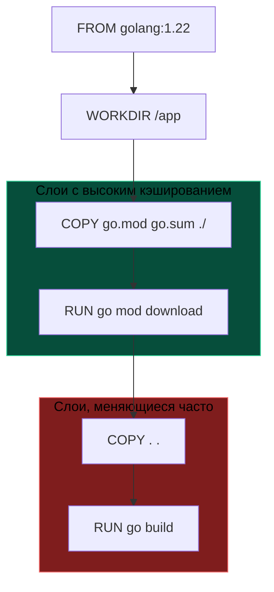

## Контейнеризация: Идеальная пара для Go

В мире динамических сред вроде Python, Ruby или Node.js контейнеризация часто превращается в попытку упаковать в образ целую операционную систему: тяжеловесный интерпретатор, менеджер пакетов, десятки системных разделяемых библиотек C и громоздкие виртуальные окружения. Для компилируемого языка Go концепция контейнеров обретает свой первозданный, кристально чистый смысл.

Для Go контейнер Docker — это всего лишь способ упаковать **один бинарный файл** и запустить его в изолированном пространстве имен Linux (namespaces и cgroups). Приложению на Go не требуются ни виртуальная машина, ни сторонний рантайм (как JRE), ни интерпретатор. Go-программы общаются с ядром операционной системы напрямую через системные вызовы (Linux Syscalls). Это фундаментальное свойство позволяет создавать сверхкомпактные контейнерные образы размером в считанные мегабайты, экономя гигабайты дискового пространства в облачных кластерах и сокращая время развертывания в Kubernetes до долей секунды.

---

## Dockerfile: Первые шаги и скрытые ловушки

На первый взгляд, создание контейнера для Go-сервиса выглядит тривиальной задачей:

```dockerfile
# Используем официальный образ компилятора
FROM golang:1.22

# Устанавливаем рабочую директорию
WORKDIR /app

# Копируем исходный код
COPY . .

# Собираем приложение
RUN go build -o main ./cmd/app

# Указываем команду запуска
CMD ["./main"]
```

Этот сценарий работает, но для производственной среды он категорически непригоден по двум ключевым причинам:

1. **Колоссальный размер образа:** Базовый образ `golang:1.22` весит более 1 ГБ! Он включает компилятор Go, тулчейн C, утилиту `git`, исходные коды стандартной библиотеки и полноценный дистрибутив Debian. Таскать этот багаж в продакшен ради запуска 15-мегабайтного бинарника — непозволительное расточительство ресурсов сети и хранилища.
2. **Безопасность и площадь атаки:** Оставлять в производственном контейнере компилятор, сборочные утилиты и исходный код — подарок для злоумышленника. В случае компрометации процесса атакующий получает готовые инструменты для компиляции эксплойтов прямо на сервере.

> [!tip] Собеседование
> **Вопрос:** Почему не стоит использовать образ `golang` в продакшене?
> **Ответ:** Образ `golang` предназначен для *сборки* (build image). Он содержит инструменты разработки. В продакшене (runtime image) должен находиться только скомпилированный бинарник и минимальный набор системных библиотек. Решение — Multi-stage builds (тема следующей статьи), но даже в рамках базового подхода лучше копировать бинарник в пустой образ.

---

## Кэширование слоев: Оптимизация сборки

Файловая система Docker (OverlayFS) оперирует неизменяемыми слоями, каждый из которых кэшируется на основе криптографического хеша входящих файлов и текста инструкции (`RUN`, `COPY`). Если хеш слоя и его предшественников не изменился, Docker мгновенно переиспользует готовый результат.

Самая дорогая операция в сборке Go-проекта — загрузка внешних зависимостей по сети через команду `go mod download`. Если скопировать весь каталог (`COPY . .`) в самом начале, любое микроскопическое изменение комментария в `main.go` инвалидирует кэш слоя, вынуждая сборщик заново скачивать сотни сторонних библиотек.

**Канонический порядок инструкций:**
1. Скопировать **только** манифесты `go.mod` и `go.sum`.
2. Скачать зависимости (`RUN go mod download`).
3. Скопировать исходный код проекта (`COPY . .`).
4. Запустить сборку компилятором.



Когда вы редактируете код в `main.go`, манифесты `go.mod` и `go.sum` остаются неизменными. Docker мгновенно подтягивает слои `COPY` и `RUN go mod download` из локального кэша, начиная сборку сразу с шага `COPY . .`. Время ожидания инженера сокращается с нескольких минут до нескольких секунд.

---

## Механическая симпатия: Go и образ `scratch`

Компилятор Go умеет порождать полностью самодостаточные статические бинарные файлы формата ELF. Это означает, что бинарник не содержит динамических ссылок на разделяемые библиотеки (`.so` / `.dll`), включая стандартную библиотеку языка C (`libc` / `glibc`).

Флаг сборки `-tags netgo` (или полное отключение CGO) позволяет запустить скомпилированный бинарник внутри специального образа **`scratch`**. 

`scratch` — это зарезервированное имя Docker для абсолютно пустого слоя размером 0 байт. В нем нет дистрибутива Linux, нет пакетных менеджеров, нет утилит вроде `cat` или `ls` и даже нет командной оболочки (`/bin/sh`).

Для микросервиса это идеальная среда:
* **Нулевой накладной расход:** образ весит ровно столько, сколько занимает сам бинарник (10–20 МБ).
* **Непревзойденная безопасность:** даже если злоумышленник сможет выполнить произвольный ввод в уязвимом API, ему физически нечем воспользоваться — в контейнере нет ни шелла, ни интерпретатора, ни системных утилит.

> [!warning] Ловушка / Gotcha
> **SSL сертификаты и DNS.**
> Если ваше приложение делает HTTPS-запросы во внешний мир (например, обращается к API), пустой образ `scratch` вызовет ошибку `x509: certificate signed by unknown authority`.
> 
> В Go библиотека SSL использует системное хранилище сертификатов. В `scratch` его нет.
> **Решение:** Нужно явно скопировать файл сертификатов в образ:
> ```dockerfile
> COPY --from=alpine:latest /etc/ssl/certs/ca-certificates.crt /etc/ssl/certs/
> ```
> Или использовать образ `alpine`, где они уже есть.

---

## CGO_ENABLED=0: Статическая компиляция

По умолчанию в средах Linux компилятор Go может использовать CGO (C Go) для ускорения сетевого резолвера имен или работы с криптографией через системные вызовы glibc. Однако привязка к динамической библиотеке `libc` немедленно ломает исполнение в образе `scratch`, приводя к ошибке ядра: `exec /main: no such file or directory`.

Чтобы получить абсолютно монолитный и независимый ELF-бинарник, необходимо принудительно отключить связывание с C:

```bash
# Сборка полностью статического бинарника
RUN CGO_ENABLED=0 go build -ldflags="-s -w" -o main ./cmd/app
```

Флаг `CGO_ENABLED=0` указывает компилятору использовать только чистые Go-реализации пакетов (включая `net` и `os/user`), гарантируя создание монолитного статического бинарника без динамических связей с libc (устаревшие флаги `-a` и `-installsuffix cgo`, встречавшиеся в старых статьях, в современном Go с `GOCACHE` полностью избыточны).

| Тип сборки | Зависимости | Образ ОС | Размер бинарника | Сложность |
| :--- | :--- | :--- | :--- | :--- |
| **Default (CGO)** | glibc, pthread | Ubuntu/Debian | Маленький | Низкая |
| **Static (No CGO)** | Нет (только Syscalls) | Scratch | Чуть больше | Средняя |

> [!info] Под капотом
> В Go рантайм (scheduler, netpoller) использует системные вызовы ОС (Linux Syscalls) напрямую. Если вы компилируете без CGO, ваше приложение общается с ядром Linux напрямую, минуя прослойку `libc`. Это делает Go-бинарники удивительно портабельными.
> 
> Сетевой поллер `netpoller` обращается напрямую к `epoll_create1` и `epoll_ctl`, а планировщик горутин — к `clone` и `futex`. Машина исполняет машинный код Go без посредников.

---

## Итог

1. Go и контейнеризация созданы друг для друга: один статически скомпилированный бинарник заменяет гигабайты зависимостей.
2. Проектируйте `Dockerfile` с учетом кэширования слоев: сначала копируйте `go.mod` и вызывайте `go mod download`, и лишь затем переносите остальной исходный код.
3. Отключайте CGO (`CGO_ENABLED=0`) для получения полностью автономных бинарных файлов без зависимостей от системного `libc`.
4. Для производственной среды ориентируйтесь на минималистичные образы `scratch` или `alpine`, не забывая о корневых сертификатах доверия `ca-certificates.crt`.

Мы выяснили, как правильно структурировать `Dockerfile`. Однако собирать бинарник на хосте и копировать его в образ — неудобно, а держать компилятор в итоговом образе — недопустимо. 

В следующей статье мы разберем технику, элегантно объединяющую чистоту сборки и минимализм продакшена: [[23. Multi stage сборки Docker]].