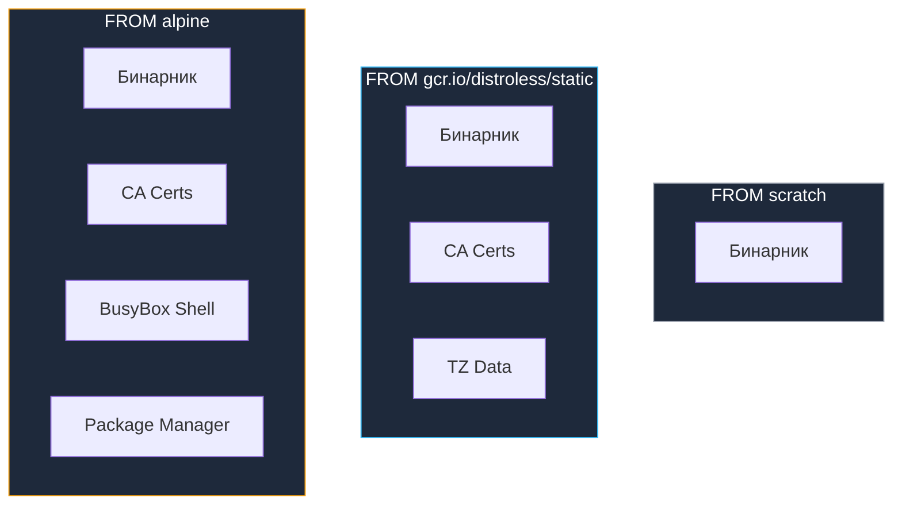

## Минимизация: Принцип необходимого и достаточного

В классической инженерной культуре Bell Labs и философии Unix всегда господствовал принцип умеренности: инструмент совершенен не тогда, когда в него больше нечего добавить, а тогда, когда из него больше нечего убрать. В мире контейнеризации размер артефакта имеет прямое физическое значение. Чем меньше байтов занимает образ, тем быстрее он пересылается по сети, тем меньше времени уходит на запуск новых подов в Kubernetes, тем ниже счета за облачные хранилища и, что самое главное, тем меньше поверхность потенциальной атаки.

Если для сред вроде Java или Python минимальный размер контейнера редко опускается ниже нескольких сотен мегабайт (из-за необходимости таскать за собой JRE, разделяемые библиотеки C и интерпретаторы), то компилируемый Go позволяет подойти к пределу минимализма — созданию практически «невесомых» контейнеров.

Мы переходим от вопроса «Как собрать контейнер?» к фундаментальному вопросу: «Что именно допустимо оставить в рантайме?». Наша инженерная цель — упаковать в образ только чистый машинный код вашего приложения.

---

## `scratch`: Абсолютный ноль

`scratch` — это особое зарезервированное ключевое слово в Docker. Это не операционная система, не дистрибутив и не базовая файловая система. Образ `scratch` представляет собой абсолютную пустоту размером ровно 0 байт. В нем нет ни одного файла: нет оболочки `/bin/sh`, нет библиотек, нет даже виртуального устройства `/dev/null`, пока вы или контейнерный движок его не создадите.

Для Go-микросервиса это идеальная среда развертывания, если приложение скомпилировано статически.

### Требования к бинарнику
Чтобы запуститься в пустом окружении `scratch`, бинарный файл должен быть **полностью статическим**. Он не должен содержать динамических ссылок на разделяемые объекты (`.so` файлы).

В Go это достигается гарантированным отключением CGO:

```bash
CGO_ENABLED=0 go build -ldflags="-s -w" -o main .
```

### Подводные камни и проблемы `scratch`

Когда вы выбрасываете из контейнера всю операционную систему, стандартная библиотека Go лишается привычной инфраструктуры, которую программисты обычно принимают как данность:

1. **SSL/TLS Сертификаты**:
   При выполнении исходящих HTTPS-запросов (например, к сторонним API или базе данных с TLS) пакет `crypto/x509` должен проверить цепочку доверия сертификатов удаленного сервера. Для этого ему необходим локальный доверенный набор корневых сертификатов (CA Bundle).
   * В дистрибутивах Ubuntu и Alpine эти сертификаты хранятся в `/etc/ssl/certs`.
   * В пустом образе `scratch` этой директории просто не существует.
   * **Результат**: фатальная ошибка `x509: certificate signed by unknown authority`.
   * **Решение**: перенести файл `ca-certificates.crt` со сборочного этапа (builder).

2. **Данные о часовых поясах (Timezone Data)**:
   Если ваш код вызывает `time.LoadLocation("Europe/Moscow")` или вычисляет локальное время, пакет `time` пытается прочесть системную базу данных часовых поясов IANA (обычно расположенную в `/usr/share/zoneinfo`).
   * В `scratch` этих каталогов нет.
   * **Результат**: аварийное завершение с ошибкой, паника или принудительный сброс локали в UTC по умолчанию.
   * **Решение**: скопировать `zoneinfo.zip` из тулчейна Go, смонтировать `/usr/share/zoneinfo` из билдера или импортировать пустой пакет `_ "time/tzdata"` в сам код приложения.

Эталонный `Dockerfile` для запуска в `scratch`:

```dockerfile
FROM golang:1.22-alpine AS builder
RUN apk add --no-cache ca-certificates tzdata
WORKDIR /app
COPY . .
RUN CGO_ENABLED=0 go build -o main .

# --- Final Stage ---
FROM scratch
# Копируем сертификаты (путь может отличаться в зависимости от базы билдера)
COPY --from=builder /etc/ssl/certs/ca-certificates.crt /etc/ssl/certs/
# Копируем данные таймзон (опционально)
COPY --from=builder /usr/share/zoneinfo /usr/share/zoneinfo
# Копируем бинарник
COPY --from=builder /app/main /main

ENTRYPOINT ["/main"]
```

---

## `distroless`: Безопасность «из коробки»

Инженеры Google предложили изящное компромиссное решение, создав проект **distroless**. Это семейство образов, специально спроектированное для компилируемых языков (Go, Rust), которое занимает промежуточную позицию между абсолютной пустотой `scratch` и самодостаточным `alpine`.

Образы Distroless:
1. Содержат предустановленные **CA сертификаты** и актуальную базу **tzdata**.
2. Содержат базовые системные файлы конфигурации `/etc/passwd` и `/etc/group` для управления пользователями.
3. **Не содержат** командной оболочки (Shell), пакетного менеджера и утилит операционной системы.



### Почему `distroless` предпочтительнее `scratch` для большинства команд?

В образе `scratch` вам приходится вручную поддерживать скрипты копирования сертификатов и таймзон. В образе `gcr.io/distroless/static-debian12` эта системная рутина уже решена авторами.

Кроме того, в `distroless` из коробки зарегистрирован непривилегированный системный пользователь `nonroot`, что позволяет легко соблюдать главную заповедь контейнерной безопасности: никогда не запускать рабочий процесс от пользователя `root`.

```dockerfile
FROM golang:1.22 AS builder
WORKDIR /app
COPY . .
RUN CGO_ENABLED=0 go build -o main .

# Используем distroless
FROM gcr.io/distroless/static-debian12:latest

# Копируем бинарник
COPY --from=builder /app/main /

# Запускаем от имени nonroot (UID 65532)
USER nonroot:nonroot

ENTRYPOINT ["/main"]
```

> [!info] Под капотом
> В Kubernetes и Docker запуск от `root` (по умолчанию) — это риск. Если злоумышленник взломает приложение, он получит root-доступ внутри контейнера. Хотя контейнеры изолированы, уязвимости ядра (container escape) позволяют выбраться на хост-систему. Запуск через `USER nonroot` — это слой защиты. В `scratch` пользователя нет, поэтому там процесс всегда запускается от root (UID 0), если только вы не создали `/etc/passwd` вручную. Distroless решает это автоматически.

---

## Размер имеет значение: Сравнительный анализ

Сравним типовые базовые слои для развертывания скомпилированного Go-приложения:

| Образ | Размер (сжатый) | Shell | Certs | Уровень безопасности |
| :--- | :--- | :--- | :--- | :--- |
| `golang:1.22` | ~800 MB | Да | Да | Низкий (лишние инструменты) |
| `alpine:latest` | ~5 MB | Да (`sh`) | Да | Средний (musl libc векторы атак) |
| `distroless/static` | ~2 MB | Нет | Да | Высокий |
| `scratch` | 0 MB | Нет | Нет | Максимальный (но требует ручной настройки) |

> [!warning] Ловушка / Gotcha
> **Отладка в Distroless.**
> Так как нет shell, вы не можете сделать `kubectl exec -it <pod> -- sh`. Как же дебажить?
> 1. Используйте логи (`kubectl logs`).
> 2. Используйте `debug` образы: `gcr.io/distroless/static:debug`. Они содержат `busybox` shell.
> 3. Используйте `kubectl debug` (ephemeral containers) — добавить временный контейнер с инструментами в тот же pod.
> 
> Наличие шелла в рабочем образе часто служит костылем для ленивой отладки, но платой за этот костыль становится брешь в безопасности всего продакшен-кластера.

---

## Итог

1. **Scratch** — выбор для ценителей абсолютного минимализма. Он обеспечивает нулевую поверхность атаки, но перекладывает заботу о сертификатах доверия и базах таймзон на плечи инженера.
2. **Distroless** — общепризнанный золотой стандарт промышленного продакшена, идеально балансирующий между жесткой изоляцией и наличием необходимых системных сертификатов.
3. Всегда декларируйте исполнение процесса от имени непривилегированного пользователя (`USER nonroot:nonroot`), нивелируя риски побега из контейнера при уязвимостях ядра.
4. Отсутствие командной оболочки в продакшене — это осознанное достоинство, а не ограничение: используйте эфемерные отладочные контейнеры вместо захламления боевых сред.

Мы научились упаковывать бинарник Go в ультракомпактные контейнеры. Однако если каждый запуск сборщика на CI будет выкачивать зависимости и компилировать проект с нуля, время обратной связи для разработчика быстро выйдет из-под контроля.

В следующей статье мы разберем тонкости кэширования сборок в Docker: [[25. Кэширование сборки Docker]].