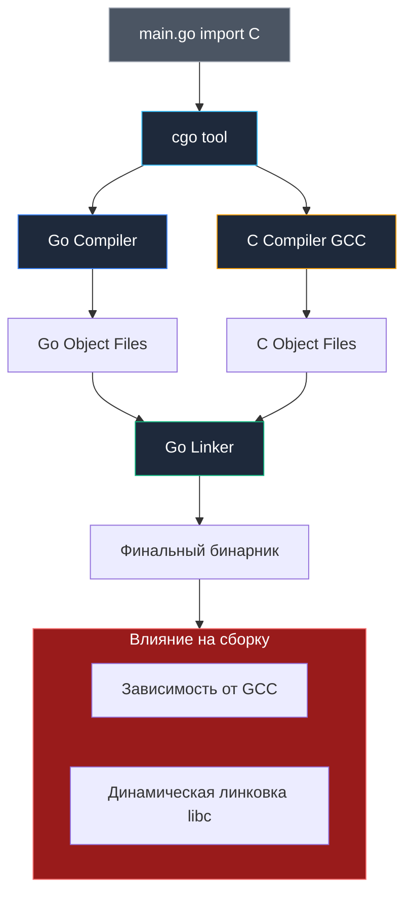

## Мост между мирами: CGO и цена компромисса

Когда мы с Деннисом Ритчи писали книгу о языке C в стенах Bell Labs, перед нами стояла задача создать предельно лаконичный инструмент системного программирования: ручное управление памятью через указатели, фиксированные стеки потоков и прямой доступ к регистрам процессора. Тридцать лет спустя Роб Пайк и Кен Томпсон создали Go как ответ на вызовы XXI века: безопасная работа с памятью, автоматический сборщик мусора (GC) и сверхлегковесные горутины с динамическими стеками.

**CGO** — это технологический мост между этими двумя фундаментально разными мирами. Это инструмент, позволяющий программам на Go вызывать существующие библиотеки на языке C, и наоборот.

Для опытного инженера CGO — это мощный, но обоюдоострый меч. С одной стороны, он открывает доступ к колоссальному наследию проверенных десятилетиями библиотек C (криптография OpenSSL, движок SQLite, обработка изображений ImageMagick, драйверы специфичного оборудования). С другой стороны, подключение CGO мгновенно перечеркивает ключевые инженерные преимущества Go: молниеносную скорость компиляции, создание единого автономного статического бинарника и гарантии безопасности памяти.

---

## Как это работает (Under the hood)

Когда компилятор видит в исходном коде псевдопакет `import "C"`, в процесс сборки вмешивается специализированная утилита `cgo`:

1. **Генерация оберток (Code Generation):** Утилита `cgo` считывает комментарии над директивой `import "C"` (так называемый преамбул C), извлекает заголовочные файлы (`#include <stdlib.h>`) и синтезирует промежуточные файлы:
   * `.go` файлы с низкоуровневыми обертками для вызова C-функций через структуры рантайма.
   * `.c` файлы с шлюзами для экспорта Go-функций во внешний мир C.
2. **Раздельная компиляция:** Компилятор Go (`compile`) собирает часть на чистом Go, а внешний C-компилятор (`gcc` или `clang`) компилирует сгенерированный C-код в стандартные объектные файлы `.o`.
3. **Линковка и компоновка:** Компоновщик Go (`link`) или внешний системный линкер объединяет объектные файлы в единый исполняемый модуль, связывая его с системными библиотеками C.



> [!info] Под капотом: Стеки и Runtime
> Это критически важный момент для понимания производительности. Go использует **динамические стеки** (начинаются с 2KB и растут/сжимаются по необходимости). C ожидает **большой фиксированный стек** (обычно 2MB-8MB).
> 
> При вызове C-функции через CGO, Go-рантайм должен "отключить" свой планировщик для текущей горутины и переключиться на системный стек (System Stack, `g0` или `gsignal`). Это дорогостоящая операция (порядка 50-100 наносекунд, что в 10-50 раз дороже обычного вызова функции).
> Поэтому CGO не подходит для узких циклов (например, вызов C-функции для сложения двух чисел в цикле). Оверхед съест весь выигрыш.

---

## Влияние на сборку и Docker

Активация CGO кардинально трансформирует всю цепочку поставки приложения:

### 1. Жесткая зависимость от внешнего C-компилятора
Проект больше не компилируется «из коробки» чистым тулчейном Go. На хост-машине или сборочном агенте CI обязательно должно присутствовать полноценное окружение сборки: пакет `build-essential` (в Linux), Xcode Command Line Tools (в macOS) или MinGW (в Windows).

### 2. Принудительная динамическая линковка
По умолчанию CGO генерирует динамически скомпонованный исполняемый файл, завязанный на системную библиотеку языка C (`libc.so` / `glibc` в Linux):
* Вы больше **не можете** использовать абсолютно пустой образ `FROM scratch` в Docker: без `ld-linux.so` и `libc.so` ядро Linux выдаст ошибку `not found`.
* Приходится использовать образы с дистрибутивом Linux (`FROM debian/ubuntu`) или легковесный `FROM alpine`.
* Возникает скрытая несовместимость: бинарник, скомпилированный на хосте с GNU `glibc`, откажется запускаться в Alpine Linux, где используется альтернативная библиотека `musl libc`.

### 3. Смерть тривиальной кросс-компиляции
Привычная и элегантная команда `GOOS=linux GOARCH=arm64 go build` перестает работать. Для кросс-компиляции с CGO требуется развертывать специализированные кросс-компиляторы C (`aarch64-linux-gnu-gcc`), настраивать системные заголовочные файлы целевой архитектуры и собирать для нее всю иерархию библиотек C.

> [!warning] Ловушка / Gotcha
> Пакет `net` в стандартной библиотеке Go по умолчанию на Linux использует CGO для DNS-резолвинга через системный вызов glibc `getaddrinfo`.
> При сборке с `CGO_ENABLED=0` чистая Go-реализация резолвера (`netgo`) активируется автоматически, и бинарник линкуется статически.
> Флаг сборки `-tags netgo` (как и `-tags osusergo` для `os/user`) необходим тогда, когда проект собирается с `CGO_ENABLED=1` (например, при наличии C-зависимостей вроде SQLite), но требуется изолировать сетевой стек от glibc и использовать встроенный Go-резолвер:
> ```bash
> go build -tags "netgo osusergo" .
> ```

---

## `CGO_ENABLED`: Главный рубильник тулчейна

Поведение сборочного тулчейна контролируется переменной окружения **`CGO_ENABLED`**:

* **`CGO_ENABLED=1`**: Значение по умолчанию для Linux и macOS. Компилятор разрешает использование CGO. Если в коде встречается `import "C"`, он транслируется через `gcc`. Кроме того, даже если ваш код не содержит прямых вызовов C, стандартные пакеты (`os/user`, `net`) могут использовать системные вызовы glibc через CGO для чтения системных учетных записей или резолвинга DNS.
* **`CGO_ENABLED=0`**: CGO категорически запрещен:
  * Компилятор полностью игнорирует файлы с `import "C"`.
  * Все стандартные библиотеки переключаются на чистые Go-реализации (Pure Go implementations).
  * Результат: монолитный, абсолютно статический бинарник, готовый к запуску в `scratch`.
  * Если в вашем проекте есть принудительный вызов `import "C"`, сборка завершится ошибкой компиляции.

---

## Производительность и безопасность: Скрытые риски

Помимо накладных расходов на переключение системных стеков `g0`, использование CGO вскрывает две опасные бреши в модели безопасности:

1. **Неуправляемые падения (Segmentation Fault):** Язык C не знает о механизме `panic` и `recover`. Если вызываемая C-библиотека совершит обращение по нулевому указателю (SIGSEGV) или повредит память, весь процесс ОС упадет мгновенно (crash), не предоставив Go-рантайму шанса на перехват и корректное завершение транзакций.
2. **Слепота сборщика мусора (Garbage Collector):** Сборщик мусора Go ничего не знает о блоках памяти, выделенных на C-куче через `malloc`. Если вы передаете указатель на структуру Go во внешний C-код, а ссылка внутри Go теряется, сборщик мусора переместит или освободит этот участок памяти, что приведет к коварным гонкам и повреждению памяти (use-after-free). Для безопасной передачи данных необходимо использовать копирование через `C.GoString` / `C.CBytes` или явно регистрировать финализаторы через `runtime.SetFinalizer`.

> [!tip] Собеседование
> **Вопрос:** В каком случае стоит использовать CGO, а когда лучше переписать код на Go?
> **Ответ:**
> Использовать CGO стоит только если:
> 1. Нет аналогов на Go (например, драйвер специфичного железа).
> 2. Переписывание огромной библиотеки (например, криптографии или видеокодека) нецелесообразно.
> 
> Всегда предпочтительнее Pure Go реализация. Она безопаснее, быстрее компилируется, легче деплоится (один бинарник) и не ломает кросс-компиляцию.

---

## Итог

1. **CGO** — мощный шлюз в экосистему C, открывающий доступ к уникальным библиотекам, но ломающий переносимость и статическую сборку Go.
2. Использование CGO требует установки локального C-компилятора (`gcc`/`clang`) и системных заголовочных файлов.
3. CGO приводит к динамической линковке с `libc`, что делает невозможным развертывание в чистом образе `scratch`.
4. Для получения чистых, безопасных и легковесных бинарников всегда принудительно отключайте C-шлюз директивой **`CGO_ENABLED=0`**.

Мы разобрались со сложностями низкоуровневой сборки и зависимостями. Теперь обратимся к тому, что происходит с бинарником на этапе компиляции: как отладочная информация влияет на размер файла и как подготовить приложение к профилированию.

В следующей статье мы исследуем структуру бинарного файла и работу с отладочными символами: [[35. Debug сборки и символы]].