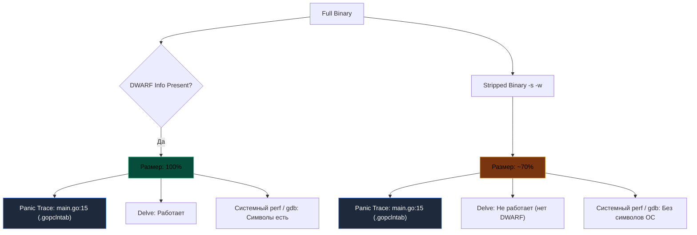

## Невидимый вес: Анатомия отладочной информации и символов

В раннюю эпоху Unix на миникомпьютерах PDP-11 дисковое пространство измерялось считанными мегабайтами. Чтобы сэкономить драгоценные блоки диска, Кен Томпсон создал системную утилиту `strip`, которая безжалостно вырезала таблицу символов из исполняемых файлов a.out. Спустя полвека компилятор Go по умолчанию придерживается диаметрально противоположной философии: он щедро снабжает каждый скомпилированный бинарник исчерпывающей отладочной информацией.

Скомпилированный Go-бинарник содержит не только «сырой» машинный код инструкций процессора, но и богатейший пласт метаданных. Этот невидимый багаж колоссально помогает инженеру при отладке и профилировании, но увеличивает физический размер файла на диске.

Понимание того, как устроены внутренние секции бинарного контейнера и какую цену мы платим за их удаление, — один из ключевых признаков зрелого системного инженера.

---

## DWARF: Карта сокровищ внутри бинарника

В отличие от традиционных компиляторов C или C++, где отладочные символы генерируются только по явному запросу (`-g`), компилятор Go по умолчанию включает полную отладочную информацию в формате **DWARF (Debugging With Attributed Record Formats)**.

Формат DWARF представляет собой структурированную базу данных, аккуратно упакованную в специальные секции исполняемого файла (ELF, Mach-O или PE). Она служит переводчиком между миром машинных инструкций процессора и миром исходного кода программиста.

Секции DWARF хранят три ключевых блока знаний:
1. **Таблица символов (Symbol Table):** Сопоставление числовых виртуальных адресов памяти именам функций, методов и глобальных переменных пакетов.
2. **Линейная информация (Line Number Table):** Прямой мэппинг смещений адресов инструкций в памяти на конкретные номера строк и имена файлов исходного кода (`main.go:42`).
3. **Информация о типах (Type Information):** Структурные описания типов данных: имена полей структур, интерфейсные таблицы, размеры аллокаций и смещения указателей.

> [!info] Под капотом
> Если вы запустите `go build` без флагов, а затем сделаете `go tool objdump -S main`, вы увидите ассемблерный код, перемежающийся строками Go-кода. Это возможно благодаря DWARF-секциям в ELF-файле. Если эту информацию вырезать, останется только "голый" ассемблер.
> 
> Утилита `objdump` обращается к секции `.debug_line`, извлекает адрес счетчика команд (PC) и выводит соответствующую строку оригинального кода на Go над блоком ассемблерных инструкций.

---

## `-ldflags="-s -w"`: Хирургическое удаление метаданных

Если для клиентских CLI-утилит или встраиваемых устройств размер бинарника критичен, компоновщик Go позволяет вырезать эти секции с помощью параметров компоновщика `-ldflags`:

* **`-s`**: Вырезает таблицу символов (symbol table). Бинарник перестает «знать» имена неэкспортируемых функций в секциях символов.
* **`-w`**: Вырезает отладочную информацию DWARF (секции `.debug_*`).

Пример оптимизации:

```bash
# Полный бинарник: ~15 MB
go build -o app_full .

# Облегченный бинарник: ~10 MB
go build -ldflags="-s -w" -o app_stripped .
```

Связка флагов `-s -w` уменьшает физический размер результирующего бинарного файла на 25–35%.



---

## Цена легкости: Обратная сторона медали

Уменьшение размера бинарника на 25–35% делает флаги `-s -w` стандартом де-факто при сборке образов в Docker (`scratch`, `distroless`). Однако важно точно понимать, какая информация удаляется, а какая остается нетронутой.

### 1. Трассировка стека (Stack Traces) и таблица `.gopclntab`
Распространенное заблуждение гласит, что флаги `-s -w` якобы «калечат» стек-трейсы паник, превращая их в голые шестнадцатеричные адреса и заглушки `<autogenerated>:1`. Это не так.

Рантайм Go для построения трассировки вызовов при `panic` или вызовах `runtime.Caller` не обращается ни к формату DWARF (удаляемому флагом `-w`), ни к стандартной таблице символов ELF/Mach-O `.symtab` (удаляемой флагом `-s`). Рантайм читает собственную внутреннюю таблицу **`.gopclntab`** (Program Counter to Line Table), которая встроена в исполняемый сегмент данных (`.rodata`/`.text`) и **никогда не вырезается линкером**.

Поэтому даже в стрипнутом бинарнике дежурный инженер видит в логах точные имена функций, файлов и номера строк:

```text
panic: something went wrong
goroutine 1 [running]:
main.processData(0x0)
        /app/service/processor.go:45 +0x12a
main.main()
        /app/cmd/main.go:12 +0x3b
```

### 2. Невозможность интерактивной отладки (Delve)
Главная реальная жертва стриппинга — отладчик **Delve (`dlv debug` / `dlv attach`)**. Delve критически зависит от DWARF-информации: структуры типов, имена локальных переменных, аргументы функций и сопоставление инструкций строкам для установки точек останова (breakpoints) извлекаются именно из DWARF-секций.

Если бинарник собран с `-w`, подключиться к работающему процессу в контейнере через `dlv attach` не удастся — отладчик завершится с ошибкой отсутствия отладочных секций.

### 3. Системные профилировщики и отладчики ОС (perf, GDB)
Встроенный профилировщик Go (`runtime/pprof`, `net/http/pprof`) опирается на рантайм Go и таблицу `.gopclntab`, поэтому сохраняет имена функций и строк даже при использовании `-s -w`.

Однако низкоуровневые инструменты операционной системы ведут себя иначе:
* **Linux `perf` и eBPF-профилировщики:** Если утилита не имеет специализированного Go-парсера `.gopclntab`, она читает таблицу `.symtab` ELF-бинарника (удаленную флагом `-s`). Без нее `perf report` покажет шестнадцатеричные адреса инструкций вместо читаемых имен функций, а раскрутка стека через DWARF (`--call-graph dwarf`) станет невозможной.
* **GDB и Core Dumps:** Посмертный анализ аварийных дампов памяти (core dumps) через `gdb` без DWARF не сможет сопоставить переменные и структуры с исходным кодом.

---

## Инспекция бинарника: `go tool nm` и `objdump`

Даже в бинарниках, собранных с флагами `-s -w`, компилятор сохраняет часть информации о типах: метаданные, необходимые для работы механизмов рефлексии (reflection), интерфейсных таблиц `itab` и сборщика мусора.

Исследовать символы любого бинарного файла Go можно с помощью встроенной утилиты **`go tool nm`**:

```bash
# Список всех символов в бинарнике
go tool nm app_full | grep main
# 10aa40 T main.main
# 10ab20 T main.processData
```

Буква `T` обозначает символ в секции исполняемого кода (Text Section), а шестнадцатеричное число — виртуальный адрес функции в адресном пространстве процесса. Эта утилита незаменима при расследовании того, попала ли конкретная функция в финальную сборку или была отсечена оптимизатором мертвого кода (dead-code elimination).

---

## Best Practice: Что выбирать?

> [!warning] Ловушка / Gotcha
> Флаги `-ldflags="-s -w"` — отличный инструмент оптимизации размера контейнеров, но их нужно применять осознанно:
> *   **Dev / Staging**: Не удаляйте символы. Полные DWARF-секции необходимы для отладки через Delve и локального профилирования.
> *   **Production (микросервисы в Kubernetes/Docker)**: Использование `-s -w` безопасно и оправдано, так как логи паник сохраняют имена функций и номеров строк благодаря `.gopclntab`.
> *   **Production (при необходимости глубокой диагностики)**: Если архитектура предусматривает подключение `dlv attach` в контейнерах или низкоуровневое системное профилирование узлов через Linux `perf`/eBPF, сохраняйте DWARF-символы или выгружайте их в отдельный артефакт сборки.
> *   **CLI Tools / Client Apps**: Удаление символов настоятельно рекомендуется для ускорения скачивания и уменьшения дискового следа.

---

## Итог

1. По умолчанию компилятор Go включает полную отладочную информацию в формате **DWARF**.
2. Флаги компоновщика `-ldflags="-s -w"` позволяют уменьшить размер исполняемого файла на 25–35%.
3. Стриппинг бинарника **не лишает** логи паник номеров строк и имен файлов: стек-трейсы обслуживаются внутренней таблицей `.gopclntab`, которая сохраняется всегда.
4. Плата за флаги `-s -w` — невозможность подключения отладчика Delve и затруднение системного профилирования через внешние инструменты ОС (Linux `perf`, GDB core dumps).

Мы детально исследовали внутреннюю структуру бинарников и механизмы отладки. Теперь обратимся к автоматизированному контролю производительности кода в непрерывном конвейере сборки.

В следующей статье мы рассмотрим профилирование и контроль регрессий производительности в CI: [[36. Профилирование в CI]].