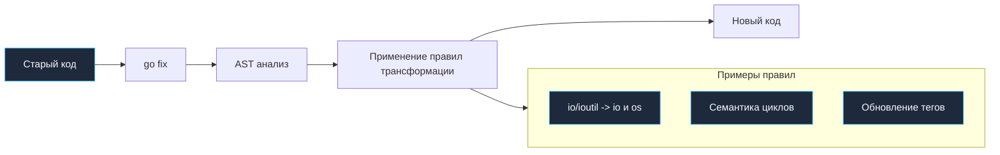

Если `go vet` — это строгий диагност, указывающий на скрытые патологии в коде, то `go fix` — это хирург. Это специализированный инструмент тулчейна, который автоматически переписывает исходный код, чтобы привести его в полное соответствие с новыми стандартами языка и обновленными сигнатурами API стандартной библиотеки.

Долгое время `go fix` воспринимался как «спящая красавица» тулчейна — инструмент, сыгравший колоссальную роль в эпоху становления Go 1.0, но затем тихо стоявший в стороне. Однако в современных версиях (начиная с Go 1.22) утилита получила второе дыхание и была переписана, получив модульную архитектуру на базе современного фреймворка статического анализа и способность безопасно устранять технический долг в кодовых базах любого масштаба.

---

## Зачем нужен `go fix`?

Язык Go славится своей бескомпромиссной гарантией обратной совместимости (*Go 1 Compatibility Promise*): код, написанный более десяти лет назад для Go 1.0, без проблем скомпилируется современным компилятором. Но обратная совместимость не означает, что старые интерфейсы навсегда остаются лучшим способом решения инженерных задач. 

Пакеты депрекейтятся, неудачные исторические имена функций заменяются на более логичные, а семантика конструкций рантайма эволюционирует в сторону большей надежности.

`go fix` решает проблему накопления технического долга. Он не заставляет инженеров часами монотонно выискивать устаревшие вызовы по всему репозиторию: инструмент находит паттерны старого кода на уровне синтаксического дерева и преобразует их в новые, современные идиомы.



---

## Как это работает (Under the hood)

В отличие от текстовых утилит вроде `sed` или скриптов на Python с регулярными выражениями, `go fix` оперирует не строками текста, а **Абстрактным Синтаксическим Деревом (AST)** и метаданными типов:

1.  **Парсинг:** Исходный код читается и преобразуется в AST с сохранением всех комментариев и позиций токенов в файле.
2.  **Обход дерева:** Драйвер обходит узлы синтаксического дерева, сопоставляя их с зарегистрированными правилами трансформации («фиксы»).
3.  **Безопасная замена:** Если правило находит совпадение, соответствующие узлы дерева заменяются на новые синтаксические конструкции.
4.  **Управление импортами:** Инструмент автоматически корректирует секцию `import`: удаляет неиспользуемые импорты устаревших пакетов и аккуратно добавляет новые.
5.  **Форматирование:** Измененное синтаксическое дерево сериализуется обратно в файл на диске с сохранением канонического форматирования `gofmt`.

> [!info] Под капотом
> В современных версиях Go архитектура `go fix` строится на базе `analysis.Driver` (похожей на `go vet`), но вместо отчетов об ошибках анализаторы генерируют правки (edits). Это позволяет писать сложные миграции, которые учитывают типы данных и область видимости переменных.

---

## Ключевые сценарии использования

### 1. Миграция с устаревших пакетов
Самый известный пример — депрекейция пакета `io/ioutil` в Go 1.16. Функции переехали в `io` и `os`.
Вместо того чтобы вручную искать и заменять `ioutil.ReadFile` на `os.ReadFile`, можно запустить:

```bash
go fix
```

Было:
```go
data, err := ioutil.ReadFile("file.txt")
```

Станет:
```go
data, err := os.ReadFile("file.txt")
```

### 2. Изменение семантики циклов (Go 1.22+)
С развитием языка меняются не только имена, но и поведение. В Go 1.22 семантика переменных цикла изменилась: переменные теперь создаются заново на каждой итерации. Анализатор `forvar` в составе `go fix` находит и автоматически удаляет ставший избыточным защитный бойлерплейт вида `x := x`, который разработчики годами писали вручную для предотвращения гонок и замыканий.

### 3. Обновление тегов сборки
Переход со старого формата тегов `// +build` на новый `//go:build` также может быть автоматизирован через `go fix`, обеспечивая консистентность объявлений.

---

## Использование

Запуск осуществляется так же просто, как и `go fmt`:

```bash
# Применить фиксы к текущему пакету
go fix

# Применить фиксы ко всему проекту
go fix ./...
```

> [!warning] Ловушка / Gotcha
> `go fix` переписывает файлы **in-place** (прямо на диске). Перед запуском обязательно убедитесь, что ваш рабочий каталог чист и код закоммичен в Git. Хотя `go fix` старается быть безопасным, автоматическая правка кода всегда несет риски. Всегда просматривайте `git diff` после его работы и прогоняйте полный набор тестов `go test ./...`.

---

## `go fix` vs Ручной рефакторинг

| Характеристика | Ручной поиск/замена | `go fix` |
| :--- | :--- | :--- |
| **Контекст** | Не учитывает область видимости, может сломать строки. | Работает с AST, учитывает контекст. |
| **Типы** | Игнорирует типы. | Может учитывать типы (в новых версиях). |
| **Импорты** | Требует ручного обновления `import`. | Автоматически обновляет блок `import`. |
| **Скорость** | Медленно на большой кодовой базе. | Мгновенно. |

> [!tip] Собеседование
> **Вопрос:** В чем разница между `go fmt` и `go fix`?
> **Ответ:** `go fmt` занимается косметологией: выравнивает отступы, приводит код к стандартному стилю, но **не меняет** логику и семантику программы. `go fix` занимается хирургией: он меняет имена функций, пакеты и паттерны использования, фактически меняя код программы (с сохранением поведения), чтобы адаптировать его к новым версиям Go.

---

## Итог

1.  **`go fix`** — инструмент для автоматической миграции кода на новые версии Go.
2.  Он работает на уровне AST, что безопаснее текстовых замен.
3.  В современных версиях (Go 1.22+) он значительно расширил свои возможности (удаление избыточных `x := x`, переход на `//go:build`, замена устаревших библиотек).
4.  Используйте его при обновлении версии Go в продакшене, чтобы убрать использование deprecated API.

Код исправлен, миграции пройдены. Теперь нужно привести его к идеальному виду, чтобы любой член команды мог его легко читать. В следующей статье мы разберем инструменты форматирования: [[8. go fmt и goimports. Форматирование кода.md]].