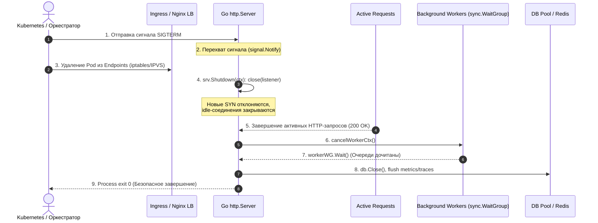

В реальном мире ни один сервер не работает вечно. Сервисы непрерывно перезапускаются при развертывании новых версий (rolling updates), масштабируются оркестраторами вроде Kubernetes при колебаниях нагрузки или перемещаются между физическими нодами во время регламентных работ в дата-центре.

Внезапное выключение процесса вызовом `os.Exit(0)` или перехват грубого `SIGKILL` подобны выдергиванию сетевого шнура из розетки прямо во время записи на диск: активные транзакции обрываются, клиенты получают уродливые ошибки `502 Bad Gateway`, а незавершенные фоновые задачи оставляют базу данных в рассогласованном состоянии. Настоящая культура проектирования бэкенда требует грациозности — детерминированного и безопасного завершения работы (**Graceful Shutdown**).



---

## Graceful shutdown. Корректное завершение сервиса

Graceful shutdown — это не просто вызов `os.Exit(0)`. Это детерминированный процесс завершения работы сервиса, который гарантирует:
- Отправку валидных HTTP-ответов на уже принятые запросы
- Корректное закрытие пулов соединений (БД, Redis, очереди)
- Завершение фоновых задач без потери данных
- Бесшовное взаимодействие с балансировщиками нагрузки и оркестраторами (Kubernetes, Docker Swarm)

Без корректного завершения rolling-обновления приводят к 502 Bad Gateway, незавершенным транзакциям и повреждению состояния в распределенных системах.

---

### Уровень ОС и TCP-стейтмашина

Когда оркестратор или администратор останавливает контейнер, ядро ОС отправляет процессу сигнал `SIGTERM`. По умолчанию Go не обрабатывает сигналы самостоятельно — процесс завершается мгновенно. Но нам нужно перехватить этот сигнал и запустить процедуру очистки.

С точки зрения сетевого стека:
1. Сервер закрывает слушающий сокет (`close(listener)`). Новые TCP SYN-пакеты получают `Connection Refused` или `RST`.
2. Load Balancer (nginx, AWS ALB, kube-proxy) обнаруживает ошибку подключения и выводит инстанс из пула.
3. Уже установленные TCP-соединения остаются в состоянии `ESTABLISHED`. Сервер продолжает читать/писать в них до завершения обработки или истечения таймаута.
4. При принудительном разрыве отправляется TCP `FIN` (грациозно) или `RST` (жестко). `FIN` позволяет клиенту получить оставшиеся байты, `RST` обрывает поток мгновенно.

> [!info] Под капотом
> В Linux закрытие слушающего сокета не закрывает уже принятые дескрипторы соединений. Они живут в файловой таблице процесса до явного `close()`. Graceful shutdown итерируется по этой таблице, дожидаясь завершения обработки или выполняя `shutdown(fd, SHUT_RDWR)` для форсированного закрытия.

---

### Под капотом. Как работает `http.Server.Shutdown`

Внутренний механизм `http.Server` в Go построен вокруг централизованного трекинга открытых сокетов. В исходном коде (`src/net/http/server.go`) сервер хранит единую хеш-таблицу соединений под защитой мьютекса:
- `activeConn map[*conn]struct{}`: множество всех открытых клиентских TCP-соединений. Текущий статус сокета (`StateNew`, `StateActive`, `StateIdle`, `StateClosed`) хранится непосредственно в самом экземпляре `*conn` и защищается его внутренним атомарным состоянием (`c.getState()`).

При вызове `Shutdown(ctx)`:
1. Атомарно выставляется флаг завершения работы `s.inShutdown.Store(true)`.
2. Закрываются все слушающие сокеты `net.Listener`, что прекращает прием новых входящих запросов и заставляет `Serve()` немедленно вернуть `ErrServerClosed`.
3. В отдельных горутинах вызываются зарегистрированные хуки `s.onShutdown`.
4. Метод `closeIdleConns()` обходит `s.activeConn` под `s.mu.Lock()` и немедленно закрывает все соединения, находящиеся в статусе `StateIdle`.
5. Сервер запускает цикл ожидания с экспоненциальным поллингом и джиттером (с шагом от 1 мс до 500 мс), ожидая перехода оставшихся соединений в статус завершенных и их удаления из `activeConn`.
6. Если переданный контекст `ctx` истекает до того, как все горутины обработчиков закончили работу, метод `Shutdown` завершается с возвратом ошибки `ctx.Err()`. Для жесткого принудительного обрыва оставшихся сокетов используется вызов `server.Close()`.

---

### Production-реализация

Полноценный канонический шаблон graceful shutdown с раздельными контекстами, логированием и очисткой внешних ресурсов:

```go
package main

import (
    "context"
    "errors"
    "log"
    "net/http"
    "os"
    "os/signal"
    "syscall"
    "time"
)

func main() {
    // 1. Инициализация сервера с адекватными таймаутами
    srv := &http.Server{
        Addr:              ":8080",
        ReadTimeout:       10 * time.Second,
        ReadHeaderTimeout: 5 * time.Second,
        WriteTimeout:      15 * time.Second,
        IdleTimeout:       60 * time.Second,
        Handler:           setupRouter(),
    }

    // 2. Запуск в отдельной горутине
    go func() {
        log.Println("Starting HTTP server on :8080")
        if err := srv.ListenAndServe(); err != nil && !errors.Is(err, http.ErrServerClosed) {
            log.Fatalf("HTTP server fatal error: %v", err)
        }
    }()

    // 3. Ожидание сигнала завершения ОС
    quit := make(chan os.Signal, 1)
    signal.Notify(quit, syscall.SIGTERM, syscall.SIGINT)
    <-quit
    log.Println("Shutdown signal received. Starting graceful shutdown...")

    // 4. Контекст с жестким таймаутом на весь процесс остановки
    // Важно: таймаут должен быть меньше terminationGracePeriodSeconds в K8s
    shutdownCtx, shutdownCancel := context.WithTimeout(context.Background(), 15*time.Second)
    defer shutdownCancel()

    // 5. Остановка HTTP-сервера
    if err := srv.Shutdown(shutdownCtx); err != nil {
        log.Fatalf("HTTP server shutdown error: %v", err)
    }

    // 6. Очистка внешних зависимостей
    if err := cleanupDependencies(shutdownCtx); err != nil {
        log.Printf("Dependencies cleanup failed: %v", err)
    }

    log.Println("Server exited gracefully")
}

func cleanupDependencies(ctx context.Context) error {
    // Закрытие пула БД, отправка финальных метрик, flush логов
    // db.Close(), redis.Close(), otel.Shutdown(ctx)
    return nil
}

func setupRouter() http.Handler {
    mux := http.NewServeMux()
    mux.HandleFunc("/", func(w http.ResponseWriter, r *http.Request) {
        time.Sleep(50 * time.Millisecond)
        w.Write([]byte("OK"))
    })
    return mux
}
```

---

### Управление фоновыми процессами и зависимостями

`http.Server.Shutdown` **не останавливает** горутины, запущенные внутри обработчиков. Если ваш хендлер запускает фоновую задачу (отправка email, асинхронная запись в Kafka), вы обязаны передать `r.Context()` и отслеживать его отмену.

```go
func longTaskHandler(w http.ResponseWriter, r *http.Request) {
    // Контекст автоматически отменится при graceful shutdown или разрыве соединения
    ctx := r.Context()
    
    // Асинхронная работа должна проверять ctx.Done()
    select {
    case <-ctx.Done():
        log.Println("Background task cancelled due to shutdown/client disconnect")
        return
    case <-time.After(5 * time.Second):
        // Завершение задачи
        log.Println("Task completed")
    }
}
```

Для тяжелых фоновых воркеров используйте `sync.WaitGroup` и отдельный сигнал отмены:

```go
var workerWG sync.WaitGroup

func startWorker(ctx context.Context) {
    workerWG.Add(1)
    go func() {
        defer workerWG.Done()
        for {
            select {
            case <-ctx.Done():
                log.Println("Worker stopping gracefully")
                return
            default:
                // Обработка задачи
                time.Sleep(100 * time.Millisecond)
            }
        }
    }()
}

// В main, после srv.Shutdown:
// cancelWorkerCtx()
// workerWG.Wait()
```

> [!warning] Ловушка / Gotcha
> **Таймаут в K8s vs Server**: В Kubernetes по умолчанию `terminationGracePeriodSeconds` равен 30. За это время под получает `SIGTERM`, выполняет graceful shutdown, и если не завершился — получает `SIGKILL`. Если ваш `http.Server.Shutdown` имеет таймаут 30 секунд, `SIGKILL` может сработать одновременно с завершением работы. Всегда задавайте таймаут сервера на 5-10 секунд меньше периода завершения пода.  
> **Readiness Probe**: Не отключайте readiness probe сразу при получении `SIGTERM`. Балансировщик должен успеть вывести инстанс из пула. Добавьте задержку 2-3 секунды между закрытием listener и началом `Shutdown`, либо используйте preStop hook.

> [!tip] Собеседование
> **Вопрос:** Чем `http.Server.Close()` отличается от `http.Server.Shutdown(ctx)`?  
> **Ответ:** `Close()` немедленно закрывает listener и **все** активные соединения, разрывая текущие запросы (клиенты получат `Connection reset by peer`). `Shutdown(ctx)` закрывает listener, но позволяет активным соединениям завершить обработку в пределах таймаута контекста. В production всегда используется `Shutdown`.  
> **Вопрос:** Что произойдет, если обработчик игнорирует `ctx.Done()` и зависает на 10 минут?  
> **Ответ:** `Shutdown` будет ждать истечения своего контекста. По таймауту он принудительно закроет соединение. Но ресурс (горутина, транзакция БД, открытый файл) может остаться висеть до завершения процесса. Именно поэтому важно прокидывать `ctx` во все блокирующие вызовы.

---

### Итог

1. Graceful shutdown — обязательный атрибут production-сервиса, работающего в кластере.
2. `http.Server.Shutdown(ctx)` закрывает listener, ждет завершения активных запросов и корректно закрывает соединения.
3. Всегда используйте контекст с таймаутом, меньшим, чем `terminationGracePeriodSeconds` оркестратора.
4. Фоновые горутины и зависимости должны явно отслеживать отмену контекста или использовать `sync.WaitGroup`.
5. Связка `SIGTERM` -> `Shutdown` -> `cleanup` -> `exit 0` гарантирует нулевую потерю данных и отсутствие 502 при деплое.

Следующая статья: [[11. Конфигурация приложения]]