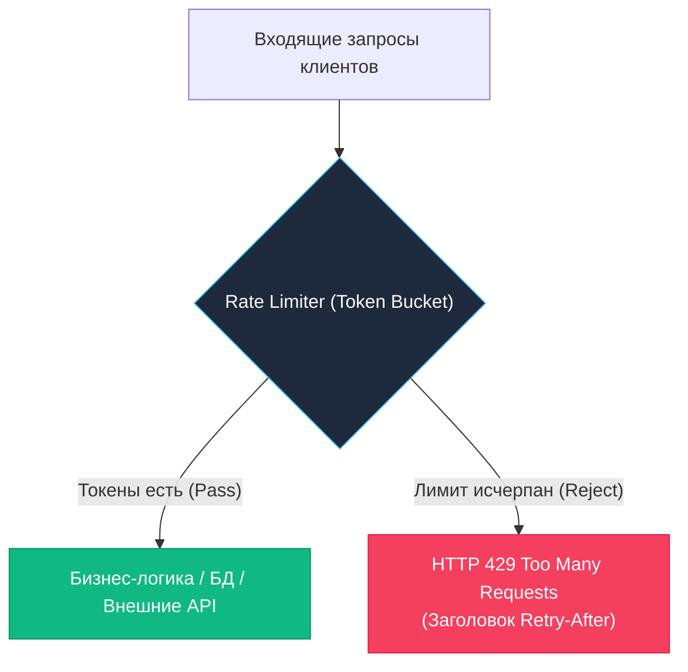

В разработке сетевого программного обеспечения существует неизменное правило: если вы не контролируете потребление ресурсов вашей системой, его будут контролировать внешние обстоятельства — и, как правило, в самый неподходящий момент.

В мире Go rate limiting (ограничение частоты запросов) — это отнюдь не только щит от злонамеренных DDoS-атак. Это фундаментальный инструмент управления ресурсами, гарантия соблюдения SLA (Service Level Agreements), предотвращение каскадных сбоев (cascading failures) в распределенных системах и контроль расходов при потреблении платных сторонних API. Если в классических стеках вроде PHP лимиты традиционно перекладывают на плечи Nginx или пограничного API Gateway, то Go-сервисы обязаны уметь самостоятельно и с ювелирной точностью дозировать нагрузку на уровне собственного рантайма. Миллионы легковесных горутин способны мгновенно перегрузить базу данных или исходящую сеть, если внутри приложения отсутствует жесткая архитектурная дисциплина.

## 1. Зачем нужен Rate Limiting

Rate limiting в надежных бэкенд-сервисах решает три фундаментальные задачи:

- **Защита инфраструктуры**: предотвращает перегрузку CPU, памяти и пулов соединений при резких всплесках трафика (traffic spikes). Отказ в обслуживании на раннем этапе (HTTP 429) стоит процессору единицы микросекунд, тогда как обработка обреченного запроса с последующим таймаутом сжигает драгоценные миллисекунды и память.
- **Справедливое распределение**: гарантирует, что один «шумный» клиент (noisy neighbor) не заберёт все ресурсы у остальных.
- **Экономическая безопасность**: ограничивает количество вызовов платных внешних API (платежные шлюзы, SMS-провайдеры, LLM) или тяжелых операций (генерация отчетов, экспорт данных).



## 2. Алгоритмы ограничения частоты

Существует несколько математических моделей. Выбор зависит от требований к burst-трафику и точности.

- **Fixed Window**: Простой счётчик за фиксированный интервал (например, 100 запросов в минуту). Дешёвый, но допускает двойной burst на границе окон: если клиент пошлет 100 запросов в конце первой минуты и 100 в начале второй, сервер получит 200 запросов за пару секунд.
- **Sliding Window**: Считает запросы в скользящем временном окне. Точный, но требует хранения истории (лог или очередь временных меток), что нагружает память и CPU.
- **Leaky Bucket**: Запросы помещаются в очередь фиксированной ёмкости и обрабатываются с постоянной скоростью. Сглаживает трафик, но не поддерживает burst: даже при нулевой нагрузке сервер не пропустит пачку запросов мгновенно.
- **Token Bucket**: Ведущий стандарт для веб-API. Каждому клиенту выдаётся «ведро» токенов, которое пополняется с заданной скоростью. Запрос consumes токен. Если токены есть — запрос проходит. Если нет — отказ. Позволяет обрабатывать легитимные всплески без потери responsiveness.

## 3. Под капотом. Внутреннее устройство golang.org/x/time/rate

Стандартный пакет `golang.org/x/time/rate` реализует алгоритм Token Bucket. Однако в нем нет фоновых горутин и таймеров — пополнение рассчитывается лениво при каждом вызове.

Его внутренняя структура `Limiter` выглядит так:

```go
type Limiter struct {
    mu     sync.Mutex
    limit  Limit        // токенов в секунду (float64)
    burst  int          // максимальная ёмкость ведра
    tokens float64      // текущее количество токенов
    last   time.Time    // время последнего обновления
}
```

При вызове `Allow()` или `Reserve()` происходит:
1. Вычисляется `elapsed = now - last`
2. `newTokens = elapsed * limit`
3. `tokens = min(burst, tokens + newTokens)`
4. Если `tokens >= 1`, токен списывается, `last = now`, возвращается `true`
5. Иначе возвращается `false` или ожидание

> [!info] Под капотом
> `time.Now()` в современном Linux использует **vDSO** (virtual Dynamic Shared Object). Это отображение страницы памяти ядра в адресное пространство процесса, содержащее обновляемый таймер. Вызов `time.Now()` **не вызывает системного вызова** `clock_gettime`, а работает как чтение из кэшированной области RAM. Это снижает стоимость вызова с ~1000 тактов CPU (syscall overhead) до ~10-20 тактов. Без vDSO rate limiter стал бы bottleneck при миллионах RPS.

## 4. Локальный лимитер в Middleware

Идиоматичная интеграция в HTTP-цепочку использует `Wait()` или `Allow()`. `Wait()` блокирует горутину, `Allow()` немедленно возвращает результат. Для API предпочтителен `Allow()`, чтобы не блокировать тред ОС и не накапливать горутины.

```go
package middleware

import (
    "net"
    "net/http"
    "sync"

    "golang.org/x/time/rate"
)

// RateLimiter управляет индивидуальными лимитерами для клиентов
type RateLimiter struct {
    mu       sync.RWMutex
    limiters map[string]*rate.Limiter
    rate     rate.Limit
    burst    int
}

func NewRateLimiter(r rate.Limit, b int) *RateLimiter {
    return &RateLimiter{
        limiters: make(map[string]*rate.Limiter),
        rate:     r,
        burst:    b,
    }
}

func (rl *RateLimiter) getLimiter(ip string) *rate.Limiter {
    rl.mu.RLock()
    limiter, ok := rl.limiters[ip]
    rl.mu.RUnlock()

    if ok {
        return limiter
    }

    rl.mu.Lock()
    defer rl.mu.Unlock()
    
    // Двойная проверка после получения write-лока
    if limiter, ok = rl.limiters[ip]; ok {
        return limiter
    }
    
    limiter = rate.NewLimiter(rl.rate, rl.burst)
    rl.limiters[ip] = limiter
    return limiter
}

// Handler возвращает http.Handler middleware
func (rl *RateLimiter) Handler(next http.Handler) http.Handler {
    return http.HandlerFunc(func(w http.ResponseWriter, r *http.Request) {
        // r.RemoteAddr имеет формат "IP:port". Если не отсекать порт, каждый новый
        // TCP-сокет клиента получит отдельный лимитер в map, обойдя ограничение.
        clientIP, _, err := net.SplitHostPort(r.RemoteAddr)
        if err != nil {
            clientIP = r.RemoteAddr
        }
        limiter := rl.getLimiter(clientIP)
        
        if !limiter.Allow() {
            w.Header().Set("Retry-After", "1")
            http.Error(w, "rate limit exceeded", http.StatusTooManyRequests)
            return
        }
        
        next.ServeHTTP(w, r)
    })
}
```

> [!warning] Ловушка / Gotcha
> **Утечка памяти в map**: Код выше создаёт лимитер для каждого нового IP и никогда его не удаляет. В production это приведёт к OOM за несколько часов. Решение: использовать LRU-кэш или фоновый `sync.Ticker`, который удаляет неиспользуемые лимитеры (метка `last` из `rate.Limiter` помогает отследить активность). Альтернатива: задавать TTL для ключей в `sync.Map` или использовать библиотеку `github.com/didip/tollbooth`.

## 5. Contention, Sharding и Atomic-оптимизации

`golang.org/x/time/rate` использует `sync.Mutex`. При 10 000 RPS с тысячами уникальных IP-адресов contention на мьютексе `rl.mu` становится заметным. При одновременном обновлении токенов горутины переводятся в `_Gwaiting`, вызывая `futex` syscall и переключение контекста ядра.

**Sharding (Шардирование)**: Разделение map на N независимых сегментов снижает contention в N раз. Ключ хэшируется (`hash(ip) % shards`), и каждая горутина блокирует только свой шард.

```go
// Пример шардирования для снижения contention
const shardCount = 16

type Shard struct {
    mu sync.Mutex
    limiters map[string]*rate.Limiter
}

type ShardedRateLimiter struct {
    shards [shardCount]*Shard
}

func (sl *ShardedRateLimiter) GetShard(key string) *Shard {
    h := hashString(key) % shardCount
    return sl.shards[h]
}

func hashString(s string) int {
    var h uint32 = 2166136261
    for i := 0; i < len(s); i++ {
        h ^= uint32(s[i])
        h *= 16777619
    }
    return int(h % shardCount)
}
```

Это распределяет блокировки по разным кэш-линиям CPU, минимизируя false sharing и contention на системной шине.

## 6. Распределенный Rate Limiting

Локальные лимитеры не работают в кластере. Каждый инстанс считает свой трафик. Для глобального ограничения требуется внешнее хранилище. Redis + Lua — стандарт де-факто.

Lua-скрипт выполняется атомарно в Redis, исключая race conditions:

```lua
-- rate_limit.lua
local key = KEYS[1]
local limit = tonumber(ARGV[1])
local window = tonumber(ARGV[2])
local current = tonumber(redis.call('GET', key) or "0")

if current + 1 > limit then
    return {0, current}
end

redis.call('INCR', key)
if current == 0 then
    redis.call('EXPIRE', key, window)
end

return {1, current + 1}
```

Вызов из Go:
```go
func checkRedisRateLimit(rdb *redis.Client, key string, limit int, windowSec int) (bool, error) {
    res, err := rdb.Eval(context.Background(), luaScript, []string{key}, limit, windowSec).Result()
    if err != nil {
        return false, fmt.Errorf("redis eval: %w", err)
    }
    arr := res.([]interface{})
    allowed, _ := arr[0].(int64)
    return allowed == 1, nil
}
```

> [!tip] Собеседование
> **Вопрос:** Почему нельзя использовать простой `INCR` + `EXPIRE` в Redis для rate limiting?
> **Ответ:** Это реализует Fixed Window, который страдает от burst на границах. Кроме того, `INCR` и `EXPIRE` — две разные команды. Между ними может возникнуть race condition (если сервер упадет между вызовами, ключ останется без TTL). Lua-скрипт гарантирует атомарность выполнения всей логики в одном RTT к Redis.
> 
> **Вопрос:** Что дешевле: локальный `sync.Mutex` или вызов Redis?
> **Ответ:** Локальный мьютекс выполняется в User Space за десятки наносекунд. Вызов Redis требует сетевого RTT (обычно 0.5-2 мс внутри кластера K8s) и сериализации. Для защиты от перегрузки CPU локальный лимитер обязателен. Redis используется только для бизнес-лимитов (например, 100 запросов в день на пользователя) или в multi-region архитектуре.

## 7. Механика и Mechanical Sympathy

- **Память**: Каждый `rate.Limiter` занимает ~64 байта + оверхед map. При 1 млн уникальных IP это ~100-200 МБ RAM. Всегда ограничивайте количество активных лимитеров или используйте вероятностные структуры (Bloom filters) для предварительной фильтрации ботов.
- **CPU**: `Allow()` выполняет 3-5 float64 операций и 1 атомарное обновление. На современных x86-64 это ~15-30 тактов. Встраивание (inlining) компилятором Go часто убирает оверхед вызова функции.
- **Network I/O**: В распределённых системах batch-запросы к Redis или использование локального кэша с eventual consistency снижают нагрузку на сеть. Точность лимита снижается, но availability растёт (CAP theorem).

## 8. Итог

1. Token Bucket — оптимальный баланс между точностью, поддержкой burst и простотой реализации.
2. `golang.org/x/time/rate` использует vDSO для таймера, но `sync.Mutex` создаёт contention при высокой конкуренции.
3. Шардирование лимитеров или lock-free атомарные структуры (для упрощённых счётчиков) необходимы для ultra-highload.
4. Локальные лимитеры защищают CPU/память, распределённые (Redis+Lua) защищают бизнес-квоты.
5. Никогда не храните лимитеры в map без механизма очистки (TTL/LRU), иначе гарантирован OOM.
6. Для API используйте `Allow()` с немедленным возвратом `429`, а не `Wait()`, чтобы не блокировать горутины и треды ОС.

Следующая статья: [[19. Authentication. JWT]]
