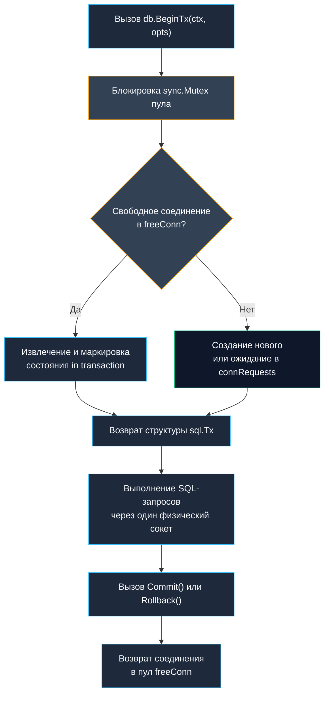

В разработке надежных информационных систем транзакции представляют собой священный контракт между прикладным кодом и долговременным хранилищем. Классические свойства ACID (атомарность, согласованность, изолированность и долговечность) были сформулированы пионерами компьютерных наук еще в 1970-х годах, но программисты до сих пор умудряются спотыкаться на одних и тех же граблях.

Во многих современных фреймворках (Spring, Ruby on Rails, Django) транзакции пытаются сделать «невидимыми» с помощью аннотаций наподобие `@Transactional`. Программист ставит волшебное слово над методом, а среда исполнения генерирует динамические AOP-прокси, привязывает неявные соединения к переменным потока (ThreadLocal) и принимает решение о коммите или откате на основе типа перехваченного исключения. Стоит разработчику вызвать приватный вспомогательный метод внутри того же класса — и транзакционность незаметно испаряется, оставляя базу данных в разорванном состоянии.

Язык Go решительно отвергает неявную магию. В Go транзакция — это осязаемый, строго типизированный объект с детерминированным жизненным циклом. Здесь нет скрытого автокоммита и магии контекста потока: вы явно открываете транзакцию, явно выполняете в ней операторы и явно фиксируете или откатываете результат.

## Философия транзакций в Go

В Go транзакции управляются **явно и детерминированно**. Здесь нет `@Transactional` аннотаций, скрывающих за собой thread-local переменные, прокси и магию автокоммита. Пакет `database/sql` предоставляет структуру `sql.Tx`, которая является строгой оберткой над одним физическим соединением из пула. Это дает разработчику полный контроль над границами консистентности, но требует дисциплины в работе с соединениями и контекстами.

### 1. Механика sql.Tx и привязка к соединению

Вызов `db.BeginTx(ctx, opts)` монопольно извлекает одно TCP-соединение из пула и жестко закрепляет его за объектом транзакции. Пока транзакция `tx` не завершена (через вызов `Commit()` или `Rollback()`), это физическое соединение переводится в статус `in transaction` и **не возвращается** в список свободных соединений `freeConn`.



> [!info] Под капотом
> Внутренняя структура `sql.Tx` хранит прямой указатель на `driverConn`. Все методы `tx.QueryContext` и `tx.ExecContext` направляют команды непосредственно в этот закрытый сокет, минуя координатор пула. Сам пул соединений категорически не может повторно использовать или перераспределить сокет, помеченный флагом `inTx`. Это обеспечивает фундаментальную гарантию ACID-изоляции, но одновременно создает колоссальный риск: если удерживать транзакцию открытой слишком долго, пул соединений будет мгновенно исчерпан.

### 2. Идиоматичный паттерн: defer и обработка ошибок

Канонический, проверенный годами шаблон работы с транзакциями в Go — немедленная регистрация отложенного вызова `defer tx.Rollback()` сразу после успешного вызова `db.BeginTx`.

```go
func UpdateUserBalance(ctx context.Context, db *sql.DB, userID int64, amount int) error {
    // Явное начало транзакции с таймаутом и параметрами изоляции
    tx, err := db.BeginTx(ctx, &sql.TxOptions{
        Isolation: sql.LevelReadCommitted,
        ReadOnly:  false,
    })
    if err != nil {
        return fmt.Errorf("begin tx: %w", err)
    }
    defer tx.Rollback() // Безопасный откат при ошибке, панике или досрочном return

    // 1. Списание средств с основного счета
    res, err := tx.ExecContext(ctx, 
        "UPDATE accounts SET balance = balance - $1 WHERE user_id = $2 AND balance >= $1",
        amount, userID,
    )
    if err != nil {
        return fmt.Errorf("deduct balance: %w", err)
    }
    rows, err := res.RowsAffected()
    if err != nil || rows == 0 {
        return errors.New("insufficient funds or account not found")
    }

    // 2. Добавление записи в аудит-лог
    _, err = tx.ExecContext(ctx,
        "INSERT INTO balance_history (user_id, amount, type) VALUES ($1, $2, 'debit')",
        userID, amount,
    )
    if err != nil {
        return fmt.Errorf("log history: %w", err)
    }

    // Коммит. Если он завершится ошибкой, defer tx.Rollback() отработает штатно.
    if err := tx.Commit(); err != nil {
        return fmt.Errorf("commit tx: %w", err)
    }

    return nil
}
```

> [!tip] Собеседование
> **Вопрос:** Безопасно ли вызывать `defer tx.Rollback()` перед `tx.Commit()`? Не откатит ли `defer` уже зафиксированные данные?
> **Ответ:** Это абсолютно безопасно и является официальной идиомой Go. В реализации `database/sql` методы `Commit()` и `Rollback()` атомарно устанавливают внутренний булев флаг `tx.done = true`. Если транзакция уже успешно зафиксирована через `Commit()`, последующий вызов `Rollback()` в `defer` просто проверяет флаг `done`, не выполняет никаких сетевых пакетов к базе данных и мгновенно возвращает сигнальную ошибку `sql.ErrTxDone` (которую рантайм игнорирует). Это избавляет от необходимости дублировать `tx.Rollback()` перед каждым `return err`.
> 
> **Вопрос:** Что произойдет, если контекст `ctx` будет отменен тайм-аутом во время активной транзакции?
> **Ответ:** Драйвер СУБД перехватит отмену контекста, прервет текущую сетевую передачу и возвратит ошибку `context.Canceled` или `context.DeadlineExceeded`. Соединение будет помечено как поврежденное (`driver.ErrBadConn`) и безопасно закрыто пулом. На стороне сервера PostgreSQL или MySQL разрыв сетевого сокета приводит к мгновенному автоматическому откату (rollback) активной серверной транзакции благодаря протоколу взаимодействия.

### 3. Уровни изоляции и влияние на MVCC

Go не реализует уровни изоляции самостоятельно. Он передает структуру `sql.TxOptions` и флаги в драйвер, который транслирует их в команды БД (`SET TRANSACTION ISOLATION LEVEL...` или протокольные расширения):

- `LevelDefault`: уровень изоляции по умолчанию для конкретной базы (обычно `READ COMMITTED` в PostgreSQL, `REPEATABLE READ` в MySQL InnoDB).
- `LevelReadCommitted`: транзакция видит только те данные, которые были зафиксированы до начала чтения. Обеспечивает минимальный уровень блокировок и наивысшую пропускную способность.
- `LevelRepeatableRead`: гарантирует одинаковый результат `SELECT` внутри транзакции при повторных чтениях. В PostgreSQL это реализуется через снимки версий MVCC (Multi-Version Concurrency Control) без установки разделяемых блокировок чтения. В MySQL могут применяться диапазонные блокировки (gap locks).
- `LevelSerializable`: строгая сериализуемость транзакций, как если бы они выполнялись строго последовательно в один поток. Предотвращает аномалии фантомного чтения и write skew, но резко увеличивает вероятность конфликтов `SerializationFailure`.

> [!warning] Ловушка / Gotcha
> **Serialization Failure (Код ошибки 40001 в PostgreSQL)**: При уровне изоляции `LevelSerializable` СУБД обнаруживает несовместимые зависимости между параллельными транзакциями и принудительно обрывает одну из них. Приложение обязано иметь логику повторных попыток (retry loop) с экспоненциальной задержкой. Если забыть о retry, пользователи будут регулярно получать ошибки 500.
> 
> **Вложенные транзакции (Nested Transactions)**: Стандартный пакет `database/sql` не поддерживает концепцию вложенных транзакций. Если вызвать `db.BeginTx()` внутри функции, уже получившей `tx`, будет выделено совершенно другое соединение из пула, что приведет к взаимным блокировкам (deadlocks). Для реализации точек отката используйте механизм точек сохранения (`SAVEPOINT`): `tx.Exec("SAVEPOINT sp1")` и `tx.Exec("ROLLBACK TO sp1")`.

### 4. Ловушки production и антипаттерны

- **Долгие транзакции и внешние сетевые вызовы**: Главное преступление против масштабируемости бэкенда — отправка внешних HTTP-запросов (в платежные шлюзы, SMS-сервисы, сторонние API) внутри открытой транзакции `sql.Tx`. Пока ваше приложение ждет ответа от стороннего сервера 500 миллисекунд, физическое соединение с базой данных заблокировано. При пуле в `MaxOpenConns=20` всего 40 одновременных запросов положат сервис на лопатки: все остальные горутины выстроятся в очередь ожидания `connRequests`, исчерпав таймауты.
- **Игнорирование `driver.ErrBadConn` при коммите**: Если сетевой канал между сервером Go и СУБД оборвался ровно в момент выполнения `Commit()`, драйвер возвратит `ErrBadConn`. База данных могла успеть записать транзакцию в журнал WAL, но клиентский сервис об этом не узнал. Для критических финансовых операций архитектура обязана опираться на ключи идемпотентности (Idempotency Keys).
- **Передача `sql.Tx` в параллельные горутины**: Хотя методы `sql.Tx` защищены внутренним `sync.Mutex`, использование одной транзакции параллельными горутинами является грубой ошибкой проектирования. Один сокет TCP не может одновременно мультиплексировать несколько независимых потоков команд одного протокола без сериализации, поэтому параллельные горутины просто встанут в очередь.

### 5. Производительность и Mechanical Sympathy

- **Состояние сокета и системные ресурсы**: Пока транзакция активна, сокет находится в состоянии `ESTABLISHED`, а СУБД вынуждена удерживать в оперативной памяти снимки строк, журнал отката (undo-log) и блокировки строк (row-locks). Чем дольше длится транзакция, тем сильнее раздувается таблица версий (bloat в Postgres) и тем тяжелее приходится фоновым процессам очистки (autovacuum).
- **Аллокации параметров**: `tx.ExecContext` создает `[]any{}` для аргументов. Компилятор размещает слайс в куче из-за `interface{}` передачи (heap escape). Драйвер `pgx/v5` умеет обходить это ограничение с помощью прямого бинарного кодирования аргументов в сетевой буфер.
- **Блокировки Mutex**: Структура `sql.Tx` использует легкий `sync.Mutex` для синхронизации вызовов и флага завершения `done`. При правильном проектировании транзакций конкуренция за этот мьютекс отсутствует, так как транзакция исполняется строго одной горутиной. Главным узким местом всегда остается сетевая задержка (RTT) между сервером приложений и узлом базы данных.

### 6. Сравнение с другими экосистемами

| Аспект | Java / Spring `@Transactional` | PHP / Laravel (PDO) | Python / SQLAlchemy | Go `database/sql` |
|---|---|---|---|---|
| Управление | AOP-прокси, thread-local connection | Implicit per request или explicit `BEGIN` | Session/Unit of Work, неявный flush | Явный `BeginTx`, `Commit`, `Rollback` |
| Пул соединений | External (HikariCP), shared | Per-process, нет пула на уровне языка | Pool через `QueuePool` | Встроенный `sql.DB` |
| Вложенность | `REQUIRES_NEW` создает новую tx | Нет нативной поддержки | Nested sessions | Только через `SAVEPOINT` |
| Откат при панике | Зависит от конфигурации proxy | Требуется явный `ROLLBACK` | Session rollback на выходе из with | `defer tx.Rollback()` покрывает panic |

### 7. Итог

1. Транзакции в Go управляются явно через `sql.Tx`. Никакой скрытой магии.
2. Всегда используйте `defer tx.Rollback()` сразу после `BeginTx`. Это безопасно и покрывает все пути выхода.
3. `sql.Tx` блокирует одно соединение из пула на все время жизни. Держите транзакции короткими и избегайте внешних сетевых вызовов внутри них.
4. Параллельное выполнение запросов внутри одной транзакции сериализуется на уровне сокета.
5. Для вложенности используйте `SAVEPOINT`, а не повторный `Begin`.
6. На highload системах `pgx/v5` с `Batch` API значительно снижает round-trip latency и аллокации по сравнению с нативным `sql.Tx`.

Следующая статья: [[24. Кеширование]]
