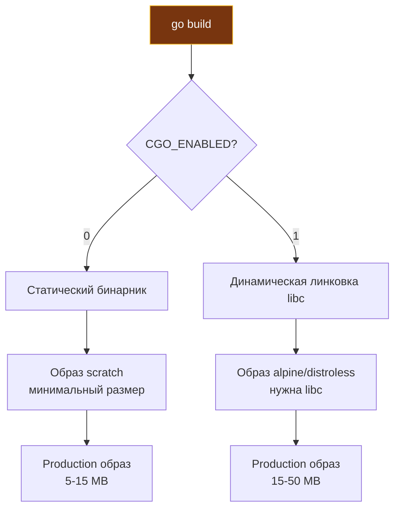

## Философия контейнеризации Go-сервисов

В исследовательской среде Bell Labs еще на заре проектирования Unix сформулировали фундаментальный завет: программа должна решать одну задачу, делать это предельно качественно и не тащить за собой ненужный груз чужих зависимостей. В эпоху виртуальных машин и скриптовых языков (вроде Python, Ruby или PHP) контейнеризация часто превращается в упаковку тяжеловесного дистрибутива Linux, рантайма языка и гигабайтов сторонних библиотек. 

В Go-экосистеме контейнеризация возвращает нас к классической Unix-элегантности. Язык Go изначально проектировался как компилируемый инструмент, порождающий автономный статический исполняемый файл. Docker для Go — это не спасательный круг от ада зависимостей («на моей машине работает, а на сервере нет»), а хирургический инструмент дистрибуции: изолированный способ развертывания компактного машинного кода в ядре Linux через контрольные группы (cgroups) и пространства имен (namespaces).

Правильно спроектированный Docker-образ продакшен-сервиса на Go весит менее 10–15 мегабайт, разворачивается за доли секунды и практически лишен векторов атак, поскольку в нем физически отсутствуют командная оболочка (`/bin/sh`), утилиты сетевого сканирования и менеджеры пакетов. Но для достижения этой чистоты инженер обязан понимать механику компоновки (linking), взаимодействие рантайма с библиотекой Си (`libc`), порядок кэширования слоев и физиологию процессов ядра.

### 1. Multi-stage builds: разделение сборки и рантайма

Сборка промышленного Go-сервиса требует массивного инструментария: компилятора, компоновщика, заголовков пакетов, системы контроля версий Git. Однако в рантайме этот арсенал превращается в бесполезный балласт и угрозу безопасности. Паттерн Multi-stage builds позволяет строго разграничить окружение компиляции и минималистичный рантайм:

```dockerfile
# Stage 1: Build (Компиляция сервиса)
FROM golang:1.24-alpine AS builder

WORKDIR /app

# Шаг 1: Копируем только метаданные зависимостей для эффективного кэширования слоев
COPY go.mod go.sum ./
RUN go mod download

# Шаг 2: Копируем исходный код приложения
COPY . .

# Шаг 3: Собираем статический машинный бинарник
# -ldflags="-s -w" вырезает таблицы символов и отладочную информацию DWARF
# -buildid= делает бинарник строго детерминированным
# CGO_ENABLED=0 отключает CGO для гарантированной статической линковки без libc
RUN CGO_ENABLED=0 GOOS=linux GOARCH=amd64 go build \
    -ldflags="-s -w -buildid=" \
    -trimpath \
    -o server ./cmd/main.go

# Stage 2: Runtime (Финальный минималистичный контейнер)
FROM scratch

# Копируем корневые доверенные CA-сертификаты для исходящих TLS/HTTPS запросов
COPY --from=builder /etc/ssl/certs/ca-certificates.crt /etc/ssl/certs/

# Копируем скомпилированный бинарник
COPY --from=builder /app/server /server

# Указываем непривилегированного пользователя (для scratch метаданные пользователя)
USER nobody

# Запускаем бинарник как главный процесс контейнера
ENTRYPOINT ["/server"]
```

> [!info] Под капотом
> Флаг `CGO_ENABLED=0` гарантирует 100% статическую линковку бинарника: компилятор Go отключает использование системной `libc` (glibc/musl) и подтягивает pure-Go реализации сетевого резолвера (`netgo`) и системных пользователей (`osusergo`), что позволяет запускать бинарник в пустом образе `FROM scratch`. Флаг `-trimpath` вырезает локальные абсолютные пути файловой системы из бинарника, а `-buildid=` обнуляет идентификатор сборки для обеспечения воспроизводимости (reproducible builds). Устаревшие флаги вроде `-installsuffix cgo` являются рудиментами до версии Go 1.10 и в современных пайплайнах не применяются.

### 2. Выбор базового образа: Scratch vs Alpine vs Distroless

Выбор финального базового образа определяет компромисс между размером, поверхностью атаки и удобством операционной эксплуатации:

| Базовый образ | Объем диска | Уровень безопасности | Возможности отладки | Поддержка CGO | Рекомендуемый сценарий |
|---|:---:|:---:|:---:|:---:|---|
| **scratch** | 0 Б (+ бинарник) | Максимальная (нет shell, утилит) | Невозможна внутри контейнера | Нет | Чистые статические сервисы Go, экстремальный минимализм |
| **distroless** | ~2–10 МБ | Очень высокая (нет shell/пакетов) | Ограничена (есть `debug`-версии) | Да (есть glibc) | Золотой стандарт корпоративного production |
| **alpine** | ~5 МБ | Высокая | Доступна (`apk add`, sh/ash) | Да (musl libc) | Быстрое прототипирование, legacy, сервисы с CGO |
| **debian-slim** | ~80 МБ | Средняя (полный Linux-дистрибутив) | Полная (bash, apt-get, gdb) | Да (glibc) | Сложные C-библиотеки, GPU-драйверы, ML-модели |



**Distroless** образы, разработанные Google (`gcr.io/distroless`), представляют собой признанный эталон для промышленного продакшена. Они содержат только минимальный набор системных библиотек (`glibc`, `ca-certificates.crt`, часовые пояса `tzdata` и учетные записи пользователей `/etc/passwd`), полностью исключая командные интерпретаторы (`/bin/sh`, `/bin/bash`) и утилиты администрирования. Злоумышленник, даже найдя RCE-уязвимость в приложении, не сможет запустить шелл-скрипт или скачать сторонний вредонос через `curl` или `wget`.

```dockerfile
# Пример использования Distroless для чистого Go (без CGO)
FROM gcr.io/distroless/static-debian12

COPY --from=builder /app/server /server

# UID 65532 зарезервирован под non-root пользователя nonroot
USER 65532:65532

ENTRYPOINT ["/server"]
```

### 3. Оптимизация слоев и кеширование

Файловая система Docker построена на механизме UnionFS (Overlay2). Каждая команда `RUN`, `COPY`, `ADD` формирует неизменяемый слой, идентифицируемый криптографическим хэшем его содержимого и команд сборщика. Нарушение порядка инструкций приводит к бессмысленной инвалидации кэша и многократному замедлению CI/CD.

**Антипаттерн:**
```dockerfile
# Грубая ошибка: любой коммит в код инвалидирует скачивание модулей!
COPY . .
RUN go mod download
```
При любом изменении файла `.go` слой `COPY . .` получает новый хэш, в результате чего команда `go mod download` выполняется заново, повторно выкачивая зависимости по сети.

**Идиоматичный порядок:**
```dockerfile
# Шаг 1: Копируем строго манифесты зависимостей
COPY go.mod go.sum ./
RUN go mod download

# Шаг 2: Копируем остальной исходный код только после успешного кэширования зависимостей
COPY . .
RUN go build -o server ./cmd/main.go
```
В таком сценарии слой с зависимостями пересобирается только тогда, когда разработчик реально добавил или обновил библиотеку в файле `go.mod`.

> [!warning] Ловушка / Gotcha
> **Временные файлы в одном слое**: Если вы выполняете команды `RUN apt-get update && apt-get install ...`, локальный кэш пакетов навсегда оседает в результирующем слое файловой системы, даже если вы удалите его следующей командой `RUN rm -rf /var/lib/apt/lists/*`. Всегда объединяйте установку и очистку в единый неделимый слой через оператор `&&`:
> `RUN apt-get update && apt-get install -y --no-install-recommends ca-certificates && rm -rf /var/lib/apt/lists/*`
> **Многослойность**: Каждая инструкция `RUN`, `COPY`, `ADD` создает отдельный слой в Overlay2. Избыточное количество слоев создает лишние метаданные ядра и замедляет запуск контейнера. Объединяйте команды через `&&` и используйте multi-stage builds.

### 4. Безопасность: Non-root пользователь и Read-only FS

Запуск серверного процесса от имени пользователя `root` (UID 0) внутри контейнера — опаснейшая уязвимость. Если в ядре Linux или механизме изоляции cgroup будет найдена брешь выхода из контейнера (container escape), злоумышленник мгновенно получит полные права суперпользователя на хост-ноде.

Для создания безопасного контейнера на базе `scratch` учетную запись пользователя подготавливают на этапе сборки:

```dockerfile
# Создаем пользователя appuser на этапе сборки в builder
FROM golang:1.24-alpine AS builder
RUN adduser -D -u 10001 -g "" appuser

# ... фаза компиляции сервиса ...

# Формируем финальный образ
FROM scratch

# Переносим запись пользователя из builder
COPY --from=builder /etc/passwd /etc/passwd
COPY --from=builder /app/server /server

# Переключаемся на непривилегированного пользователя
USER appuser
ENTRYPOINT ["/server"]
```

В случае применения образов `distroless` достаточно явно указать зарезервированный UID:
```dockerfile
USER 65532:65532
```

**Read-only файловая система**:
В современных кластерах Kubernetes наилучшей практикой является запуск подов с флагом `securityContext.readOnlyRootFilesystem: true`. В этом режиме ядро Linux полностью запрещает любые операции записи в корневую файловую систему контейнера. Сервис не сможет изменить системные файлы или сохранить вредоносный скрипт. 
- Логи обязаны писаться строго в стандартные потоки `stdout` / `stderr`.
- Если приложению жизненно необходим временный буфер для обработки файлов, монтируйте эфемерный том в оперативной памяти через `emptyDir` volume (например, в директорию `/tmp`).

### 5. Health checks и graceful shutdown

Оркестраторы инфраструктуры (Docker Compose, HashiCorp Nomad, Kubernetes) обязаны точно знать реальный статус здоровья микросервиса.

Инструкция `HEALTHCHECK` внутри Dockerfile задает периодичность и критерии проверки:
```dockerfile
HEALTHCHECK --interval=30s --timeout=3s --start-period=5s --retries=3     CMD wget --no-verbose --tries=1 --spider http://localhost:8080/health || exit 1
```

Однако в минималистичных образах `scratch` и `distroless`, где нет `wget` или `curl`, предпочтительно встраивать команду самодиагностики прямо в исполняемый бинарник Go:
```dockerfile
HEALTHCHECK --interval=10s --timeout=2s CMD ["/server", "healthcheck"]
```

**Graceful shutdown**: При выполнении команды `docker stop` или удалении пода оркестратором (`kubectl delete pod`) главному процессу контейнера (PID 1) посылается сигнал операционной системы `SIGTERM`. Архитектурно корректный Go-сервис обязан:
1. Перехватить сигнал `SIGTERM` через канал сигналов ОС.
2. Немедленно прекратить прием новых входящих HTTP/TCP-соединений.
3. Корректно завершить активные запросы клиентов, используя `server.Shutdown(ctx)` с таймаутом.
4. Сбросить буферы логов и корректно закрыть пулы сетевых соединений к БД и кэшам.
5. Завершить процесс с нулевым кодом возврата (`exit 0`).

```go
func main() {
    server := &http.Server{Addr: ":8080", Handler: mux}
    
    go func() {
        if err := server.ListenAndServe(); err != nil && err != http.ErrServerClosed {
            log.Fatal(err)
        }
    }()
    
    quit := make(chan os.Signal, 1)
    signal.Notify(quit, syscall.SIGTERM, syscall.SIGINT)
    <-quit
    
    ctx, cancel := context.WithTimeout(context.Background(), 30*time.Second)
    defer cancel()
    
    if err := server.Shutdown(ctx); err != nil {
        log.Fatalf("shutdown error: %v", err)
    }
}
```

> [!tip] Собеседование
> **Вопрос:** Почему `docker stop` ждет 10 секунд перед отправкой `SIGKILL`?
> **Ответ:** 10 секунд — это значение системного тайм-аута по умолчанию (`--stop-timeout`). За этот временной интервал серверное приложение обязано корректно отработать полученный сигнал `SIGTERM`, закрыть соединения и освободить ресурсы. Если процесс завис или проигнорировал сигнал, Docker принудительно уничтожает его через `SIGKILL` (который невозможно перехватить или проигнорировать). В Kubernetes аналогичный параметр называется `terminationGracePeriodSeconds` (по умолчанию 30 секунд). При проектировании graceful shutdown следите, чтобы таймаут вашего `server.Shutdown` был строго меньше таймаута оркестратора.
> 
> **Вопрос:** Зачем нужен `tini` или `dumb-init` в Go-образах?
> **Ответ:** В архитектуре Linux процесс с PID 1 несет особую ответственность: он обязан перехватывать сигналы и «усыновлять» процессы-сироты, выполняя над ними `wait()` (reaping zombies). Если Go-сервис динамически порождает дочерние процессы (через вызовы `exec.Command`), а дочерний процесс умирает раньше родителя, не убранный процесс превращается в зомби (`zombie processes`), захламляя таблицу процессов ядра. Утилиты `tini` или `dumb-init` встают на место PID 1 и берут эту работу на себя. Если ваш сервис — чистый HTTP-демон, не вызывающий `exec.Command`, `tini` не требуется.

### 6. Отладка и observability в production

Экстремальный минимализм образов `scratch` и `distroless` оборачивается сложностью оперативной отладки: вы не можете просто набрать `docker exec -it container /bin/sh`.

Для решения этой задачи в современных инженерных практиках применяются следующие подходы:

1. **Многоцелевой Debug-образ**: Создание отдельного таргета в Dockerfile, собирающего отладочный образ с установленным интерактивным отладчиком Delve:
```dockerfile
FROM golang:1.24-alpine AS debug
RUN go install github.com/go-delve/delve/cmd/dlv@latest
COPY server /server
ENTRYPOINT ["/go/bin/dlv", "exec", "/server"]
```

2. **Эфемерные контейнеры (Ephemeral debug container)** в Kubernetes (начиная с версии 1.20+): Механизм позволяет подмонтировать контейнер с полнофункциональным шеллом и утилитами диагностики в существующий под, разделяя с ним общее пространство имен процессов (Process Namespace Sharing):
```bash
kubectl debug my-pod -it --image=busybox --target=my-container
```

3. **Удаленная отладка через Delve**: Проброс отладочного порта (например, 40000) для подключения IDE к процессу в staging-среде:
```dockerfile
EXPOSE 40000
CMD ["dlv", "--listen=:40000", "--headless=true", "--api-version=2", "exec", "/server"]
```

### 7. Ловушки и антипаттерны

- **Игнорирование `.dockerignore`**: Если вы не создали файл `.dockerignore`, команда `COPY . .` послушно скопирует в контекст сборки каталог `.git`, локальные сборки `bin`, папки `vendor` и дампы памяти. Это раздувает размер контекста сборки до сотен мегабайт и чудовищно замедляет процесс сборки на CI-раннерах. Обязательный минимальный `.dockerignore`:
```dockerignore
.git
vendor
bin
*.md
Dockerfile*
docker-compose*
```

- **Динамические зависимости в статическом бинарнике**: Если разработчик забыл указать директиву `CGO_ENABLED=0`, Go-компилятор по умолчанию слинкует бинарник с системной библиотекой `libc` хост-системы. При копировании такого бинарника в пустой образ `scratch` попытка запуска немедленно завершится загадочной системной ошибкой:
`standard_init_linux.go:219: exec user process caused: no such file or directory`
Эта ошибка означает не отсутствие самого бинарника, а отсутствие динамического загрузчика ELF (например, `/lib64/ld-linux-x86-64.so.2`), на который ссылается скомпилированный файл.

- **Часовой пояс и база zoneinfo**: Образ `scratch` не содержит системного каталога `/usr/share/zoneinfo`. Вызовы `time.LoadLocation("Europe/Moscow")` завершатся паникой или ошибкой. Либо встраивайте базу таймзон прямо в бинарник через анонимный импорт `_ "time/tzdata"`, либо копируйте файл часового пояса из билдера:
```dockerfile
COPY --from=builder /usr/share/zoneinfo/Europe/Moscow /etc/localtime
```

- **Отсутствие CA-сертификатов**: В `scratch` нет доверенных центров сертификации. Любой исходящий HTTPS-запрос из Go-сервиса (например, к платежному шлюзу или S3) завершится ошибкой валидации TLS:
`x509: certificate signed by unknown authority`
Всегда копируйте файл `ca-certificates.crt` в директорию `/etc/ssl/certs/`.

### 8. Итог

1. Всегда используйте multi-stage builds: компилируйте сервис в тяжелом builder-образе, а готовый бинарник копируйте в легковесный рантайм.
2. Предпочитайте `scratch` или `distroless` для безопасного production, оставляя `alpine` для этапа отладки и прототипирования.
3. Собирайте сервисы строго с `CGO_ENABLED=0` и флагами компоновщика `-ldflags="-s -w"` для получения компактного автономного статического файла.
4. Оптимизируйте кэширование слоев: сначала выполняйте `COPY go.mod` и `go mod download`, и лишь затем `COPY . .`.
5. Никогда не запускайте контейнеры от пользователя root. Настраивайте `USER` с непривилегированным UID и монтируйте корневую файловую систему как read-only.
6. Обеспечьте корректный graceful shutdown с обработкой сигналов `SIGTERM` и синхронизацией таймаутов с оркестратором (`terminationGracePeriodSeconds`).
7. Всегда сопровождайте проект файлом `.dockerignore`, исключая каталоги `.git`, `vendor` и артефакты сборки из контекста Docker.
8. Помните о сопутствующих ресурсах чистого рантайма: не забывайте переносить `ca-certificates.crt` и настраивать базу временных зон через `time/tzdata` или `/usr/share/zoneinfo`.

Следующая статья: [[38. Конфигурация nginx]]
