## Архитектура Reverse Proxy в Go

Маршрутизация и диспетчеризация потоков данных — одна из старейших и фундаментальных задач вычислительной техники. Еще на заре сетевых экспериментов в Bell Labs инженеры поняли: разделение внешней точки входа и внутренних специализированных узлов обработки многократно повышает гибкость и надежность всей системы.

В современной веб-разработке Reverse Proxy (обратный прокси-сервер) выступает связующим архитектурным узлом. Он принимает запросы от внешних клиентов и интеллектуально перенаправляет их во внутренний кластер микросервисов (бэкендов). На базе этого паттерна строятся **API Gateway** (шлюзы API) и архитектуры **BFF** (Backend for Frontend).

Индустриальные тяжеловесы вроде Nginx, Envoy или HAProxy являются де-факто стандартами для периметра инфраструктуры. Однако язык Go предлагает уникальное преимущество: мощнейший стандартный пакет `net/http/httputil`, позволяющий конструировать высокопроизводительные, полностью программируемые прокси прямо на уровне исходного кода. Это избавляет от необходимости писать хрупкие регулярные выражения в конфигурационных файлах Nginx или писать скрипты на Lua, предоставляя абсолютный контроль над аутентификацией, динамической маршрутизацией по содержимому тела запроса и балансировкой нагрузки средствами самого компилируемого языка.

### 1. Внутреннее устройство `httputil.ReverseProxy`

Структура `httputil.ReverseProxy` в рантайме Go — это не просто слепая пересылка сырых байтов через сетевой сокет. Это четко выверенный конвейер обработки HTTP-транзакций, состоящий из трех ключевых узлов:

1. **Rewrite / Director**: Функция-модификатор входящего клиентского запроса. Начиная с Go 1.20, хук `Director` объявлен устаревшим (deprecated) из-за рисков безопасности (удаление hop-by-hop заголовков клиентом и уязвимость к спуфингу `X-Forwarded-*`). В современном коде стандартом является хук `Rewrite (func(*httputil.ProxyRequest))`, предоставляющий безопасные методы `SetURL()` и `SetXForwarded()`.
2. **Transport**: Абстракция интерфейса `http.RoundTripper` (обычно представляющая собой настроенный `*http.Transport`). Этот компонент управляет пулом постоянных TCP-соединений, кэшем TLS-сессий, таймаутами рукопожатий и непосредственной отправкой байт на выбранный бэкенд.
3. **ModifyResponse** (опциональный хук): Функция обратного вызова, позволяющая инспектировать или трансформировать заголовки и тело ответа бэкенда до того, как они отправятся клиенту.

```mermaid
flowchart LR
    classDef process  fill:#1e293b,stroke:#38bdf8,stroke-width:1px,color:#f8fafc
    classDef success  fill:#064e3b,stroke:#34d399,stroke-width:1px,color:#f8fafc
    classDef error    fill:#7f1d1d,stroke:#f87171,stroke-width:1px,color:#f8fafc
    classDef warning  fill:#78350f,stroke:#fbbf24,stroke-width:1px,color:#f8fafc
    classDef entry    fill:#1e3a5f,stroke:#38bdf8,stroke-width:2px,color:#f8fafc
    classDef aux      fill:#334155,stroke:#64748b,stroke-width:1px,color:#f8fafc
    classDef system   fill:#312e81,stroke:#a78bfa,stroke-width:1px,color:#f8fafc
    classDef data     fill:#132d29,stroke:#2dd4bf,stroke-width:1px,color:#f8fafc
    classDef network  fill:#881337,stroke:#fb7185,stroke-width:1px,color:#f8fafc
    classDef accent   fill:#1e1b4b,stroke:#818cf8,stroke-width:1px,color:#f8fafc
    A["Клиентский запрос"]:::entry --> B["Вызов ReverseProxy ServeHTTP"]
    B --> C["Вызов Director<br>Модификация запроса"]
    C --> D["Использование Transport<br>Отправка на бэкенд"]
    D --> E["Чтение ответа<br>от бэкенда"]
    E --> F{"Нужна ModifyResponse?"}
    F -->|Да| G["Модификация ответа"]
    F -->|Нет| H["Копирование тела<br>в ответ клиенту"]
    G --> H
    H --> J["Отправка клиенту"]
```



> [!info] Под капотом
> Под капотом `ReverseProxy` использует системный механизм `io.Copy` для потоковой передачи тела запроса и ответа через сетевые буферы. Это гарантирует, что даже многогигабайтные полезные нагрузки не буферизуются целиком в оперативной памяти Go (если только разработчик сам явно не попытался прочитать тело в буфер). Параметр `FlushInterval` управляет частотой сброса локального буфера записи в клиентский сокет. По умолчанию он равен 0 (ожидание заполнения буфера или завершения чтения), но для потоковых протоколов (Server-Sent Events или WebSockets) параметр `FlushInterval` критически необходимо устанавливать в значение `-1` (принудительный flush после каждой порции записанных байтов).

### 2. Идиоматичная реализация прокси

Конструктор `httputil.NewSingleHostReverseProxy` предоставляет готовую заготовку прокси-сервера. Однако промышленная эксплуатация требует тонкой настройки:

```go
package main

import (
    "net/http"
    "net/http/httputil"
    "net/url"
    "time"
)

func NewSimpleProxy(targetURL string) (*httputil.ReverseProxy, error) {
    target, err := url.Parse(targetURL)
    if err != nil {
        return nil, err
    }

    proxy := httputil.NewSingleHostReverseProxy(target)
    
    // В Go 1.20+ для новых прокси рекомендуется использовать безопасный хук Rewrite:
    // proxy.Rewrite = func(pr *httputil.ProxyRequest) {
    //     pr.SetURL(target)
    //     pr.Out.Header.Set("X-Proxy-By", "go-service")
    //     pr.SetXForwarded() // Безопасно заполняет X-Forwarded-* без уязвимости к спуфингу
    // }
    
    // Кастомизация функции Director для проектов с поддержкой старых версий Go:
    originalDirector := proxy.Director
    proxy.Director = func(req *http.Request) {
        originalDirector(req)
        
        // Добавление идентификатора прокси-шлюза
        req.Header.Set("X-Proxy-By", "go-service")
        
        // Важно: заголовок X-Forwarded-For формируется автоматически,
        // но при необходимости явного переопределения в старых версиях:
        // req.Header.Set("X-Forwarded-For", req.RemoteAddr)
    }

    // Настройка кастомного http.Transport для предотвращения исчерпания сокетов
    proxy.Transport = &http.Transport{
        MaxIdleConns:          100,
        IdleConnTimeout:       90 * time.Second,
        TLSHandshakeTimeout:   10 * time.Second,
        ExpectContinueTimeout: 1 * time.Second,
    }

    return proxy, nil
}
```

> [!warning] Ловушка / Gotcha
> **Утечка и искажение `X-Forwarded-For`**: При использовании `NewSingleHostReverseProxy` заголовок `X-Forwarded-For` дополняется автоматически адресом клиента. Однако, если вы модифицируете структуру `req.URL` вручную внутри `Director`, неосторожная конкатенация путей без учета хвостовых слэшей (функция `SingleJoiningSlash`) приведет к дублированию путей (`/api//v1`). Также никогда не забывайте синхронизировать поле `req.Host`: если целевой бэкенд использует виртуальный хостинг (Name-based Virtual Hosting), несоответствие `req.Host` и `target.Host` приведет к ошибкам 404 или отклонению запроса.

### 3. Реализация Load Balancer (Балансировщика)

Для распределения входящего потока между кластером бэкендов логика выбора целевого адреса встраивается в `Director`. Классический потокобезопасный алгоритм Round Robin наглядно демонстрирует мощь Go:

```go
package main

import (
    "net/http"
    "net/http/httputil"
    "net/url"
    "sync"
)

type LoadBalancer struct {
    backends []*url.URL
    current  int
    mu       sync.Mutex // Гарантия потокобезопасности счетчика
}

func (lb *LoadBalancer) GetNext() *url.URL {
    lb.mu.Lock()
    defer lb.mu.Unlock()
    
    // Классический циклический выбор Round Robin
    next := lb.backends[lb.current]
    lb.current = (lb.current + 1) % len(lb.backends)
    return next
}

func NewLoadBalancerProxy(backends []*url.URL) *httputil.ReverseProxy {
    lb := &LoadBalancer{backends: backends}

    return &httputil.ReverseProxy{
        Director: func(req *http.Request) {
            target := lb.GetNext()
            
            // Направляем запрос на выбранный узел
            req.URL.Scheme = target.Scheme
            req.URL.Host = target.Host
            req.Host = target.Host // Критично для виртуальных хостов бэкенда
            
            // Сохраняем оригинальный путь запроса (req.URL.Path остается без изменений)
        },
        ErrorHandler: func(w http.ResponseWriter, r *http.Request, err error) {
            // Идиоматичная обработка сбоев соединения: 502 Bad Gateway
            w.WriteHeader(http.StatusBadGateway)
            w.Write([]byte("Backend unavailable"))
        },
    }
}
```

### 4. Механика ошибок и повторных попыток (Retries)

Стандартный `httputil.ReverseProxy` не выполняет автоматических повторных попыток при сбоях: если бэкенд внезапно разорвал TCP-сокет или не ответил по таймауту, управление сразу передается в `ErrorHandler`, и клиент получает ошибку 502.

Для реализации автоматических ретраев на резервные узлы необходимо оборачивать метод `RoundTrip` базового транспорта `http.RoundTripper`:

```go
type RetryTransport struct {
    Base       http.RoundTripper
    MaxRetries int
}

func (t *RetryTransport) RoundTrip(req *http.Request) (*http.Response, error) {
    attempts := 0
    
    for {
        resp, err := t.Base.RoundTrip(req)
        if err == nil {
            return resp, nil // Успешный ответ от бэкенда
        }
        
        attempts++
        if attempts >= t.MaxRetries {
            return nil, err // Лимит повторных попыток исчерпан
        }
        
        // Логирование ошибки и повтор попытки
        // Внимание: если req.Body уже вычитан транспортом,
        // повторный запрос отправит пустое тело!
    }
}
```

> [!tip] Собеседование
> **Вопрос:** В чем заключается главная архитектурная проблема при повторной отправке (retry) POST/PUT-запросов в Reverse Proxy?
> **Ответ:** Поле `req.Body` представляет собой однонаправленный интерфейс `io.ReadCloser`. При первой попытке передачи транспорт `Transport` вычитывает тело запроса до конца (`EOF`), опустошая сетевой поток. Если соединение с бэкендом оборвалось и прокси пытается повторить запрос, `req.Body` оказывается исчерпанным, и сервер получит пустое тело. Решение задачи: либо предварительно вычитать тело запроса в байтовый буфер в памяти и оборачивать его перед каждой попыткой через `io.NopCloser(bytes.NewReader(buf))`, либо использовать системное поле `req.GetBody()`, возвращающее новый экземпляр `io.ReadCloser` по требованию для каждой новой попытки отправки.

### 5. Производительность и Mechanical Sympathy

При обслуживании сотен тысяч запросов в секунду работа обратного прокси создает измеримое давление на память и планировщик Go:

1. **Аллокации строк и парсинг URL**: Вызов `req.URL.String()` принудительно аллоцирует новую строку в куче на каждый поступивший запрос. Внутри функции `Director` модифицируйте поля структуры напрямую (`URL.Host`, `URL.Path`), избегая промежуточной сериализации и повторного парсинга URL.
2. **Мутация заголовков и гонки данных**: Заголовки `http.Header` представляют собой структуру `map[string][]string`. При наивном пробросе заголовков через присваивание `req.Header = backendResp.Header` создается поверхностная ссылка на ту же область памяти. Если бэкенд или сторонний middleware модифицирует карту заголовков конкурентно, рантайм Go выбросит панику `fatal error: concurrent map read and map write`. Для безопасного копирования заголовков используйте метод `http.Header.Clone()`.
3. **Переиспользование сетевых пулов (Connection Reuse)**: Экземпляр `http.Transport` обязан создаваться один раз как синглтон на все время жизни приложения. Создание нового `http.Transport` внутри функции `Director` или для каждого запроса — фатальная ошибка. Это порождает отдельный неуправляемый пул сокетов, что за секунды исчерпывает эфемерные порты ОС и забивает стек ядра тысячами соединений в состоянии `TIME_WAIT`.
4. **Распространение контекста отмены (Context Propagation)**: `ReverseProxy` автоматически связывает контекст клиентского запроса `req.Context()` с исходящим вызовом к бэкенду. Если мобильный клиент внезапно разорвал TCP-соединение или нажал кнопку «Отмена», рантайм Go немедленно отменяет `req.Context()`, транспорт закрывает внутренний сокет к бэкенду и прерывает бессмысленную обработку в кластере.

### 6. Сравнение с внешними прокси

| Архитектурная характеристика | Go `httputil` | Nginx | Envoy |
|---|---|---|---|
| **Сетевая задержка** | Минимальная (вызовы в памяти процесса) | Низкая (отдельный C-процесс на хосте) | Средняя (накладные расходы Sidecar-прокси) |
| **Гибкость бизнес-логики** | Абсолютная (полноценный код на языке Go) | Ограниченная (конфигурации + скрипты Lua) | Высокая (фильтры C++, WASM, gRPC control plane) |
| **Управление соединениями** | Программная настройка `http.Transport` | Тюнинг директив `nginx.conf` | Сложная динамическая балансировка пулов |
| **Наблюдаемость (Observability)** | Нативная интеграция (`pprof`, OpenTelemetry) | Текстовые Access-логи, сторонние модули | Встроенный экспорт метрик Prometheus и трейсов |
| **Потребление оперативной памяти** | Зависит от объема аллокаций в коде | Минимальное и строго фиксированное | Умеренно высокое (тяжеловесный C++ рантайм) |

### 7. Итог

1. Библиотека `httputil.ReverseProxy` — первоклассный стандартный инструмент Go для создания интеллектуальных шлюзов API Gateway, BFF и программных маршрутизаторов.
2. Всегда конфигурируйте отдельный долгоживущий `http.Transport` с выверенными лимитами соединений и таймаутами простоя.
3. В функции `Director` мутируйте только целевые поля структуры `req.URL` и синхронизируйте `req.Host`, предотвращая бессмысленные аллокации строк.
4. Для передачи потоковых протоколов (SSE, WebSockets) выставляйте параметр `FlushInterval: -1` для предотвращения буферизации данных.
5. Обязательно переопределяйте `ErrorHandler` для возврата корректных статус-кодов (502 Bad Gateway) и логирования сетевых сбоев.
6. При проектировании механизма повторных отправок (retries) учитывайте исчерпание тела запроса `req.Body` и задействуйте `req.GetBody()`.

Следующая статья: [[40. Деплой в production]]
