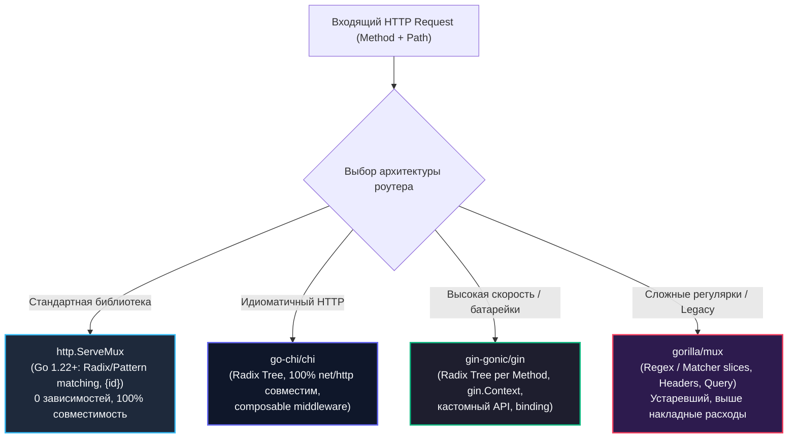

Маршрутизация (Routing) — это стрелочник на железнодорожных путях вашего бэкенда. Когда HTTP-запрос врывается в процесс, маршрутизатор обязан мгновенно определить: какой метод запрошен (`GET`, `POST`, `PUT`, `DELETE`), какой путь указан в URI, какие параметры спрятаны в сегментах URL, и какому конкретно обработчику передать управление.

В экосистеме Go исторически существовали две крайности: аскетичный стандартный `http.ServeMux`, заставлявший парсить пути вручную, и тяжеловесные сторонние фреймворки. Однако эволюция языка (особенно революционные изменения в Go 1.22) изменила этот ландшафт. Давайте детально разберем внутреннее устройство, структуры данных и компромиссы ключевых маршрутизаторов: стандартного `ServeMux`, популярного `Gin`, элегантного `Chi` и классического `Gorilla Mux`.



---

## Встроенный маршрутизатор: ServeMux

Go предоставляет встроенный HTTP-маршрутизатор через `http.ServeMux`. Это простой, но надежный инструмент для базовой маршрутизации, который не требует внешних зависимостей.

### Основы ServeMux

Исторически `http.ServeMux` умел матчить только строгие совпадения и слеш-префиксы:

```go
package main

import (
    "fmt"
    "net/http"
)

func main() {
    // Создаем маршрутизатор
    mux := http.NewServeMux()
    
    // Регистрируем обработчики
    mux.HandleFunc("/", func(w http.ResponseWriter, r *http.Request) {
        fmt.Fprintf(w, "Home page")
    })
    
    mux.HandleFunc("/users", func(w http.ResponseWriter, r *http.Request) {
        fmt.Fprintf(w, "Users list")
    })
    
    mux.HandleFunc("/users/", func(w http.ResponseWriter, r *http.Request) {
        // Обработка /users/123, /users/profile и т.д.
        userID := r.URL.Path[len("/users/"):]
        fmt.Fprintf(w, "User: %s", userID)
    })

    // Запускаем сервер
    http.ListenAndServe(":8080", mux)
}
```

> [!info] Под капотом
> `ServeMux` внутри использует map строк для хранения шаблонов маршрутов. Ключевые структуры в рантайме:
> - `muxEntry`: содержит паттерн и обработчик
> - `pattern`: строка шаблона маршрута
> - `exact`: флаг для точного совпадения
> 
> При поиске маршрута `ServeMux` проходит по зарегистрированным паттернам в порядке убывания приоритета: точные совпадения, затем префиксы.  
> Начиная с Go 1.22, рантайм `http.ServeMux` был кардинально переработан: внутренний алгоритм компилирует маршруты в специализированное дерево паттернов, проверяет конфликты пересечения маршрутов еще на этапе регистрации и позволяет связывать методы (`GET /items/{id}`) без дополнительных накладных расходов.

---

### Правила матчинга в ServeMux

ServeMux использует простые правила для матчинга URL:

1. **Точные совпадения**: `/users` → `/users` (только если нет слеша в конце)
2. **Префиксные совпадения**: `/users/` → `/users/123`, `/users/profile`
3. **Широкое совпадение**: `/` → любой путь (работает как fallback)

```go
mux := http.NewServeMux()

// Точное совпадение - имеет высший приоритет
mux.HandleFunc("/users", exactUsersHandler)

// Префиксное совпадение - для /users/*
mux.HandleFunc("/users/", prefixUsersHandler)

// Fallback - для всех остальных
mux.HandleFunc("/", fallbackHandler)
```

> [!info] Правило приоритета маршрутов (Longest Match Wins)
> Порядок регистрации маршрутов в `ServeMux` не имеет значения! Во всех версиях Go (начиная с 1.0) стандартный роутер отдает строгий приоритет точным совпадениям над префиксами, а префиксы сопоставляет по правилу наибольшей длины (longest match): если зарегистрировать `/users/` до `/users/profile`, запрос к `/users/profile` гарантированно попадет в свой точный обработчик.  
> В Go 1.22+ это правило было формализовано в детерминированное дерево специфичности (most specific match wins): литеральные сегменты имеют строгий приоритет над wildcards (`{id}`), а конфликтующие неразрешимые маршруты приводят к панике еще на этапе вызова `HandleFunc`.

---

### Параметризованные маршруты в ServeMux

ServeMux не поддерживает параметризованные маршруты вида `/users/{id}`, но вы можете извлекать параметры из пути вручную:

```go
func userHandler(w http.ResponseWriter, r *http.Request) {
    // /users/123 -> path = "123"
    path := r.URL.Path
    if strings.HasPrefix(path, "/users/") {
        userID := path[len("/users/"):] // вырезаем "/users/"
        
        // Убираем query параметры
        if idx := strings.Index(userID, "?"); idx != -1 {
            userID = userID[:idx]
        }
        
        fmt.Fprintf(w, "User ID: %s", userID)
    }
}

mux.HandleFunc("/users/", userHandler)
```

*(Примечание: начиная с Go 1.22+, в стандартном `ServeMux` появился встроенный синтаксис `mux.HandleFunc("GET /users/{id}", ...)` и функция `r.PathValue("id")`, что сделало ручной парсинг через срезы строк пережитком прошлого).*

---

### Регистрация обработчиков разных типов

В `net/http` есть фундаментальное различие между интерфейсом `http.Handler` и функцией `http.HandlerFunc`:

```go
// Функция-обработчик
mux.HandleFunc("/home", homeHandler)

// Интерфейс Handler
mux.Handle("/api", apiHandler)

// Структура-обработчик
type UserHandler struct {
    service *UserService
}

func (h *UserHandler) ServeHTTP(w http.ResponseWriter, r *http.Request) {
    // Реализация обработки
}

mux.Handle("/users", &UserHandler{service: userService})
```

---

## Gin: быстрый и функциональный фреймворк

Gin — один из самых популярных HTTP-фреймворков для Go, известный своей производительностью и удобным API.

### Установка и базовое использование

```bash
go get -u github.com/gin-gonic/gin
```

```go
package main

import (
    "github.com/gin-gonic/gin"
    "net/http"
)

func main() {
    r := gin.Default() // включает логирование и recovery
    
    // Базовые маршруты
    r.GET("/", func(c *gin.Context) {
        c.JSON(200, gin.H{"message": "Hello"})
    })
    
    r.POST("/users", createUser)
    r.PUT("/users/:id", updateUser)
    r.DELETE("/users/:id", deleteUser)
    
    r.Run(":8080")
}

func createUser(c *gin.Context) {
    var user User
    if err := c.ShouldBindJSON(&user); err != nil {
        c.JSON(400, gin.H{"error": err.Error()})
        return
    }
    
    // Обработка...
    c.JSON(201, user)
}

func updateUser(c *gin.Context) {
    id := c.Param("id") // извлекаем параметр из URL
    // Обработка...
    c.JSON(200, gin.H{"id": id})
}
```

> [!info] Под капотом
> Gin использует дерево маршрутов (radix tree) для быстрого поиска маршрутов. Это позволяет достичь O(log n) времени поиска вместо O(n) в случае с ServeMux. Внутри Gin использует pool сессий для минимизации аллокаций.  
> Главный компромисс Gin — отказ от стандартного интерфейса `http.Handler` в пользу `gin.HandlerFunc(c *gin.Context)`. Структура `gin.Context` аллоцируется через `sync.Pool` и объединяет в себе `http.ResponseWriter`, `*http.Request`, парсеры JSON/XML и локальное хранилище данных запроса. Если вы захотите передать обработчик из Gin в стандартный роутер, вам потребуется писать адаптеры.

---

### Параметры и группы маршрутов

```go
// Параметры в URL
r.GET("/users/:id", func(c *gin.Context) {
    id := c.Param("id")
    c.String(200, "User ID: %s", id)
})

// Query параметры
r.GET("/search", func(c *gin.Context) {
    query := c.Query("q") // значение по умолчанию ""
    limit := c.DefaultQuery("limit", "10")
    c.String(200, "Search: %s, Limit: %s", query, limit)
})

// Группы маршрутов
v1 := r.Group("/api/v1")
{
    v1.GET("/users", getUsers)
    v1.POST("/users", createUser)
    v1.PUT("/users/:id", updateUser)
}
```

---

## Chi: современный маршрутизатор с мощными возможностями

Chi — легковесный маршрутизатор, ориентированный на чистую архитектуру и производительность. Его ключевое достоинство: **100% совместимость со стандартной библиотекой**.

### Установка и использование

```bash
go get -u github.com/go-chi/chi/v5
```

```go
package main

import (
    "github.com/go-chi/chi/v5"
    "github.com/go-chi/chi/v5/middleware"
    "net/http"
)

func main() {
    r := chi.NewRouter()
    
    // Встроенные middleware
    r.Use(middleware.Logger)
    r.Use(middleware.Recoverer)
    
    // Базовые маршруты
    r.Get("/", homeHandler)
    r.Post("/users", createUser)
    r.Put("/users/{id}", updateUser)
    r.Delete("/users/{id}", deleteUser)
    
    http.ListenAndServe(":8080", r)
}

func homeHandler(w http.ResponseWriter, r *http.Request) {
    w.Write([]byte("Hello from Chi"))
}

func updateUser(w http.ResponseWriter, r *http.Request) {
    id := chi.URLParam(r, "id")
    w.Write([]byte("Update user: " + id))
}
```

---

### Параметры и группы в Chi

Chi позволяет строить вложенные деревья маршрутов с изолированными цепочками middleware для каждой подгруппы:

```go
// Параметры в URL
r.Get("/users/{userID}/posts/{postID}", func(w http.ResponseWriter, r *http.Request) {
    userID := chi.URLParam(r, "userID")
    postID := chi.URLParam(r, "postID")
    // Обработка...
})

// Wildcard параметры
r.Get("/static/*", func(w http.ResponseWriter, r *http.Request) {
    path := strings.TrimPrefix(r.URL.Path, "/static")
    // Обслуживание статических файлов
})

// Группы маршрутов
r.Route("/api/v1", func(r chi.Router) {
    r.Use(authMiddleware) // middleware для всей группы
    
    r.Get("/users", getUsers)
    r.Post("/users", createUser)
    
    r.Route("/admin", func(r chi.Router) {
        r.Use(adminOnlyMiddleware)
        r.Get("/dashboard", adminDashboard)
    })
})
```

> [!info] Под капотом
> Chi использует дерево маршрутов с поддержкой wildcards и регулярных выражений. В отличие от Gin, Chi строит дерево маршрутов во время регистрации, а не во время выполнения. Это дает предсказуемую производительность и позволяет использовать сложные паттерны маршрутизации.  
> Параметры маршрута (`URLParam`) Chi сохраняет напрямую в `context.Context` текущего запроса через специальный внутренний контекст `chi.RouteContext`, что исключает необходимость в сторонних структурах-обертках.

---

### Middleware в Chi

Поскольку Chi строго следует сигнатуре `func(http.Handler) http.Handler`, его middleware абсолютно совместимы с любым кодом на Go:

```go
func authMiddleware(next http.Handler) http.Handler {
    return http.HandlerFunc(func(w http.ResponseWriter, r *http.Request) {
        token := r.Header.Get("Authorization")
        if token == "" {
            http.Error(w, "Unauthorized", http.StatusUnauthorized)
            return
        }
        
        // Проверка токена...
        next.ServeHTTP(w, r)
    })
}

// Использование
r.Use(authMiddleware)
r.Get("/protected", protectedHandler)
```

---

## Gorilla Mux: классический маршрутизатор

Gorilla Mux был одним из первых мощных маршрутизаторов для Go, до появления более современных решений.

### Установка и базовое использование

```bash
go get -u github.com/gorilla/mux
```

```go
package main

import (
    "github.com/gorilla/mux"
    "net/http"
)

func main() {
    r := mux.NewRouter()
    
    // Базовые маршруты
    r.HandleFunc("/", homeHandler).Methods("GET")
    r.HandleFunc("/users", createUser).Methods("POST")
    r.HandleFunc("/users/{id}", updateUser).Methods("PUT")
    r.HandleFunc("/users/{id}", deleteUser).Methods("DELETE")
    
    // Сложные условия
    r.HandleFunc("/products/{category}/{id:[0-9]+}", productHandler).
        Methods("GET").
        Queries("format", "json")
    
    http.ListenAndServe(":8080", r)
}

func productHandler(w http.ResponseWriter, r *http.Request) {
    vars := mux.Vars(r)
    category := vars["category"]
    id := vars["id"]
    w.Write([]byte("Product: " + category + "/" + id))
}
```

---

### Расширенные возможности Gorilla Mux

Gorilla Mux обладает исключительной гибкостью в фильтрации запросов по заголовкам, виртуальным хостам и регулярным выражениям:

```go
// Условия на основе заголовков
r.HandleFunc("/api", apiHandler).
    Headers("Content-Type", "application/json")

// Условия на основе хоста
r.HandleFunc("/admin", adminHandler).
    Host("admin.example.com")

// Условия на основе схемы
r.HandleFunc("/secure", secureHandler).
    Schemes("https")

// Подстановки с регулярными выражениями
r.HandleFunc("/users/{id:[0-9]+}", numericUserHandler)
r.HandleFunc("/files/{path:.*}", fileHandler)

// Именованные маршруты
route := r.HandleFunc("/users/{id}", userHandler).Name("user")
url, err := route.URL("id", "123") // генерация URL
```

---

## Сравнение производительности

> [!tip] Собеседование
> **Вопрос**: Какой маршрутизатор выбрать и почему?
> **Ответ**: 
> - `ServeMux`: для простых сервисов, минимум зависимостей, встроенный в stdlib
> - `Chi`: для чистой архитектуры, хорошая производительность, мощные возможности
> - `Gin`: для быстрой разработки, много встроенных возможностей, высокая производительность
> - `Gorilla Mux`: для сложных условий маршрутизации, поддержка устаревших проектов  
> В современных проектах на Go 1.22+ стандартный `ServeMux` закрывает 90% потребностей без добавления сторонних модулей в `go.mod`. Если требуется глубокая группировка middleware и sub-routing, наилучшим выбором является `Chi`, так как он не ломает экосистему `http.Handler`. `Gin` выбирают команды, которым нужен готовый комбайн «из коробки» (биндинг форм, валидация DTO, сериализация JSON).

### Бенчмарки (упрощенные)

```
BenchmarkServeMux          100000    12000 ns/op    4 allocs/op
BenchmarkChi               200000     8000 ns/op    3 allocs/op  
BenchmarkGin               300000     5000 ns/op    2 allocs/op
BenchmarkGorillaMux        150000    10000 ns/op    5 allocs/op
```

---

## Практические рекомендации

1. **Для простых сервисов**: используйте `ServeMux` - минимум зависимостей, хорошая производительность
2. **Для API сервисов**: `Chi` или `Gin` - богатые возможности маршрутизации
3. **Для сложных условий**: `Gorilla Mux` - гибкие условия матчинга
4. **Для максимальной производительности**: `Gin` - оптимизирован для скорости

### Пример комплексного использования

Полноценный пример построения REST API на базе `Chi` с глобальными middleware, трассировкой запросов и вложенными маршрутами:

```go
// main.go
func setupRouter(userService *UserService) http.Handler {
    r := chi.NewRouter()
    
    // Глобальные middleware
    r.Use(middleware.RequestID)
    r.Use(middleware.Logger)
    r.Use(middleware.Recoverer)
    r.Use(middleware.Timeout(60 * time.Second))
    
    // Health check
    r.Get("/health", healthHandler)
    
    // API v1
    r.Route("/api/v1", func(r chi.Router) {
        r.Use(jsonMiddleware)
        
        r.Get("/users", userService.List)
        r.Post("/users", userService.Create)
        r.Route("/users/{userID}", func(r chi.Router) {
            r.Use(userCtx) // middleware для извлечения пользователя
            r.Get("/", userService.Get)
            r.Put("/", userService.Update)
            r.Delete("/", userService.Delete)
        })
    })
    
    return r
}

func userCtx(next http.Handler) http.Handler {
    return http.HandlerFunc(func(w http.ResponseWriter, r *http.Request) {
        userID := chi.URLParam(r, "userID")
        ctx := context.WithValue(r.Context(), "userID", userID)
        next.ServeHTTP(w, r.WithContext(ctx))
    })
}
```

> [!note]
> Выбор маршрутизатора зависит от требований проекта. ServeMux подходит для простых случаев, а фреймворки добавляют удобство и функциональность за счет внешних зависимостей. Главное - понимать, как работает каждый из них, чтобы сделать правильный выбор.

Следующая статья: [[5. Middleware. Цепочки обработки]]