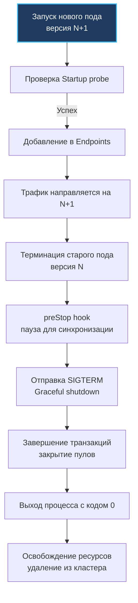

## Деплой в production. Архитектура запуска и жизненный цикл

В исследовательских лабораториях Bell Labs мы считали программную систему завершенной не тогда, когда компилятор молча выдавал исполняемый файл, а тогда, когда этот файл мог месяцами надежно функционировать на сервере под непрерывным шквалом пользовательских запросов. Развертывание (деплой) промышленного Go-сервиса в production — это не тривиальная автоматизация команд `docker push` и `kubectl apply`. Это критический архитектурный этап, на котором машинный код приложения вступает в прямое взаимодействие с ядром Linux, механизмами cgroups, сетевым стеком распределенного оркестратора и политиками безопасности операционной системы.

В отличие от скриптовых платформ, где развертывание часто сводится к замене набора исходных файлов на диске, Go транслируется в нативный машинный код. Это дает поразительную скорость запуска и феноменальную плотность утилизации ресурсов. Однако ошибки на стыке рантайма Go и оркестратора приводят не к вежливым сообщениям об ошибках `500 Internal Server Error`, а к мгновенному и беспощадному уничтожению контейнера ядром (`OOMKilled`), бесконечным циклам перезапуска `CrashLoopBackOff` или трудноуловимой деградации хвостовой задержки p99 latency.

### 1. Стратегии развертывания и влияние на рантайм

Выбор архитектурной стратегии развертывания определяется компромиссом между бюджетом на инфраструктуру, допустимым окном простоя (SLA/SLO) и сложностью синхронизации версий схем баз данных:

- **Rolling Update (Постепенное обновление)**: Пошаговая замена старых реплик (подов) новыми. Это стандартная стратегия Kubernetes. Она требует строгой обратной совместимости API и схемы БД. В экосистеме Go благодаря феноменальной скорости холодного старта бинарника (< 100 мс) и низкому потреблению базовой памяти рантаймом Rolling Update проходит практически бесшовно.
- **Blue-Green (Сине-зеленый деплой)**: Параллельное развертывание независимого кластера новой версии (Green) рядом с работающим (Blue) с последующим мгновенным переключением сетевого балансировщика. Обеспечивает возможность моментального отката (rollback) в случае сбоя, однако требует двукратного запаса вычислительных мощностей. Это идеальный выбор для сервисов, требующих длительного прогрева кэшей или несовместимых миграций БД.
- **Canary (Канареечный релиз)**: Постепенное и контролируемое смещение доли пользовательского трафика на новую версию (1% → 5% → 25% → 100%) на основе постоянного анализа метрик ошибок и задержек. Стратегия требует развитого Service Mesh (Istio, Linkerd) или продвинутого Ingress-контроллера.

> [!info] Под капотом
> При стратегии Rolling Update оркестратор поднимает новый контейнер и параллельно инициирует вывод из эксплуатации старого. В этот переходный интервал неизбежно возникает **версионный рассинхрон**: запрос от клиента v1 может быть направлен балансировщиком на сервер v2, а ответ от v2 — интерпретироваться клиентом v1. Как мы детально разбирали в статье [[32. API versioning]], серверные приложения на Go обязаны поддерживать строгую обратную совместимость структур данных. В противном случае версионный рассинхрон приведет к лавине клиентских ошибок `400 Bad Request` или скрытым падениям при десериализации `json.Unmarshal`.

### 2. Интеграция с оркестратором и Lifecycle хуки

Оркестратор Kubernetes управляет жизненным циклом контейнеров через дискретные фазы и хуки. Без их глубокого понимания даже образцовая реализация `Graceful Shutdown` (подробно рассмотренная в статье [[10. Graceful shutdown]]) не спасет от потери активных запросов пользователей.



**Критическая гонка (Race Condition) распределенной сети**: Когда Kubernetes решает вывести под из эксплуатации, контроллер кластера одновременно выполняет два независимых асинхронных действия:
1. Посылает сигнал `SIGTERM` процессу в контейнере.
2. Инициирует удаление IP-адреса пода из системного ресурса `Endpoints` (или `EndpointSlice`).

Однако обновление сетевых таблиц `iptables` или `ipvs` через агент `kube-proxy` на всех физических нодах кластера занимает от 1 до 3 секунд. Если Go-сервис начнет процедуру остановки немедленно в момент получения `SIGTERM` и закроет слушающий сокет, сетевые балансировщики еще несколько секунд будут направлять входящие TCP-пакеты на умирающий экземпляр. Клиенты получат сетевой обрыв `Connection Refused` или ошибку шлюза `502`.

Надежное инженерное решение — внедрение контейнерного хука `preStop` с фиксированной паузой, синхронизирующей сетевую конвергенцию:

```yaml
lifecycle:
  preStop:
    exec:
      command: ["sleep", "5"]
terminationGracePeriodSeconds: 35
```

Эти 5 секунд задержки дают `kube-proxy` достаточно времени, чтобы гарантированно исключить адрес пода из маршрутизации `iptables`/`ipvs`. Лишь после этого рантайм Go получает сигнал `SIGTERM` и запускает детерминированный `server.Shutdown`.

### 3. Tuning рантайма под cgroups

Современные контейнерные среды изолируют и ограничивают ресурсы с помощью подсистемы cgroups v2 ядра Linux. Рантайм Go обязан гармонично соотносить свои внутренние алгоритмы с этими физическими лимитами:

- **Управление памятью**: Системная переменная `GOMEMLIMIT` (появившаяся в Go 1.19) задает мягкий порог потребления оперативной памяти кучей Go. Стандартный рантайм не считывает лимиты памяти из cgroups автоматически — значение `GOMEMLIMIT` задают явно в манифесте пода (на уровне 80–90% от лимита контейнера) либо используют библиотеку `github.com/KimMachineGun/automemlimit`. При приближении к `GOMEMLIMIT` сборщик мусора Go начинает упреждающую, более агрессивную очистку, не позволяя общему потреблению выйти за пределы жесткого лимита контейнера. Это надежно защищает процесс от немедленного уничтожения системным механизмом ядра `OOMKilled` (Exit Code 137).
- **Планирование CPU**: Стандартный рантайм Go не читает квоты CFS из cgroups (`cpu.max` или `cpu.cfs_quota_us`) и инициализирует `GOMAXPROCS` по числу ядер физического сервера (через `sched_getaffinity`). Если под размещен на 64-ядерной ноде с лимитом `cpu: 1000m` (1 ядро), Go создаст 64 логических процессора `P`. Десятки горутин исчерпают 100-миллисекундный квант CFS за первые миллисекунды, после чего ядро Linux затроттлит процесс до конца периода. Для предотвращения троттлинга в Kubernetes критически важно подключать библиотеку `_ "go.uber.org/automaxprocs"` (она парсит cgroups и вызывает `runtime.GOMAXPROCS`) либо явно задавать переменную окружения `GOMAXPROCS`.

> [!warning] Ловушка / Gotcha
> **CPU Throttling**: Установка жестких ограничений процессора (`limits`) в Kubernetes при неумелом расчете квот приводит к регулярному троттлингу. Механизм CFS (Completely Fair Scheduler) ядра Linux начисляет квоту `CFS quota` на фиксированный период (обычно 100 мс). Если многопоточный Go-сервис исчерпал свою квоту за первые 20 мс периода, ядро принудительно усыпляет все потоки процесса на оставшиеся 80 мс. Это приводит к катастрофическим пикам задержек (p99). Для сервисов с высокими требованиями к задержкам (платежи, финтех) рекомендуется задавать строгие гарантии через `requests` без указания удушающих `limits`, либо настраивать системную политику `cpuManagerPolicy: static` для привязки процесса к изолированным процессорным ядрам.

### 4. Механика сигналов и PID 1

В архитектуре пространств имен Linux процесс, стартующий внутри контейнера первым, получает статус PID 1. На процесс с PID 1 ядро возлагает две жесткие системные обязанности: маршрутизацию сигналов и сбор завершившихся дочерних процессов («зомби»).

Если разработчик запускает Go-бинарник через вызов командного интерпретатора (например, директива `ENTRYPOINT ["/bin/sh", "-c", "./server"]`), то PID 1 получает оболочка `sh`, а скомпилированный бинарник Go становится дочерним процессом с PID 2. Стандартный командный интерпретатор `sh` не транслирует полученный сигнал `SIGTERM` своим потомкам. В итоге сервис не узнает о начале остановки, продолжит обрабатывать запросы, пока оркестратор по истечении тайм-аута `terminationGracePeriodSeconds` грубо не уничтожит его неперехватываемым сигналом `SIGKILL`.

Идиоматичный подход — прямой запуск бинарника в формате exec:
```dockerfile
# Прямой вызов машинного бинарника как PID 1
ENTRYPOINT ["/app/server"]
```
Если же в контейнере необходимо параллельно запускать вспомогательные утилиты, следует использовать микроскопические init-системы вроде `tini` или `dumb-init`, которые корректно перенаправляют системные сигналы по всему дереву процессов.

### 5. Безопасность и Hardening

Промышленное развертывание требует сведения поверхности атаки к абсолютному минимуму (принцип наименьших привилегий):

- **Non-root контекст**: Директива `securityContext.runAsUser: 65532` запускает процесс от имени непривилегированного пользователя. Бинарнику Go не требуются права root для связывания с непривилегированными портами (выше 1024) или сетевого взаимодействия.
- **Read-only корневая файловая система**: Конфигурация `securityContext.readOnlyRootFilesystem: true` аппаратно блокирует запись на диск. Любая попытка внедрения или сохранения исполняемых файлов будет заблокирована ядром. Для временных буферов монтируются изолированные каталоги в оперативной памяти через `emptyDir` volumes.
- **Сброс системных привилегий (Drop Capabilities)**: Директива `capabilities.drop: ["ALL"]` отзывает все расширенные права Linux ядра. Сетевые привилегии вроде `CAP_NET_ADMIN` не нужны прикладному серверу.
- **Изоляция системных вызовов (Seccomp)**: Стандартный профиль безопасности `RuntimeDefault` отсекает потенциально опасные системные вызовы ядра (такие как `ptrace`, `mount`, манипуляции с модулями ядра), оставляя только базовый интерфейс POSIX.

### 6. Собеседование

> [!tip] Собеседование
> **Вопрос:** В чем принципиальная разница между `OOMKilled` и паникой рантайма Go? Как оперативно диагностировать причину падения?
> **Ответ:** Событие `OOMKilled` (Exit Code 137) генерируется ядром Linux (подсистемой cgroup OOM killer), когда совокупная память контейнера превышает жесткий лимит. В логах приложения не будет никакого stack trace — процесс мгновенно уничтожается, а факт убийства фиксируется в системных логах ядра `dmesg` и метрике `container_memory_working_set_bytes`. Паника рантайма Go (`panic`) инициируется самим приложением при фатальных нарушениях контрактов (разыменование `nil`-указателя, выход за границы слайса, гонка данных) и сопровождается детальным дампом стека горутин в `stderr`. Профилактика OOM строится на калибровке `GOMEMLIMIT` на уровне 80–90% от лимита cgroup.
> 
> **Вопрос:** Почему хук `preStop` жизненно необходим, даже если в коде безупречно реализован `server.Shutdown(ctx)`?
> **Ответ:** Функция `server.Shutdown` отвечает исключительно за внутренние ресурсы одного локального процесса Go. Она не способна повлиять на сетевую топологию внешнего кластера. Kubernetes исключает IP-адрес пода из балансировки асинхронно, и обновление цепочек `iptables`/`ipvs` на нодах занимает 1–3 секунды. Хук `preStop` создает искусственную паузу, гарантируя, что ядро успеет перестроить сетевые маршруты до того, как Go закроет сокет. Без `preStop` неизбежно возникает временное окно, в котором клиенты получают ошибки `502 Bad Gateway` и `Connection Refused`.

### 7. Итог

1. Деплой — это строгий архитектурный контракт между скомпилированным бинарником, рантаймом Go, оркестратором и ядром Linux.
2. Всегда используйте контейнерный хук `preStop` со `sleep 5` для синхронизации с сетевым слоем `kube-proxy` и исключения гонок при удалении пода из `Endpoints` / `EndpointSlice`.
3. Настраивайте `GOMEMLIMIT` на 80–90% от лимита памяти контейнера для предотвращения внезапных аварий `OOMKilled`, а для адаптации `GOMAXPROCS` под квоты CPU используйте библиотеку `go.uber.org/automaxprocs`.
4. Запускайте Go-бинарник напрямую как PID 1 в Dockerfile, либо используйте `tini` / `dumb-init`, исключая обертку в скрипты `sh`, блокирующие доставку сигнала `SIGTERM`.
5. Соблюдайте жесткий харденинг: запускайте процесс от непривилегированного пользователя (`securityContext.runAsUser: 65532`), используйте read-only файловую систему, сбрасывайте `capabilities.drop: ["ALL"]` и включайте seccomp `RuntimeDefault`.
6. Остерегайтесь скрытого троттлинга процессора (`CPU Throttling`): тщательно калибруйте `CFS quota` или опирайтесь на `requests` с политикой `cpuManagerPolicy: static`.
7. Выбирайте стратегию развертывания (Rolling Update, Blue-Green, Canary) исходя из требований к непрерывности сервиса и возможностей обратной совместимости API.

Следующая статья: [[41. Observability основы]]
