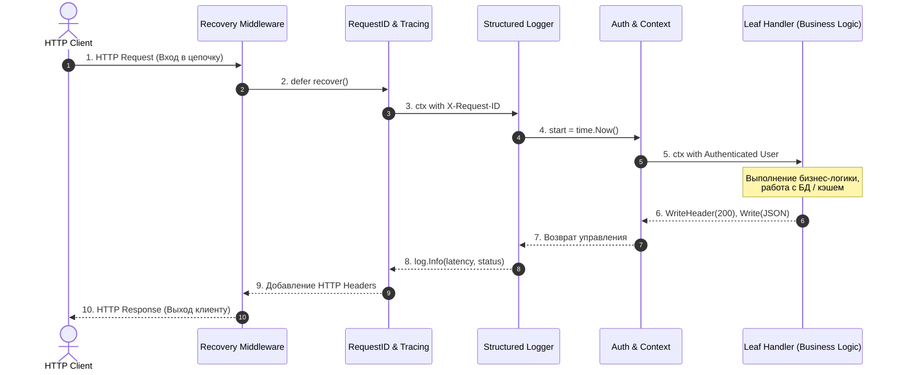

В программировании хорошая архитектура похожа на очистку луковицы или сборку оптической системы: каждый компонент фокусирует луч света, не заботясь о том, кто держал линзу до него. В сетевых приложениях на Go эта концепция воплощается через паттерн **Middleware** (промежуточное ПО).

Вместо того чтобы размазывать код логирования, валидации токенов авторизации и подсчета задержек по сотням HTTP-обработчиков, мы выстраиваем конвейер декораторов вокруг стандартного интерфейса `http.Handler`. Это позволяет сохранить доменные обработчики предельно чистыми, а сквозную функциональность — централизованной и тестируемой.



---

## Что такое Middleware

Middleware — это функции, которые обрабатывают HTTP-запрос до того, как он попадает в конечный обработчик. Они образуют цепочку обработки, где каждый middleware может:

- Модифицировать запрос/ответ
- Прервать обработку и отправить ответ
- Добавить данные в контекст
- Выполнить логирование, аутентификацию, валидацию и т.д.

### Базовая структура Middleware

В идиоматичном Go промежуточный обработчик — это декоратор, принимающий один `http.Handler` и возвращающий новый `http.Handler`:

```go
type Middleware func(http.Handler) http.Handler

func exampleMiddleware(next http.Handler) http.Handler {
    return http.HandlerFunc(func(w http.ResponseWriter, r *http.Request) {
        // Код до вызова следующего обработчика
        log.Printf("Before: %s %s", r.Method, r.URL.Path)
        
        // Вызов следующего обработчика в цепочке
        next.ServeHTTP(w, r)
        
        // Код после вызова обработчика
        log.Printf("After: %s %s", r.Method, r.URL.Path)
    })
}
```

> [!info] Под капотом
> Middleware в Go — это функции высшего порядка, которые принимают `http.Handler` и возвращают `http.Handler`. Это позволяет создавать цепочки обработки через композицию функций. Каждый middleware оборачивает предыдущий, образуя стек вызовов.  
> С точки зрения рантайма вызов `next.ServeHTTP(w, r)` — это обычный косвенный вызов метода через указатель в таблице интерфейса (`itab`). Затраты на вызов составляют доли наносекунды, а стек вызовов углубляется ровно на глубину цепочки оберток, что абсолютно безопасно для легковесных стеков горутин Go.

---

## Создание Middleware

### Простое логирование запросов

Чтобы замерить реальную задержку (latency) и зафиксировать HTTP-статус, нам необходимо перехватить вызов `WriteHeader`:

```go
func loggingMiddleware(next http.Handler) http.Handler {
    return http.HandlerFunc(func(w http.ResponseWriter, r *http.Request) {
        start := time.Now()
        
        // Создаем ResponseWriter, который оборачивает оригинальный
        // для отслеживания статуса ответа
        wrapped := &responseWriter{ResponseWriter: w, statusCode: http.StatusOK}
        
        // Обработка запроса
        next.ServeHTTP(wrapped, r)
        
        // Логирование
        log.Printf(
            "%s %s %d %v",
            r.Method,
            r.URL.Path,
            wrapped.statusCode,
            time.Since(start),
        )
    })
}

// Обертка для ResponseWriter для отслеживания статуса
type responseWriter struct {
    http.ResponseWriter
    statusCode int
}

func (rw *responseWriter) WriteHeader(code int) {
    rw.statusCode = code
    rw.ResponseWriter.WriteHeader(code)
}

// Реализуем Unwrap для поддержки http.ResponseController (Go 1.20+)
func (rw *responseWriter) Unwrap() http.ResponseWriter {
    return rw.ResponseWriter
}
```

### Аутентификация

Middleware аутентификации извлекает учетные данные (например, Bearer JWT токен), валидирует их и обогащает `r.Context()` идентификатором пользователя:

```go
func authMiddleware(next http.Handler) http.Handler {
    return http.HandlerFunc(func(w http.ResponseWriter, r *http.Request) {
        authHeader := r.Header.Get("Authorization")
        if authHeader == "" {
            http.Error(w, "Authorization header required", http.StatusUnauthorized)
            return
        }
        
        // Проверяем токен (упрощенно)
        token := strings.TrimPrefix(authHeader, "Bearer ")
        if !isValidToken(token) {
            http.Error(w, "Invalid token", http.StatusForbidden)
            return
        }
        
        // Добавляем информацию о пользователе в контекст
        ctx := context.WithValue(r.Context(), "userID", extractUserID(token))
        next.ServeHTTP(w, r.WithContext(ctx))
    })
}

func isValidToken(token string) bool {
    // Реализация проверки токена
    return len(token) > 0
}

func extractUserID(token string) string {
    // Извлечение userID из токена
    return "user123"
}
```

### Обработка паник

Самый важный защитный рубеж в любом веб-сервисе — перехват паник. Если разработчик в глубине обработчика допустил разыменование нулевого указателя, необработанная паника убьет горутину и заставит сервер оборвать TCP-сокет без внятного ответа клиенту:

```go
func recoveryMiddleware(next http.Handler) http.Handler {
    return http.HandlerFunc(func(w http.ResponseWriter, r *http.Request) {
        defer func() {
            if err := recover(); err != nil {
                log.Printf("Panic recovered: %v", err)
                
                // Отправляем 500 ошибку
                http.Error(w, "Internal Server Error", http.StatusInternalServerError)
            }
        }()
        
        next.ServeHTTP(w, r)
    })
}
```

---

## Композиция Middleware

Когда количество middleware растет, вложенный вызов `m1(m2(m3(m4(handler))))` становится трудночитаемым.

### Последовательное применение

Простейшая функция композиции обходит слайс middleware с конца к началу, последовательно заворачивая исходный обработчик:

```go
func applyMiddleware(handler http.Handler, middlewares ...func(http.Handler) http.Handler) http.Handler {
    for i := len(middlewares) - 1; i >= 0; i-- {
        handler = middlewares[i](handler)
    }
    return handler
}

// Использование
func main() {
    mux := http.NewServeMux()
    mux.HandleFunc("/api/users", usersHandler)
    
    chain := applyMiddleware(mux, recoveryMiddleware, loggingMiddleware, authMiddleware)
    
    http.ListenAndServe(":8080", chain)
}
```

### Структура для удобной композиции

Более выразительный и расширяемый подход — использование цепочки с fluent API (подобно популярной библиотеке `alice`):

```go
type MiddlewareChain struct {
    middlewares []func(http.Handler) http.Handler
}

func NewMiddlewareChain() *MiddlewareChain {
    return &MiddlewareChain{}
}

func (mc *MiddlewareChain) Use(middleware func(http.Handler) http.Handler) *MiddlewareChain {
    mc.middlewares = append(mc.middlewares, middleware)
    return mc
}

func (mc *MiddlewareChain) Then(handler http.Handler) http.Handler {
    for i := len(mc.middlewares) - 1; i >= 0; i-- {
        handler = mc.middlewares[i](handler)
    }
    return handler
}

// Использование
chain := NewMiddlewareChain().
    Use(recoveryMiddleware).
    Use(loggingMiddleware).
    Use(authMiddleware)

handler := chain.Then(apiHandler)
```

---

## Middleware для конкретных задач

### CORS

Междоменный обмен ресурсами (Cross-Origin Resource Sharing) требует корректной обработки предварительных preflight-запросов (`OPTIONS`):

```go
func corsMiddleware(next http.Handler) http.Handler {
    return http.HandlerFunc(func(w http.ResponseWriter, r *http.Request) {
        w.Header().Set("Access-Control-Allow-Origin", "*")
        w.Header().Set("Access-Control-Allow-Methods", "GET, POST, PUT, DELETE, OPTIONS")
        w.Header().Set("Access-Control-Allow-Headers", "Content-Type, Authorization")
        
        if r.Method == "OPTIONS" {
            w.WriteHeader(http.StatusOK)
            return
        }
        
        next.ServeHTTP(w, r)
    })
}
```

### Rate limiting

Защита сервиса от перегрузки с помощью алгоритма Token Bucket из стандартного пакета `golang.org/x/time/rate`:

```go
import "golang.org/x/time/rate"

type RateLimiter struct {
    limiter *rate.Limiter
}

func newRateLimiter(r rate.Limit, b int) *RateLimiter {
    return &RateLimiter{
        limiter: rate.NewLimiter(r, b),
    }
}

func (rl *RateLimiter) Middleware(next http.Handler) http.Handler {
    return http.HandlerFunc(func(w http.ResponseWriter, r *http.Request) {
        if !rl.limiter.Allow() {
            http.Error(w, "Rate limit exceeded", http.StatusTooManyRequests)
            return
        }
        next.ServeHTTP(w, r)
    })
}

// Использование
limiter := newRateLimiter(rate.Limit(10), 20) // 10 запросов в секунду, burst 20
```

### Request ID

Сквозной идентификатор запроса необходим для корреляции логов в микросервисной архитектуре:

```go
import "github.com/google/uuid"

func requestIdMiddleware(next http.Handler) http.Handler {
    return http.HandlerFunc(func(w http.ResponseWriter, r *http.Request) {
        reqID := r.Header.Get("X-Request-ID")
        if reqID == "" {
            reqID = uuid.New().String()
        }
        
        // Добавляем ID в заголовки ответа
        w.Header().Set("X-Request-ID", reqID)
        
        // Добавляем в контекст
        ctx := context.WithValue(r.Context(), "requestID", reqID)
        
        next.ServeHTTP(w, r.WithContext(ctx))
    })
}
```

---

## Middleware в разных фреймворках

### Chi

В маршрутизаторе Chi middleware подключаются нативно через метод `.Use()` благодаря полному следованию стандартному интерфейсу:

```go
r := chi.NewRouter()

// Глобальные middleware
r.Use(middleware.Logger)
r.Use(middleware.Recoverer)
r.Use(authMiddleware)

// Middleware для конкретной группы
r.Group(func(r chi.Router) {
    r.Use(permissionMiddleware)
    r.Get("/admin", adminHandler)
})
```

### Gin

В фреймворке Gin цепочка реализуется через массив обработчиков внутри структуры `*gin.Context`, управляемый вызовом `c.Next()`:

```go
r := gin.New()

// Глобальные middleware
r.Use(gin.Logger())
r.Use(gin.Recovery())

// Middleware для группы
auth := r.Group("/api")
auth.Use(authMiddleware)
auth.GET("/users", getUsers)
```

> [!warning] Ловушка / Gotcha
> Порядок middleware важен! Если вы поставите аутентификацию перед логированием, то логи будут содержать только успешные аутентифицированные запросы. Обычно middleware идут в порядке: recovery -> logging -> auth -> validation -> handler.

---

## Контекст в Middleware

Middleware часто используют `context.Context` для передачи данных между слоями. Важно помнить, что ключи контекста в Go должны быть типизированными, чтобы избежать коллизий между независимыми библиотеками:

```go
type userCtxKey struct{}

// Middleware для извлечения пользователя из токена
func userMiddleware(next http.Handler) http.Handler {
    return http.HandlerFunc(func(w http.ResponseWriter, r *http.Request) {
        token := r.Header.Get("Authorization")
        if token == "" {
            http.Error(w, "No token provided", http.StatusUnauthorized)
            return
        }
        
        user, err := getUserFromToken(strings.TrimPrefix(token, "Bearer "))
        if err != nil {
            http.Error(w, "Invalid token", http.StatusForbidden)
            return
        }
        
        // Добавляем пользователя в контекст с неэкспортируемым типизированным ключом
        ctx := context.WithValue(r.Context(), userCtxKey{}, user)
        next.ServeHTTP(w, r.WithContext(ctx))
    })
}

// Использование в обработчике
func protectedHandler(w http.ResponseWriter, r *http.Request) {
    user, ok := r.Context().Value(userCtxKey{}).(*User)
    if !ok {
        http.Error(w, "Unauthorized", http.StatusUnauthorized)
        return
    }
    w.Write([]byte(fmt.Sprintf("Hello, %s!", user.Name)))
}
```

---

## Производительность и аллокации

При обработке десятков тысяч запросов в секунду создание промежуточных объектов в куче может создавать заметную нагрузку на сборщик мусора:

```go
// Плохо - создает closure на каждый запрос
func badMiddleware(next http.Handler) http.Handler {
    return http.HandlerFunc(func(w http.ResponseWriter, r *http.Request) {
        // Создание новых структур на каждый запрос
        logger := &logger{req: r} // аллокация
        logger.log()
        next.ServeHTTP(w, r)
    })
}

// Хорошо - использует pool для минимизации аллокаций
var responseWriterPool = sync.Pool{
    New: func() interface{} {
        return &responseWriter{}
    },
}

func goodMiddleware(next http.Handler) http.Handler {
    return http.HandlerFunc(func(w http.ResponseWriter, r *http.Request) {
        wrapped := responseWriterPool.Get().(*responseWriter)
        wrapped.ResponseWriter = w
        wrapped.statusCode = http.StatusOK
        
        next.ServeHTTP(wrapped, r)
        
        responseWriterPool.Put(wrapped)
    })
}
```

> [!tip] Собеседование
> **Вопрос**: Как работает цепочка middleware и почему порядок важен?
> **Ответ**: Middleware оборачивают обработчики друг в друга, образуя стек. Код до `next.ServeHTTP()` выполняется в прямом порядке, а код после — в обратном. Порядок важен, потому что middleware могут прервать цепочку (не вызвать `next`) или модифицировать запрос/ответ для следующих middleware.

---

## Заключение

Middleware — мощный инструмент для организации общей логики в HTTP-сервисах. Они позволяют:

- Разделять concerns (логирование, аутентификация, валидация)
- Повторно использовать код
- Создавать гибкие цепочки обработки
- Упрощать тестирование (middleware можно тестировать отдельно)

Правильное использование middleware делает код более читаемым и поддерживаемым, особенно в больших проектах.

> [!note]
> Middleware — это про композицию функций и чистую архитектуру. Каждый middleware должен отвечать за одну задачу, быть тестируемым и не зависеть от других middleware, кроме тех, с которыми он явно работает.

Следующая статья: [[6. Обработка запросов и ответов]]