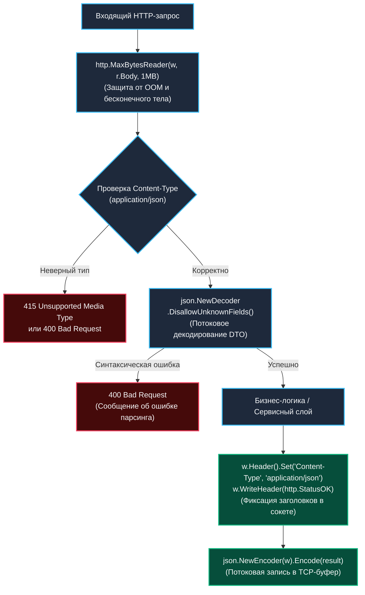

В веб-сервисах вся жизнь программы вращается вокруг двух фундаментальных абстракций протокола HTTP: запроса (**Request**), который сообщает серверу, чего хочет клиент, и ответа (**Response**), с помощью которого сервер возвращает результат вычислений или код ошибки.

В стандартной библиотеке Go эти абстракции представлены структурой `*http.Request` и интерфейсом `http.ResponseWriter`. На первый взгляд они кажутся элементарными, но именно на стыке сериализации данных, управления потоками ввода-вывода и соблюдения спецификации HTTP кроется подавляющее большинство скрытых дефектов, уязвимостей переполнения памяти и плавающих багов промышленного кода.



---

## Обработка HTTP-запросов

HTTP-запрос в Go представлен структурой `http.Request`. Это основной объект, через который обработчики получают информацию о запросе клиента.

### Структура http.Request

Структура `http.Request` инкапсулирует полное состояние входящей транзакции:

```go
type Request struct {
    Method string     // GET, POST, PUT, DELETE и т.д.
    URL    *url.URL   // URL запроса
    Header Header     // HTTP заголовки
    Body   io.ReadCloser // Тело запроса
    Form   url.Values // Пarsed form data (POST, PUT, PATCH, GET)
    PostForm url.Values // POST, PUT, PATCH формы
    MultipartForm *multipart.Form // Загруженные файлы
    RemoteAddr string // IP-адрес клиента
    Context context.Context // Контекст запроса
    // и другие поля...
}
```

### Чтение тела запроса

Ключевая особенность тела запроса в Go — его потоковая природа:

```go
func readBody(w http.ResponseWriter, r *http.Request) {
    // Важно: тело можно читать только один раз
    body, err := io.ReadAll(r.Body)
    if err != nil {
        http.Error(w, "Cannot read body", http.StatusBadRequest)
        return
    }
    
    // После чтения тело закрывается автоматически
    // или нужно закрыть явно: r.Body.Close()
    
    fmt.Fprintf(w, "Body: %s", string(body))
}
```

> [!info] Под капотом
> Тело запроса (`r.Body`) реализует интерфейс `io.ReadCloser`. Это потоковый интерфейс, который читает данные по мере их поступления. После первого чтения тело становится недоступным, так как поток исчерпан. Это важно для производительности — данные не буферизируются в памяти полностью.  
> Сервер `net/http` автоматически закрывает `r.Body` после завершения работы функции обработчика. Однако наивный вызов `io.ReadAll(r.Body)` без ограничения объема является классической уязвимостью отказа в обслуживании (Denial of Service): если злоумышленник отправит запрос размером 5 гигабайт, сервер попытается аллоцировать соответствующий срез в куче, что немедленно приведет к срабатыванию OOM Killer ядра Linux. В промышленных системах чтение всегда оборачивают в `http.MaxBytesReader(w, r.Body, maxBytes)`.

---

### Проверка метода HTTP

Если ваш маршрутизатор не фильтрует методы автоматически, обработчик обязан явно валидировать метод запроса:

```go
func handleUser(w http.ResponseWriter, r *http.Request) {
    switch r.Method {
    case http.MethodGet:
        getUser(w, r)
    case http.MethodPost:
        createUser(w, r)
    case http.MethodPut:
        updateUser(w, r)
    case http.MethodDelete:
        deleteUser(w, r)
    default:
        w.Header().Set("Allow", "GET, POST, PUT, DELETE")
        http.Error(w, "Method not allowed", http.StatusMethodNotAllowed)
    }
}
```

---

### Работа с заголовками

Заголовки в Go представлены типом `http.Header`, который является псевдонимом для `map[string][]string`. Методы `Get` и `Set` автоматически нормализуют регистр символов в соответствии с RFC (MIME header canonicalization):

```go
func handleWithHeaders(w http.ResponseWriter, r *http.Request) {
    // Чтение заголовков
    contentType := r.Header.Get("Content-Type")
    userAgent := r.Header.Get("User-Agent")
    
    // Чтение нескольких значений одного заголовка
    acceptValues := r.Header["Accept"]
    
    // Работа с конкретными заголовками
    if strings.Contains(contentType, "application/json") {
        // Обработка JSON
    }
    
    // Установка заголовков в ответе
    w.Header().Set("Content-Type", "application/json")
    w.Header().Add("X-Custom-Header", "value")
}
```

---

## Обработка различных типов запросов

### JSON-запросы

При работе с REST API потоковое декодирование через `json.NewDecoder` предпочтительнее предварительного чтения всего слайса байт в память:

```go
type User struct {
    ID    int    `json:"id"`
    Name  string `json:"name"`
    Email string `json:"email"`
}

func createUser(w http.ResponseWriter, r *http.Request) {
    // Проверяем Content-Type
    if r.Header.Get("Content-Type") != "application/json" {
        http.Error(w, "Content-Type must be application/json", http.StatusBadRequest)
        return
    }
    
    // Декодируем JSON
    var user User
    decoder := json.NewDecoder(r.Body)
    if err := decoder.Decode(&user); err != nil {
        http.Error(w, "Invalid JSON", http.StatusBadRequest)
        return
    }
    
    // Валидация
    if user.Name == "" || user.Email == "" {
        http.Error(w, "Name and email are required", http.StatusBadRequest)
        return
    }
    
    // Сохранение (псевдокод)
    // savedUser := saveUser(user)
    
    w.Header().Set("Content-Type", "application/json")
    w.WriteHeader(http.StatusCreated)
    json.NewEncoder(w).Encode(user)
}
```

*(Совет: вызов `decoder.DisallowUnknownFields()` позволяет гарантировать, что клиент не передал в запросе неизвестные поля, защищая систему от опечаток и непреднамеренной модификации внутренних атрибутов моделей).*

---

### Form-данные

При отправке данных из HTML-форм или OAuth2-эндпоинтов используется кодировка `application/x-www-form-urlencoded`:

```go
func handleForm(w http.ResponseWriter, r *http.Request) {
    // Парсим форму (если еще не было сделано)
    if err := r.ParseForm(); err != nil {
        http.Error(w, "Cannot parse form", http.StatusBadRequest)
        return
    }
    
    // Получаем значения
    name := r.FormValue("name")
    email := r.FormValue("email")
    
    // Или через r.Form
    age := r.Form.Get("age")
    
    // Работа с массивами
    tags := r.Form["tags"]
    
    fmt.Fprintf(w, "Name: %s, Email: %s, Age: %s", name, email, age)
}
```

---

### File Upload

Загрузка бинарных файлов осуществляется через формат `multipart/form-data`. Метод `r.ParseMultipartForm(maxMemory)` парсит заголовки частей и сохраняет файлы, превышающие лимит памяти, во временные файлы на диске:

```go
func uploadFile(w http.ResponseWriter, r *http.Request) {
    // Устанавливаем максимальный размер тела (32MB)
    r.ParseMultipartForm(32 << 20)
    
    file, handler, err := r.FormFile("uploadfile")
    if err != nil {
        http.Error(w, "Error retrieving file", http.StatusBadRequest)
        return
    }
    defer file.Close()
    
    // Создаем файл для сохранения (filepath.Base защищает от path traversal атак)
    filename := filepath.Base(handler.Filename)
    dst, err := os.Create(filepath.Join("./uploads", filename))
    if err != nil {
        http.Error(w, "Cannot create file", http.StatusInternalServerError)
        return
    }
    defer dst.Close()
    
    // Копируем файл
    if _, err := io.Copy(dst, file); err != nil {
        http.Error(w, "Cannot save file", http.StatusInternalServerError)
        return
    }
    
    fmt.Fprintf(w, "File uploaded successfully: %s", handler.Filename)
}
```

---

## Обработка ответов

HTTP-ответ в Go формируется через `http.ResponseWriter`. Это интерфейс, который позволяет управлять заголовками, статусом и телом ответа.

### Основы ResponseWriter

```go
func basicResponse(w http.ResponseWriter, r *http.Request) {
    // Установка заголовков
    w.Header().Set("Content-Type", "text/plain")
    w.Header().Set("X-Custom-Header", "value")
    
    // Установка статуса
    w.WriteHeader(http.StatusOK)
    
    // Запись тела
    w.Write([]byte("Hello, World!"))
}
```

> [!info] Под капотом
> `ResponseWriter` внутри использует буферизацию. Заголовки и статус отправляются клиенту при первом вызове `Write()` или при явном вызове `WriteHeader()`. После отправки заголовков их изменение не повлияет на ответ. Если вы попытаетесь вызвать `w.Header().Set()` или повторный `w.WriteHeader()` после того, как в сокет уже ушли первые байты тела, рантайм Go проигнорирует эти действия и выведет предупреждение в `ErrorLog`.

---

### Отправка JSON

Сериализация структур в формате JSON с корректными заголовками:

```go
func sendJSON(w http.ResponseWriter, r *http.Request) {
    user := User{
        ID:    1,
        Name:  "John Doe",
        Email: "john@example.com",
    }
    
    w.Header().Set("Content-Type", "application/json")
    w.WriteHeader(http.StatusOK)
    
    if err := json.NewEncoder(w).Encode(user); err != nil {
        log.Printf("Error encoding JSON: %v", err)
        return
    }
}

// Обертка для JSON-ответов
func writeJSON(w http.ResponseWriter, data interface{}) error {
    w.Header().Set("Content-Type", "application/json")
    return json.NewEncoder(w).Encode(data)
}
```

---

### Стриминг ответов

Когда вам требуется отдавать большие объемы данных частями (Server-Sent Events, чанкированные отчеты), используется приведение `w` к интерфейсу `http.Flusher`:

```go
func streamData(w http.ResponseWriter, r *http.Request) {
    w.Header().Set("Content-Type", "text/plain")
    // net/http автоматически выставит Transfer-Encoding: chunked в HTTP/1.1
    // при вызовах Flush(), если Content-Length не задан явным образом
    
    // Отправляем данные частями
    for i := 0; i < 10; i++ {
        fmt.Fprintf(w, "Chunk %d\n", i)
        
        // Принудительно отправляем данные
        if flusher, ok := w.(http.Flusher); ok {
            flusher.Flush()
        }
        
        time.Sleep(100 * time.Millisecond)
    }
}
```

---

### Отправка файлов

При отдаче статических файлов критически важно защищаться от атак выхода за пределы корневого каталога (Directory Traversal):

```go
func serveFile(w http.ResponseWriter, r *http.Request) {
    filename := r.URL.Query().Get("file")
    
    // Важно: проверяем путь для безопасности
    if filepath.IsAbs(filename) || strings.Contains(filename, "..") {
        http.Error(w, "Invalid file path", http.StatusBadRequest)
        return
    }
    
    // Открываем файл
    file, err := os.Open("./files/" + filename)
    if err != nil {
        http.Error(w, "File not found", http.StatusNotFound)
        return
    }
    defer file.Close()
    
    // Получаем информацию о файле
    fileInfo, err := file.Stat()
    if err != nil {
        http.Error(w, "Cannot stat file", http.StatusInternalServerError)
        return
    }
    
    // Устанавливаем заголовки
    w.Header().Set("Content-Type", "application/octet-stream")
    w.Header().Set("Content-Length", strconv.FormatInt(fileInfo.Size(), 10))
    
    // Копируем файл в ответ
    io.Copy(w, file)
}
```

---

## Обработка ошибок в HTTP-обработчиках

Чтобы не повторять бойлерплейт логирования ошибок и маппинга статусов в каждом обработчике, часто создают адаптер типа `errorHandler`:

```go
type errorHandler func(http.ResponseWriter, *http.Request) error

func (fn errorHandler) ServeHTTP(w http.ResponseWriter, r *http.Request) {
    if err := fn(w, r); err != nil {
        log.Printf("Handler error: %v", err)
        
        // В зависимости от типа ошибки отправляем разные статусы
        switch {
        case errors.Is(err, ErrNotFound):
            http.Error(w, "Not Found", http.StatusNotFound)
        case errors.Is(err, ErrValidation):
            http.Error(w, "Validation Error", http.StatusBadRequest)
        default:
            http.Error(w, "Internal Server Error", http.StatusInternalServerError)
        }
    }
}

// Использование
func getUser(w http.ResponseWriter, r *http.Request) error {
    userID := chi.URLParam(r, "id")
    if userID == "" {
        return fmt.Errorf("user id required: %w", ErrValidation)
    }
    
    user, err := findUser(userID)
    if err != nil {
        return fmt.Errorf("find user: %w", err)
    }
    
    return writeJSON(w, user)
}
```

---

### Custom ResponseWriter для тестирования

Хотя в стандартном пакете `net/http/httptest` есть готовый `httptest.ResponseRecorder`, создание собственного мока помогает понять контракт интерфейса `http.ResponseWriter`:

```go
type TestResponseWriter struct {
    StatusCode int
    HeaderMap  http.Header
    Body       *bytes.Buffer
}

func (t *TestResponseWriter) Header() http.Header {
    return t.HeaderMap
}

func (t *TestResponseWriter) Write(data []byte) (int, error) {
    return t.Body.Write(data)
}

func (t *TestResponseWriter) WriteHeader(statusCode int) {
    t.StatusCode = statusCode
}

// Использование в тестах
func TestHandler(t *testing.T) {
    req, _ := http.NewRequest("GET", "/users/1", nil)
    w := &TestResponseWriter{
        HeaderMap: make(http.Header),
        Body:      &bytes.Buffer{},
    }
    
    handler(w, req)
    
    assert.Equal(t, http.StatusOK, w.StatusCode)
    assert.Contains(t, w.Body.String(), "expected content")
}
```

---

## Security Considerations

### Input Validation

На границе транспортного слоя необходимо жестко пресекать аномальные входящие запросы:

```go
func safeHandler(w http.ResponseWriter, r *http.Request) {
    // Проверяем Content-Length
    if r.ContentLength > 1<<20 { // 1MB
        http.Error(w, "Request too large", http.StatusRequestEntityTooLarge)
        return
    }
    
    // Санитизация путей
    path := r.URL.Path
    if strings.Contains(path, "../") || strings.Contains(path, "..\\") {
        http.Error(w, "Invalid path", http.StatusBadRequest)
        return
    }
    
    // Проверка Content-Type
    contentType := r.Header.Get("Content-Type")
    if contentType != "application/json" {
        http.Error(w, "Unsupported content type", http.StatusUnsupportedMediaType)
        return
    }
}
```

### Rate Limiting Integration

Ограничение частоты запросов на уровне конкретных критических эндпоинтов (например, аутентификации или сброса пароля):

```go
func withRateLimit(next http.HandlerFunc) http.HandlerFunc {
    limiter := rate.NewLimiter(rate.Every(time.Minute/10), 1) // 10 requests per minute
    
    return func(w http.ResponseWriter, r *http.Request) {
        if !limiter.Allow() {
            w.Header().Set("Retry-After", "60")
            http.Error(w, "Rate limit exceeded", http.StatusTooManyRequests)
            return
        }
        next(w, r)
    }
}
```

> [!tip] Собеседование
> **Вопрос**: Что произойдет, если вызвать `WriteHeader()` дважды?
> **Ответ**: Второй вызов `WriteHeader()` будет проигнорирован. Заголовки и статус отправляются при первом вызове `WriteHeader()` или `Write()`. Это важно помнить при обработке ошибок после начала записи тела ответа.

---

## Заключение

Правильная обработка запросов и ответов — ключ к надежным HTTP-сервисам. Важно:

- Проверять типы контента
- Валидировать входные данные
- Правильно обрабатывать ошибки
- Управлять размером тела запроса
- Использовать безопасные методы работы с файлами

> [!note]
> Всегда помните о безопасности и производительности при обработке HTTP-запросов. Плохо написанный обработчик может стать уязвимостью или причиной падения сервиса под нагрузкой.

Следующая статья: [[7. Валидация входных данных]]